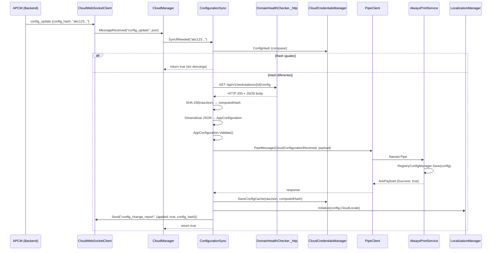
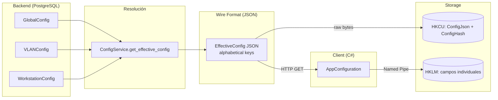

# Design Document — Phase 3: Configuration Sync by Hash

## Overview

La Fase 3 implementa el ciclo completo de sincronización de configuración entre el AlwaysPrintTray y APCM (AlwaysPrint Cloud Manager). El mecanismo central es la **comparación de hash SHA-256**: cuando APCM envía un mensaje `config_update` con un `config_hash`, el Tray compara ese hash con el almacenado localmente en HKCU. Solo si difieren se descarga la nueva configuración vía HTTP GET, se aplica al Service vía Named Pipe, se persiste como cache offline, y se confirma al servidor.

### Objetivos principales

- Sincronización eficiente: solo descarga cuando hay cambios reales (detección por hash)
- Resiliencia offline: cache en HKCU permite operar sin conexión
- Separación de responsabilidades: Tray descarga y orquesta, Service persiste en HKLM
- Confirmación bidireccional: el servidor sabe si la configuración fue aplicada exitosamente
- Cero impacto en modo local: `CloudEnabled=false` no ejecuta ningún código cloud

### Flujo principal



---

## Architecture

### Diagrama de componentes

```mermaid
graph TB
    subgraph "AlwaysPrintTray (User Context)"
        CM[CloudManager]
        CS[ConfigurationSync]
        WSC[CloudWebSocketClient]
        PC[PipeClient]
        CCM[CloudCredentialsManager]
        DHC[DomainHealthChecker._http]
        LM[LocalizationManager]
    end

    subgraph "AlwaysPrintService (LocalSystem)"
        MD[MessageDispatcher]
        RCM[RegistryConfigManager]
    end

    subgraph "APCM Backend (FastAPI)"
        EP[GET /api/v1/workstations/{id}/config]
        WSH[WebSocket Handler]
    end

    subgraph "Storage"
        HKCU[(HKCU\Cloud)]
        HKLM[(HKLM\AlwaysPrint)]
    end

    WSH -->|config_update| WSC
    WSC -->|MessageReceived| CM
    CM -->|SyncIfNeeded| CS
    CS -->|HTTP GET| DHC
    DHC -->|request| EP
    CS -->|SaveConfigCache| CCM
    CCM -->|write| HKCU
    CS -->|CloudConfigurationReceived| PC
    PC -->|Named Pipe| MD
    MD -->|Save| RCM
    RCM -->|write| HKLM
    CS -->|Initialize| LM
    CS -->|config_change_report| WSC
```

### Decisiones de diseño

| Decisión | Justificación |
|----------|---------------|
| Reutilizar `DomainHealthChecker._http` | Evitar socket exhaustion; el HttpClient estático ya existe y gestiona el pool TCP |
| Hash sobre bytes crudos (no re-serializado) | Garantiza que el hash local coincida con el del servidor sobre los mismos bytes |
| Cache en HKCU (no archivo) | Consistente con Phase 1/2; no requiere permisos de admin; atómico con el registro |
| JSON serializado en orden alfabético (backend) | Produce bytes idénticos para configuraciones idénticas → hash estable |
| `config_change_report` vía WebSocket | Reutiliza la conexión existente; no requiere endpoint REST adicional |
| Locale override después de pipe success | Asegura que la configuración ya está persistida antes de cambiar la UI |

---

## Components and Interfaces

### 1. ConfigurationSync (NUEVO)

**Ubicación:** `AlwaysPrintTray/Cloud/ConfigurationSync.cs`  
**Namespace:** `AlwaysPrintTray.Cloud`  
**Modificador:** `sealed`

```csharp
public sealed class ConfigurationSync
{
    // Constructor
    public ConfigurationSync(
        string cloudApiUrl,
        string workstationId,
        CloudCredentialsManager credentials,
        PipeClient pipe,
        CloudWebSocketClient wsClient);

    // Métodos públicos
    public bool SyncIfNeeded(string serverConfigHash);
    public bool ForceSync();
    public AppConfiguration? LoadFromCache();

    // Métodos privados
    private string? DownloadConfig();
    private bool ApplyConfig(string rawJson, string serverConfigHash);
    private static string ComputeSha256(string input);
    private void SendChangeReport(bool applied, string configHash, string? errorMessage = null);
}
```

**Responsabilidades:**
- Comparar hash del servidor con hash local
- Descargar configuración vía HTTP GET (usando `DomainHealthChecker._http`)
- Calcular SHA-256 del JSON descargado
- Deserializar JSON → `AppConfiguration` y validar
- Enviar configuración al Service vía Named Pipe
- Persistir cache en HKCU vía `CloudCredentialsManager`
- Aplicar locale override vía `LocalizationManager`
- Enviar `config_change_report` al servidor vía WebSocket

### 2. CloudCredentialsManager (MODIFICADO)

**Nuevos métodos:**

```csharp
// Persiste el JSON crudo y su hash en HKCU
public void SaveConfigCache(string configJson, string configHash);

// Retorna el JSON crudo almacenado, o null si no existe
public string? LoadConfigCache();
```

**Nuevos valores de registro en `HKCU\SOFTWARE\Robles.AI\AlwaysPrint\Cloud`:**
- `ConfigJson` (REG_SZ) — JSON crudo de la última configuración descargada
- `ConfigHash` (REG_SZ) — Hash SHA-256 de 64 caracteres hexadecimales
- `ConfigCachedAt` (REG_SZ) — Timestamp ISO-8601 formato "O"

### 3. CloudManager (MODIFICADO)

**Cambios:**
- Instanciar `ConfigurationSync` en `Start()` después de crear `CloudWebSocketClient`
- Agregar case `"config_update"` en `OnMessageReceived`
- Extraer `config_hash` del JSON y llamar `ConfigurationSync.SyncIfNeeded()`

```csharp
// Nuevo campo
private ConfigurationSync? _configSync;

// En Start():
_configSync = new ConfigurationSync(
    _config.CloudApiUrl,
    _credentials.WorkstationId!,
    _credentials,
    _pipe,
    _wsClient!);

// En OnMessageReceived:
case "config_update":
    HandleConfigUpdate(json);
    break;
```

### 4. Backend — Endpoint GET /api/v1/workstations/{id}/config (NUEVO)

**Ubicación:** `AlwaysPrintProject/Cloud/backend/app/api/v1/endpoints/config.py`  
**Ruta:** `GET /api/v1/workstations/{workstation_id}/config`  
**Autenticación:** Por IP pública (sin headers de auth)

**Response (HTTP 200):**
```json
{
    "bootstrap_domains": "robles.ai,iol.pe",
    "connectivity_checks": [],
    "corporate_queue_name": "LexmarkRoblesAI",
    "locale": "",
    "pending_task_polling_minutes": 3,
    "search_targets": {"ips": "", "ranges": ""},
    "telemetry_enabled": true,
    "telemetry_interval_seconds": 300
}
```

**Nota:** Las claves se serializan en orden alfabético fijo para garantizar hash estable.

### 5. Backend — Modelos y Schemas (MODIFICADO)

**Nuevos campos en `GlobalConfig` (models/config.py):**
- `connectivity_checks` (JSON, nullable, default `[]`)
- `locale` (String(10), nullable, default `""`)
- `telemetry_enabled` (Boolean, default `True`)
- `telemetry_interval_seconds` (Integer, default `300`)

**Mismos campos en `VLANConfig` y `WorkstationConfig`** (nullable para override selectivo).

**Nuevo schema `EffectiveConfigResponse` actualizado (schemas/config.py):**
```python
class EffectiveConfigResponse(BaseModel):
    corporate_queue_name: str
    search_targets: Optional[dict] = None
    pending_task_polling_minutes: int
    bootstrap_domains: str
    connectivity_checks: list = Field(default_factory=list)
    locale: str = ""
    telemetry_enabled: bool = True
    telemetry_interval_seconds: int = 300
```

---

## Data Models

### Flujo de datos: Servidor → Cliente



### Mapeo EffectiveConfig JSON → AppConfiguration

| Campo JSON (backend) | Propiedad C# (AppConfiguration) | Tipo |
|---------------------|--------------------------------|------|
| `corporate_queue_name` | `CorporateQueueName` | string |
| `search_targets.ips` | `SearchTargets.Ips` | string |
| `search_targets.ranges` | `SearchTargets.Ranges` | string |
| `pending_task_polling_minutes` | `PendingTaskPollingMinutes` | int |
| `bootstrap_domains` | `BootstrapDomains` | string |
| `connectivity_checks` | `ConnectivityChecks` | List\<ConnectivityCheck\> |
| `locale` | `CloudLocale` | string |
| `telemetry_enabled` | `TelemetryEnabled` | bool |
| `telemetry_interval_seconds` | `TelemetryIntervalSeconds` | int |

### Mensajes WebSocket

**config_update (Servidor → Cliente):**
```json
{
    "type": "config_update",
    "config_hash": "a1b2c3d4e5f6..."
}
```

**config_change_report (Cliente → Servidor):**
```json
{
    "type": "config_change_report",
    "applied": true,
    "config_hash": "a1b2c3d4e5f6...",
    "error_message": null
}
```

### Registro HKCU — Valores de cache

| Valor | Tipo | Descripción |
|-------|------|-------------|
| `ConfigJson` | REG_SZ | JSON crudo de la última configuración (max 1 MB) |
| `ConfigHash` | REG_SZ | SHA-256 lowercase hex, 64 caracteres |
| `ConfigCachedAt` | REG_SZ | UTC ISO-8601 formato "O" |

### Migración de base de datos (Alembic)

Nuevas columnas en `global_configs`, `vlan_configs`, `workstation_configs`:

| Columna | Tipo | Default | Nullable |
|---------|------|---------|----------|
| `connectivity_checks` | JSON | `[]` | Sí (VLAN/WS) |
| `locale` | VARCHAR(10) | `""` | Sí (VLAN/WS) |
| `telemetry_enabled` | BOOLEAN | `True` | Sí (VLAN/WS) |
| `telemetry_interval_seconds` | INTEGER | `300` | Sí (VLAN/WS) |

---

## Correctness Properties

*A property is a characteristic or behavior that should hold true across all valid executions of a system — essentially, a formal statement about what the system should do. Properties serve as the bridge between human-readable specifications and machine-verifiable correctness guarantees.*

### Property 1: Hash-based sync decision

*For any* `serverConfigHash` string and any local hash stored in `CloudCredentialsManager.ConfigHash`, calling `SyncIfNeeded(serverConfigHash)` SHALL trigger an HTTP download if and only if `serverConfigHash` differs from the local hash (case-insensitive ordinal comparison). When hashes are equal, no HTTP request SHALL be made and the method SHALL return `true`.

**Validates: Requirements 1.4, 1.5**

### Property 2: Cache round-trip preservation

*For any* valid JSON string stored via `CloudCredentialsManager.SaveConfigCache(json, hash)`, calling `CloudCredentialsManager.LoadConfigCache()` SHALL return a string that is byte-for-byte identical to the original JSON input.

**Validates: Requirements 3.2, 3.3, 3.5**

### Property 3: EffectiveConfig → AppConfiguration field mapping

*For any* valid `EffectiveConfig` JSON object containing all required fields (`corporate_queue_name`, `search_targets`, `pending_task_polling_minutes`, `bootstrap_domains`, `connectivity_checks`, `locale`, `telemetry_enabled`, `telemetry_interval_seconds`), deserializing and mapping to an `AppConfiguration` object SHALL produce a configuration where each field value matches the corresponding JSON field according to the defined mapping table.

**Validates: Requirements 2.3, 2.4**

### Property 4: SHA-256 computation correctness

*For any* non-null, non-empty string input, `ComputeSha256(input)` SHALL produce a lowercase hexadecimal string of exactly 64 characters that equals the SHA-256 digest of the input's UTF-8 byte representation.

**Validates: Requirements 4.1, 4.2, 4.3**

### Property 5: Hash comparison case-insensitivity

*For any* two SHA-256 hash strings that differ only in letter casing (e.g., "AbC123..." vs "abc123..."), the hash comparison in `SyncIfNeeded` SHALL treat them as equal, resulting in no download being triggered.

**Validates: Requirements 4.5**

### Property 6: Backend JSON deterministic serialization

*For any* effective configuration resolved from the same database state, serializing the response multiple times SHALL produce byte-for-byte identical JSON output with keys in fixed alphabetical order.

**Validates: Requirements 8.8**

### Property 7: config_update message dispatch

*For any* WebSocket message with `type = "config_update"` and a non-empty `config_hash` field, `CloudManager.OnMessageReceived` SHALL extract the hash value and invoke `ConfigurationSync.SyncIfNeeded()` with that exact hash string.

**Validates: Requirements 9.1, 9.2**

---

## Error Handling

### Estrategia general

Todos los errores en Phase 3 siguen el patrón **catch-log-continue**: las excepciones se capturan en el punto más cercano al fallo, se loggean con `AlwaysPrintLogger` en español, y la operación retorna un valor de fallo (`false` o `null`) sin propagar la excepción.

### Tabla de errores y respuestas

| Escenario | Acción | Log Level | Retorno |
|-----------|--------|-----------|---------|
| HTTP 4xx/5xx del servidor | Log código + primeros 2048 chars del body | `WriteTrayError` | `false` |
| Timeout HTTP (30s) | Log timeout con URL | `WriteTrayError` | `false` |
| JSON inválido en respuesta | Log error de parsing | `WriteTrayError` | `false` |
| `AppConfiguration.Validate()` falla | Log error de validación | `WriteTrayError` | `false` |
| Named Pipe desconectado | Log pipe no disponible | `WriteTrayWarning` | `false` |
| Service responde `AckPayload.Success = false` | Log mensaje del Service | `WriteTrayWarning` | `false` |
| `CloudCredentialsManager` lanza excepción | Log excepción, continuar | `WriteTrayError` | continúa |
| `LocalizationManager.Initialize()` lanza | Log locale fallido, fallback "en" | `WriteTrayWarning` | continúa |
| WebSocket no conectado para report | Log imposibilidad de reportar | `WriteTrayWarning` | continúa |
| JSON cache corrupto en `LoadFromCache()` | Log error deserialización | `WriteTrayError` | `null` |
| Hash mismatch (computed ≠ server) | Log warning, aplicar igualmente | `WriteTrayWarning` | continúa |
| `config_update` con hash vacío/null | Log hash inválido | `WriteTrayWarning` | no-op |
| `config_update` con JSON malformado | Log error de parsing | `WriteTrayWarning` | no-op |

### Envío de config_change_report en caso de error

En **todos** los casos donde `SyncIfNeeded` o `ForceSync` fallan después de recibir un `config_update`, se envía un `config_change_report` con `applied: false` y `error_message` descriptivo. Si el WebSocket no está conectado, se loggea el fallo de reporte pero no se reintenta.

---

## Testing Strategy

### Enfoque dual: Unit Tests + Property-Based Tests

**Unit Tests (ejemplo-based):**
- Escenarios de error específicos (HTTP 4xx, timeout, pipe desconectado)
- Comportamiento con `CloudEnabled=false`
- Secuencia de operaciones (orden: pipe → locale → report)
- Valores por defecto del backend
- Edge cases (JSON vacío, hash null, cache corrupto)

**Property-Based Tests:**
- Verificación de propiedades universales con 100+ iteraciones
- Librería: **FsCheck** (para C#/.NET) y **Hypothesis** (para Python/backend)
- Cada test referencia su propiedad del diseño

### Configuración de Property Tests

- **Mínimo 100 iteraciones** por propiedad
- **Tag format:** `Feature: alwaysprint-phase3-config-sync, Property {N}: {title}`
- **Generadores personalizados:**
  - `Arb<string>` filtrado a 64 chars hex para hashes
  - `Arb<AppConfiguration>` con valores válidos según `Validate()`
  - `Arb<string>` para JSON válido con campos de EffectiveConfig

### Matriz de cobertura

| Propiedad | Tipo Test | Framework | Ubicación |
|-----------|-----------|-----------|-----------|
| P1: Hash-based sync decision | Property | FsCheck | `Tests/ConfigurationSyncTests.cs` |
| P2: Cache round-trip | Property | FsCheck | `Tests/CloudCredentialsManagerTests.cs` |
| P3: Field mapping | Property | FsCheck | `Tests/ConfigMappingTests.cs` |
| P4: SHA-256 correctness | Property | FsCheck | `Tests/HashTests.cs` |
| P5: Case-insensitive comparison | Property | FsCheck | `Tests/HashTests.cs` |
| P6: Deterministic serialization | Property | Hypothesis | `tests/test_config_serialization.py` |
| P7: config_update dispatch | Property | FsCheck | `Tests/CloudManagerTests.cs` |

### Integration Tests

- Endpoint `GET /api/v1/workstations/{id}/config` con datos reales en PostgreSQL
- Flujo completo WebSocket: `config_update` → descarga → apply → report
- Compilación sin errores: `dotnet build AlwaysPrint.sln -c Release`

### Smoke Tests

- Verificar que `ConfigurationSync` existe como `sealed class` en el namespace correcto
- Verificar que `CloudEnabled=false` no instancia ningún componente cloud
- Verificar que la migración Alembic se ejecuta sin errores
