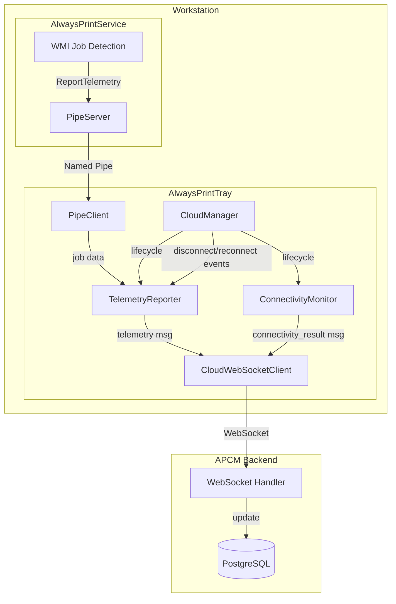
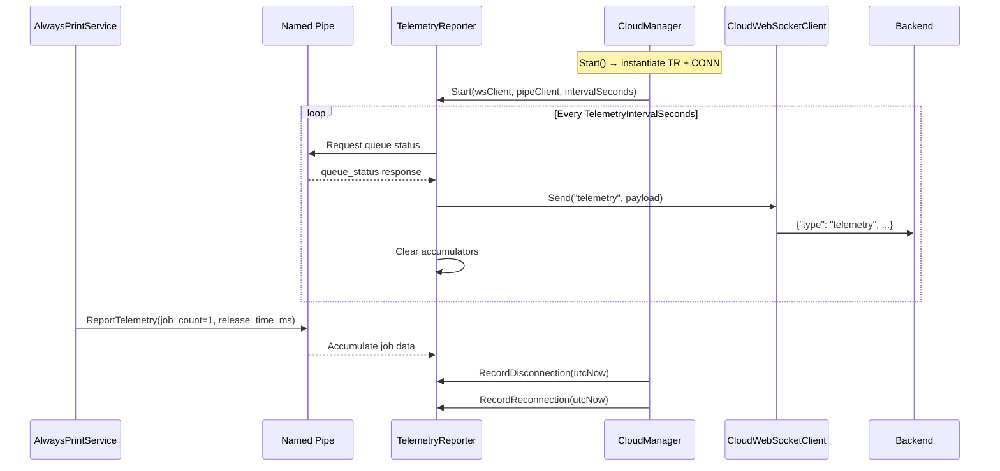

# Design Document: AlwaysPrint Phase 4 — Telemetry & Connectivity Monitoring

## Overview

Phase 4 adds two new components to the AlwaysPrintTray application:

1. **TelemetryReporter** — Periodically collects operational metrics (queue status, disconnection events, job counts, release times) and sends them to APCM via WebSocket.
2. **ConnectivityMonitor** — Executes configurable network checks (HTTP, TCP, DNS, ICMP) in parallel and reports each result individually to APCM via WebSocket.

Both components integrate into the existing `CloudManager` lifecycle, use `CloudWebSocketClient` for transmission, and follow project conventions (AlwaysPrintLogger, Spanish messages, no Console.WriteLine).

The backend (FastAPI) receives and validates telemetry and connectivity data, updating workstation records and making data available for dashboards.

### Design Decisions

| Decision | Rationale |
|----------|-----------|
| In-memory accumulation only (no persistence) | Simplicity; data loss on restart is acceptable per requirements |
| Reuse `DomainHealthChecker.Http` for HTTP checks | Avoids socket exhaustion; follows existing pattern |
| Individual result reporting (not batched) | One slow check doesn't delay others; simpler error handling |
| Timer-based execution (not Task.Delay loop) | `System.Threading.Timer` is lightweight on .NET 4.8 and doesn't block threads |
| Cap disconnection events at 1000 | Prevents unbounded memory growth in edge cases |
| Error messages truncated to 256 chars | Prevents oversized WebSocket frames from exception stack traces |

---

## Architecture



### Component Interaction Flow



---

## Components and Interfaces

### TelemetryReporter (C# — AlwaysPrintTray/Cloud/)

```csharp
public sealed class TelemetryReporter : IDisposable
{
    // Constructor
    public TelemetryReporter(
        CloudWebSocketClient wsClient,
        PipeClient pipeClient,
        int intervalSeconds,
        bool contingencyActive);

    // Lifecycle
    public void Start();
    public void Stop();
    public void Dispose();

    // Event recording (called by CloudManager)
    public void RecordDisconnection(DateTime utcStart);
    public void RecordReconnection(DateTime utcReconnected);

    // Job data accumulation (called when ReportTelemetry IPC received)
    public void AccumulateJobData(int jobCount, long releaseTimeMs);

    // State update (called by CloudManager on contingency change)
    public void UpdateContingencyState(bool active);
}
```

**Internal State:**
- `List<DisconnectionEvent> _disconnectionLog` (max 1000)
- `int _jobsIdentified`
- `List<long> _releaseTimes`
- `bool _contingencyActive`
- `Timer _timer`
- `object _lock` (thread safety)

### ConnectivityMonitor (C# — AlwaysPrintTray/Cloud/)

```csharp
public sealed class ConnectivityMonitor : IDisposable
{
    // Constructor
    public ConnectivityMonitor(
        CloudWebSocketClient wsClient,
        List<ConnectivityCheck> checks,
        int intervalSeconds = 60);

    // Lifecycle
    public void Start();
    public void Stop();
    public void Dispose();

    // Dynamic reconfiguration
    public void UpdateChecks(List<ConnectivityCheck> newChecks);
}
```

**Internal State:**
- `List<ConnectivityCheck> _checks` (volatile reference swap for thread safety)
- `Timer _timer`
- `object _lock`

### ConnectivityCheckResult (Shared model)

```csharp
public class ConnectivityCheckResult
{
    public string CheckId { get; set; }
    public bool Success { get; set; }
    public long? LatencyMs { get; set; }
    public string? Error { get; set; }
}
```

### CloudManager Changes

```csharp
// New fields in CloudManager
private TelemetryReporter? _telemetryReporter;
private ConnectivityMonitor? _connectivityMonitor;

// In Start():
if (_config.TelemetryEnabled)
{
    _telemetryReporter = new TelemetryReporter(_wsClient!, _pipe, _config.TelemetryIntervalSeconds, contingencyActive: false);
    _telemetryReporter.Start();
}

if (_config.ConnectivityChecks?.Count > 0)
{
    _connectivityMonitor = new ConnectivityMonitor(_wsClient!, _config.ConnectivityChecks);
    _connectivityMonitor.Start();
}

// In OnDisconnected():
_telemetryReporter?.RecordDisconnection(DateTime.UtcNow);

// In OnConnected():
_telemetryReporter?.RecordReconnection(DateTime.UtcNow);

// In Stop():
_telemetryReporter?.Stop();
_telemetryReporter?.Dispose();
_connectivityMonitor?.Stop();
_connectivityMonitor?.Dispose();
```

### Backend WebSocket Handler Changes (Python)

New message type handlers in `workstation.py`:

```python
elif message_type == "telemetry":
    await handle_telemetry(data, workstation_id, db)

elif message_type == "connectivity_result":
    await handle_connectivity_result(data, workstation_id, db)
```

### Backend Pydantic Schemas

```python
class TelemetryMessage(BaseModel):
    queue_status: str  # "ok", "missing", "error"
    contingency_active: bool
    jobs_identified: int
    avg_release_time_ms: Optional[int] = None
    disconnection_log: List[DisconnectionEventSchema]

class DisconnectionEventSchema(BaseModel):
    started_at: str  # ISO 8601 UTC
    reconnected_at: Optional[str] = None
    duration_seconds: Optional[int] = None

class ConnectivityResultMessage(BaseModel):
    check_id: str
    success: bool
    latency_ms: Optional[int] = None
    error: Optional[str] = None
```

---

## Data Models

### WebSocket Message: Telemetry (Tray → APCM)

```json
{
    "type": "telemetry",
    "queue_status": "ok",
    "contingency_active": false,
    "jobs_identified": 5,
    "avg_release_time_ms": 1200,
    "disconnection_log": [
        {
            "started_at": "2024-01-15T10:30:00Z",
            "reconnected_at": "2024-01-15T10:30:45Z",
            "duration_seconds": 45
        }
    ]
}
```

### WebSocket Message: Connectivity Result (Tray → APCM)

```json
{
    "type": "connectivity_result",
    "check_id": "http-apcm-health",
    "success": true,
    "latency_ms": 142,
    "error": null
}
```

### IPC Message: ReportTelemetry (Service → Tray via Named Pipe)

Uses existing `MessageType.ReportTelemetry` with payload:

```json
{
    "jobCount": 1,
    "releaseTimeMs": 850
}
```

New payload class in `Payloads.cs`:

```csharp
public class ReportTelemetryPayload
{
    [JsonProperty("jobCount")]
    public int JobCount { get; set; }

    [JsonProperty("releaseTimeMs")]
    public long ReleaseTimeMs { get; set; }
}
```

### Configuration Model (already exists in AppConfiguration)

```csharp
public bool TelemetryEnabled { get; set; } = true;
public int TelemetryIntervalSeconds { get; set; } = 300;  // [60, 3600]
public List<ConnectivityCheck> ConnectivityChecks { get; set; } = new();
```

### ConnectivityCheck (already exists)

```csharp
public class ConnectivityCheck
{
    public string Id { get; set; }
    public string Type { get; set; }       // "http", "tcp", "dns", "ping"
    public string? Url { get; set; }       // For HTTP checks
    public string? Host { get; set; }      // For TCP/PING checks
    public string? Hostname { get; set; }  // For DNS checks
    public int? Port { get; set; }         // For TCP checks
    public int TimeoutMs { get; set; } = 5000;
}
```

---

## Correctness Properties

*A property is a characteristic or behavior that should hold true across all valid executions of a system — essentially, a formal statement about what the system should do. Properties serve as the bridge between human-readable specifications and machine-verifiable correctness guarantees.*

### Property 1: Telemetry Payload Assembly

*For any* combination of queue status (string), contingency state (bool), list of disconnection events, job count (non-negative integer), and list of release times, the assembled telemetry payload SHALL contain all fields with values matching the accumulated internal state, and avg_release_time_ms SHALL be null when the release times list is empty.

**Validates: Requirements 1.1, 1.4**

### Property 2: Telemetry Interval Clamping

*For any* integer value provided as TelemetryIntervalSeconds, the effective timer interval SHALL be clamped to the range [60, 3600] seconds.

**Validates: Requirements 1.2**

### Property 3: State Reset After Successful Send

*For any* accumulated telemetry state (disconnection events, job count, release times), after a successful WebSocket send (no exception), the disconnection log SHALL be empty, jobs_identified SHALL be zero, and the release times list SHALL be empty.

**Validates: Requirements 1.3, 3.5**

### Property 4: Data Retention When WebSocket Unavailable

*For any* accumulated telemetry state, if the WebSocket is not connected when the timer fires, the accumulated state SHALL remain unchanged after the cycle completes.

**Validates: Requirements 1.6**

### Property 5: Disconnection Event Lifecycle

*For any* pair of UTC timestamps (start, reconnection) where reconnection ≥ start, recording a disconnection followed by a reconnection SHALL produce a closed DisconnectionEvent with duration_seconds equal to floor((reconnection - start).TotalSeconds).

**Validates: Requirements 2.1, 2.2**

### Property 6: Disconnection Events Cap

*For any* sequence of N disconnection recordings where N > 1000, the accumulated disconnection log SHALL never exceed 1000 events.

**Validates: Requirements 2.4**

### Property 7: Job Accumulation and Average Calculation

*For any* sequence of (jobCount, releaseTimeMs) pairs where all values are non-negative, the accumulated jobs_identified SHALL equal the sum of all jobCount values, and avg_release_time_ms SHALL equal the arithmetic mean (integer division) of all releaseTimeMs values. When the sequence is empty, avg_release_time_ms SHALL be null.

**Validates: Requirements 3.3, 3.4**

### Property 8: HTTP Status Code Evaluation

*For any* HTTP response status code in the range [100, 599], the ConnectivityMonitor SHALL report success=true if and only if the status code is exactly 200.

**Validates: Requirements 4.2**

### Property 9: Error Message Truncation

*For any* exception message string of length L, the reported error field SHALL have length min(L, 256).

**Validates: Requirements 4.4**

### Property 10: Failed Check Latency Invariant

*For any* connectivity check (HTTP, TCP, DNS, ICMP) that results in failure (timeout, exception, or non-success status), the reported latency_ms SHALL be null.

**Validates: Requirements 4.6, 5.4, 6.4, 7.3**

### Property 11: Invalid URL Detection

*For any* string that is either empty or not a valid absolute URI (scheme://host format), the HTTP connectivity check SHALL report success=false with an error indicating invalid URL configuration.

**Validates: Requirements 4.7**

### Property 12: Connectivity Result Message Structure

*For any* completed connectivity check result (success or failure), the WebSocket message SHALL contain fields: check_id (non-empty string), success (boolean), latency_ms (non-negative integer or null), and error (string or null), with type "connectivity_result".

**Validates: Requirements 5.5, 6.5, 7.6, 8.2**

### Property 13: Non-Success ICMP Status Mapping

*For any* ICMP reply with a status value other than Success, the ConnectivityMonitor SHALL report success=false with an error string containing the IPStatus enum name.

**Validates: Requirements 7.3**

### Property 14: Dynamic Check List Update

*For any* new ConnectivityChecks list received via configuration update, after the current execution cycle completes, the ConnectivityMonitor's active check list SHALL exactly match the new configuration.

**Validates: Requirements 9.1, 9.2**

### Property 15: Backend Payload Validation

*For any* WebSocket message with type "telemetry" or "connectivity_result", if the payload is missing required fields or contains wrong types, the backend SHALL log the error and discard the message without closing the WebSocket connection. If the payload is valid, the backend SHALL process it and update the workstation's last_connection timestamp.

**Validates: Requirements 12.1, 12.2, 12.3**

---

## Error Handling

| Scenario | Behavior |
|----------|----------|
| Named Pipe disconnected during queue status collection | Report `queue_status: "error"` in telemetry payload |
| WebSocket unavailable at telemetry send time | Retain accumulated data, retry next interval |
| WebSocket unavailable at connectivity result send time | Discard result, log warning |
| HTTP check timeout | Cancel request, report failed with timeout error |
| HTTP check exception (network, DNS, TLS) | Report failed with truncated exception message (max 256 chars) |
| TCP connection timeout | Report failed with timeout error |
| TCP connection exception | Report failed with exception message, null latency |
| DNS resolution returns 0 addresses | Report failed with "no addresses resolved" error |
| DNS resolution exception | Report failed with exception message, null latency |
| ICMP insufficient permissions | Log warning (Spanish), report failed with "ICMP no permitido" |
| ICMP non-Success reply | Report failed with IPStatus name as error |
| Invalid URL in HTTP check config | Skip check, report failed with "URL inválida" error |
| Backend receives invalid payload | Log error with workstation ID, discard message, keep WS open |
| DisconnectionEvent cap exceeded | Drop oldest events (FIFO) when exceeding 1000 |
| TelemetryReporter stopped with open event | Close event with current UTC timestamp before disposal |
| ReportTelemetry IPC when pipe disconnected (Service side) | Discard message, log warning |

### Thread Safety

- `TelemetryReporter`: All state mutations protected by `lock(_lock)`. Timer callback acquires lock before reading/writing accumulators.
- `ConnectivityMonitor`: Check list updated via volatile reference swap. Timer callback reads the reference once per cycle. Individual check results sent to WebSocket under lock.
- `CloudWebSocketClient.Send()`: Already thread-safe (internal lock).

---

## Testing Strategy

### Unit Tests (C# — xUnit + Moq)

Focus on specific scenarios and edge cases:

- TelemetryReporter lifecycle (start/stop/dispose)
- Feature toggle behavior (TelemetryEnabled = false)
- Pipe disconnected → queue_status = "error"
- WebSocket unavailable → data retained
- Reconnection without prior disconnection → discarded
- Stop with open disconnection event → event closed
- HTTP timeout → failed result
- TCP timeout → failed result
- DNS zero addresses → failed result
- ICMP permission exception → warning logged + "ICMP no permitido"
- Empty/invalid ConnectivityChecks list → monitor idle
- Config update with empty list → monitor stops

### Unit Tests (Python — pytest)

- Backend telemetry message validation (valid/invalid payloads)
- Backend connectivity_result validation
- Invalid payload → error logged, WS not closed
- last_connection timestamp updated on valid telemetry

### Property-Based Tests (C# — FsCheck + xUnit)

**Library**: FsCheck 2.x with xUnit integration (`FsCheck.Xunit`)
**Configuration**: Minimum 100 iterations per property test.
**Tag format**: `Feature: alwaysprint-phase4-telemetry, Property {N}: {title}`

Properties to implement:
1. Telemetry payload assembly correctness
2. Interval clamping [60, 3600]
3. State reset after successful send
4. Data retention when WS unavailable
5. Disconnection event lifecycle (duration calculation)
6. Disconnection events cap at 1000
7. Job accumulation and average calculation
8. HTTP status code evaluation (only 200 = success)
9. Error message truncation to 256 chars
10. Failed check latency invariant (null)
11. Invalid URL detection
12. Connectivity result message structure
13. Non-Success ICMP status mapping
14. Dynamic check list update

### Property-Based Tests (Python — Hypothesis)

**Library**: Hypothesis
**Configuration**: `@settings(max_examples=100)`

Properties to implement:
15. Backend payload validation and graceful error handling

### Integration Tests

- End-to-end WebSocket telemetry flow (Tray → APCM)
- End-to-end connectivity result flow (Tray → APCM)
- Named Pipe ReportTelemetry message flow (Service → Tray)
- CloudManager lifecycle with TelemetryReporter + ConnectivityMonitor
- Parallel check execution (verify concurrency)
