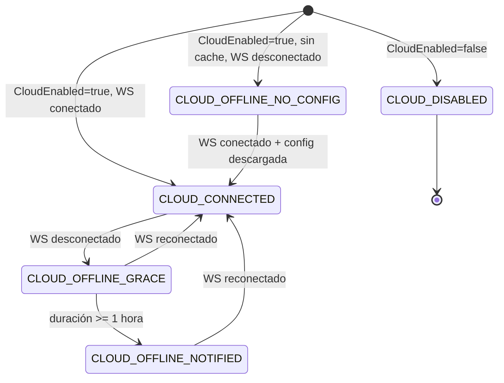
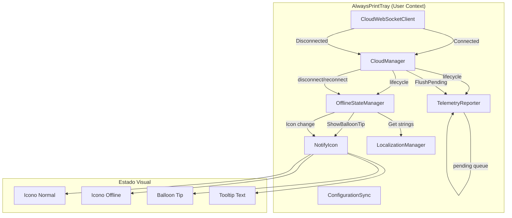
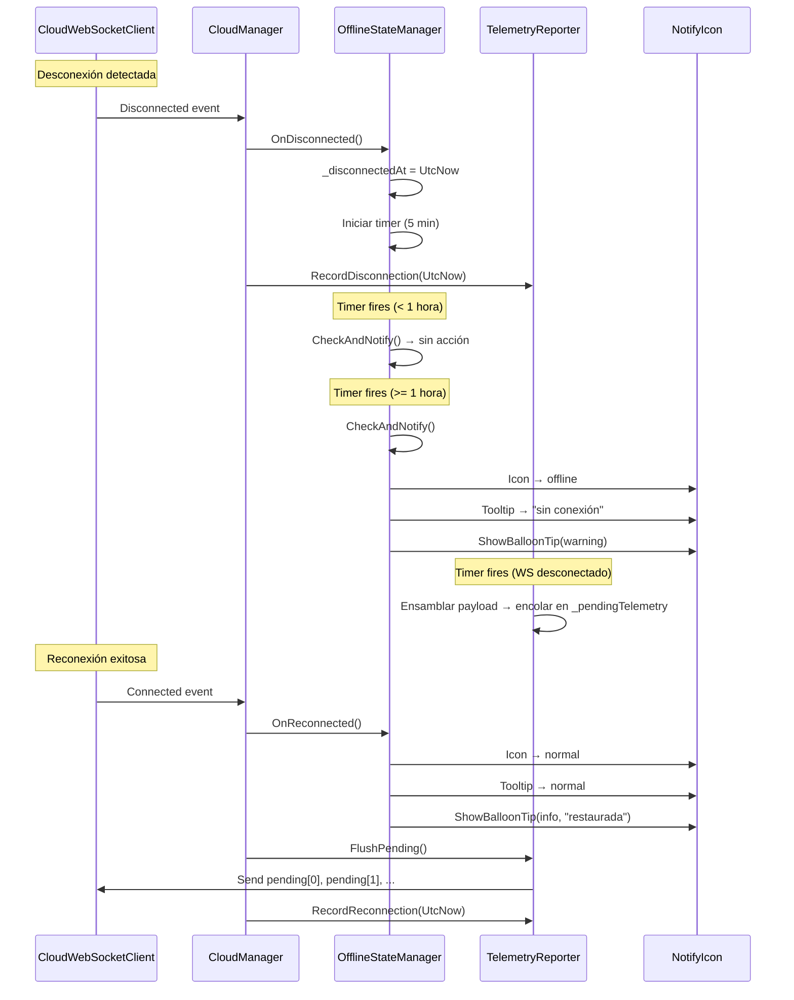

# Design Document: AlwaysPrint Phase 5 — Resiliencia Offline, Notificaciones y Modo Degradado

## Overview

La Fase 5 agrega capacidades de resiliencia offline al AlwaysPrintTray:

1. **OfflineStateManager** — Gestiona la máquina de estados offline, notificaciones balloon tip no invasivas, y cambio visual del icono del tray.
2. **Telemetría offline** — Extiende TelemetryReporter con una cola de payloads pendientes (máx 100) que se envían al reconectar.
3. **Modo sin config cacheada** — Manejo especial cuando no hay configuración descargada y no hay conexión.
4. **Reconexión transparente** — Al restaurar conexión: flush de telemetría, restaurar icono, notificar al usuario.

Todos los componentes se integran en el `CloudManager` existente, respetan el flag `CloudEnabled`, y siguen las convenciones del proyecto (AlwaysPrintLogger, mensajes en español, no Console.WriteLine).

### Design Decisions

| Decisión | Justificación |
|----------|---------------|
| Timer de 5 minutos para verificación offline | Balance entre responsividad y bajo consumo de CPU; no necesita ser instantáneo |
| Grace period de 1 hora antes de notificar | Evita alarmas por desconexiones breves (reinicio de router, mantenimiento) |
| Repetición cada 2 horas | Recordatorio periódico sin ser excesivamente molesto |
| Balloon tip (no MessageBox) | No invasivo, no bloquea el trabajo del usuario |
| Cola de telemetría limitada a 100 | Previene crecimiento ilimitado de memoria en desconexiones prolongadas |
| FIFO con descarte del más antiguo | Los datos más recientes son más valiosos que los antiguos |
| Icono offline como recurso embebido | Sin dependencias de archivos externos en runtime |
| SynchronizationContext para UI | Patrón estándar .NET para acceder a controles UI desde hilos de fondo |

---

## Architecture

### Máquina de estados



### Diagrama de componentes



### Flujo de desconexión y reconexión



---

## Components and Interfaces

### OfflineStateManager (NUEVO)

**Ubicación:** `AlwaysPrintTray/Cloud/OfflineStateManager.cs`  
**Namespace:** `AlwaysPrintTray.Cloud`  
**Modificador:** `public sealed class`, implementa `IDisposable`

```csharp
public sealed class OfflineStateManager : IDisposable
{
    // Constantes
    private static readonly TimeSpan GracePeriod = TimeSpan.FromHours(1);
    private static readonly TimeSpan NotifyRepeatEvery = TimeSpan.FromHours(2);
    private static readonly TimeSpan CheckInterval = TimeSpan.FromMinutes(5);

    // Estado
    private DateTime? _disconnectedAt;
    private DateTime? _lastNotifiedAt;
    private bool _iconIsOffline;
    private Timer? _checkTimer;
    private bool _disposed;
    private readonly object _lock = new object();

    // Dependencias
    private readonly SynchronizationContext _uiContext;
    private readonly NotifyIcon _trayIcon;

    // Constructor
    public OfflineStateManager(SynchronizationContext uiContext, NotifyIcon trayIcon);

    // Propiedades
    public bool IsOffline { get; }
    public TimeSpan? OfflineDuration { get; }

    // Métodos públicos
    public void OnDisconnected();
    public void OnReconnected();
    public void Dispose();

    // Métodos privados
    private void CheckAndNotify();
    private void OnTimerElapsed(object? state);
    private void ShowOfflineNotification();
    private void ShowReconnectedNotification();
    private void SetOfflineIcon();
    private void SetNormalIcon();
}
```

**Responsabilidades:**
- Registrar timestamp de desconexión/reconexión
- Timer periódico (5 min) para verificar si corresponde notificar
- Mostrar balloon tip después del grace period (1 hora)
- Repetir balloon tip cada 2 horas
- Cambiar icono del tray a versión offline/normal
- Actualizar tooltip del tray
- Mostrar balloon tip de reconexión

### TelemetryReporter (MODIFICADO)

**Nuevos miembros:**

```csharp
// Cola de telemetría pendiente (protegida por _lock existente)
private readonly Queue<object> _pendingTelemetry = new Queue<object>();
private const int MaxPendingTelemetry = 100;

// Nuevo método público
public void FlushPending();

// Método privado modificado
private void SendOrQueue(object payload);
```

**Cambios en `OnTimerElapsed`:**
- En lugar de descartar cuando WS no está conectado, ensamblar el payload y llamar `SendOrQueue(payload)`
- `SendOrQueue`: si WS conectado → enviar directo; si no → encolar (con descarte FIFO si lleno)
- Después de ensamblar y encolar/enviar: limpiar acumuladores (como antes)

**Nuevo método `FlushPending()`:**
- Bajo lock, dequeue y enviar cada payload mientras WS esté conectado
- Si WS se desconecta durante flush, detener y retener los restantes

### CloudManager (MODIFICADO)

**Nuevos campos:**

```csharp
private OfflineStateManager? _offlineState;
```

**Cambios en `Start()`:**
- Instanciar `OfflineStateManager` con `_uiContext` y `_trayIcon`
- Detectar condición "sin config cacheada + offline" y mostrar balloon tip

**Cambios en `OnConnected()`:**
- Llamar `_offlineState?.OnReconnected()`
- Llamar `_telemetryReporter?.FlushPending()`
- Mostrar balloon tip de reconexión (si estaba offline)

**Cambios en `OnDisconnected()`:**
- Llamar `_offlineState?.OnDisconnected()`

**Cambios en `Stop()`:**
- Llamar `_offlineState?.Dispose()`

---

## Data Models

### Estados del Tray respecto a la nube

| Estado | Condición | Comportamiento |
|--------|-----------|----------------|
| `CLOUD_DISABLED` | `CloudEnabled=false` | Sin intentos de conexión, sin notificaciones |
| `CLOUD_CONNECTED` | WS conectado | Operación normal, icono normal |
| `CLOUD_OFFLINE_GRACE` | WS desconectado < 1 hora | Sin notificación, icono normal |
| `CLOUD_OFFLINE_NOTIFIED` | WS desconectado ≥ 1 hora | Balloon tip, icono offline, repetir cada 2h |
| `CLOUD_OFFLINE_NO_CONFIG` | Sin cache + WS desconectado | Warning prominente, operar con defaults |

### Cola de telemetría pendiente

```
Queue<object> _pendingTelemetry
├── Capacidad máxima: 100 entradas
├── Política de overflow: FIFO (descartar más antiguo)
├── Protección: lock(_lock) existente
├── Flush: al reconectar, antes del siguiente ciclo periódico
└── Contenido: payloads anónimos serializables a JSON
```

### Strings de localización

| Key | English (Strings.resx) | Español (Strings.es.resx) |
|-----|----------------------|--------------------------|
| `BalloonOfflineTitle` | `AlwaysPrint` | `AlwaysPrint` |
| `BalloonOfflineText` | `Using cached config. No cloud connection.` | `Usando configuración guardada. Sin conexión a la nube.` |
| `BalloonOfflineNoConfig` | `No cloud connection and no cached config. Using defaults.` | `Sin conexión a la nube y sin configuración guardada. Usando valores por defecto.` |
| `BalloonReconnected` | `Cloud connection restored.` | `Conexión con la nube restaurada.` |
| `TooltipOffline` | `AlwaysPrint (offline)` | `AlwaysPrint (sin conexión)` |

### Recursos embebidos

| Recurso | Archivo | Descripción |
|---------|---------|-------------|
| Icono offline | `Resources/logo_offline.ico` | Versión gris/desaturada del logo normal |

---

## Correctness Properties

*A property is a characteristic or behavior that should hold true across all valid executions of a system — essentially, a formal statement about what the system should do. Properties serve as the bridge between human-readable specifications and machine-verifiable correctness guarantees.*

### Property 1: Grace Period Notification Suppression

*For any* disconnection duration less than 1 hour, the `OfflineStateManager` SHALL NOT show any balloon tip notification and SHALL NOT change the tray icon.

**Validates: Requirements 2.1, 3.1**

### Property 2: First Notification Timing

*For any* disconnection that persists for exactly 1 hour or more, the first balloon tip SHALL be shown at or after the 1-hour mark, and no earlier.

**Validates: Requirements 2.2**

### Property 3: Notification Repeat Interval

*For any* sequence of `CheckAndNotify()` calls after the first notification, subsequent notifications SHALL occur at intervals of exactly 2 hours (±5 minutes due to timer granularity) from the previous notification.

**Validates: Requirements 2.3**

### Property 4: Reconnection Clears State

*For any* offline state (with or without notifications shown), calling `OnReconnected()` SHALL result in `IsOffline == false`, `OfflineDuration == null`, timer stopped, icon restored to normal, and tooltip restored to normal.

**Validates: Requirements 1.4, 3.2, 3.4**

### Property 5: Pending Telemetry Queue Cap

*For any* sequence of N telemetry cycles where N > 100 and the WebSocket remains disconnected, the pending telemetry queue SHALL never exceed 100 entries.

**Validates: Requirements 4.2**

### Property 6: Pending Telemetry FIFO Order

*For any* sequence of enqueued telemetry payloads, `FlushPending()` SHALL send them in the same order they were enqueued (FIFO).

**Validates: Requirements 4.3**

### Property 7: Flush Partial Failure Retention

*For any* flush operation where the WebSocket disconnects after sending K of N pending payloads (K < N), the remaining N-K payloads SHALL be retained in the queue in their original order.

**Validates: Requirements 6.5**

### Property 8: CloudEnabled=false Inertness

*For any* system state where `CloudEnabled=false`, no `OfflineStateManager` SHALL be instantiated, no balloon tips SHALL be shown, and no tray icon changes SHALL occur.

**Validates: Requirements 9.1, 9.2**

### Property 9: Accumulator Reset After Queue

*For any* telemetry cycle where the payload is enqueued (WS offline), the accumulators (disconnection log, jobs_identified, release times) SHALL be cleared after enqueueing, identical to the behavior after a successful send.

**Validates: Requirements 4.7**

### Property 10: No-Config-Offline Single Notification

*For any* startup where `CloudEnabled=true`, no cached config exists, and WS is disconnected, the `BalloonOfflineNoConfig` balloon tip SHALL be shown exactly once and SHALL NOT repeat.

**Validates: Requirements 5.5**

---

## Error Handling

| Escenario | Comportamiento |
|-----------|----------------|
| Timer callback throws exception | Catch, log con AlwaysPrintLogger, no propagar |
| ShowBalloonTip throws (icon disposed) | Catch, log warning, continuar |
| SynchronizationContext.Post fails | Catch, log warning, no retry |
| FlushPending: WS disconnects mid-flush | Stop flushing, retain remaining payloads |
| LoadOfflineIcon fails (resource missing) | Log error, keep current icon unchanged |
| OnReconnected called without prior OnDisconnected | No-op (IsOffline already false) |
| OnDisconnected called while already offline | No-op (already tracking disconnection) |
| Dispose called multiple times | Idempotent (guard with _disposed flag) |

### Thread Safety

- `OfflineStateManager`: All state mutations protected by `lock(_lock)`. Timer callback acquires lock. UI operations dispatched via `SynchronizationContext.Post()`.
- `TelemetryReporter._pendingTelemetry`: Protected by existing `lock(_lock)`. No new lock objects.
- `CloudManager`: Calls to `OfflineStateManager` and `TelemetryReporter.FlushPending()` are made from event handlers which are already serialized by the WebSocket client.

---

## Testing Strategy

### Unit Tests (C# — xUnit + Moq)

Focus on specific scenarios and edge cases:

- OfflineStateManager lifecycle (OnDisconnected → CheckAndNotify → OnReconnected)
- Grace period: no notification before 1 hour
- First notification at 1 hour mark
- Repeat notification every 2 hours
- OnReconnected clears all state
- OnReconnected shows reconnection balloon
- CloudEnabled=false: no OfflineStateManager instantiated
- TelemetryReporter: payload enqueued when WS offline
- TelemetryReporter: queue cap at 100 (oldest discarded)
- TelemetryReporter: FlushPending sends in FIFO order
- TelemetryReporter: FlushPending stops on WS disconnect
- TelemetryReporter: accumulators cleared after enqueue
- CloudManager: no-config-offline balloon shown once
- Icon change to offline after 1 hour
- Icon restored on reconnection

### Property-Based Tests (C# — FsCheck + xUnit)

**Library**: FsCheck 2.x with xUnit integration (`FsCheck.Xunit`)  
**Configuration**: Minimum 100 iterations per property test.  
**Tag format**: `Feature: alwaysprint-phase5-resilience, Property {N}: {title}`

Properties to implement:
1. Grace period notification suppression
2. First notification timing
3. Notification repeat interval
4. Reconnection clears state
5. Pending telemetry queue cap at 100
6. Pending telemetry FIFO order
7. Flush partial failure retention
8. CloudEnabled=false inertness
9. Accumulator reset after queue
10. No-config-offline single notification

### Integration Tests

- End-to-end: disconnect → wait > 1 hour (simulated) → verify balloon shown
- End-to-end: disconnect → reconnect → verify flush + icon restore
- CloudManager lifecycle with OfflineStateManager + TelemetryReporter
- Verify compilation: `dotnet build AlwaysPrint.sln -c Release`
