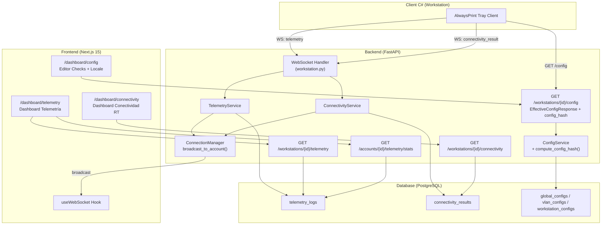

# Design Document — Fase 6: Mejoras al Portal Cloud (APCM)

## Overview

La Fase 6 extiende el backend FastAPI y el frontend Next.js 15 del AlwaysPrint Cloud Manager (APCM) para soportar:

1. **Persistencia de telemetría y conectividad**: Nuevas tablas PostgreSQL (`telemetry_logs`, `connectivity_results`) con modelos SQLAlchemy y migración Alembic.
2. **Extensión de schemas de configuración**: `ConnectivityCheckItem` con validación condicional por tipo (HTTP/TCP/Ping/DNS), locale por organización, y `config_hash` SHA-256 en `EffectiveConfigResponse`.
3. **WebSocket persistence + broadcast**: Los mensajes de telemetría y resultados de conectividad recibidos por WebSocket se persisten en BD y se retransmiten a operadores.
4. **Endpoints REST de consulta**: Historial de telemetría, historial de conectividad, y estadísticas agregadas por cuenta.
5. **Frontend**: Editor de checks de conectividad, selector de locale, dashboard de telemetría, dashboard de conectividad en tiempo real, y tipos TypeScript estrictos.

### Decisiones de diseño clave

- **Tenant isolation**: Todas las queries filtran por `account_id`. Los nuevos modelos incluyen `account_id` como FK directa para evitar JOINs innecesarios en consultas frecuentes.
- **config_hash**: SHA-256 del JSON serializado con `sort_keys=True` excluyendo `source` y `config_hash`. Permite al Client C# detectar cambios sin comparar campo a campo.
- **Índices compuestos**: `(workstation_id, recorded_at)` y `(workstation_id, check_id, recorded_at)` para queries de rango temporal eficientes.
- **WebSocket flow**: Persist → Broadcast (si persist falla, no se hace broadcast). La conexión WebSocket nunca se cierra por errores de validación o persistencia.

---

## Architecture



### Flujo de datos principal

1. **Workstation → Backend (WebSocket)**: El Tray Client envía mensajes `telemetry` y `connectivity_result` por WebSocket.
2. **Backend → PostgreSQL**: El handler valida con Pydantic, verifica tenant isolation, y persiste en la tabla correspondiente.
3. **Backend → Operadores (WebSocket broadcast)**: Tras persistir, se hace broadcast a todos los operadores de la misma cuenta.
4. **Frontend → Backend (REST)**: Los dashboards consultan historial y estadísticas vía endpoints REST con React Query.
5. **Frontend (WebSocket)**: Los dashboards reciben actualizaciones en tiempo real vía el hook `useWebSocket` existente.

---

## Components and Interfaces

### Backend — Nuevos archivos

| Archivo | Responsabilidad |
|---------|----------------|
| `alembic/versions/007_add_telemetry_and_connectivity_tables.py` | Migración: crear tablas e índices |
| `app/models/telemetry.py` | Modelos `TelemetryLog` y `ConnectivityResult` |
| `app/schemas/telemetry.py` | Schemas Pydantic para telemetría y conectividad |
| `app/services/telemetry.py` | `TelemetryService` — persistencia y consulta de telemetría |
| `app/services/connectivity.py` | `ConnectivityService` — persistencia y consulta de conectividad |
| `app/api/v1/endpoints/telemetry.py` | Endpoints REST de telemetría y stats |
| `app/api/v1/endpoints/connectivity.py` | Endpoint REST de historial de conectividad |

### Backend — Archivos modificados

| Archivo | Cambio |
|---------|--------|
| `app/models/__init__.py` | Registrar `TelemetryLog`, `ConnectivityResult` |
| `app/schemas/config.py` | Extender `ConnectivityCheckItem` con tipos ping/dns, agregar `config_hash` a `EffectiveConfigResponse` |
| `app/services/config.py` | Agregar `compute_config_hash()` y extender `get_effective_config()` |
| `app/api/v1/websocket/workstation.py` | Agregar handlers para mensajes `telemetry` y `connectivity_result` |
| `app/api/v1/router.py` | Registrar nuevos routers |

### Frontend — Nuevos archivos

| Archivo | Responsabilidad |
|---------|----------------|
| `src/types/telemetry.ts` | Interfaces `TelemetryEntry`, `ConnectivityResult`, `TelemetryStats` |
| `src/app/dashboard/telemetry/page.tsx` | Página de dashboard de telemetría |
| `src/app/dashboard/connectivity/page.tsx` | Página de dashboard de conectividad RT |
| `src/components/ConnectivityCheckEditor.tsx` | Editor de checks de conectividad (tabla + modal) |
| `src/components/LocaleSelector.tsx` | Selector de locale para configuración |

### Frontend — Archivos modificados

| Archivo | Cambio |
|---------|--------|
| `src/types/config.ts` | Extender `EffectiveConfig` con nuevos campos, agregar `ConnectivityCheck` |
| `src/types/websocket.ts` | Agregar `TelemetryReceivedMessage`, `ConnectivityResultReceivedMessage` al union `OperatorMessage` |
| `src/types/index.ts` | Re-exportar nuevos tipos |
| `src/app/dashboard/config/page.tsx` | Integrar `ConnectivityCheckEditor` y `LocaleSelector` |
| `src/app/dashboard/layout.tsx` | Agregar entradas de navegación para telemetría y conectividad |

---

## Data Models

### Tabla `telemetry_logs`

```sql
CREATE TABLE telemetry_logs (
    id UUID PRIMARY KEY DEFAULT gen_random_uuid(),
    workstation_id UUID NOT NULL REFERENCES workstations(id) ON DELETE CASCADE,
    account_id UUID NOT NULL REFERENCES accounts(id) ON DELETE CASCADE,
    queue_status VARCHAR(20),          -- "ok" | "missing" | "error"
    contingency_active BOOLEAN,
    jobs_identified INTEGER,
    avg_release_time_ms BIGINT,
    disconnection_count INTEGER,
    recorded_at TIMESTAMP NOT NULL DEFAULT NOW()
);

CREATE INDEX ix_telemetry_logs_ws_recorded 
    ON telemetry_logs(workstation_id, recorded_at);
CREATE INDEX ix_telemetry_logs_account 
    ON telemetry_logs(account_id);
```

### Tabla `connectivity_results`

```sql
CREATE TABLE connectivity_results (
    id UUID PRIMARY KEY DEFAULT gen_random_uuid(),
    workstation_id UUID NOT NULL REFERENCES workstations(id) ON DELETE CASCADE,
    account_id UUID NOT NULL REFERENCES accounts(id) ON DELETE CASCADE,
    check_id VARCHAR(100) NOT NULL,
    check_type VARCHAR(20) NOT NULL,   -- "http" | "tcp" | "ping" | "dns"
    success BOOLEAN NOT NULL,
    latency_ms BIGINT,
    error VARCHAR(500),
    recorded_at TIMESTAMP NOT NULL DEFAULT NOW()
);

CREATE INDEX ix_connectivity_results_ws_check_recorded 
    ON connectivity_results(workstation_id, check_id, recorded_at);
CREATE INDEX ix_connectivity_results_account 
    ON connectivity_results(account_id);
```

### Modelo SQLAlchemy — `TelemetryLog`

```python
class TelemetryLog(Base):
    __tablename__ = "telemetry_logs"
    
    id = Column(GUID, primary_key=True, default=uuid.uuid4)
    workstation_id = Column(GUID, ForeignKey("workstations.id", ondelete="CASCADE"), nullable=False, index=True)
    account_id = Column(GUID, ForeignKey("accounts.id", ondelete="CASCADE"), nullable=False, index=True)
    queue_status = Column(String(20), nullable=True)
    contingency_active = Column(Boolean, nullable=True)
    jobs_identified = Column(Integer, nullable=True)
    avg_release_time_ms = Column(BigInteger, nullable=True)
    disconnection_count = Column(Integer, nullable=True)
    recorded_at = Column(DateTime, nullable=False, default=datetime.utcnow, index=True)
    
    # Relaciones
    workstation = relationship("Workstation", back_populates="telemetry_logs")
    account = relationship("Account", back_populates="telemetry_logs")
```

### Modelo SQLAlchemy — `ConnectivityResult`

```python
class ConnectivityResult(Base):
    __tablename__ = "connectivity_results"
    
    id = Column(GUID, primary_key=True, default=uuid.uuid4)
    workstation_id = Column(GUID, ForeignKey("workstations.id", ondelete="CASCADE"), nullable=False, index=True)
    account_id = Column(GUID, ForeignKey("accounts.id", ondelete="CASCADE"), nullable=False, index=True)
    check_id = Column(String(100), nullable=False)
    check_type = Column(String(20), nullable=False)
    success = Column(Boolean, nullable=False)
    latency_ms = Column(BigInteger, nullable=True)
    error = Column(String(500), nullable=True)
    recorded_at = Column(DateTime, nullable=False, default=datetime.utcnow, index=True)
    
    # Relaciones
    workstation = relationship("Workstation", back_populates="connectivity_results")
    account = relationship("Account", back_populates="connectivity_results")
```

### Schema Pydantic — `ConnectivityCheckItem` (extendido)

```python
class ConnectivityCheckItem(BaseModel):
    """Check de conectividad con validación condicional por tipo."""
    id: str = Field(..., max_length=64)
    type: Literal["http", "tcp", "ping", "dns"]
    url: Optional[str] = Field(None, max_length=2048)
    host: Optional[str] = Field(None, max_length=255)
    hostname: Optional[str] = Field(None, max_length=255)
    port: Optional[int] = Field(None, ge=1, le=65535)
    timeout_ms: int = Field(5000, ge=100, le=30000)

    @model_validator(mode="after")
    def validate_type_fields(self) -> "ConnectivityCheckItem":
        if self.type == "http" and not self.url:
            raise ValueError("Campo 'url' requerido para tipo 'http'")
        if self.type == "tcp" and (not self.host or not self.port):
            raise ValueError("Campos 'host' y 'port' requeridos para tipo 'tcp'")
        if self.type == "ping" and not self.host:
            raise ValueError("Campo 'host' requerido para tipo 'ping'")
        if self.type == "dns" and not self.hostname:
            raise ValueError("Campo 'hostname' requerido para tipo 'dns'")
        return self
```

### Schema Pydantic — `EffectiveConfigResponse` (con config_hash)

```python
class EffectiveConfigResponse(BaseModel):
    corporate_queue_name: str
    search_targets: Optional[dict] = None
    pending_task_polling_minutes: int
    bootstrap_domains: str
    connectivity_checks: List[ConnectivityCheckItem] = Field(default_factory=list, max_length=50)
    locale: str = Field(default="", max_length=10)
    telemetry_enabled: bool = Field(default=True)
    telemetry_interval_seconds: int = Field(default=300, ge=10, le=86400)
    source: dict[str, Literal["global", "vlan", "workstation"]]
    config_hash: str = Field(..., min_length=64, max_length=64, pattern=r"^[0-9a-f]{64}$")
```

### Función `compute_config_hash`

```python
import hashlib
import json

def compute_config_hash(config_dict: dict) -> str:
    """
    Computa SHA-256 del JSON de configuración efectiva.
    
    Excluye 'source' y 'config_hash' del input.
    Serializa con sort_keys=True y ensure_ascii=False.
    """
    # Excluir campos no-hashables
    hashable = {k: v for k, v in config_dict.items() if k not in ("source", "config_hash")}
    # Serializar determinísticamente
    json_str = json.dumps(hashable, sort_keys=True, ensure_ascii=False)
    # Computar SHA-256
    return hashlib.sha256(json_str.encode("utf-8")).hexdigest()
```

### Interfaces TypeScript — `TelemetryEntry`

```typescript
export interface TelemetryEntry {
  id: string
  workstation_id: string
  queue_status: 'ok' | 'missing' | 'error'
  contingency_active: boolean
  jobs_identified: number
  avg_release_time_ms: number | null
  disconnection_count: number
  recorded_at: string  // ISO 8601
}
```

### Interfaces TypeScript — `ConnectivityResult`

```typescript
export interface ConnectivityResult {
  id: string
  workstation_id: string
  check_id: string
  check_type: 'http' | 'tcp' | 'ping' | 'dns'
  success: boolean
  latency_ms: number | null
  error: string | null
  recorded_at: string  // ISO 8601
}
```

### Interfaces TypeScript — `TelemetryStats`

```typescript
export interface TelemetryStats {
  total_workstations: number
  workstations_reporting: number
  avg_jobs_identified: number
  contingency_active_count: number
  queue_status_summary: {
    ok: number
    missing: number
    error: number
  }
  last_updated: string | null
}
```

### Interfaces TypeScript — WebSocket Messages

```typescript
export interface TelemetryReceivedMessage {
  type: 'telemetry_received'
  workstation_id: string
  queue_status: string
  contingency_active: boolean
  jobs_identified: number
  avg_release_time_ms: number | null
  disconnection_count: number
}

export interface ConnectivityResultReceivedMessage {
  type: 'connectivity_result'
  workstation_id: string
  check_id: string
  check_type: string
  success: boolean
  latency_ms: number | null
  error: string | null
}
```

---

## Correctness Properties

*A property is a characteristic or behavior that should hold true across all valid executions of a system — essentially, a formal statement about what the system should do. Properties serve as the bridge between human-readable specifications and machine-verifiable correctness guarantees.*

### Property 1: ConnectivityCheckItem schema validates type-specific required fields

*For any* `ConnectivityCheckItem` with a valid `type` value, the schema SHALL accept the item if and only if the required fields for that type are present (`url` for HTTP, `host`+`port` for TCP, `host` for Ping, `hostname` for DNS), and SHALL reject items with invalid type values or missing required fields for the declared type.

**Validates: Requirements 3.4, 3.5, 3.6, 3.7, 3.8, 3.9, 3.10**

### Property 2: config_hash is a deterministic SHA-256 of effective config excluding source

*For any* effective config dictionary, `compute_config_hash` SHALL produce a 64-character lowercase hexadecimal string equal to the SHA-256 of the UTF-8 JSON serialization (with `sort_keys=True`, `ensure_ascii=False`) of the config fields excluding `source` and `config_hash`, and SHALL produce the same output for the same input across multiple invocations.

**Validates: Requirements 4.1, 4.2, 4.3, 4.4, 4.5, 4.7**

### Property 3: Telemetry message persistence preserves all payload fields

*For any* valid telemetry WebSocket message with a workstation_id that exists within the sender's account, the resulting `TelemetryLog` record SHALL contain the same `queue_status`, `contingency_active`, `jobs_identified`, `avg_release_time_ms` values from the payload, and `disconnection_count` SHALL equal the length of the `disconnection_log` array.

**Validates: Requirements 5.1, 5.2**

### Property 4: Invalid WebSocket messages are rejected without closing the connection

*For any* WebSocket message (telemetry or connectivity_result) that fails Pydantic validation OR references a workstation_id not belonging to the sender's account, the Backend SHALL discard the message without persisting a record and without closing the WebSocket connection.

**Validates: Requirements 5.4, 5.5, 5.6, 6.3, 6.4, 6.6**

### Property 5: Connectivity result persistence preserves all payload fields

*For any* valid `connectivity_result` WebSocket message with a workstation_id that exists within the sender's account, the resulting `ConnectivityResult` record SHALL contain the same `check_id`, `check_type`, `success`, `latency_ms`, and `error` values from the payload.

**Validates: Requirements 6.1, 6.5**

### Property 6: Telemetry endpoint returns correctly ordered and filtered results

*For any* valid query to `GET /api/v1/workstations/{id}/telemetry` with parameters `from`, `to`, and `limit`, the response SHALL contain only records whose `recorded_at` falls within the specified time range, ordered by `recorded_at` descending, with at most `limit` records. Invalid parameter combinations (from > to, limit outside 1-1000) SHALL return HTTP 422.

**Validates: Requirements 7.2, 7.3, 7.7**

### Property 7: Connectivity endpoint returns correctly ordered and filtered results

*For any* valid query to `GET /api/v1/workstations/{id}/connectivity` with parameters `check_id`, `from`, `to`, and `limit`, the response SHALL contain only records matching the filters, ordered by `recorded_at` descending, with at most `limit` records. Invalid parameters SHALL return HTTP 422.

**Validates: Requirements 8.2, 8.3, 8.7**

### Property 8: Tenant isolation — no cross-account data access

*For any* authenticated request to telemetry, connectivity, or stats endpoints, the response SHALL contain exclusively records belonging to the authenticated user's `account_id`. A request for a workstation not belonging to the user's account SHALL return HTTP 404.

**Validates: Requirements 7.4, 7.5, 8.4, 8.5, 9.4, 9.5, 16.1, 16.2, 16.3, 16.4, 16.5**

### Property 9: Telemetry stats aggregation correctness

*For any* set of `TelemetryLog` records within the last 24 hours for an account, the stats endpoint SHALL return `workstations_reporting` equal to the count of distinct workstation_ids with records in that window, `avg_jobs_identified` equal to the arithmetic mean of `jobs_identified` across all records (rounded to 2 decimals), and `contingency_active_count` equal to the count of workstations whose most recent record has `contingency_active = true`.

**Validates: Requirements 9.2, 9.3**

---

## Error Handling

### Backend — WebSocket message processing

| Escenario | Acción | Conexión |
|-----------|--------|----------|
| Payload falla validación Pydantic | Log ERROR con workstation_id, descartar mensaje | Mantener abierta |
| workstation_id no existe para account_id | Log WARNING, descartar mensaje | Mantener abierta |
| Fallo de escritura en BD | Log ERROR con detalles, omitir broadcast | Mantener abierta |
| Excepción inesperada en handler | Log CRITICAL, descartar mensaje | Mantener abierta |

**Rationale**: La conexión WebSocket es costosa de re-establecer. Un mensaje inválido no debe penalizar mensajes futuros válidos.

### Backend — REST endpoints

| Escenario | HTTP Status | Respuesta |
|-----------|-------------|-----------|
| Token ausente o inválido | 401 | `{"detail": "Autenticación requerida"}` |
| Workstation no encontrada o de otra cuenta | 404 | `{"detail": "Workstation no encontrada"}` |
| Parámetros de query inválidos | 422 | `{"detail": "Parámetro X inválido: ..."}` |
| Error interno de BD | 500 | `{"detail": "Error interno del servidor"}` |

### Frontend — Manejo de errores

| Escenario | Comportamiento |
|-----------|---------------|
| API request falla | Mostrar mensaje de error + botón "Reintentar", preservar datos previos |
| WebSocket desconectado | Indicador visual de desconexión, reconexión automática |
| Datos vacíos | Mostrar empty-state con mensaje informativo |
| Carga inicial | Skeleton placeholders que replican el layout final |

---

## Testing Strategy

### Unit Tests (pytest)

- **Modelos**: Verificar que `TelemetryLog` y `ConnectivityResult` se crean correctamente con todos los campos.
- **Schemas**: Verificar validación de `ConnectivityCheckItem` con casos específicos (HTTP sin url, TCP sin port, etc.).
- **config_hash**: Verificar cómputo correcto con ejemplos concretos.
- **Services**: Verificar lógica de persistencia y consulta con BD en memoria (SQLite).
- **Endpoints**: Verificar respuestas HTTP con TestClient de FastAPI.

### Property-Based Tests (Hypothesis)

La librería elegida es **Hypothesis** para Python, que es el estándar para PBT en el ecosistema Python/pytest.

**Configuración**:
- Mínimo 100 iteraciones por propiedad (`@settings(max_examples=100)`)
- Cada test referencia su propiedad del documento de diseño con un tag en comentario

**Tests a implementar**:

1. **Property 1**: Generar `ConnectivityCheckItem` aleatorios con combinaciones de tipo y campos, verificar que la validación acepta/rechaza correctamente.
   - Tag: `# Feature: alwaysprint-phase6-portal, Property 1: ConnectivityCheckItem schema validates type-specific required fields`

2. **Property 2**: Generar diccionarios de configuración aleatorios, computar hash, verificar formato y determinismo.
   - Tag: `# Feature: alwaysprint-phase6-portal, Property 2: config_hash is a deterministic SHA-256 of effective config excluding source`

3. **Property 3**: Generar payloads de telemetría válidos, persistir, verificar que el registro coincide.
   - Tag: `# Feature: alwaysprint-phase6-portal, Property 3: Telemetry message persistence preserves all payload fields`

4. **Property 4**: Generar payloads inválidos (validación fallida o workstation inexistente), verificar rechazo sin cierre de conexión.
   - Tag: `# Feature: alwaysprint-phase6-portal, Property 4: Invalid WebSocket messages are rejected without closing the connection`

5. **Property 5**: Generar payloads de connectivity_result válidos, persistir, verificar que el registro coincide.
   - Tag: `# Feature: alwaysprint-phase6-portal, Property 5: Connectivity result persistence preserves all payload fields`

6. **Property 6**: Generar conjuntos de TelemetryLog con timestamps aleatorios, consultar con parámetros from/to/limit, verificar orden y filtrado.
   - Tag: `# Feature: alwaysprint-phase6-portal, Property 6: Telemetry endpoint returns correctly ordered and filtered results`

7. **Property 7**: Generar conjuntos de ConnectivityResult, consultar con parámetros, verificar orden y filtrado.
   - Tag: `# Feature: alwaysprint-phase6-portal, Property 7: Connectivity endpoint returns correctly ordered and filtered results`

8. **Property 8**: Generar datos para múltiples cuentas, verificar que cada usuario solo ve datos de su cuenta.
   - Tag: `# Feature: alwaysprint-phase6-portal, Property 8: Tenant isolation — no cross-account data access`

9. **Property 9**: Generar conjuntos de TelemetryLog con timestamps dentro/fuera de 24h, verificar estadísticas calculadas.
   - Tag: `# Feature: alwaysprint-phase6-portal, Property 9: Telemetry stats aggregation correctness`

### Integration Tests

- **Migración Alembic**: Ejecutar `upgrade` y `downgrade`, verificar que las tablas se crean/eliminan correctamente.
- **WebSocket broadcast**: Verificar que tras persistir telemetría/conectividad, el broadcast llega a operadores de la misma cuenta.
- **End-to-end flow**: Enviar mensaje WebSocket → verificar persistencia → verificar broadcast → consultar endpoint REST.

### Frontend Tests

- **TypeScript compilation**: `npm run build` con strict mode debe compilar sin errores.
- **Component tests** (React Testing Library): Verificar renderizado de tablas, modales, y manejo de estados (loading, error, empty).
- **WebSocket integration**: Verificar que `useWebSocket` procesa correctamente los nuevos tipos de mensaje.

### Performance

- **Endpoint de stats**: Verificar respuesta < 2000ms con 10,000 workstations (test de carga con datos sintéticos).
