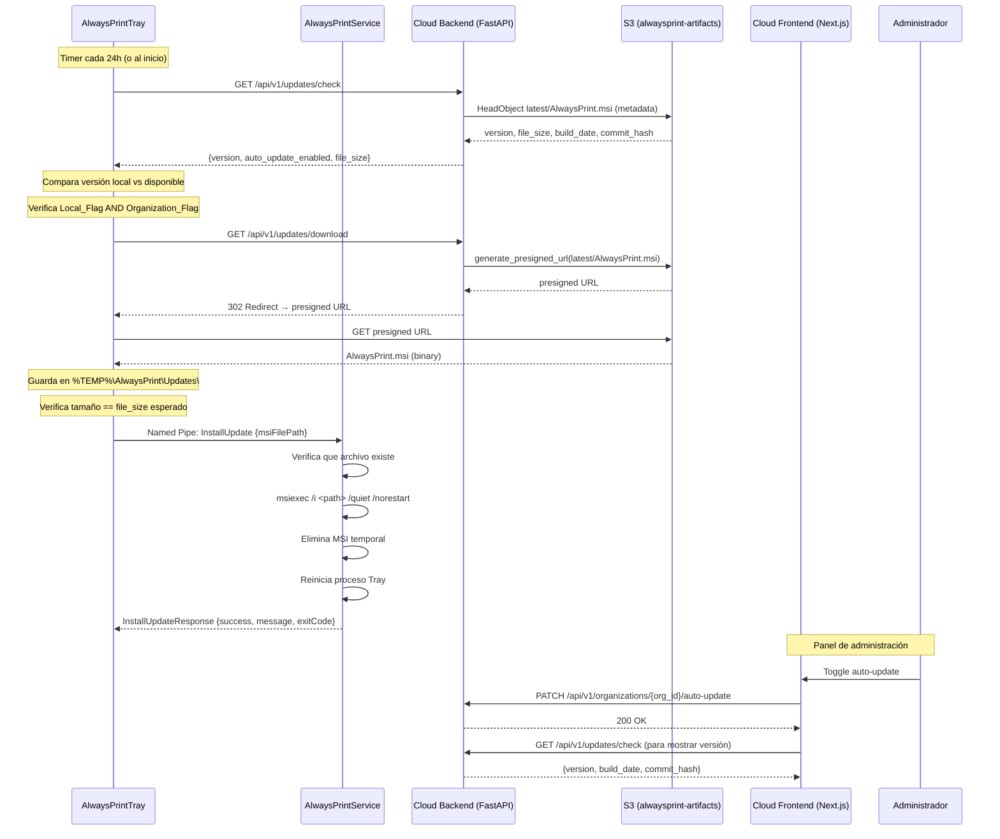

# Design Document: Auto-Update

## Overview

Sistema de actualizaciones automáticas para el cliente AlwaysPrint que permite a las workstations Windows actualizarse de forma autónoma cuando hay una nueva versión del MSI disponible en S3. El flujo involucra tres capas:

1. **Cliente Windows (Tray + Service)**: El Tray verifica periódicamente si hay actualizaciones, descarga el MSI, y solicita al Service (que tiene permisos de administrador) que ejecute la instalación silenciosa.
2. **Backend Cloud (FastAPI)**: Expone endpoints para consultar la versión disponible, descargar el MSI via presigned URL, y gestionar el flag de organización.
3. **Frontend Cloud (Next.js)**: Panel de administración para visualizar la versión vigente y controlar el flag de auto-actualización por organización.

### Decisiones de Diseño Clave

- **Separación de responsabilidades**: El Tray (contexto de usuario) maneja la verificación y descarga; el Service (LocalSystem) maneja la instalación con privilegios elevados.
- **Doble flag**: Se requiere que tanto el flag local (registro Windows) como el flag de organización (base de datos Cloud) estén habilitados para proceder con la actualización.
- **Presigned URL**: El cliente no accede directamente a S3; el backend genera una URL temporal para la descarga.
- **Verificación por tamaño**: Se usa el tamaño del archivo como verificación de integridad (simple pero efectivo para detectar descargas incompletas).
- **Instalación silenciosa con reinicio de Tray**: `msiexec /i /quiet /norestart` seguido de reinicio del proceso Tray por el Service.

## Architecture



### Diagrama de Componentes

```mermaid
graph TB
    subgraph "Cliente Windows"
        subgraph "AlwaysPrintTray (contexto usuario)"
            UC[UpdateChecker]
            UD[UpdateDownloader]
            UI[Settings UI - Toggle]
        end
        subgraph "AlwaysPrint.Shared"
            RC[RegistryConfigManager]
            MT[MessageType enum]
            PL[Payloads]
        end
        subgraph "AlwaysPrintService (LocalSystem)"
            MD[MessageDispatcher]
            UIH[UpdateInstallHandler]
        end
    end
    
    subgraph "Cloud Backend"
        UE[/api/v1/updates/check]
        DE[/api/v1/updates/download]
        OE[/api/v1/organizations/.../auto-update]
        AM[Account Model + auto_update_enabled]
    end
    
    subgraph "Cloud Frontend"
        AP[Admin Panel - Updates Section]
    end
    
    subgraph "AWS"
        S3[S3: alwaysprint-artifacts/latest/AlwaysPrint.msi]
    end

    UC -->|HTTP GET| UE
    UD -->|HTTP GET + redirect| DE
    DE -->|presigned URL| S3
    UC -->|lee| RC
    UI -->|escribe| RC
    UD -->|Named Pipe| MD
    MD -->|dispatch| UIH
    UIH -->|msiexec| UIH
    AP -->|PATCH| OE
    AP -->|GET| UE
    OE -->|read/write| AM
    UE -->|HeadObject| S3
```

## Components and Interfaces

### 1. Cliente - RegistryConfigManager (Extensión)

Se agrega un nuevo campo DWORD `AutoUpdateEnabled` al registro existente.

```csharp
// En RegistryConfigManager.EnsureDefaults()
SetIfMissing(key, "AutoUpdateEnabled", 0, RegistryValueKind.DWord);

// En RegistryConfigManager.Load()
// Nuevo campo independiente (no parte de AppConfiguration para evitar
// que la sincronización Cloud lo sobreescriba)
public bool LoadAutoUpdateEnabled()
{
    using (var key = Registry.LocalMachine.OpenSubKey(RegistryPath, writable: false))
    {
        if (key == null) return false;
        return Convert.ToInt32(key.GetValue("AutoUpdateEnabled", 0)) == 1;
    }
}

public void SaveAutoUpdateEnabled(bool enabled)
{
    using (var key = Registry.LocalMachine.CreateSubKey(RegistryPath, writable: true))
    {
        key?.SetValue("AutoUpdateEnabled", enabled ? 1 : 0, RegistryValueKind.DWord);
    }
}
```

**Decisión**: `AutoUpdateEnabled` se gestiona como campo independiente en `RegistryConfigManager` (no dentro de `AppConfiguration`) para evitar que la sincronización de configuración Cloud lo sobreescriba. El toggle local es una decisión del administrador de la workstation.

### 2. Cliente - UpdateChecker (Nueva clase en AlwaysPrintTray/Cloud/)

```csharp
namespace AlwaysPrintTray.Cloud
{
    /// <summary>
    /// Verifica periódicamente si hay actualizaciones disponibles.
    /// Se ejecuta en el contexto del Tray (usuario).
    /// </summary>
    public class UpdateChecker : IDisposable
    {
        private readonly Timer _timer;
        private readonly RegistryConfigManager _registry;
        private readonly string _cloudApiUrl;
        private readonly string _currentVersion;
        private const int CheckIntervalMs = 86_400_000; // 24 horas

        public UpdateChecker(RegistryConfigManager registry, string cloudApiUrl, string currentVersion);
        
        /// <summary>Inicia la verificación periódica.</summary>
        public void Start();
        
        /// <summary>Detiene la verificación.</summary>
        public void Stop();
        
        /// <summary>Ejecuta una verificación inmediata.</summary>
        public Task CheckNowAsync();
        
        /// <summary>Se dispara cuando hay una actualización disponible y lista para descargar.</summary>
        public event Action<UpdateInfo>? UpdateAvailable;
        
        public void Dispose();
    }

    public class UpdateInfo
    {
        public string Version { get; set; }
        public long FileSize { get; set; }
        public bool OrganizationAutoUpdateEnabled { get; set; }
    }
}
```

**Flujo interno de `CheckNowAsync()`**:
1. Leer `AutoUpdateEnabled` del registro → si `false`, no hacer nada
2. Llamar `GET /api/v1/updates/check` con autenticación de workstation
3. Si la respuesta indica `auto_update_enabled = false` (org flag), loggear y salir
4. Comparar `response.version` con `_currentVersion`
5. Si son iguales, loggear "sin actualización" y salir
6. Si difieren, disparar evento `UpdateAvailable`

### 3. Cliente - UpdateDownloader (Nueva clase en AlwaysPrintTray/Cloud/)

```csharp
namespace AlwaysPrintTray.Cloud
{
    /// <summary>
    /// Descarga el MSI de actualización de forma asíncrona y no bloqueante.
    /// </summary>
    public class UpdateDownloader
    {
        private readonly string _cloudApiUrl;
        private static readonly string UpdatesDir = 
            Path.Combine(Path.GetTempPath(), "AlwaysPrint", "Updates");

        /// <summary>
        /// Descarga el MSI y verifica su integridad por tamaño.
        /// </summary>
        /// <param name="expectedSize">Tamaño esperado en bytes.</param>
        /// <returns>Ruta completa del MSI descargado, o null si falla.</returns>
        public Task<string?> DownloadAsync(long expectedSize);
        
        /// <summary>Elimina archivos parciales o antiguos del directorio de updates.</summary>
        public void Cleanup();
    }
}
```

**Flujo interno de `DownloadAsync()`**:
1. Crear directorio `%TEMP%\AlwaysPrint\Updates\` si no existe
2. Llamar `GET /api/v1/updates/download` (sigue redirect a presigned URL)
3. Guardar como `AlwaysPrint_update.msi`
4. Verificar `FileInfo.Length == expectedSize`
5. Si falla verificación, eliminar archivo parcial, loggear error, retornar `null`
6. Si éxito, retornar ruta completa

### 4. Cliente - Mensajes IPC (Extensión de AlwaysPrint.Shared)

```csharp
// En MessageType.cs - nuevos valores
public enum MessageType
{
    // ... valores existentes ...
    
    // Actualizaciones automáticas
    InstallUpdate,           // Tray → Service: solicitar instalación de MSI
    InstallUpdateResponse    // Service → Tray: resultado de la instalación
}

// En Payloads.cs - nuevas clases
public class InstallUpdatePayload
{
    [JsonProperty("msiFilePath")]
    public string MsiFilePath { get; set; } = string.Empty;
}

public class InstallUpdateResponsePayload
{
    [JsonProperty("success")]
    public bool Success { get; set; }

    [JsonProperty("message")]
    public string? Message { get; set; }

    [JsonProperty("exitCode")]
    public int ExitCode { get; set; }
}
```

### 5. Cliente - UpdateInstallHandler (Nueva clase en AlwaysPrintService/)

```csharp
namespace AlwaysPrintService.Tasks
{
    /// <summary>
    /// Maneja la instalación del MSI de actualización.
    /// Ejecuta en contexto de LocalSystem (permisos de administrador).
    /// </summary>
    public class UpdateInstallHandler
    {
        /// <summary>
        /// Ejecuta la instalación silenciosa del MSI.
        /// </summary>
        /// <param name="msiFilePath">Ruta completa al archivo MSI.</param>
        /// <returns>Resultado de la instalación.</returns>
        public InstallUpdateResponsePayload Execute(string msiFilePath);
    }
}
```

**Flujo interno de `Execute()`**:
1. Verificar que `File.Exists(msiFilePath)` → si no, retornar error
2. Ejecutar `Process.Start("msiexec", $"/i \"{msiFilePath}\" /quiet /norestart")`
3. Esperar finalización del proceso (`WaitForExit()`)
4. Si `ExitCode == 0`:
   - Eliminar archivo MSI temporal
   - Reiniciar proceso Tray (`KillExistingTray()` + `LaunchTray()`)
   - Retornar éxito
5. Si `ExitCode != 0`:
   - Loggear error con código de salida
   - Retornar fallo con código

**Integración con MessageDispatcher**:
```csharp
// Nuevo case en Dispatch()
MessageType.InstallUpdate => HandleInstallUpdate(request),

private PipeMessage HandleInstallUpdate(PipeMessage req)
{
    var payload = req.GetPayload<InstallUpdatePayload>();
    if (string.IsNullOrWhiteSpace(payload?.MsiFilePath))
        return PipeMessage.Reply(req, MessageType.Error,
            new ErrorPayload { Code = "INVALID_PAYLOAD", Message = "MsiFilePath es obligatorio." });

    var handler = new UpdateInstallHandler();
    var result = handler.Execute(payload.MsiFilePath);
    return PipeMessage.Reply(req, MessageType.InstallUpdateResponse, result);
}
```

### 6. Cliente - Tray UI (Settings Screen)

Se agrega un toggle en la pantalla de configuración existente del Tray:

```xml
<!-- En la pantalla de configuración (XAML) -->
<CheckBox x:Name="chkAutoUpdate"
          Content="Habilitar Actualizaciones Automáticas"
          IsChecked="{Binding AutoUpdateEnabled, Mode=TwoWay}"
          Margin="0,10,0,0"/>
```

El binding lee/escribe directamente al registro via `RegistryConfigManager.LoadAutoUpdateEnabled()` / `SaveAutoUpdateEnabled()`.

### 7. Backend - Modelo de Datos

Se agrega un campo booleano al modelo `Account`:

```python
# En app/models/account.py - nuevo campo en clase Account
auto_update_enabled = Column(Boolean, nullable=False, default=False, server_default='false')
```

**Migración Alembic**:
```python
# alembic/versions/YYYYMMDDHHMMSS_add_auto_update_enabled.py
def upgrade():
    op.add_column('accounts', sa.Column(
        'auto_update_enabled', 
        sa.Boolean(), 
        nullable=False, 
        server_default='false'
    ))

def downgrade():
    op.drop_column('accounts', 'auto_update_enabled')
```

### 8. Backend - API Endpoints

#### 8.1 GET /api/v1/updates/check

**Autenticación**: Workstation (por IP pública o token Bearer)  
**Respuesta**:
```json
{
    "version": "2.1.0",
    "auto_update_enabled": true,
    "file_size": 15728640,
    "build_date": "2026-06-01T10:30:00Z",
    "commit_hash": "abc1234"
}
```

**Lógica**:
1. Identificar workstation por IP o token
2. Obtener `account_id` de la workstation
3. Leer `auto_update_enabled` del Account
4. Llamar `s3.head_object(Bucket='alwaysprint-artifacts', Key='latest/AlwaysPrint.msi')`
5. Extraer metadata: `x-amz-meta-version`, `x-amz-meta-build-date`, `x-amz-meta-commit-hash`
6. Extraer `ContentLength` para `file_size`
7. Retornar respuesta combinada

#### 8.2 GET /api/v1/updates/download

**Autenticación**: Workstation (por IP pública o token Bearer)  
**Respuesta**: `302 Redirect` a presigned URL (o `403` si org flag deshabilitado)

**Lógica**:
1. Identificar workstation y su organización
2. Verificar `account.auto_update_enabled == True` → si no, retornar 403
3. Generar presigned URL con `boto3`:
   ```python
   url = s3_client.generate_presigned_url(
       'get_object',
       Params={'Bucket': 'alwaysprint-artifacts', 'Key': 'latest/AlwaysPrint.msi'},
       ExpiresIn=3600  # 1 hora
   )
   ```
4. Retornar `RedirectResponse(url, status_code=302)`

#### 8.3 PATCH /api/v1/organizations/{org_id}/auto-update

**Autenticación**: Admin (JWT Bearer)  
**Request Body**:
```json
{"enabled": true}
```
**Respuesta**: `200 OK`
```json
{"auto_update_enabled": true, "organization_id": "uuid", "updated_at": "..."}
```

**Lógica**:
1. Verificar que el usuario es Admin
2. Buscar Account por `org_id`
3. Actualizar `auto_update_enabled`
4. Commit y retornar

### 9. Backend - S3 Integration

```python
# app/services/s3_service.py (nuevo)
import boto3
from app.core.config import settings

class S3UpdateService:
    """Servicio para interactuar con el bucket de artefactos S3."""
    
    def __init__(self):
        self._client = boto3.client('s3', region_name=settings.AWS_REGION)
        self._bucket = 'alwaysprint-artifacts'
        self._key = 'latest/AlwaysPrint.msi'
    
    def get_msi_metadata(self) -> dict:
        """Obtiene metadata del MSI desde S3."""
        response = self._client.head_object(Bucket=self._bucket, Key=self._key)
        metadata = response.get('Metadata', {})
        return {
            'version': metadata.get('version', 'unknown'),
            'build_date': metadata.get('build-date', ''),
            'commit_hash': metadata.get('commit-hash', ''),
            'file_size': response.get('ContentLength', 0),
        }
    
    def generate_download_url(self, expires_in: int = 3600) -> str:
        """Genera una presigned URL para descargar el MSI."""
        return self._client.generate_presigned_url(
            'get_object',
            Params={'Bucket': self._bucket, 'Key': self._key},
            ExpiresIn=expires_in
        )
```

### 10. Frontend - Admin Panel (Updates Section)

Nueva sección en el dashboard de administración (`/dashboard/admin/updates/page.tsx`):

```typescript
interface UpdateInfo {
    version: string;
    buildDate: string;
    commitHash: string;
    fileSize: number;
    autoUpdateEnabled: boolean;
}
```

**Componentes**:
- Card con información del MSI actual (versión, fecha build, commit hash)
- Toggle para habilitar/deshabilitar auto-updates de la organización
- Diálogo de confirmación antes de habilitar

## Data Models

### Registro Windows (Cliente)

| Campo | Tipo | Default | Descripción |
|-------|------|---------|-------------|
| `AutoUpdateEnabled` | DWORD | 0 | Flag local de auto-actualización (0=deshabilitado, 1=habilitado) |

**Ubicación**: `HKLM\SOFTWARE\Robles.AI\AlwaysPrint`

### Base de Datos Cloud (Backend)

**Tabla `accounts`** (campo nuevo):

| Campo | Tipo | Default | Nullable | Descripción |
|-------|------|---------|----------|-------------|
| `auto_update_enabled` | Boolean | false | No | Flag de organización para auto-actualizaciones |

### S3 Object Metadata

**Objeto**: `s3://alwaysprint-artifacts/latest/AlwaysPrint.msi`

| Metadata Key | Ejemplo | Descripción |
|-------------|---------|-------------|
| `x-amz-meta-version` | `2.1.0` | Versión semántica del MSI |
| `x-amz-meta-build-date` | `2026-06-01T10:30:00Z` | Fecha de compilación ISO 8601 |
| `x-amz-meta-commit-hash` | `abc1234` | Hash corto del commit de Git |

### Mensajes IPC

| Mensaje | Dirección | Payload |
|---------|-----------|---------|
| `InstallUpdate` | Tray → Service | `{ msiFilePath: string }` |
| `InstallUpdateResponse` | Service → Tray | `{ success: bool, message: string, exitCode: int }` |

### API Response Schemas

```python
# Pydantic schemas
class UpdateCheckResponse(BaseModel):
    version: str
    auto_update_enabled: bool
    file_size: int
    build_date: str
    commit_hash: str

class AutoUpdateToggleRequest(BaseModel):
    enabled: bool

class AutoUpdateToggleResponse(BaseModel):
    auto_update_enabled: bool
    organization_id: str
    updated_at: datetime
```


## Correctness Properties

*A property is a characteristic or behavior that should hold true across all valid executions of a system—essentially, a formal statement about what the system should do. Properties serve as the bridge between human-readable specifications and machine-verifiable correctness guarantees.*

### Property 1: Update decision logic

*For any* combination of (local_flag: bool, org_flag: bool, available_version: string, installed_version: string), the UpdateChecker SHALL proceed to download if and only if all three conditions hold: local_flag is true, org_flag is true, and available_version differs from installed_version.

**Validates: Requirements 3.1, 3.2, 3.3, 3.4**

### Property 2: File size integrity verification

*For any* downloaded file with actual_size bytes and an expected_size reported by the backend, the integrity check SHALL pass if and only if actual_size equals expected_size exactly.

**Validates: Requirements 4.3**

### Property 3: Install handler file path validation

*For any* file path string received in an InstallUpdate message, the Service SHALL return a failure response with an appropriate error message if and only if the file does not exist at that path.

**Validates: Requirements 5.2, 5.4**

### Property 4: Install handler exit code reporting

*For any* msiexec execution that returns a non-zero exit code, the InstallUpdateResponse SHALL have Success=false and ExitCode equal to the actual process exit code.

**Validates: Requirements 5.5**

### Property 5: Update check response completeness

*For any* valid S3 metadata (version string, file size, build date, commit hash) and any organization auto_update_enabled state, the /api/v1/updates/check endpoint response SHALL always contain all required fields: version, auto_update_enabled, and file_size.

**Validates: Requirements 6.2**

### Property 6: Download endpoint authorization

*For any* workstation belonging to an organization, the /api/v1/updates/download endpoint SHALL return a 302 redirect if and only if the organization's auto_update_enabled flag is true; otherwise it SHALL return 403.

**Validates: Requirements 7.3, 7.4**

### Property 7: Organization flag toggle consistency

*For any* sequence of PATCH operations with {"enabled": bool} values on the /api/v1/organizations/{org_id}/auto-update endpoint, the final value of auto_update_enabled in the database SHALL always equal the value of the last PATCH operation in the sequence.

**Validates: Requirements 8.3, 8.4**

### Property 8: IPC payload serialization round-trip

*For any* valid InstallUpdatePayload (arbitrary non-null MsiFilePath string) or InstallUpdateResponsePayload (arbitrary Success bool, Message string, ExitCode int), serializing to JSON and deserializing back SHALL produce an object equal to the original.

**Validates: Requirements 10.3, 10.4**

## Error Handling

### Cliente - UpdateChecker

| Escenario | Acción | Log |
|-----------|--------|-----|
| Backend inalcanzable (timeout, DNS, etc.) | Loggear warning, reintentar en próximo intervalo | `"Verificación de actualización fallida: {excepción}. Reintentando en 24h."` |
| Respuesta HTTP no-200 | Loggear warning con status code, reintentar | `"Backend retornó {statusCode} en check de actualización."` |
| JSON de respuesta malformado | Loggear error, reintentar | `"Respuesta de actualización con formato inválido."` |
| Local_Flag deshabilitado | No hacer nada (silencioso) | Solo en nivel Debug |

### Cliente - UpdateDownloader

| Escenario | Acción | Log |
|-----------|--------|-----|
| Descarga interrumpida (red) | Eliminar archivo parcial, reintentar en próximo ciclo | `"Descarga de actualización interrumpida. Archivo parcial eliminado."` |
| Verificación de tamaño falla | Eliminar archivo, reintentar en próximo ciclo | `"Integridad de MSI fallida: esperado={expected}B, actual={actual}B."` |
| Disco lleno / error I/O | Loggear error, reintentar en próximo ciclo | `"Error de I/O al guardar MSI: {excepción}."` |
| Presigned URL expirada (403 de S3) | Loggear warning, reintentar en próximo ciclo | `"URL de descarga expirada. Reintentando en próximo ciclo."` |

### Cliente - UpdateInstallHandler (Service)

| Escenario | Acción | Log |
|-----------|--------|-----|
| Archivo MSI no existe | Retornar error en response | `"InstallUpdate: archivo no encontrado en {path}."` |
| msiexec retorna código no-cero | Retornar error con exit code | `"Instalación fallida. msiexec exit code={code}."` |
| msiexec no se puede iniciar | Retornar error | `"No se pudo iniciar msiexec: {excepción}."` |
| Timeout de instalación (>10 min) | Matar proceso, retornar error | `"Instalación excedió timeout de 10 minutos."` |
| Error al eliminar MSI temporal | Loggear warning (no crítico) | `"No se pudo eliminar MSI temporal: {excepción}."` |
| Error al reiniciar Tray | Loggear error (no crítico) | `"Error al reiniciar Tray post-actualización: {excepción}."` |

### Backend - Endpoints

| Escenario | HTTP Status | Respuesta |
|-----------|-------------|-----------|
| S3 inalcanzable en /check | 503 Service Unavailable | `{"detail": "No se puede determinar la versión disponible"}` |
| Workstation no identificada | 401 Unauthorized | `{"detail": "Workstation no autenticada"}` |
| Org flag deshabilitado en /download | 403 Forbidden | `{"detail": "Actualizaciones automáticas deshabilitadas para esta organización"}` |
| Org no encontrada en PATCH | 404 Not Found | `{"detail": "Organización no encontrada"}` |
| Usuario no es admin en PATCH | 403 Forbidden | `{"detail": "Se requieren permisos de administrador"}` |
| Error generando presigned URL | 500 Internal Server Error | `{"detail": "Error interno al generar URL de descarga"}` |

## Testing Strategy

### Unit Tests (Example-based)

**Cliente C#**:
- `UpdateChecker` no ejecuta check cuando `AutoUpdateEnabled = false`
- `UpdateChecker` ejecuta check inmediato al iniciar con flag habilitado
- `UpdateDownloader` crea directorio temporal si no existe
- `UpdateInstallHandler` retorna error cuando archivo no existe
- `MessageDispatcher` rutea `InstallUpdate` al handler correcto
- `RegistryConfigManager.EnsureDefaults()` crea `AutoUpdateEnabled` con valor 0

**Backend Python**:
- Endpoint `/updates/check` retorna 503 cuando S3 no responde
- Endpoint `/updates/download` retorna 403 cuando org flag es false
- Endpoint PATCH requiere autenticación admin (401 sin token, 403 sin rol)
- Migración Alembic crea columna con default correcto

**Frontend TypeScript**:
- Toggle renderiza estado correcto desde API
- Diálogo de confirmación aparece al habilitar
- Información de versión se muestra correctamente

### Property-Based Tests

**Framework**: 
- C# → FsCheck (compatible con .NET Framework 4.8)
- Python → Hypothesis

**Configuración**: Mínimo 100 iteraciones por propiedad.

**Propiedades a implementar**:

1. **Property 1** (C#/FsCheck): Generar combinaciones aleatorias de flags y versiones, verificar lógica de decisión.
   - Tag: `Feature: auto-update, Property 1: Update decision logic`

2. **Property 2** (C#/FsCheck): Generar pares (actual_size, expected_size) aleatorios, verificar que integridad pasa solo cuando son iguales.
   - Tag: `Feature: auto-update, Property 2: File size integrity verification`

3. **Property 3** (C#/FsCheck): Generar paths aleatorios (existentes y no existentes), verificar validación.
   - Tag: `Feature: auto-update, Property 3: Install handler file path validation`

4. **Property 4** (C#/FsCheck): Generar exit codes aleatorios no-cero, verificar que se reportan correctamente.
   - Tag: `Feature: auto-update, Property 4: Install handler exit code reporting`

5. **Property 5** (Python/Hypothesis): Generar metadata S3 aleatoria, verificar completitud de respuesta.
   - Tag: `Feature: auto-update, Property 5: Update check response completeness`

6. **Property 6** (Python/Hypothesis): Generar escenarios con org flag true/false, verificar 302 vs 403.
   - Tag: `Feature: auto-update, Property 6: Download endpoint authorization`

7. **Property 7** (Python/Hypothesis): Generar secuencias aleatorias de toggles, verificar estado final.
   - Tag: `Feature: auto-update, Property 7: Organization flag toggle consistency`

8. **Property 8** (C#/FsCheck): Generar payloads aleatorios, serializar/deserializar, verificar igualdad.
   - Tag: `Feature: auto-update, Property 8: IPC payload serialization round-trip`

### Integration Tests

- Flujo completo: check → download → install (con mocks de S3 y msiexec)
- Named Pipe: envío y recepción de mensajes InstallUpdate/InstallUpdateResponse
- Backend: endpoint /check con S3 mock (moto) y base de datos de test
- Backend: endpoint /download con verificación de redirect
- Frontend: toggle llama PATCH y actualiza UI
