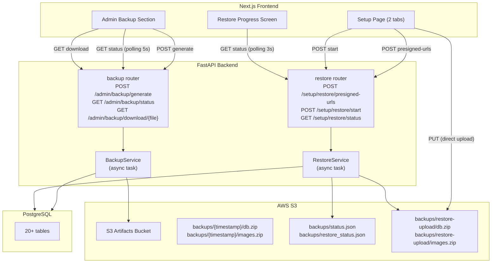
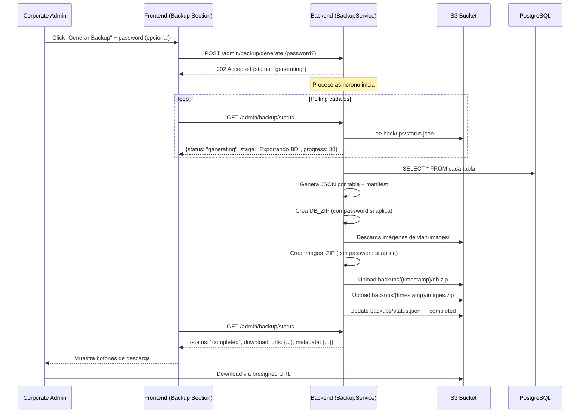
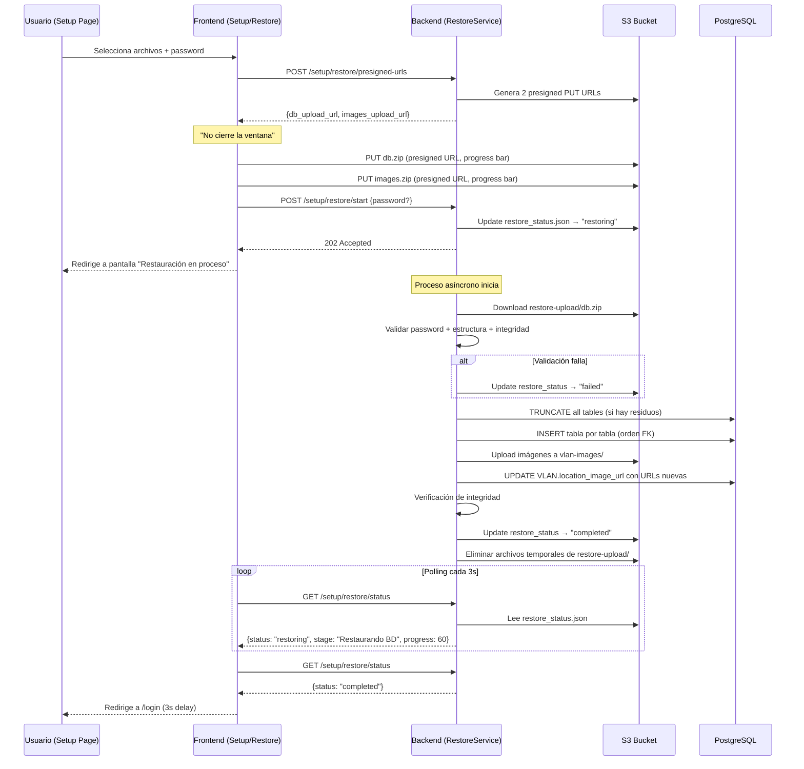

# Design Document: Backup & Restore para Migración de Cuenta AWS

## Overview

Sistema de backup y restauración completo para migrar AlwaysPrint Cloud Manager entre cuentas AWS. El backup se genera asincrónicamente en el backend (proceso que puede tardar minutos), produce 2 archivos ZIP (BD + imágenes) cifrados opcionalmente con AES-256, y se almacena en S3. La restauración se ejecuta desde la pantalla de setup inicial, con upload vía presigned URLs y procesamiento asíncrono con tracking de progreso en S3.

El diseño sigue el patrón establecido de features restringidas por dominio corporativo (`@robles.ai`, `@sistemas.com.pe`), similar a SSL Management y Sync Inventory.

## Arquitectura

### Diagrama de Componentes



### Flujo de Backup (Export)



### Flujo de Restore (Import)



## Componentes e Interfaces

### Backend — Endpoints

#### Módulo: `app/api/v1/endpoints/backup.py`

| Método | Path | Auth | Descripción |
|--------|------|------|-------------|
| POST | `/admin/backup/generate` | Corporate Admin | Inicia generación de backup |
| GET | `/admin/backup/status` | Corporate Admin | Estado actual del backup |
| GET | `/admin/backup/download/{file_type}` | Corporate Admin | Presigned URL de descarga |
| DELETE | `/admin/backup/delete` | Corporate Admin | Eliminar backup actual |

#### Módulo: `app/api/v1/endpoints/restore.py`

| Método | Path | Auth | Descripción |
|--------|------|------|-------------|
| POST | `/setup/restore/presigned-urls` | Público (solo si BD vacía) | Genera presigned URLs de upload |
| POST | `/setup/restore/start` | Público (solo si BD vacía) | Inicia proceso de restauración |
| GET | `/setup/restore/status` | Público | Estado actual del restore |

#### Schemas

```python
# === BACKUP ===

class BackupGenerateRequest(BaseModel):
    password: Optional[str] = Field(None, min_length=4, max_length=128,
        description="Password para cifrar ZIPs (opcional)")

class BackupStatusResponse(BaseModel):
    status: Literal["idle", "generating", "completed", "failed"]
    stage: Optional[str] = None  # Etapa actual si generating
    progress: Optional[int] = None  # 0-100
    error: Optional[str] = None
    # Solo cuando completed:
    db_zip_size: Optional[int] = None  # bytes
    images_zip_size: Optional[int] = None  # bytes
    generated_at: Optional[str] = None  # ISO 8601
    has_password: Optional[bool] = None
    download_expires_in: Optional[int] = None  # seconds

class BackupDownloadResponse(BaseModel):
    presigned_url: str
    file_name: str
    file_size: int
    expires_in: int  # seconds

# === RESTORE ===

class RestorePresignedUrlsRequest(BaseModel):
    db_zip_size: int  # Para validar tamaño antes de generar URL
    images_zip_size: int

class RestorePresignedUrlsResponse(BaseModel):
    db_upload_url: str
    images_upload_url: str
    expires_in: int  # seconds (1800 = 30 min)

class RestoreStartRequest(BaseModel):
    password: Optional[str] = Field(None, description="Password si los ZIPs están protegidos")

class RestoreStatusResponse(BaseModel):
    status: Literal["idle", "restoring", "completed", "failed"]
    stage: Optional[str] = None
    progress: Optional[int] = None  # 0-100
    error: Optional[str] = None
    completed_at: Optional[str] = None
```

### Backend — Servicios

#### `app/services/backup_service.py`

```python
class BackupService:
    """Servicio de generación de backup completo."""
    
    STAGES = [
        ("exporting_db", "Exportando base de datos", 0, 40),
        ("downloading_images", "Descargando imágenes", 40, 60),
        ("creating_db_zip", "Generando ZIP de base de datos", 60, 70),
        ("creating_images_zip", "Generando ZIP de imágenes", 70, 80),
        ("uploading_to_s3", "Subiendo archivos a S3", 80, 100),
    ]

    async def generate(self, password: Optional[str] = None) -> None:
        """Genera backup completo de forma asíncrona."""
        ...

    def _export_table(self, db: Session, model_class) -> list[dict]:
        """Exporta todos los registros de una tabla como lista de dicts."""
        ...

    def _convert_value(self, value) -> Any:
        """Convierte valores SQLAlchemy a JSON-serializable."""
        ...

    def _create_zip_with_password(self, files: dict, password: Optional[str]) -> bytes:
        """Crea ZIP con AES-256 password protection."""
        ...

    def _get_active_vlan_images(self, db: Session) -> list[tuple[str, str]]:
        """Retorna lista de (vlan_id, relative_path) para imágenes activas."""
        ...
```

#### `app/services/restore_service.py`

```python
class RestoreService:
    """Servicio de restauración desde backup."""
    
    STAGES = [
        ("validating", "Validando archivos", 0, 10),
        ("cleaning", "Limpiando base de datos", 10, 15),
        ("restoring_db", "Restaurando base de datos", 15, 70),
        ("restoring_images", "Restaurando imágenes", 70, 85),
        ("rebuilding_urls", "Reconstruyendo URLs de imágenes", 85, 90),
        ("verifying", "Verificando integridad", 90, 100),
    ]

    # Orden de inserción respetando foreign keys
    TABLE_ORDER = [
        "organizations",
        "users",
        "vlans",
        "devices",
        "workstations",
        "licenses",
        "global_configs",
        "vlan_configs",
        "workstation_configs",
        "action_configs",
        "public_ips",
        "messages",
        "message_deliveries",
        "telemetry_logs",
        "connectivity_results",
        "audit_logs",
        "documents",
        "debugging_profiles",
        "knowledge_articles",
        "profile_knowledge_articles",
        "debugging_sessions",
        "log_analyses",
        "status_snapshots",
        "metric_records",
        "health_check_results",
        "container_metrics",
    ]

    async def restore(self, password: Optional[str] = None) -> None:
        """Ejecuta restauración completa de forma asíncrona."""
        ...

    def _validate_zip(self, zip_bytes: bytes, password: Optional[str], expected_structure: list) -> None:
        """Valida password, estructura e integridad del ZIP."""
        ...

    def _restore_table(self, db: Session, table_name: str, records: list[dict]) -> int:
        """Inserta registros en una tabla, retorna cantidad insertada."""
        ...

    def _rebuild_image_urls(self, db: Session) -> None:
        """Reconstruye location_image_url usando bucket/región actuales."""
        ...
```

### Frontend — Componentes

#### Setup Page (modificado): `src/app/setup/page.tsx`

```
┌─────────────────────────────────────────────────┐
│              AlwaysPrint Setup                    │
│                                                   │
│  ┌──────────────────┐  ┌──────────────────────┐ │
│  │ Crear Admin (tab) │  │ Restaurar Backup (tab)│ │
│  └──────────────────┘  └──────────────────────┘ │
│                                                   │
│  [Tab activo: Crear Admin]                       │
│  ┌─────────────────────────────────────────────┐ │
│  │ Nombre: [____________]                       │ │
│  │ Email:  [____________]                       │ │
│  │ Password: [____________]                     │ │
│  │ Confirmar: [____________]                    │ │
│  │ Idioma: [en ▼]                              │ │
│  │                                              │ │
│  │ [   Crear Administrador   ]                  │ │
│  └─────────────────────────────────────────────┘ │
│                                                   │
│  [Tab activo: Restaurar Backup]                  │
│  ┌─────────────────────────────────────────────┐ │
│  │ Archivo BD (ZIP): [Seleccionar...]           │ │
│  │ Archivo Imágenes (ZIP): [Seleccionar...]     │ │
│  │ Contraseña: [____________] (si aplica)       │ │
│  │                                              │ │
│  │ [   Restaurar Backup   ]                     │ │
│  └─────────────────────────────────────────────┘ │
└─────────────────────────────────────────────────┘
```

#### Admin Backup Section: `src/components/admin/BackupSection.tsx`

```
┌─────────────────────────────────────────────────┐
│  Backup & Restore                                │
│  ─────────────────                               │
│                                                   │
│  Estado: ● Listo (sin backup previo)            │
│                                                   │
│  Contraseña (opcional): [____________]           │
│                                                   │
│  [  Generar Backup  ]                            │
│                                                   │
│  ── ó cuando hay backup disponible: ──           │
│                                                   │
│  Estado: ● Backup disponible                     │
│  Generado: 2026-08-21 15:30:00                  │
│  Protegido con contraseña: Sí                    │
│                                                   │
│  BD (45 MB)        [Descargar]                   │
│  Imágenes (120 MB) [Descargar]                   │
│                                                   │
│  [Generar nuevo backup] [Eliminar backup]        │
└─────────────────────────────────────────────────┘
```

### Estructura de Archivos en S3

```
s3://{S3_ARTIFACTS_BUCKET}/
└── backups/
    ├── status.json              # Estado del proceso de backup
    ├── restore_status.json      # Estado del proceso de restore
    ├── latest/                  # Último backup generado
    │   ├── db.zip              # Dump de BD (con password opcional)
    │   └── images.zip          # Imágenes de VLANs (con password opcional)
    └── restore-upload/          # Archivos subidos para restore (temporales)
        ├── db.zip
        └── images.zip
```

### Estructura interna de DB_ZIP

```
db.zip
├── manifest.json
├── organizations.json
├── users.json
├── vlans.json
├── devices.json
├── workstations.json
├── licenses.json
├── global_configs.json
├── vlan_configs.json
├── workstation_configs.json
├── action_configs.json
├── public_ips.json
├── messages.json
├── message_deliveries.json
├── telemetry_logs.json
├── connectivity_results.json
├── audit_logs.json
├── documents.json
├── debugging_profiles.json
├── knowledge_articles.json
├── profile_knowledge_articles.json
├── debugging_sessions.json
├── log_analyses.json
├── status_snapshots.json
├── metric_records.json
├── health_check_results.json
└── container_metrics.json
```

### manifest.json (ejemplo)

```json
{
  "version": "1.0",
  "generated_at": "2026-08-21T15:30:00Z",
  "alembic_revision": "abc123def456",
  "tables": {
    "organizations": {"count": 3},
    "users": {"count": 12},
    "vlans": {"count": 45},
    "workstations": {"count": 1200},
    ...
  },
  "total_records": 15000,
  "has_password": true
}
```

## Decisiones Técnicas

### 1. ZIP con password (AES-256)

Se usa la librería `pyzipper` (compatible con AES-256 WinZip standard) para generar ZIPs con password. Esto permite:
- Apertura manual con 7-Zip/WinZip si es necesario
- Password compartido entre ambos ZIPs
- Compatibilidad cross-platform

### 2. Ejecución asíncrona con asyncio.create_task

El backup/restore se ejecuta como un task de asyncio. El estado se persiste en S3 (no en memoria) para sobrevivir reinicios. Si el servidor se reinicia durante un proceso, el estado quedará en "generating"/"restoring" y el admin deberá reiniciar manualmente.

### 3. Paths relativos para imágenes

Al exportar, `VLAN.location_image_url` se convierte de URL absoluta (`https://bucket.s3.region.amazonaws.com/vlan-images/xxx.jpg`) a path relativo (`vlan-images/xxx.jpg`). Al restaurar, se reconstruye con el bucket/región de la nueva cuenta.

### 4. S3 como fuente de verdad del estado

El estado de backup/restore se almacena en S3 (`backups/status.json`, `backups/restore_status.json`) porque:
- Sobrevive reinicios del contenedor
- No depende de Redis (que puede no estar configurado)
- No depende de la BD (que puede estar siendo restaurada)
- Es accesible sin autenticación para el endpoint de status del restore

### 5. Orden de inserción por dependencias FK

Las tablas se insertan en un orden que garantiza que las foreign keys ya existan:
1. Organizations (sin FK)
2. Users (FK → organizations)
3. VLANs (FK → organizations)
4. Devices (FK → organizations, vlans)
5. Workstations (FK → organizations, vlans)
6. ... y así sucesivamente

### 6. Validación de compatibilidad vía Alembic revision

El manifest incluye el head revision de Alembic al momento del export. Al restaurar, se compara con el head de la nueva instalación. Si no coinciden, se aborta para evitar corrupción de datos por schema mismatch.

## Dependencias

### Nuevas dependencias Python (backend)

- `pyzipper` — Creación/lectura de ZIPs con AES-256 password encryption

### Librerías frontend existentes (sin nuevas)

- Axios (upload con progress tracking)
- React state (tabs, progress indicators)
- Tailwind + shadcn/ui (componentes visuales)

## Seguridad

- Los archivos de backup en S3 están bajo `backups/` en el bucket de artifacts (privado, sin política pública)
- Las presigned URLs de descarga expiran en 1 hora
- Las presigned URLs de upload expiran en 30 minutos
- El endpoint de restore solo funciona con BD vacía (user_count == 0)
- El endpoint de status del restore es público (necesario para polling sin auth)
- Los passwords de usuarios se exportan como hashes bcrypt (no reversibles)
- Las API keys de organizaciones se exportan tal cual (necesarias para funcionalidad)
