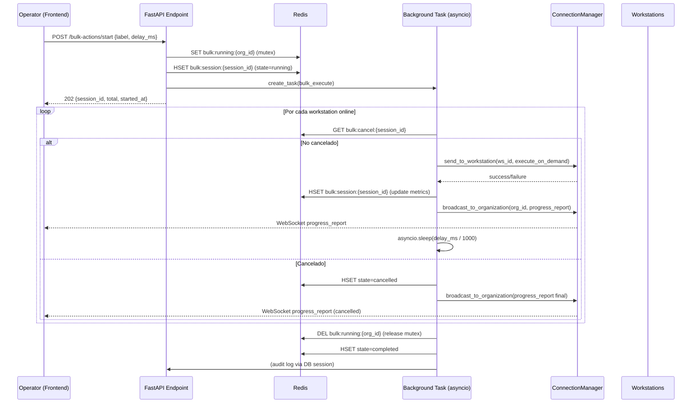
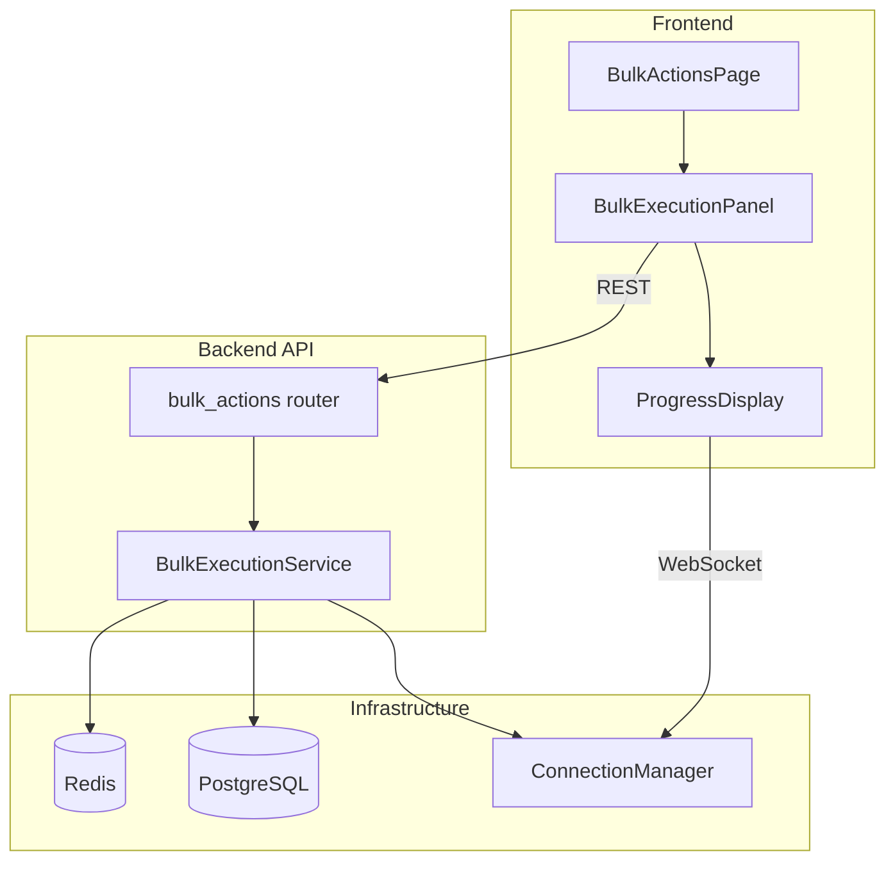

# Design Document: Bulk On-Demand Actions

## Overview

Sistema de ejecución masiva de acciones OnDemand que permite a operadores y administradores ejecutar una acción definida en el alwaysconfig activo contra todas las workstations online de una organización, con throttling configurable, progreso en tiempo real vía WebSocket, y cancelación.

El diseño se integra con la infraestructura existente de 2 uvicorn workers coordinados con Redis pub/sub, reutilizando el `ConnectionManager` (o `RedisConnectionManager`) para envío a workstations y el patrón de operador WebSocket para reportes de progreso.

### Decisiones de diseño clave

1. **Ejecución en background task (asyncio)**: La iteración throttled se ejecuta como `asyncio.Task` en el worker que recibe la solicitud. No se distribuye entre workers porque el throttling exige control secuencial.
2. **Estado en Redis**: La `Bulk_Session` se almacena en Redis (no en PostgreSQL) porque es efímera, de alta frecuencia de escritura, y no necesita persistencia a largo plazo. Solo el registro de auditoría se persiste en BD.
3. **Cancelación vía Redis key**: Se usa un flag `bulk:cancel:{session_id}` en Redis para señalizar cancelación. El loop de ejecución lo verifica antes de cada envío.
4. **Mutex por organización**: Una key Redis `bulk:running:{org_id}` con TTL previene sesiones concurrentes para la misma organización.

## Architecture



### Componentes del sistema



## Components and Interfaces

### Backend

#### 1. API Endpoints (`app/api/v1/endpoints/bulk_actions.py`)

| Método | Ruta | Descripción |
|--------|------|-------------|
| `GET` | `/bulk-actions/available-actions` | Lista acciones OnDemand del alwaysconfig activo de la org |
| `POST` | `/bulk-actions/preview` | Preview con conteo de workstations y tiempo estimado |
| `POST` | `/bulk-actions/start` | Inicia ejecución masiva (retorna 202) |
| `GET` | `/bulk-actions/status/{session_id}` | Estado actual de una Bulk_Session |
| `POST` | `/bulk-actions/cancel/{session_id}` | Cancela ejecución en curso |

Todos los endpoints requieren rol `admin` u `operator` y aplican tenant isolation.

#### 2. Servicio de ejecución (`app/services/bulk_execution.py`)

```python
class BulkExecutionService:
    """Orquesta la ejecución masiva de acciones OnDemand con throttling."""
    
    async def get_available_actions(org_id: UUID, db: Session) -> list[OnDemandAction]
    async def get_preview(org_id: UUID, label: str, delay_ms: int) -> BulkPreview
    async def start_session(org_id: UUID, label: str, delay_ms: int, user_id: UUID, db: Session) -> BulkSession
    async def cancel_session(session_id: UUID, org_id: UUID) -> BulkSession
    async def get_session_status(session_id: UUID, org_id: UUID) -> BulkSession
    
    # Método interno ejecutado como background task
    async def _execute_bulk(session_id: UUID, org_id: UUID, label: str, delay_ms: int, workstation_ids: list[str])
```

#### 3. WebSocket Message (nuevo tipo para operadores)

Se agrega un nuevo tipo `bulk_progress` al `OperatorMessage`:

```python
# Backend → Operator
{
    "type": "bulk_progress",
    "session_id": "uuid",
    "status": "running" | "completed" | "cancelled",
    "total": 150,
    "sent": 45,
    "success": 43,
    "errors": 2,
    "failed_workstations": ["ws-uuid-1", "ws-uuid-2"],
    "elapsed_ms": 22500
}
```

### Frontend

#### 4. Página de acciones masivas (`/dashboard/workstations/bulk-actions/`)

Componentes:
- `BulkActionsPage`: Página contenedora con verificación de rol
- `ActionSelector`: Dropdown con acciones OnDemand disponibles
- `ThrottleConfig`: Input numérico para delay (default 500ms, rango 50-10000)
- `ConfirmationDialog`: Modal de confirmación pre-ejecución
- `ExecutionProgress`: Barra de progreso + contadores en tiempo real
- `ExecutionSummary`: Resumen final post-ejecución

## Data Models

### Redis Keys (estado efímero)

| Key | Tipo | TTL | Contenido |
|-----|------|-----|-----------|
| `bulk:session:{session_id}` | Hash | 1h | `{status, total, sent, success, errors, failed_ws, org_id, label, delay_ms, started_at, user_id}` |
| `bulk:running:{org_id}` | String | 30min | `session_id` (mutex: una sesión por org) |
| `bulk:cancel:{session_id}` | String | 5min | `"1"` (flag de cancelación) |

### Pydantic Schemas (`app/schemas/bulk_actions.py`)

```python
class OnDemandAction(BaseModel):
    """Acción OnDemand disponible en el alwaysconfig activo."""
    label: str
    description: Optional[str] = None

class BulkStartRequest(BaseModel):
    """Solicitud para iniciar ejecución masiva."""
    label: str = Field(..., min_length=1, max_length=255)
    delay_ms: int = Field(default=500, ge=50, le=10000)

class BulkPreviewRequest(BaseModel):
    """Solicitud de preview de ejecución masiva."""
    label: str = Field(..., min_length=1, max_length=255)
    delay_ms: int = Field(default=500, ge=50, le=10000)

class BulkPreview(BaseModel):
    """Respuesta de preview."""
    action_label: str
    action_description: Optional[str] = None
    workstations_online: int
    estimated_time_ms: int  # (workstations_online - 1) * delay_ms

class BulkSessionStatus(BaseModel):
    """Estado de una Bulk_Session."""
    session_id: UUID
    status: Literal["running", "completed", "cancelled", "failed"]
    total: int
    sent: int
    success: int
    errors: int
    failed_workstations: list[str] = []
    started_at: datetime
    elapsed_ms: Optional[int] = None

class BulkStartResponse(BaseModel):
    """Respuesta al iniciar ejecución masiva."""
    session_id: UUID
    total: int
    started_at: datetime
```

### TypeScript Types (`src/types/bulk-actions.ts`)

```typescript
interface OnDemandAction {
  label: string
  description: string | null
}

interface BulkPreview {
  action_label: string
  action_description: string | null
  workstations_online: number
  estimated_time_ms: number
}

interface BulkSessionStatus {
  session_id: string
  status: 'running' | 'completed' | 'cancelled' | 'failed'
  total: number
  sent: number
  success: number
  errors: number
  failed_workstations: string[]
  started_at: string
  elapsed_ms: number | null
}

// Nuevo mensaje WebSocket (agregar a OperatorMessage union)
interface BulkProgressMessage {
  type: 'bulk_progress'
  session_id: string
  status: 'running' | 'completed' | 'cancelled'
  total: number
  sent: number
  success: number
  errors: number
  failed_workstations: string[]
  elapsed_ms: number
}
```

## Correctness Properties

*A property is a characteristic or behavior that should hold true across all valid executions of a system — essentially, a formal statement about what the system should do. Properties serve as the bridge between human-readable specifications and machine-verifiable correctness guarantees.*

### Property 1: OnDemand trigger extraction

*For any* valid alwaysconfig JSON structure containing an arbitrary mix of triggers (OnDemand, OnServiceStart, OnTrayLaunched, etc.) with or without labels, the extraction function SHALL return exactly those triggers where `event == "OnDemand"` AND `label` is a non-empty string, each with the correct `label` and `description` fields.

**Validates: Requirements 1.1, 1.2, 1.4**

### Property 2: Label validation against active config

*For any* alwaysconfig JSON and any string `label`, the validation function SHALL accept the label if and only if there exists a trigger in the config with `event == "OnDemand"` and `label` equal to the provided string.

**Validates: Requirements 2.1, 2.6**

### Property 3: Throttle range validation

*For any* integer value `delay_ms`, the validation SHALL accept the value if and only if `50 <= delay_ms <= 10000`.

**Validates: Requirements 2.4, 2.5**

### Property 4: Single running session per organization

*For any* organization with a Bulk_Session in state `running`, attempting to start a new Bulk_Session for the same organization SHALL be rejected. Starting a session for a different organization SHALL succeed independently.

**Validates: Requirements 2.7**

### Property 5: Execution progress invariants

*For any* list of N workstations (N >= 1) where each send either succeeds or fails, at every point during execution: `sent == success + errors`, `sent <= total`, and upon natural completion (no cancellation) `sent == total` and status transitions to `completed`. Each progress report SHALL contain monotonically non-decreasing values of sent, success, and errors.

**Validates: Requirements 2.3, 3.1, 3.2, 3.3, 3.4**

### Property 6: Cancellation correctness

*For any* Bulk_Session in state `running` cancelled at progress point P (0 <= P < total), the final state SHALL be `cancelled`, `sent <= P + 1` (at most one in-flight command completes), and no new sends occur after the cancellation signal. For any session NOT in state `running`, cancellation SHALL be rejected.

**Validates: Requirements 4.1, 4.2, 4.3, 4.4**

### Property 7: Role-based access control

*For any* user with role in {admin, operator}, all bulk-action endpoints SHALL be accessible. For any user with role `readonly`, all bulk-action endpoints SHALL return HTTP 403. For operators, operations SHALL be restricted exclusively to their assigned organization.

**Validates: Requirements 5.1, 5.2, 5.3**

### Property 8: Preview time estimation

*For any* positive integer `workstations_online` and valid `delay_ms` in [50, 10000], the preview estimated time SHALL equal exactly `(workstations_online - 1) * delay_ms` milliseconds.

**Validates: Requirements 6.1, 6.2**

## Error Handling

### Backend

| Escenario | Código HTTP | Respuesta |
|-----------|-------------|-----------|
| Org sin alwaysconfig activo | 404 | `{"detail": "No hay configuración activa para la organización"}` |
| Label no existe en config | 422 | `{"detail": "La acción OnDemand '{label}' no existe en la configuración activa"}` |
| delay_ms fuera de rango | 422 | Pydantic validation error |
| Ya hay sesión running para org | 409 | `{"detail": "Ya existe una ejecución masiva en curso para esta organización"}` |
| Sesión no encontrada | 404 | `{"detail": "Sesión no encontrada"}` |
| Sesión no cancelable (no running) | 409 | `{"detail": "La sesión no está en estado ejecutable"}` |
| Usuario readonly | 403 | `{"detail": "Permisos insuficientes"}` |
| Operator accede otra org | 403 | `{"detail": "No tienes permisos para esta organización"}` |
| Redis no disponible | 503 | `{"detail": "Servicio temporalmente no disponible"}` |

### Ejecución en background

- **Workstation se desconecta durante envío**: Se incrementa `errors`, se registra el `workstation_id` en `failed_workstations`, se continúa con la siguiente.
- **Redis pierde conexión mid-execution**: El task captura la excepción, intenta reconectar. Si no puede en 10s, marca la sesión como `failed` (si logra escribir) y termina.
- **Worker crash mid-execution**: La key `bulk:running:{org_id}` tiene TTL de 30min. Expirará automáticamente permitiendo reintentar. El estado final será `running` huérfano hasta TTL expiry.
- **Mutex TTL safety**: Si la ejecución tarda más de 30min, el background task renueva el TTL de `bulk:running:{org_id}` cada 5 minutos durante la ejecución.

### Frontend

- Error de conexión WebSocket: Polling fallback via `GET /bulk-actions/status/{session_id}` cada 3 segundos.
- Timeout sin progress_report: Mostrar indicador de "conexión interrumpida" después de 30s sin mensajes.

## Testing Strategy

### Property-Based Tests (Hypothesis, Python)

Se utilizará **Hypothesis** como librería de property-based testing. Cada test ejecutará mínimo **100 iteraciones**.

**Tests a implementar:**

1. **Feature: bulk-on-demand-actions, Property 1: OnDemand trigger extraction** — Generar configs aleatorios, verificar extracción correcta.
2. **Feature: bulk-on-demand-actions, Property 2: Label validation** — Generar labels y configs, verificar aceptación/rechazo.
3. **Feature: bulk-on-demand-actions, Property 3: Throttle range validation** — Generar enteros, verificar rango.
4. **Feature: bulk-on-demand-actions, Property 5: Execution progress invariants** — Generar listas de workstations con patrones de fallo aleatorios, mock send, verificar invariantes de progreso.
5. **Feature: bulk-on-demand-actions, Property 6: Cancellation correctness** — Generar listas y puntos de cancelación aleatorios, verificar estado final.
6. **Feature: bulk-on-demand-actions, Property 8: Preview time estimation** — Generar valores numéricos, verificar fórmula.

Properties 4 y 7 se validan con tests de integración porque involucran Redis (mutex) y middleware HTTP (auth).

### Unit Tests (pytest)

- Parseo de alwaysconfig sin triggers OnDemand → lista vacía
- Error cuando no hay config activa
- Creación correcta del hash Redis de sesión
- Formato del progress report WebSocket
- Diálogo de confirmación muestra datos correctos (frontend, Vitest)
- Componente oculto para rol readonly (frontend, Vitest)

### Integration Tests (pytest + httpx)

- Flujo completo: start → progress → complete
- Flujo con cancelación: start → cancel → final report
- Mutex: segundo start rechazado con 409
- Auth: readonly user gets 403
- Tenant isolation: operator cannot start for other org
- Audit logs creados correctamente al inicio y fin

### Configuración PBT

```python
from hypothesis import settings as hypothesis_settings

# Mínimo 100 iteraciones por property test
hypothesis_settings.register_profile("ci", max_examples=200)
hypothesis_settings.register_profile("dev", max_examples=100)
hypothesis_settings.load_profile("ci")
```
