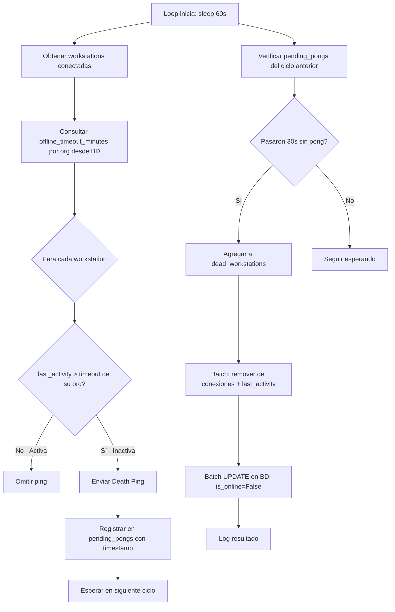
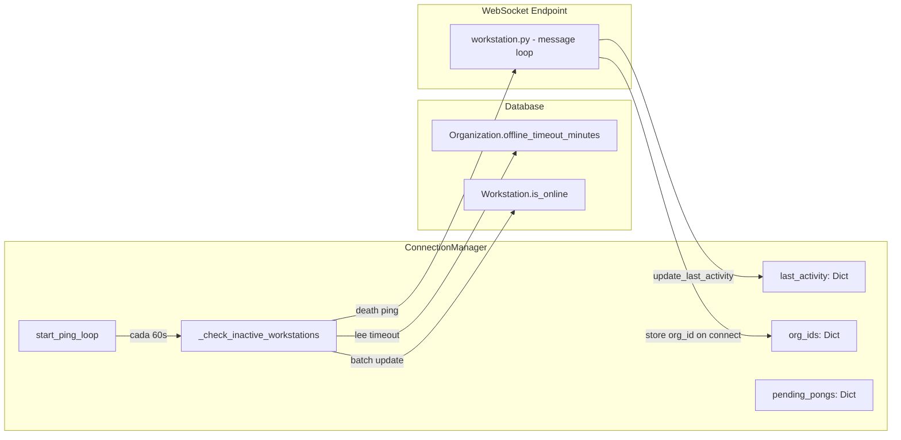

# Documento de Diseño — Death Ping Optimization

## Overview

### Problema

El sistema actual de detección de conexiones muertas envía un ping masivo a **todas** las workstations conectadas cada 60 segundos. Con 5000 workstations, esto genera 5000 mensajes WebSocket por minuto completamente innecesarios, ya que la mayoría están enviando telemetría activamente (cada 30s).

### Solución

Reemplazar el ping masivo por un mecanismo de **Death Ping selectivo** basado en inactividad:

1. Rastrear `last_activity` en memoria para cada workstation conectada.
2. Cada 60s, identificar workstations cuya inactividad excede el `offline_timeout_minutes` de su organización.
3. Enviar Death Ping **solo** a las inactivas.
4. Si no responden en 30s → marcar offline via batch disconnect existente.

### Impacto esperado

- **Reducción de tráfico**: De ~5000 pings/min a ~50 pings/min (estimación con 1% de inactividad real).
- **Transparencia**: Sin cambios en AlwaysPrintTray (mismo formato `{"type": "ping"}`).
- **Configurabilidad**: Cada organización ajusta su umbral de inactividad.

---

## Architecture

### Diagrama de flujo del nuevo ping loop



### Componentes involucrados



---

## Components and Interfaces

### ConnectionManager (modificado)

#### Nuevos atributos

```python
class ConnectionManager:
    def __init__(self):
        # ... atributos existentes ...
        
        # Última actividad por workstation: {workstation_id: datetime (UTC naive)}
        self.last_activity: Dict[str, datetime] = {}
        
        # Organización de cada workstation conectada: {workstation_id: str(org_id)}
        self.org_ids: Dict[str, str] = {}
        
        # Death pings pendientes de respuesta: {workstation_id: datetime_enviado}
        self._pending_pongs: Dict[str, datetime] = {}

# Constante global
PONG_TIMEOUT_SECONDS: int = 30
```

#### Método modificado: `connect_workstation`

```python
async def connect_workstation(
    self,
    workstation_id: str,
    websocket: WebSocket,
    db: Session,
    organization_id: str  # NUEVO parámetro
):
    """
    Registra conexión de un Tray Client.
    Ahora también inicializa last_activity y almacena org_id.
    """
    async with self._lock:
        self.workstation_connections[workstation_id] = websocket
        self.last_pong[workstation_id] = datetime.now(timezone.utc).replace(tzinfo=None)
        self.last_activity[workstation_id] = datetime.now(timezone.utc).replace(tzinfo=None)
        self.org_ids[workstation_id] = organization_id
    
    # Actualizar estado en BD (sin cambios)
    workstation_service = WorkstationService()
    workstation_service.update_workstation_status(db=db, workstation_id=workstation_id, is_online=True)
```

#### Nuevo método: `update_last_activity`

```python
async def update_last_activity(self, workstation_id: str):
    """
    Actualiza el timestamp de última actividad de una workstation.
    Se invoca al recibir cualquier mensaje válido (register, telemetry, pong, status_update, connectivity_result).
    """
    async with self._lock:
        if workstation_id in self.workstation_connections:
            self.last_activity[workstation_id] = datetime.now(timezone.utc).replace(tzinfo=None)
```

#### Método modificado: `start_ping_loop`

```python
async def start_ping_loop(self, db_session_factory):
    """
    Loop de verificación de inactividad selectivo.
    
    Cada CHECK_INTERVAL (60s):
    1. Verificar pending_pongs del ciclo anterior (timeout 30s)
    2. Consultar offline_timeout_minutes de cada org con ws conectadas
    3. Identificar ws inactivas (last_activity > timeout)
    4. Enviar Death Ping solo a inactivas
    5. Batch disconnect de las muertas
    """
```

#### Nuevo método: `_check_inactive_workstations`

```python
async def _check_inactive_workstations(
    self,
    db_session_factory
) -> List[str]:
    """
    Identifica workstations inactivas y envía Death Ping.
    
    Returns:
        Lista de workstation_ids que no respondieron al Death Ping del ciclo anterior
        (muertas confirmadas para batch disconnect).
    """
```

#### Método modificado: `disconnect_workstation`

```python
async def disconnect_workstation(self, workstation_id: str, db: Session, websocket: WebSocket = None):
    """
    Ahora también limpia last_activity, org_ids y pending_pongs.
    """
    # ... lógica existente ...
    # NUEVO: limpiar registros adicionales
    async with self._lock:
        self.last_activity.pop(workstation_id, None)
        self.org_ids.pop(workstation_id, None)
        self._pending_pongs.pop(workstation_id, None)
```

### WebSocket Endpoint (workstation.py)

Modificación al message loop para invocar `update_last_activity` en cada mensaje recibido:

```python
# Dentro del loop while True:
if message_type == "pong":
    await connection_manager.handle_pong(workstation_id)
    await connection_manager.update_last_activity(workstation_id)

elif message_type == "status_update":
    await connection_manager.update_last_activity(workstation_id)
    # ... lógica existente ...

elif message_type == "telemetry":
    await connection_manager.update_last_activity(workstation_id)
    # ... lógica existente ...

elif message_type == "connectivity_result":
    await connection_manager.update_last_activity(workstation_id)
    # ... lógica existente ...
```

Y en el registro inicial:

```python
await connection_manager.connect_workstation(
    workstation_id=workstation_id,
    websocket=websocket,
    db=db,
    organization_id=str(workstation.organization_id)  # NUEVO
)
```

### Organization Model (modificado)

```python
class Organization(Base):
    # ... campos existentes ...
    
    # Minutos de inactividad antes de enviar Death Ping (default: 10)
    offline_timeout_minutes = Column(Integer, nullable=False, default=10, server_default='10')
```

### Schemas Pydantic (modificados)

```python
# En OrganizationUpdate:
offline_timeout_minutes: Optional[int] = Field(
    None, ge=1, description="Minutos de inactividad antes de enviar Death Ping"
)

# En OrganizationResponse:
offline_timeout_minutes: int = 10
```

---

## Data Models

### Cambios en modelo `Organization`

| Campo | Tipo | Default | Descripción |
|-------|------|---------|-------------|
| `offline_timeout_minutes` | `Integer` | `10` | Minutos de inactividad permitidos antes de Death Ping |

### Estructuras in-memory en `ConnectionManager`

| Estructura | Tipo | Descripción |
|------------|------|-------------|
| `last_activity` | `Dict[str, datetime]` | Último timestamp de actividad por ws (UTC naive) |
| `org_ids` | `Dict[str, str]` | org_id de cada ws conectada |
| `_pending_pongs` | `Dict[str, datetime]` | Death pings enviados esperando respuesta |

### Constantes

| Constante | Valor | Descripción |
|-----------|-------|-------------|
| `PONG_TIMEOUT_SECONDS` | `30` | Segundos de espera máxima para pong tras Death Ping |
| `CHECK_INTERVAL` | `60` | Intervalo del loop de verificación (se mantiene) |

### Migración Alembic

Archivo: `alembic/versions/015_add_offline_timeout_minutes.py`

```python
"""Agregar campo offline_timeout_minutes a organizations.

Revision ID: 015
Revises: 014_add_scalability_json
"""

from alembic import op
import sqlalchemy as sa

revision = '015_add_offline_timeout_minutes'
down_revision = '014_add_scalability_json'
branch_labels = None
depends_on = None

def upgrade() -> None:
    op.add_column(
        'organizations',
        sa.Column('offline_timeout_minutes', sa.Integer(), nullable=False, server_default='10')
    )

def downgrade() -> None:
    op.drop_column('organizations', 'offline_timeout_minutes')
```

---

## Algoritmo de detección de inactividad

### Pseudocódigo del loop principal

```
CONSTANTES:
  CHECK_INTERVAL = 60 segundos
  PONG_TIMEOUT_SECONDS = 30 segundos

LOOP (cada CHECK_INTERVAL):
  current_time = now(UTC)
  dead_workstations = []
  
  # === FASE 1: Verificar pending_pongs del ciclo anterior ===
  for ws_id, ping_sent_at in pending_pongs.items():
      if (current_time - ping_sent_at).seconds > PONG_TIMEOUT_SECONDS:
          dead_workstations.append(ws_id)
  
  # Limpiar pending_pongs de las muertas
  for ws_id in dead_workstations:
      pending_pongs.remove(ws_id)
  
  # === FASE 2: Consultar timeouts por organización ===
  org_ids_unicos = set(org_ids.values())
  timeouts = query_db(
      SELECT id, offline_timeout_minutes 
      FROM organizations 
      WHERE id IN org_ids_unicos
  )  # Dict[org_id, minutes]
  
  # === FASE 3: Identificar inactivas y enviar Death Ping ===
  for ws_id in workstation_connections.keys():
      if ws_id in pending_pongs:
          continue  # Ya tiene ping pendiente
      
      org_id = org_ids[ws_id]
      timeout_minutes = timeouts.get(org_id, 10)  # Default 10 si no se encontró
      threshold = current_time - timedelta(minutes=timeout_minutes)
      
      if last_activity[ws_id] < threshold:
          try:
              send_to_workstation(ws_id, {"type": "ping"})
              pending_pongs[ws_id] = current_time
          except Exception:
              dead_workstations.append(ws_id)
  
  # === FASE 4: Batch disconnect de muertas ===
  if dead_workstations:
      # Remover de dicts en memoria
      for ws_id in dead_workstations:
          workstation_connections.pop(ws_id)
          last_activity.pop(ws_id)
          last_pong.pop(ws_id)
          org_ids.pop(ws_id)
          pending_pongs.pop(ws_id, None)
      
      # Batch UPDATE en BD
      db.query(Workstation)
        .filter(Workstation.id.in_(dead_workstations))
        .update({is_online: False})
      db.commit()
```

### Integración con batch disconnect existente

El mecanismo de `_flush_disconnect_queue` del commit bef6b8c **no se modifica**. Se reutiliza su patrón pero directamente desde el loop:

- El loop **no usa** `_disconnect_queue` (esa es para desconexiones individuales normales, ej: WebSocketDisconnect).
- El loop ejecuta su propio batch UPDATE en una sesión dedicada (mismo patrón que el `start_ping_loop` actual).
- Si una workstation se desconecta normalmente (WebSocketDisconnect) mientras tiene un pending_pong, el `disconnect_workstation` limpia el pending_pong automáticamente.

---

## Error Handling

### Errores en envío de Death Ping

| Error | Acción |
|-------|--------|
| `Exception` al enviar ping | Agregar ws a `dead_workstations` inmediatamente |
| WebSocket cerrado antes del envío | Mismo tratamiento que excepción |

### Errores en consulta de BD (timeouts por org)

| Error | Acción |
|-------|--------|
| `Exception` al consultar organizaciones | Usar timeout default (10 min) para todas las ws de ese ciclo |
| Organización no encontrada en resultado | Usar timeout default (10 min) |
| Sesión de BD expirada | Crear nueva sesión, reintentar 1 vez |

### Errores en batch UPDATE

| Error | Acción |
|-------|--------|
| `Exception` en UPDATE | Rollback, log error, las ws quedan en memoria como desconectadas (serán reintentadas en siguiente ciclo si se reconectan) |
| Timeout de BD | Mismo tratamiento que excepción |

### Consistencia de estado

- Si el batch UPDATE falla, las ws ya fueron removidas de los dicts en memoria. Esto es intencional: aunque la BD muestre `is_online=True`, la conexión WebSocket ya no existe. El próximo ciclo de telemetría o reconexión corregirá el estado.
- Si el servidor se reinicia, todos los dicts en memoria se pierden. Las ws se reconectan automáticamente y el estado se reconstruye.

---

## Correctness Properties

*Una propiedad es una característica o comportamiento que debe mantenerse verdadera a través de todas las ejecuciones válidas del sistema — esencialmente, una declaración formal sobre lo que el sistema debe hacer. Las propiedades sirven como puente entre especificaciones legibles por humanos y garantías de correctitud verificables por máquina.*

### Property 1: Actualización de last_activity por mensaje recibido

*Para cualquier* workstation conectada y *para cualquier* tipo de mensaje válido (register, telemetry, pong, status_update, connectivity_result), al recibir ese mensaje, el campo `last_activity` de esa workstation debe actualizarse a un timestamp UTC no anterior al momento de recepción.

**Validates: Requirements 1.1, 1.2, 1.3, 1.4, 1.5, 1.6**

### Property 2: Validación de offline_timeout_minutes

*Para cualquier* valor entero, si el valor es >= 1 entonces la validación de `offline_timeout_minutes` debe aceptarlo y persistirlo; si el valor es < 1 entonces la validación debe rechazarlo sin modificar el valor existente.

**Validates: Requirements 2.4, 7.2, 7.3**

### Property 3: Selectividad del Death Ping

*Para cualquier* conjunto de workstations conectadas con diferentes `last_activity` y organizaciones con diferentes `offline_timeout_minutes`, al ejecutar un ciclo del loop de verificación, una workstation recibe Death Ping si y solo si su tiempo de inactividad (now - last_activity) excede el `offline_timeout_minutes` de su organización.

**Validates: Requirements 3.3, 3.4, 3.5**

### Property 4: Timeout de pong resulta en desconexión

*Para cualquier* workstation a la que se le envió un Death Ping, si transcurren más de 30 segundos (PONG_TIMEOUT_SECONDS) sin recibir un pong, esa workstation debe ser agregada a la lista de desconexión batch.

**Validates: Requirements 4.3**

### Property 5: Limpieza completa en desconexión

*Para cualquier* workstation marcada como muerta (sin respuesta de pong), después del batch disconnect, esa workstation no debe existir en `workstation_connections`, `last_activity`, `org_ids`, ni `_pending_pongs`.

**Validates: Requirements 5.2, 5.3**

---

## Testing Strategy

### Librería de property-based testing

Se usará **Hypothesis** para Python, la librería estándar de PBT para el ecosistema Python.

### Configuración

- Mínimo **100 iteraciones** por property test (`@settings(max_examples=100)`)
- Cada test referencia su propiedad del diseño con un tag en docstring

### Property-Based Tests

| Property | Test | Descripción |
|----------|------|-------------|
| 1 | `test_last_activity_updated_on_message` | Generar ws_ids y tipos de mensaje aleatorios, verificar actualización de last_activity |
| 2 | `test_offline_timeout_validation` | Generar enteros aleatorios, verificar aceptación/rechazo según >= 1 |
| 3 | `test_death_ping_selectivity` | Generar conjuntos de ws con last_activity y timeouts variados, verificar que solo las inactivas reciben ping |
| 4 | `test_pong_timeout_disconnect` | Generar ws con pending_pongs y tiempos variados, verificar que solo las que exceden 30s van a disconnect |
| 5 | `test_disconnect_cleanup` | Generar ws muertas, ejecutar cleanup, verificar que no existen en ningún dict |

### Tag format

```python
# Feature: death-ping-optimization, Property 3: Selectividad del Death Ping
@given(...)
@settings(max_examples=100)
def test_death_ping_selectivity(...):
    """Feature: death-ping-optimization, Property 3: Para cualquier conjunto de
    workstations con diferentes inactividades, solo las que exceden el timeout reciben ping."""
```

### Unit Tests (ejemplo)

| Test | Descripción |
|------|-------------|
| `test_connect_initializes_last_activity` | Verificar que connect_workstation inicializa last_activity |
| `test_connect_stores_org_id` | Verificar que org_id se almacena correctamente |
| `test_default_timeout_is_10` | Verificar que Organization tiene default 10 |
| `test_ping_message_format` | Verificar que el mensaje es `{"type": "ping"}` exacto |
| `test_batch_update_single_query` | Verificar que N muertas = 1 query UPDATE |
| `test_db_failure_rollback` | Simular fallo de BD, verificar rollback |
| `test_send_exception_marks_dead` | Simular excepción en send, verificar ws marcada como muerta |
| `test_new_timeout_applied_next_cycle` | Cambiar timeout en BD, verificar uso en siguiente ciclo |

### Integration Tests

| Test | Descripción |
|------|-------------|
| `test_full_death_ping_cycle` | Conectar ws, esperar inactividad, verificar ping, simular no-pong, verificar desconexión |
| `test_active_ws_never_pinged` | Conectar ws enviando telemetría constantemente, verificar que nunca recibe ping |
| `test_multi_org_different_timeouts` | Dos orgs con diferentes timeouts, verificar comportamiento correcto por org |

### Estructura de archivos de test

```
tests/
├── properties/
│   ├── test_last_activity_properties.py
│   ├── test_timeout_validation_properties.py
│   ├── test_death_ping_selectivity_properties.py
│   ├── test_pong_timeout_properties.py
│   └── test_disconnect_cleanup_properties.py
├── unit/
│   └── test_death_ping_unit.py
└── integration/
    └── test_death_ping_integration.py
```
