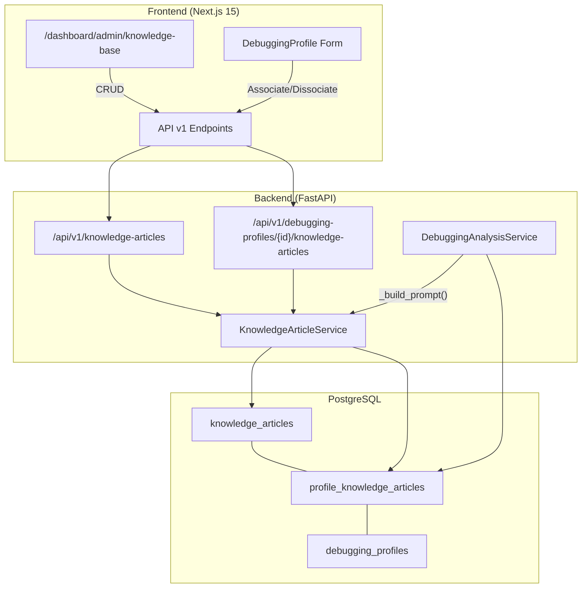

# Design Document: Knowledge Base Library

## Overview

La funcionalidad **Knowledge Base Library** añade una biblioteca de artículos de conocimiento técnico al Cloud Manager de AlwaysPrint. Los artículos contienen documentación en formato Markdown (flujos de impresión, patrones de fallo, secuencias de autenticación, etc.) que se inyectan como contexto adicional en el prompt del LLM durante el análisis de sesiones de debugging.

**Problema que resuelve**: Actualmente el LLM analiza datos de debugging sin contexto de dominio específico. Los administradores conocen patrones de fallo y flujos técnicos que podrían guiar al LLM hacia diagnósticos más precisos, pero no hay mecanismo para proporcionar esa información como referencia.

**Solución**: Una entidad `KnowledgeArticle` con CRUD completo, asociable via many-to-many a `DebuggingProfile`, cuyo contenido Markdown se inyecta automáticamente en el prompt LLM al construirlo en `DebuggingAnalysisService._build_prompt()`.

**Decisiones de diseño clave**:
- Relación many-to-many (un artículo puede servir a múltiples perfiles, un perfil puede tener múltiples artículos)
- Truncación progresiva del contenido de artículos si excede `MAX_TOTAL_PROMPT_SIZE` (200KB)
- Validación cross-tenant en las asociaciones (artículo y perfil deben pertenecer a la misma organización)
- Límites: 50 artículos/org, 10 artículos/perfil, 500KB max/artículo

## Architecture



### Integración con el flujo existente

El flujo de debugging actual es:
1. Admin inicia sesión de debugging → cliente captura datos → sube ZIP
2. `DebuggingAnalysisService.analyze()` descomprime, genera diffs, lee extractos
3. `_build_prompt()` construye el prompt completo
4. LLM genera análisis → PDF → S3

La integración ocurre en el paso 3: antes de construir la sección de solicitud final, se consultan los artículos asociados al perfil activo y se inyectan como una sección "Base de Conocimiento" en el prompt.

## Components and Interfaces

### Backend Components

#### 1. Modelo SQLAlchemy: `KnowledgeArticle`
- Ubicación: `app/models/knowledge_article.py`
- Tabla de asociación many-to-many: `profile_knowledge_articles`
- Importa `Base` desde `app.core.database`

#### 2. Schemas Pydantic: `app/schemas/knowledge_article.py`
- `KnowledgeArticleCreate` — validación de creación
- `KnowledgeArticleUpdate` — validación de actualización parcial
- `KnowledgeArticleResponse` — respuesta completa
- `KnowledgeArticleListItem` — respuesta resumida para listados
- `ProfileArticleAssociation` — request para asociar artículos

#### 3. Service Layer: `app/services/knowledge_article.py`
- `KnowledgeArticleService` — CRUD + asociaciones + retrieval para prompt
- Método `get_articles_for_profile(profile_id, org_id)` usado por `DebuggingAnalysisService`

#### 4. API Endpoints: `app/api/v1/endpoints/knowledge_articles.py`
- Router con prefix `/knowledge-articles` para CRUD
- Sub-router en debugging profiles para asociaciones

#### 5. Modificación: `DebuggingAnalysisService._build_prompt()`
- Inyecta sección "Base de Conocimiento" con contenido de artículos asociados
- Truncación progresiva si excede límite de prompt

### Frontend Components

#### 1. Página principal: `/dashboard/admin/knowledge-base/page.tsx`
- Listado con vista cards/tabla (patrón estándar list-views)
- CRUD completo con dialogs
- Editor Markdown con preview

#### 2. Componente multi-select: `KnowledgeArticleSelector`
- Integrado en formulario de DebuggingProfile (crear/editar)
- Búsqueda por título
- Muestra artículos pre-seleccionados

#### 3. Tipos TypeScript: `types/knowledge-article.ts`
- Interfaces para artículos y asociaciones

### Interfaces (API Contracts)

```
POST   /api/v1/knowledge-articles                          → KnowledgeArticleResponse
GET    /api/v1/knowledge-articles                          → KnowledgeArticleListItem[]
GET    /api/v1/knowledge-articles/{article_id}             → KnowledgeArticleResponse
PUT    /api/v1/knowledge-articles/{article_id}             → KnowledgeArticleResponse
DELETE /api/v1/knowledge-articles/{article_id}             → 204 No Content

POST   /api/v1/debugging-profiles/{profile_id}/knowledge-articles    → 201 (body: {article_ids: UUID[]})
DELETE /api/v1/debugging-profiles/{profile_id}/knowledge-articles/{article_id} → 204
GET    /api/v1/debugging-profiles/{profile_id}/knowledge-articles    → KnowledgeArticleListItem[]
```

## Data Models

### Tabla: `knowledge_articles`

```python
"""
Modelo SQLAlchemy para artículos de conocimiento.
"""

import uuid
from datetime import datetime
from sqlalchemy import Column, String, Text, DateTime, ForeignKey, Index, Table
from sqlalchemy.orm import relationship

from app.core.database import Base
from app.models.organization import GUID


# Tabla de asociación many-to-many
profile_knowledge_articles = Table(
    "profile_knowledge_articles",
    Base.metadata,
    Column(
        "profile_id",
        GUID,
        ForeignKey("debugging_profiles.id", ondelete="CASCADE"),
        primary_key=True,
    ),
    Column(
        "article_id",
        GUID,
        ForeignKey("knowledge_articles.id", ondelete="CASCADE"),
        primary_key=True,
    ),
)


class KnowledgeArticle(Base):
    """
    Artículo de conocimiento técnico para inyección en prompts LLM.
    
    Almacena documentación en Markdown (flujos de impresión, patrones de fallo,
    secuencias de autenticación, etc.) que se inyecta como contexto adicional
    al prompt del LLM durante el análisis de sesiones de debugging.
    """
    __tablename__ = "knowledge_articles"

    id = Column(GUID, primary_key=True, default=uuid.uuid4)
    organization_id = Column(
        GUID, ForeignKey("organizations.id", ondelete="CASCADE"), nullable=False
    )

    title = Column(String(200), nullable=False, comment="Título del artículo (3-200 chars)")
    description = Column(String(500), nullable=False, comment="Descripción breve (10-500 chars)")
    content = Column(Text, nullable=False, comment="Contenido Markdown (max 500KB)")

    # Auditoría
    created_at = Column(DateTime, nullable=False, default=datetime.utcnow)
    updated_at = Column(DateTime, nullable=False, default=datetime.utcnow, onupdate=datetime.utcnow)

    # Relaciones
    organization = relationship("Organization", backref="knowledge_articles")
    profiles = relationship(
        "DebuggingProfile",
        secondary=profile_knowledge_articles,
        back_populates="knowledge_articles",
    )

    # Índices
    __table_args__ = (
        Index("ix_knowledge_articles_org", "organization_id"),
    )

    def __repr__(self):
        return (
            f"<KnowledgeArticle(id={self.id}, title='{self.title}', "
            f"org={self.organization_id})>"
        )
```

### Relación en DebuggingProfile (modificación)

Se agrega al modelo existente `DebuggingProfile`:

```python
# En app/models/debugging.py — agregar relación
knowledge_articles = relationship(
    "KnowledgeArticle",
    secondary="profile_knowledge_articles",
    back_populates="profiles",
)
```

### Schemas Pydantic

```python
"""
Schemas Pydantic para artículos de conocimiento.
"""

from datetime import datetime
from typing import List, Optional
from uuid import UUID
from pydantic import BaseModel, Field, field_validator


class KnowledgeArticleCreate(BaseModel):
    """Schema para crear un artículo de conocimiento."""

    title: str = Field(..., min_length=3, max_length=200, description="Título del artículo")
    description: str = Field(..., min_length=10, max_length=500, description="Descripción breve")
    content: str = Field(..., min_length=1, max_length=500_000, description="Contenido Markdown")

    @field_validator("content")
    @classmethod
    def validate_content_not_empty(cls, v: str) -> str:
        """Validar que el contenido no sea solo espacios en blanco."""
        if not v.strip():
            raise ValueError("El contenido no puede estar vacío")
        return v


class KnowledgeArticleUpdate(BaseModel):
    """Schema para actualizar un artículo existente."""

    title: Optional[str] = Field(None, min_length=3, max_length=200)
    description: Optional[str] = Field(None, min_length=10, max_length=500)
    content: Optional[str] = Field(None, min_length=1, max_length=500_000)

    @field_validator("content")
    @classmethod
    def validate_content_not_empty(cls, v: Optional[str]) -> Optional[str]:
        if v is not None and not v.strip():
            raise ValueError("El contenido no puede estar vacío")
        return v


class KnowledgeArticleResponse(BaseModel):
    """Schema de respuesta completa de un artículo."""

    id: UUID
    organization_id: UUID
    title: str
    description: str
    content: str
    created_at: datetime
    updated_at: datetime

    model_config = {"from_attributes": True}


class KnowledgeArticleListItem(BaseModel):
    """Schema resumido para listados."""

    id: UUID
    title: str
    description: str
    created_at: datetime
    updated_at: datetime

    model_config = {"from_attributes": True}


class ProfileArticleAssociation(BaseModel):
    """Schema para asociar artículos a un perfil."""

    article_ids: List[UUID] = Field(
        ..., min_length=1, max_length=10,
        description="Lista de IDs de artículos a asociar (máximo 10)"
    )
```

### Service Layer

```python
"""
Servicio de gestión de artículos de conocimiento.
"""

import logging
from typing import List, Optional
from uuid import UUID
from sqlalchemy.orm import Session
from sqlalchemy import func

from app.models.knowledge_article import KnowledgeArticle, profile_knowledge_articles
from app.models.debugging import DebuggingProfile

logger = logging.getLogger(__name__)

# Límites configurables
MAX_ARTICLES_PER_ORG = 50
MAX_ARTICLES_PER_PROFILE = 10


class KnowledgeArticleService:
    """Servicio CRUD y asociaciones para artículos de conocimiento."""

    def create_article(
        self, db: Session, org_id: UUID, title: str, description: str, content: str
    ) -> KnowledgeArticle:
        """Crea un artículo verificando límite por organización."""
        count = db.query(func.count(KnowledgeArticle.id)).filter(
            KnowledgeArticle.organization_id == org_id
        ).scalar()
        if count >= MAX_ARTICLES_PER_ORG:
            raise ValueError(
                f"Límite alcanzado: máximo {MAX_ARTICLES_PER_ORG} artículos por organización"
            )
        article = KnowledgeArticle(
            organization_id=org_id, title=title, description=description, content=content
        )
        db.add(article)
        db.commit()
        db.refresh(article)
        return article

    def list_articles(self, db: Session, org_id: UUID) -> List[KnowledgeArticle]:
        """Lista todos los artículos de una organización."""
        return db.query(KnowledgeArticle).filter(
            KnowledgeArticle.organization_id == org_id
        ).order_by(KnowledgeArticle.updated_at.desc()).all()

    def get_article(self, db: Session, article_id: UUID, org_id: UUID) -> Optional[KnowledgeArticle]:
        """Obtiene un artículo verificando tenant isolation."""
        return db.query(KnowledgeArticle).filter(
            KnowledgeArticle.id == article_id,
            KnowledgeArticle.organization_id == org_id,
        ).first()

    def update_article(
        self, db: Session, article: KnowledgeArticle,
        title: Optional[str] = None, description: Optional[str] = None, content: Optional[str] = None
    ) -> KnowledgeArticle:
        """Actualiza campos de un artículo."""
        if title is not None:
            article.title = title
        if description is not None:
            article.description = description
        if content is not None:
            article.content = content
        db.commit()
        db.refresh(article)
        return article

    def delete_article(self, db: Session, article: KnowledgeArticle) -> None:
        """Elimina un artículo y sus asociaciones (cascade)."""
        db.delete(article)
        db.commit()

    def associate_articles_to_profile(
        self, db: Session, profile: DebuggingProfile, article_ids: List[UUID], org_id: UUID
    ) -> None:
        """
        Asocia artículos a un perfil, verificando:
        - Que los artículos pertenezcan a la misma organización
        - Que no se exceda el límite de 10 artículos por perfil
        - Que duplicados se ignoran silenciosamente
        """
        # Verificar artículos existen y pertenecen a la org
        articles = db.query(KnowledgeArticle).filter(
            KnowledgeArticle.id.in_(article_ids),
            KnowledgeArticle.organization_id == org_id,
        ).all()

        if len(articles) != len(article_ids):
            # Algunos artículos no encontrados o pertenecen a otra org → 404
            raise LookupError("Uno o más artículos no encontrados")

        # Contar asociaciones actuales
        current_count = db.query(func.count()).select_from(
            profile_knowledge_articles
        ).filter(
            profile_knowledge_articles.c.profile_id == profile.id
        ).scalar()

        # Filtrar duplicados
        existing_ids = {
            row[0] for row in db.query(profile_knowledge_articles.c.article_id).filter(
                profile_knowledge_articles.c.profile_id == profile.id
            ).all()
        }
        new_ids = [aid for aid in article_ids if aid not in existing_ids]

        if current_count + len(new_ids) > MAX_ARTICLES_PER_PROFILE:
            raise ValueError(
                f"Límite alcanzado: máximo {MAX_ARTICLES_PER_PROFILE} artículos por perfil"
            )

        # Insertar asociaciones nuevas
        for aid in new_ids:
            db.execute(
                profile_knowledge_articles.insert().values(profile_id=profile.id, article_id=aid)
            )
        db.commit()

    def remove_article_from_profile(
        self, db: Session, profile_id: UUID, article_id: UUID
    ) -> None:
        """Elimina una asociación artículo-perfil."""
        db.execute(
            profile_knowledge_articles.delete().where(
                profile_knowledge_articles.c.profile_id == profile_id,
                profile_knowledge_articles.c.article_id == article_id,
            )
        )
        db.commit()

    def get_articles_for_profile(
        self, db: Session, profile_id: UUID, org_id: UUID
    ) -> List[KnowledgeArticle]:
        """
        Obtiene todos los artículos asociados a un perfil.
        Usado por DebuggingAnalysisService para inyectar en el prompt.
        """
        return db.query(KnowledgeArticle).join(
            profile_knowledge_articles,
            profile_knowledge_articles.c.article_id == KnowledgeArticle.id,
        ).filter(
            profile_knowledge_articles.c.profile_id == profile_id,
            KnowledgeArticle.organization_id == org_id,
        ).all()
```

### Modificación de `_build_prompt()` (Low-Level Design)

En `app/services/debugging_analysis.py`, se modifica `_build_prompt()` para inyectar artículos:

```python
def _build_prompt(
    self,
    session: DebuggingSession,
    index_data: dict,
    diffs: dict,
    extracts: dict,
    knowledge_articles: list = None,  # Nuevo parámetro
) -> str:
    """Construye el prompt completo para el LLM."""
    # ... (código existente sin cambios hasta antes de "Solicitud de Análisis") ...

    # === INYECCIÓN DE BASE DE CONOCIMIENTO ===
    if knowledge_articles:
        sections.append("\n## Base de Conocimiento")
        sections.append(
            "Los siguientes artículos técnicos proporcionan contexto de dominio "
            "relevante para este perfil de debugging. Úsalos como referencia para "
            "el análisis:\n"
        )
        current_prompt_size = sum(len(s) for s in sections)
        remaining_budget = MAX_TOTAL_PROMPT_SIZE - current_prompt_size - 2000  # Reservar espacio

        for i, article in enumerate(knowledge_articles):
            article_header = f"### {article.title}\n"
            article_content = article.content

            if len(article_header) + len(article_content) > remaining_budget:
                # Truncar este artículo
                truncated_content = article_content[:max(0, remaining_budget - len(article_header) - 100)]
                sections.append(article_header + truncated_content)
                sections.append(
                    f"\n[... artículo truncado por límite de prompt. "
                    f"Se omitieron {len(knowledge_articles) - i - 1} artículos adicionales.]"
                )
                break
            else:
                sections.append(article_header + article_content)
                remaining_budget -= len(article_header) + len(article_content)

    # Solicitud final (existente, sin cambios)
    sections.append("\n## Solicitud de Análisis\n...")
```

En el método `analyze()`, se añade la consulta de artículos antes de llamar a `_build_prompt()`:

```python
async def analyze(self, session, zip_data, org, workstation=None):
    # ... pasos 1-4 sin cambios ...

    # 4.5. Obtener artículos de conocimiento asociados al perfil
    knowledge_articles = []
    if session.profile_id:
        from app.services.knowledge_article import KnowledgeArticleService
        kb_service = KnowledgeArticleService()
        knowledge_articles = kb_service.get_articles_for_profile(
            db=self._get_db(),  # Sesión de BD
            profile_id=session.profile_id,
            org_id=session.organization_id,
        )

    # 5. Construir prompt (modificado)
    prompt = self._build_prompt(session, index_data, diffs, extracts, knowledge_articles)
    # ... resto sin cambios ...
```

### Frontend Component Structure

```
frontend/src/
├── app/dashboard/admin/knowledge-base/
│   └── page.tsx                    # Página principal CRUD
├── components/
│   └── knowledge-article-selector.tsx  # Multi-select para formulario de perfiles
├── lib/api/
│   └── knowledge-articles.ts      # Funciones API client
├── types/
│   └── knowledge-article.ts       # Interfaces TypeScript
└── messages/
    ├── es.json                     # + namespace "knowledgeBase"
    └── en.json                     # + namespace "knowledgeBase"
```

## Correctness Properties

*A property is a characteristic or behavior that should hold true across all valid executions of a system — essentially, a formal statement about what the system should do. Properties serve as the bridge between human-readable specifications and machine-verifiable correctness guarantees.*

### Property 1: Tenant isolation en artículos

*For any* KnowledgeArticle y cualquier query de listado/lectura, solo se retornan artículos cuyo `organization_id` coincide con el del usuario autenticado.

**Validates: Requirements 1.2, 4.7**

### Property 2: Validación de longitudes de campos

*For any* string de título con longitud < 3 o > 200 caracteres, o descripción con longitud < 10 o > 500 caracteres, o contenido vacío/solo whitespace o > 500,000 caracteres, la creación/actualización debe ser rechazada con HTTP 422.

**Validates: Requirements 8.1, 8.2, 8.3, 8.4**

### Property 3: Cross-tenant association prevention

*For any* intento de asociar un KnowledgeArticle a un DebuggingProfile donde `article.organization_id != profile.organization_id`, el sistema debe retornar HTTP 404.

**Validates: Requirements 2.3, 5.4**

### Property 4: Idempotencia de asociaciones duplicadas

*For any* par (profile_id, article_id) que ya existe en `profile_knowledge_articles`, un intento de re-asociación debe completarse sin error y sin crear duplicados (la cantidad de registros no cambia).

**Validates: Requirements 5.5**

### Property 5: Cascade deletion de asociaciones

*For any* KnowledgeArticle que se elimina, todas las filas en `profile_knowledge_articles` que referencian su `id` deben ser eliminadas automáticamente. Lo mismo al eliminar un DebuggingProfile.

**Validates: Requirements 2.2**

### Property 6: Límite de artículos por organización

*For any* organización con exactamente 50 artículos, un intento de crear el artículo 51 debe ser rechazado con error descriptivo.

**Validates: Requirements 8.5**

### Property 7: Límite de artículos por perfil

*For any* DebuggingProfile con exactamente 10 artículos asociados, un intento de asociar un artículo adicional debe ser rechazado con error descriptivo.

**Validates: Requirements 8.6**

### Property 8: Inyección condicional en prompt

*For any* DebuggingProfile sin artículos asociados, el prompt construido por `_build_prompt()` NO debe contener la sección "Base de Conocimiento". Para cualquier perfil CON artículos asociados, el prompt DEBE contener esa sección con el contenido de los artículos.

**Validates: Requirements 3.1, 3.2, 3.4**

### Property 9: Truncación preserva orden y warning

*For any* conjunto de artículos cuyo contenido total sumado excede `MAX_TOTAL_PROMPT_SIZE`, el prompt resultante debe contener una nota de truncación, y los artículos incluidos deben estar en el orden original (primeros artículos priorizados sobre últimos).

**Validates: Requirements 3.3**

## Error Handling

### Backend Errors

| Situación | HTTP Status | Respuesta |
|-----------|-------------|-----------|
| Artículo no encontrado (o de otra org) | 404 | `{"detail": "Artículo no encontrado"}` |
| Validación de campos falla | 422 | `{"detail": [{"field": "title", "msg": "..."}]}` |
| Límite de artículos/org alcanzado | 409 | `{"detail": "Límite alcanzado: máximo 50 artículos por organización"}` |
| Límite de artículos/perfil alcanzado | 409 | `{"detail": "Límite alcanzado: máximo 10 artículos por perfil"}` |
| Perfil no encontrado (o de otra org) | 404 | `{"detail": "Perfil no encontrado"}` |
| No autenticado | 401 | `{"detail": "No autenticado"}` |
| Error interno al construir prompt | N/A | Log de error, flujo de análisis continúa sin artículos |

### Resiliencia en inyección de prompt

Si la consulta de artículos falla durante el análisis de debugging (error de BD, timeout), el sistema debe:
1. Loggear el error con nivel WARNING
2. Continuar el análisis sin la sección "Base de Conocimiento"
3. No fallar el pipeline completo por un error en la inyección de contexto

### Frontend Error Handling

- Errores de red: toast con mensaje genérico + retry button
- Validación 422: mostrar errores inline en el formulario
- Conflicto 409 (límites): toast descriptivo con el límite alcanzado
- 404 en operaciones: redirigir al listado con toast informativo

## Testing Strategy

### Unit Tests (pytest)

- **Service layer**: Test de cada método de `KnowledgeArticleService` con BD SQLite in-memory
- **Schema validation**: Test de validación Pydantic con inputs válidos e inválidos
- **Prompt injection**: Test de `_build_prompt()` con y sin artículos, con truncación
- **Edge cases**: Contenido vacío, caracteres especiales en Markdown, artículos muy grandes

### Property-Based Tests (Hypothesis)

**Library**: [Hypothesis](https://hypothesis.readthedocs.io/) (ya presente en el proyecto — directorio `.hypothesis/` existe)

**Configuración**: Mínimo 100 iteraciones por test (`@settings(max_examples=100)`)

Los siguientes tests implementan las Correctness Properties definidas arriba:

- **Feature: knowledge-base-library, Property 2**: Generación de títulos/descripciones/contenido con longitudes aleatorias para verificar que la validación Pydantic acepta/rechaza correctamente según los límites definidos.
- **Feature: knowledge-base-library, Property 4**: Generación de asociaciones duplicadas aleatorias para verificar idempotencia.
- **Feature: knowledge-base-library, Property 6**: Generación de N artículos (N ∈ [45..55]) para verificar el corte en 50.
- **Feature: knowledge-base-library, Property 7**: Generación de N asociaciones (N ∈ [8..12]) para verificar el corte en 10.
- **Feature: knowledge-base-library, Property 8**: Generación de perfiles con 0..N artículos para verificar presencia/ausencia de sección en prompt.
- **Feature: knowledge-base-library, Property 9**: Generación de artículos con contenido de tamaño variable para verificar truncación correcta.

### Integration Tests

- **API endpoints**: Test e2e de cada endpoint con TestClient de FastAPI
- **Association workflow**: Crear artículo → asociar a perfil → verificar en listado → eliminar
- **Tenant isolation**: Verificar que org A no puede ver/modificar artículos de org B

### Frontend Tests (opcionales)

- Validación de formularios (título, descripción, contenido)
- Comportamiento del multi-select component
- Rendering de Markdown preview
