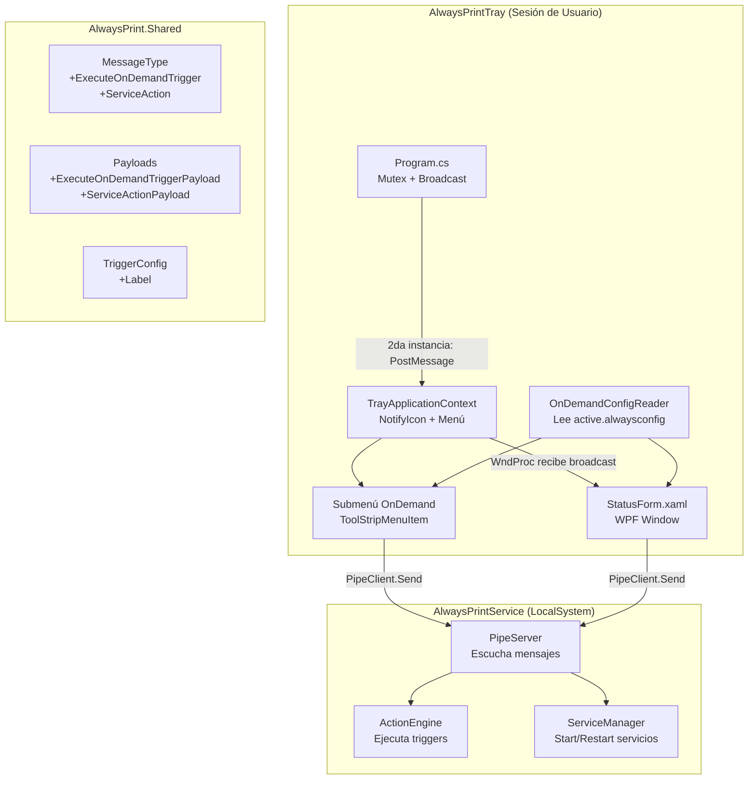
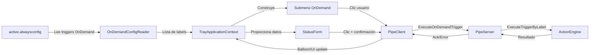
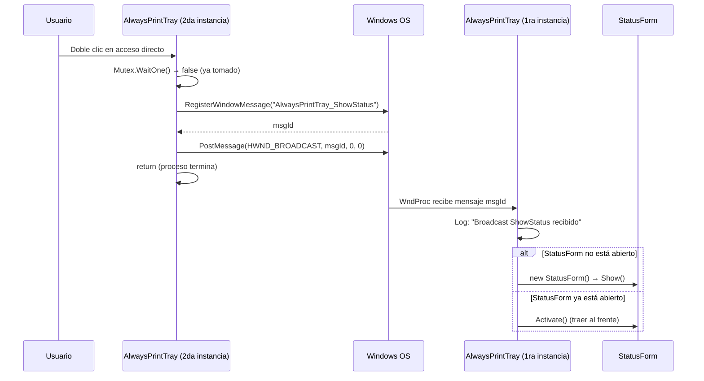
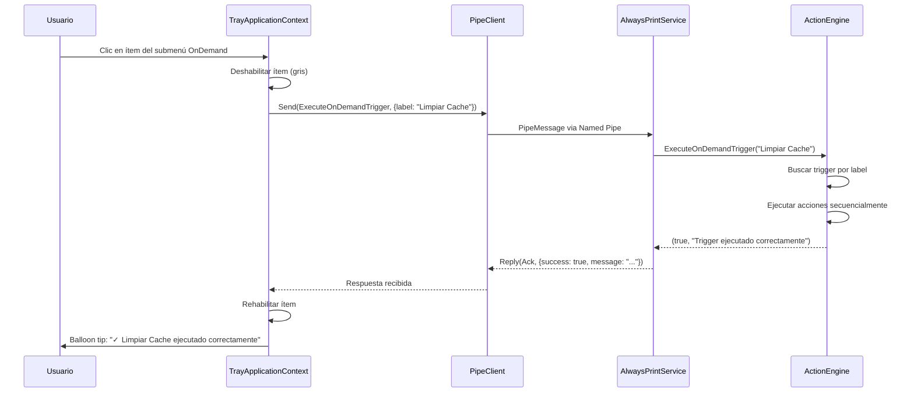
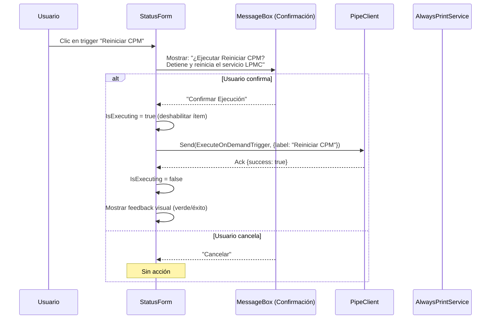
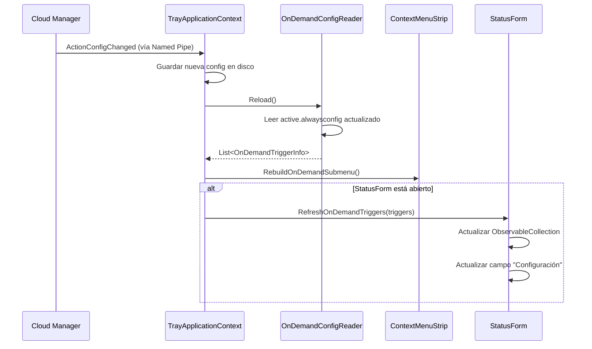

# Documento de Diseño — On-Demand Triggers

## Overview

Este diseño extiende el sistema AlwaysPrint con tres capacidades interconectadas:

1. **Detección de segunda instancia** — Cuando el usuario hace doble clic en el acceso directo del Tray y ya hay una instancia corriendo, la segunda instancia envía un mensaje Win32 broadcast y termina. La primera instancia escucha ese mensaje y muestra el Status Form.

2. **Status Form (WPF)** — Formulario no modal que muestra información del sistema (estado, versión, cola activa, configuración), el estado de 5 servicios con controles de Start/Restart, y la lista de triggers OnDemand ejecutables con confirmación.

3. **Triggers OnDemand** — Nuevo tipo de evento `"OnDemand"` en el array `triggers` del `.alwaysconfig`, ejecutable desde el submenú del Tray o desde el Status Form. La ejecución se delega al Service vía Named Pipe, manteniendo la arquitectura existente.

### Decisiones de Diseño Clave

| Decisión | Justificación |
|----------|---------------|
| Win32 `RegisterWindowMessage` + `PostMessage(HWND_BROADCAST)` | Mecanismo estándar Windows para comunicación entre instancias sin necesidad de pipe adicional. El Tray ya usa WinForms (tiene message loop). |
| WPF Window para Status Form | Permite UI moderna con DataBinding, estilos y layouts complejos (secciones con listas). Se mezcla con WinForms del Tray usando `ElementHost` no es necesario — se lanza como ventana WPF independiente. |
| Reutilizar `TriggerConfig` existente con campo `label` | Minimiza cambios en el modelo. `TriggerConfig` ya tiene `event` y `description`; solo se agrega `label` para identificación única en UI. |
| `ExecuteOnDemandTrigger` como nuevo `MessageType` | Separa semánticamente la ejecución on-demand de otros comandos. El Service puede hacer logging y manejo de errores específico. |
| Submenú dinámico construido desde `active.alwaysconfig` local | El Tray ya lee este archivo. Evita round-trip al Service solo para listar opciones. |

## Architecture

### Diagrama de Componentes



### Diagrama de Flujo de Datos



## Components and Interfaces

### 1. Modificaciones a `Program.cs` — Broadcast de Segunda Instancia

```csharp
// En Program.cs — cambios al flujo de single-instance
internal static class Program
{
    private const string MutexName = "Global\\AlwaysPrintTray-SingleInstance";
    private const string BroadcastMessageName = "AlwaysPrintTray_ShowStatus";

    // Win32 interop
    [DllImport("user32.dll", SetLastError = true, CharSet = CharSet.Unicode)]
    private static extern uint RegisterWindowMessage(string lpString);

    [DllImport("user32.dll", SetLastError = true)]
    private static extern bool PostMessage(IntPtr hWnd, uint Msg, IntPtr wParam, IntPtr lParam);

    private static readonly IntPtr HWND_BROADCAST = new IntPtr(0xFFFF);

    [STAThread]
    private static void Main()
    {
        // ... (código existente de AUMID, TLS, etc.) ...

        // Registrar mensaje Win32 (ambas instancias deben usar el mismo nombre)
        uint showStatusMsg = RegisterWindowMessage(BroadcastMessageName);

        // Single-instance guard
        bool isNew;
        using var mutex = new Mutex(false, MutexName, out isNew, mutexSecurity);
        
        try { isNew = mutex.WaitOne(TimeSpan.FromSeconds(10)); }
        catch (AbandonedMutexException) { isNew = true; }

        if (!isNew)
        {
            // Segunda instancia: enviar broadcast y salir
            AlwaysPrintLogger.WriteTrayInfo(
                "Segunda instancia detectada. Enviando broadcast ShowStatus.");
            PostMessage(HWND_BROADCAST, showStatusMsg, IntPtr.Zero, IntPtr.Zero);
            return;
        }

        // Primera instancia: continúa normalmente...
        // Pasa showStatusMsg al TrayApplicationContext para que escuche
        Application.Run(new TrayApplicationContext(showStatusMsg));
    }
}
```

### 2. Modificaciones a `TrayApplicationContext` — Escucha de Broadcast

```csharp
public sealed class TrayApplicationContext : ApplicationContext
{
    private readonly uint _showStatusMsgId;
    private NativeWindow? _messageWindow;

    public TrayApplicationContext(uint showStatusMsgId)
    {
        _showStatusMsgId = showStatusMsgId;
        // ... (código existente) ...
        
        // Crear ventana oculta para recibir mensajes broadcast
        _messageWindow = new BroadcastListener(this, showStatusMsgId);
    }

    /// <summary>
    /// Ventana oculta que intercepta el mensaje broadcast para mostrar StatusForm.
    /// </summary>
    private sealed class BroadcastListener : NativeWindow
    {
        private readonly TrayApplicationContext _owner;
        private readonly uint _targetMsg;

        public BroadcastListener(TrayApplicationContext owner, uint targetMsg)
        {
            _owner = owner;
            _targetMsg = targetMsg;
            // Crear ventana message-only
            CreateHandle(new CreateParams { Parent = IntPtr.Zero });
        }

        protected override void WndProc(ref Message m)
        {
            if ((uint)m.Msg == _targetMsg)
            {
                AlwaysPrintLogger.WriteTrayInfo(
                    "Broadcast ShowStatus recibido. Mostrando StatusForm.");
                _owner.ShowStatusForm();
                return;
            }
            base.WndProc(ref m);
        }
    }

    internal void ShowStatusForm() { /* ver sección StatusForm */ }
}
```

### 3. `OnDemandConfigReader` — Lectura de Triggers OnDemand

```csharp
namespace AlwaysPrintTray.OnDemand
{
    /// <summary>
    /// Lee triggers OnDemand desde el archivo de configuración activa.
    /// Filtra solo triggers con event="OnDemand" y label no vacío.
    /// </summary>
    public static class OnDemandConfigReader
    {
        /// <summary>
        /// Lee y retorna los triggers OnDemand válidos de la configuración activa.
        /// Retorna lista vacía si el archivo no existe o no es parseable.
        /// </summary>
        public static List<OnDemandTriggerInfo> GetOnDemandTriggers()

        /// <summary>
        /// Recarga la configuración. Llamado al recibir ActionConfigChanged.
        /// </summary>
        public static List<OnDemandTriggerInfo> Reload()
    }

    /// <summary>
    /// DTO liviano con la información necesaria para la UI.
    /// </summary>
    public class OnDemandTriggerInfo
    {
        public string Label { get; set; }
        public string Description { get; set; }
    }
}
```

### 4. Submenú OnDemand en `TrayApplicationContext`

```csharp
// Dentro de TrayApplicationContext
private ToolStripMenuItem? _onDemandSubmenu;
private readonly HashSet<string> _executingTriggers = new HashSet<string>();

/// <summary>
/// Construye o reconstruye el submenú de acciones OnDemand.
/// Se llama en bootstrap y ante ActionConfigChanged.
/// </summary>
private void RebuildOnDemandSubmenu()
{
    var triggers = OnDemandConfigReader.GetOnDemandTriggers();
    
    // Eliminar submenú anterior si existe
    if (_onDemandSubmenu != null)
        _trayIcon.ContextMenuStrip.Items.Remove(_onDemandSubmenu);
    
    if (triggers.Count == 0)
    {
        _onDemandSubmenu = null;
        return;
    }
    
    _onDemandSubmenu = new ToolStripMenuItem("Acciones A Demanda");
    foreach (var trigger in triggers)
    {
        var item = new ToolStripMenuItem(trigger.Label);
        item.Tag = trigger;
        item.Click += OnDemandMenuItem_Click;
        _onDemandSubmenu.DropDownItems.Add(item);
    }
    
    // Insertar antes del separador final (antes de "Salir")
    int insertIndex = _trayIcon.ContextMenuStrip.Items.Count - 2;
    _trayIcon.ContextMenuStrip.Items.Insert(insertIndex, new ToolStripSeparator());
    _trayIcon.ContextMenuStrip.Items.Insert(insertIndex + 1, _onDemandSubmenu);
}

private async void OnDemandMenuItem_Click(object sender, EventArgs e)
{
    var item = (ToolStripMenuItem)sender;
    var trigger = (OnDemandTriggerInfo)item.Tag;
    await ExecuteOnDemandTriggerAsync(trigger.Label, item);
}
```

### 5. StatusForm (WPF)

```csharp
namespace AlwaysPrintTray.Forms
{
    /// <summary>
    /// Formulario de estado del sistema. Muestra información general,
    /// estado de servicios y triggers OnDemand disponibles.
    /// </summary>
    public partial class StatusForm : Window
    {
        private readonly PipeClient _pipe;
        
        public StatusForm(PipeClient pipe)
        
        // ── Información General ──
        public string EstadoSistema { get; set; }      // "Normal" / "En Contingencia"
        public string VersionApp { get; set; }
        public string ColaActiva { get; set; }
        public string ConfigActiva { get; set; }        // "CPM_Compliant v5.2"
        
        // ── Servicios ──
        public ObservableCollection<ServiceStatusItem> Servicios { get; set; }
        
        // ── OnDemand Triggers ──
        public ObservableCollection<OnDemandTriggerItem> TriggersOnDemand { get; set; }
        
        /// <summary>Carga toda la información al abrir el formulario.</summary>
        private async Task LoadDataAsync()
        
        /// <summary>Ejecuta Start o Restart de un servicio vía pipe.</summary>
        private async Task ExecuteServiceActionAsync(ServiceStatusItem service, string action)
        
        /// <summary>Ejecuta un trigger OnDemand con diálogo de confirmación.</summary>
        private async Task ExecuteOnDemandTriggerAsync(OnDemandTriggerItem trigger)
        
        /// <summary>Actualiza la UI ante cambio de configuración.</summary>
        public void RefreshOnDemandTriggers(List<OnDemandTriggerInfo> triggers)
    }
    
    public class ServiceStatusItem : INotifyPropertyChanged
    {
        public string DisplayName { get; set; }       // "AlwaysPrintService"
        public string ServiceName { get; set; }       // nombre real del servicio
        public string State { get; set; }             // "Running" / "Stopped"
        public bool IsOperating { get; set; }         // true durante Start/Restart
        public string ActionLabel { get; set; }       // "Reiniciar" / "Iniciar"
    }
    
    public class OnDemandTriggerItem : INotifyPropertyChanged
    {
        public string Label { get; set; }
        public string Description { get; set; }
        public bool IsExecuting { get; set; }
    }
}
```

### 6. Nuevos `MessageType` y Payloads

```csharp
// En MessageType.cs — agregar:
ExecuteOnDemandTrigger,    // Tray → Service: ejecutar trigger OnDemand por label
ServiceAction,             // Tray → Service: iniciar o reiniciar un servicio
ServiceActionResponse,     // Service → Tray: resultado de la acción sobre servicio

// En Payloads.cs — agregar:

/// <summary>
/// Payload para solicitar ejecución de un trigger OnDemand.
/// Tray → Service.
/// </summary>
public class ExecuteOnDemandTriggerPayload
{
    [JsonProperty("label")]
    public string Label { get; set; } = string.Empty;
}

/// <summary>
/// Payload para solicitar acción sobre un servicio Windows.
/// Tray → Service.
/// </summary>
public class ServiceActionPayload
{
    /// <summary>Nombre del servicio Windows (ej: "lpmc_universal_service").</summary>
    [JsonProperty("serviceName")]
    public string ServiceName { get; set; } = string.Empty;
    
    /// <summary>Acción a ejecutar: "Start" o "Restart".</summary>
    [JsonProperty("action")]
    public string Action { get; set; } = string.Empty;
}

/// <summary>
/// Respuesta del Service al Tray tras una acción sobre servicio.
/// </summary>
public class ServiceActionResponsePayload
{
    [JsonProperty("serviceName")]
    public string ServiceName { get; set; } = string.Empty;
    
    [JsonProperty("success")]
    public bool Success { get; set; }
    
    /// <summary>Estado resultante del servicio tras la acción.</summary>
    [JsonProperty("newState")]
    public string NewState { get; set; } = string.Empty;
    
    [JsonProperty("message")]
    public string? Message { get; set; }
}
```

### 7. Modificación a `TriggerConfig` — Campo `label`

```csharp
// En ActionConfig.cs — agregar a TriggerConfig:
public class TriggerConfig
{
    [JsonProperty("event")]
    public string Event { get; set; } = string.Empty;
    
    /// <summary>
    /// Etiqueta única del trigger OnDemand. Requerida solo para event="OnDemand".
    /// Se usa como identificador en la UI y en el payload de ejecución.
    /// </summary>
    [JsonProperty("label")]
    public string? Label { get; set; }
    
    [JsonProperty("description")]
    public string Description { get; set; } = string.Empty;
    
    [JsonProperty("interval_seconds")]
    public int? IntervalSeconds { get; set; }
    
    [JsonProperty("actions")]
    public List<ActionConfig> Actions { get; set; } = new List<ActionConfig>();
}

// En TriggerEvents — agregar:
public const string OnDemand = "OnDemand";
```

### 8. `ActionEngine.ExecuteOnDemandTrigger` — Ejecución en el Service

```csharp
// En ActionEngine.cs — nuevo método público:

/// <summary>
/// Ejecuta un trigger OnDemand buscándolo por label exacto.
/// Retorna (success, message) para comunicar resultado al Tray.
/// </summary>
public (bool success, string message) ExecuteOnDemandTrigger(string label)
{
    if (_config == null)
        return (false, "No hay configuración cargada");
    
    var trigger = _config.Triggers
        .Where(t => t.Event.Equals("OnDemand", StringComparison.OrdinalIgnoreCase)
                 && !string.IsNullOrWhiteSpace(t.Label))
        .FirstOrDefault(t => t.Label!.Equals(label, StringComparison.Ordinal));
    
    if (trigger == null)
        return (false, $"Trigger OnDemand con label '{label}' no encontrado");
    
    // Verificar duplicados y advertir
    var duplicates = _config.Triggers
        .Where(t => t.Event.Equals("OnDemand", StringComparison.OrdinalIgnoreCase)
                 && t.Label == label)
        .Count();
    if (duplicates > 1)
        AlwaysPrintLogger.WriteWarning(
            $"ActionEngine: existen {duplicates} triggers OnDemand con label '{label}'. " +
            "Ejecutando el primero encontrado.");
    
    var sw = Stopwatch.StartNew();
    AlwaysPrintLogger.WriteInfo(
        $"ActionEngine: iniciando ejecución OnDemand '{label}'");
    
    _variables.Clear();
    bool success = ExecuteActions(trigger.Actions);
    
    sw.Stop();
    AlwaysPrintLogger.WriteInfo(
        $"ActionEngine: OnDemand '{label}' completado. " +
        $"Success={success}, Duración={sw.ElapsedMilliseconds}ms");
    
    return (success, success 
        ? $"Trigger '{label}' ejecutado correctamente ({sw.ElapsedMilliseconds}ms)"
        : $"Trigger '{label}' falló durante ejecución");
}
```

## Diagramas de Secuencia

### Flujo 1: Doble clic en ícono de escritorio (segunda instancia)



### Flujo 2: Ejecución desde submenú OnDemand



### Flujo 3: Ejecución desde Status Form con confirmación



### Flujo 4: Actualización dinámica por cambio de configuración



## Data Models

### Estructura JSON del Trigger OnDemand en `.alwaysconfig`

```json
{
  "version": "5.3",
  "name": "CPM_Compliant",
  "triggers": [
    {
      "event": "OnTrayLaunched",
      "description": "...",
      "actions": [...]
    },
    {
      "event": "OnDemand",
      "label": "Reiniciar LPMC",
      "description": "Detiene y reinicia el servicio lpmc_universal_service y su systray app",
      "actions": [
        {
          "type": "StopService",
          "description": "Detener lpmc_universal_service",
          "parameters": {
            "service_name": "lpmc_universal_service",
            "graceful_timeout_seconds": 15,
            "force_kill_on_timeout": true
          }
        },
        {
          "type": "KillProcessesByName",
          "description": "Eliminar lpmc-systemtray-app.exe",
          "parameters": {
            "process_name": "lpmc-systemtray-app.exe",
            "force": true
          }
        },
        {
          "type": "StartService",
          "description": "Iniciar lpmc_universal_service",
          "parameters": {
            "service_name": "lpmc_universal_service",
            "wait_for_running": true,
            "timeout_seconds": 30
          }
        }
      ]
    },
    {
      "event": "OnDemand",
      "label": "Limpiar Cache Impresión",
      "description": "Elimina archivos temporales de la cola de impresión y reinicia el Spooler",
      "actions": [
        {
          "type": "StopService",
          "parameters": { "service_name": "Spooler", "graceful_timeout_seconds": 10, "force_kill_on_timeout": true }
        },
        {
          "type": "DeleteFolderContents",
          "parameters": { "path": "C:\\Windows\\System32\\spool\\PRINTERS", "recursive": true, "ignore_errors": true }
        },
        {
          "type": "StartService",
          "parameters": { "service_name": "Spooler", "wait_for_running": true, "timeout_seconds": 15 }
        }
      ]
    }
  ]
}
```

### Flujo de Mensajes IPC

| Dirección | MessageType | Payload | Escenario |
|-----------|-------------|---------|-----------|
| Tray → Service | `ExecuteOnDemandTrigger` | `{ "label": "Reiniciar LPMC" }` | Usuario ejecuta desde menú o form |
| Service → Tray | `Ack` | `{ "success": true, "message": "..." }` | Ejecución exitosa |
| Service → Tray | `Error` | `{ "code": "TRIGGER_NOT_FOUND", "message": "..." }` | Label no encontrado |
| Tray → Service | `ServiceAction` | `{ "serviceName": "Spooler", "action": "Restart" }` | Desde StatusForm |
| Service → Tray | `ServiceActionResponse` | `{ "serviceName": "Spooler", "success": true, "newState": "Running" }` | Resultado |

### Servicios Monitoreados en Status Form

| Display Name | Service Name | Descripción |
|---|---|---|
| AlwaysPrintService | AlwaysPrintService | Servicio principal de contingencia |
| LPMC | lpmc_universal_service | Lexmark Print Management Client |
| LPD Service Monitor | LpdServiceMonitor | Monitor del servicio LPD |
| Servicio LPD | LPDSVC | Line Printer Daemon |
| Cola de Impresión | Spooler | Windows Print Spooler |


## Correctness Properties

*Una propiedad es una característica o comportamiento que debe mantenerse verdadero a través de todas las ejecuciones válidas de un sistema — esencialmente, una declaración formal sobre lo que el sistema debe hacer. Las propiedades sirven como puente entre especificaciones legibles por humanos y garantías de correctitud verificables por máquina.*

### Property 1: Filtrado de triggers OnDemand

*Para cualquier* `ActionConfiguration` con una lista arbitraria de triggers (mezcla de eventos OnDemand, OnTrayLaunched, OnConfigChange, etc., con labels vacíos, nulos o válidos), el resultado de `OnDemandConfigReader.GetOnDemandTriggers()` debe contener **exactamente** los triggers cuyo `event` es `"OnDemand"` (case-insensitive) Y cuyo `label` no es null ni whitespace, preservando el orden original.

**Validates: Requirements 4.1, 5.2, 5.5, 6.3, 10.1, 11.4**

### Property 2: Resolución de trigger por label (búsqueda exacta)

*Para cualquier* `ActionConfiguration` y *para cualquier* string `label`: si existe al menos un trigger con `event="OnDemand"` y ese `label` exacto, entonces `ExecuteOnDemandTrigger(label)` debe encontrar y ejecutar las acciones del primer trigger que coincida; si no existe ningún trigger con ese label, debe retornar `(false, mensaje_de_error)`.

**Validates: Requirements 8.1, 8.2, 5.6, 8.5**

### Property 3: Serialización round-trip de ExecuteOnDemandTriggerPayload

*Para cualquier* string `label` no nulo, crear un `ExecuteOnDemandTriggerPayload { Label = label }`, serializarlo a JSON y deserializarlo de vuelta debe producir un payload con el mismo `label` original.

**Validates: Requirements 7.1, 7.2**

### Property 4: Formato de display de configuración activa

*Para cualquier* `ActionConfiguration` con `Name` y `Version` no vacíos, el texto de display generado debe ser exactamente `"{Name} v{Version}"`.

**Validates: Requirements 2.5**

### Property 5: Deduplicación preserva orden (primero encontrado gana)

*Para cualquier* `ActionConfiguration` con múltiples triggers `OnDemand` que comparten el mismo `label`, `ExecuteOnDemandTrigger(label)` debe ejecutar las acciones del trigger que aparece primero en el array `triggers`, ignorando los posteriores con el mismo label.

**Validates: Requirements 5.6, 8.5**

## Error Handling

### Errores de Comunicación IPC

| Escenario | Componente | Comportamiento |
|-----------|------------|----------------|
| Pipe no conectado al solicitar ejecución | Tray | Balloon tip de error: "El servicio no está accesible". Log warning. No reintentar. |
| Timeout esperando respuesta del Service | Tray | Tras 30s sin respuesta, rehabilitar ítem de menú/form. Balloon: "Tiempo de espera agotado". |
| Service recibe label desconocido | Service | Responder `PipeMessage.Reply(Error, { code: "TRIGGER_NOT_FOUND", message: "..." })` |
| Service no tiene configuración cargada | Service | Responder Error con code: "NO_CONFIG_LOADED" |

### Errores de Configuración

| Escenario | Componente | Comportamiento |
|-----------|------------|----------------|
| `active.alwaysconfig` no existe | Tray | No crear submenú OnDemand. Log warning. Continuar bootstrap normal. |
| JSON inválido en `active.alwaysconfig` | Tray | Tratar como archivo inexistente. Log error con detalle de parse. |
| Trigger OnDemand sin label | Tray/Service | Ignorar trigger. Log warning: "Trigger OnDemand sin label en posición X". |
| Labels duplicados en config | Service | Ejecutar primero. Log warning indicando duplicidad. |

### Errores en Ejecución de Acciones

| Escenario | Componente | Comportamiento |
|-----------|------------|----------------|
| Una acción del trigger falla | ActionEngine | Continuar con las siguientes acciones (best-effort). Retornar `success=false` al final. |
| Excepción no controlada durante ejecución | ActionEngine | Catch, log con stack trace, retornar `(false, "Error inesperado: {message}")` |
| Servicio Windows no responde a Start/Stop | Service | Timeout configurable por acción. Retornar fallo parcial. |

### Errores de Win32 Broadcast

| Escenario | Componente | Comportamiento |
|-----------|------------|----------------|
| `RegisterWindowMessage` falla | Program.cs | Log error. Segunda instancia sale sin enviar broadcast. Primera instancia funciona sin listener. |
| `PostMessage` falla | Program.cs (2da instancia) | Log warning. Sale silenciosamente (el usuario puede intentar de nuevo). |

## Testing Strategy

### Tests de Propiedad (Property-Based Testing)

Se usará **FsCheck** (librería PBT para .NET/C#) integrada con xUnit. Cada propiedad se ejecutará con mínimo 100 iteraciones.

| Propiedad | Clase de Test | Generadores |
|-----------|---------------|-------------|
| P1: Filtrado de triggers | `OnDemandFilteringTests` | Generador de `ActionConfiguration` con triggers aleatorios (mix de eventos, labels vacíos/válidos) |
| P2: Resolución por label | `TriggerLookupTests` | Generador de configs + labels (existentes y no existentes) |
| P3: Serialización round-trip | `PayloadSerializationTests` | Generador de strings arbitrarios para label |
| P4: Formato display | `DisplayFormatTests` | Generador de pares (name, version) no vacíos |
| P5: Deduplicación | `DeduplicationTests` | Generador de configs con labels duplicados intencionalmente |

**Configuración PBT:**
- Librería: FsCheck.Xunit 2.x
- Iteraciones mínimas: 100 por propiedad
- Tag format: `Feature: on-demand-triggers, Property {N}: {descripción}`

### Tests Unitarios (Example-Based)

| Área | Tests | Cobertura |
|------|-------|-----------|
| Win32 Broadcast | Lógica de decisión mutex tomado/libre | Req 1.1, 1.3 |
| StatusForm data binding | Estado Normal vs Contingencia, formatos de cola | Req 2.1-2.4, 2.6-2.7 |
| ServiceStatusItem | Mapeo estado → label de acción | Req 3.2, 3.3 |
| UI disable/enable | Flags IsExecuting/IsOperating durante operación | Req 3.6, 4.5, 9.3 |
| Confirmación dialog | Confirmar ejecuta, Cancelar no ejecuta | Req 4.3, 4.4 |
| Submenú construcción | Con triggers → submenú presente; sin triggers → ausente | Req 6.1, 6.4 |
| Balloon notifications | Éxito muestra label, error muestra mensaje | Req 9.1, 9.2 |

### Tests de Integración

| Área | Tests | Cobertura |
|------|-------|-----------|
| IPC end-to-end | Tray envía ExecuteOnDemandTrigger → Service responde Ack | Req 7.1, 8.3 |
| ServiceAction flow | Tray envía ServiceAction → Service Start/Restart → Responde estado | Req 3.4, 3.5 |
| Config reload | Cambio de archivo → Submenú actualizado | Req 10.1, 11.2 |

### Tests de Edge Cases

| Escenario | Cobertura |
|-----------|-----------|
| Archivo config inexistente al inicio | Req 11.3 |
| Pipe desconectado al ejecutar trigger | Req 7.3, 3.7 |
| Trigger eliminado durante ejecución en curso | Req 10.4 |
| Config sin triggers OnDemand | Req 4.7, 6.4 |

### Estructura de Archivos de Test

```
AlwaysPrint.Tests/
├── Properties/
│   ├── OnDemandFilteringTests.cs        // Propiedad 1
│   ├── TriggerLookupTests.cs            // Propiedad 2
│   ├── OnDemandPayloadSerializationTests.cs  // Propiedad 3
│   ├── DisplayFormatTests.cs            // Propiedad 4
│   └── DeduplicationTests.cs            // Propiedad 5
├── Unit/
│   ├── StatusFormViewModelTests.cs
│   ├── OnDemandMenuBuilderTests.cs
│   └── BroadcastDecisionTests.cs
└── Integration/
    ├── OnDemandExecutionFlowTests.cs
    └── ServiceActionFlowTests.cs
```
