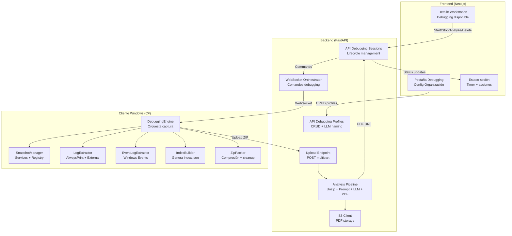
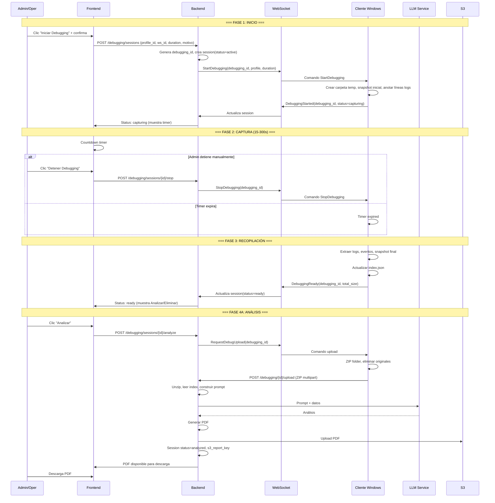
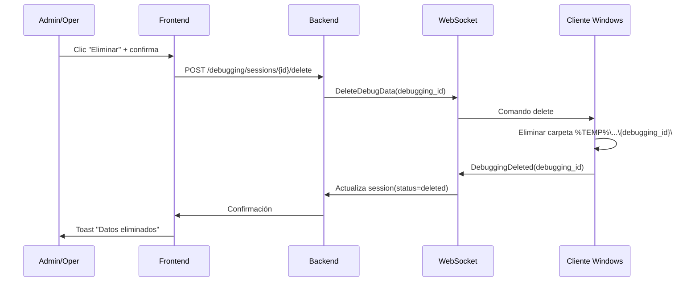
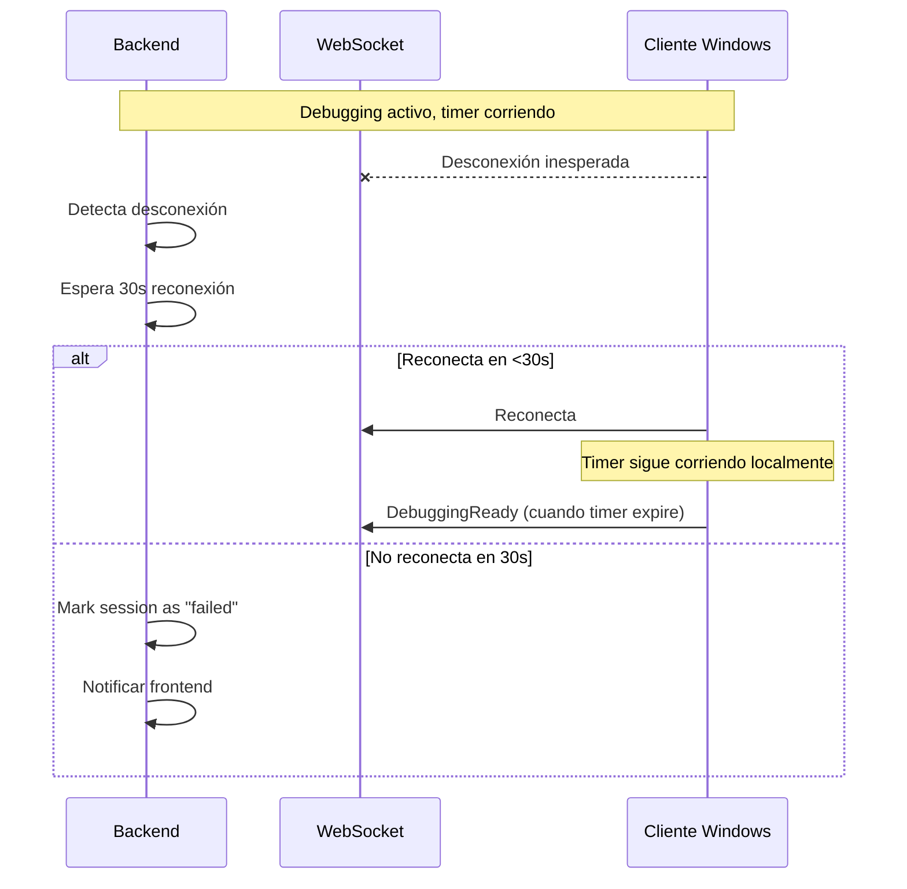

# Documento de Diseño — Capturas de Debugging a Nivel de Organización

## Overview

Este diseño implementa un sistema de capturas de debugging que permite a administradores/operadores definir perfiles de monitoreo a nivel de organización y ejecutarlos sobre workstations individuales para diagnóstico bajo demanda.

El sistema se compone de tres capas:

1. **Frontend (Next.js)** — Pestaña de configuración de perfiles + UI de ejecución en detalle de workstation
2. **Backend (FastAPI)** — API REST para perfiles/sesiones + orquestación WebSocket + análisis LLM + PDF
3. **Cliente Windows (C#)** — Motor de captura: snapshots, extracción de logs/eventos, compresión y upload

### Decisiones de Diseño Clave

| Decisión | Justificación |
|----------|---------------|
| Gate de LLM para acceso a debugging | El análisis final requiere LLM; sin él, los datos capturados no tendrían utilidad automatizada |
| Solo un debugging por workstation | Evita interferencia entre capturas simultáneas y simplifica el estado en el cliente |
| Duración máxima 300s (5 min) hard-limit en cliente | Protección contra sesiones olvidadas que consuman recursos |
| ZIP solo después de solicitar análisis (no durante captura) | Permite al admin decidir si analizar o eliminar antes de comprimir |
| Upload por HTTP endpoint dedicado (no WebSocket) | Los uploads pueden ser grandes (hasta 50MB); HTTP multipart es más robusto para archivos |
| PDF en S3 como artefacto permanente, ZIP eliminado del backend | Balance entre persistencia del análisis y uso de disco/almacenamiento |
| Índice JSON como hub de la carpeta | Permite al LLM entender la estructura sin parsear nombres de archivo |
| Snapshots en JSON (no texto plano) | Facilita diff programático entre estado inicial y final |

## Architecture

### Diagrama de Componentes



### Diagrama de Flujo Completo



## Components and Interfaces

### 1. Backend — Modelo DebuggingProfile

```python
# app/models/debugging.py

class DebuggingProfile(Base):
    """Perfil de debugging definido a nivel de organización."""
    __tablename__ = "debugging_profiles"

    id = Column(GUID, primary_key=True, default=uuid.uuid4)
    organization_id = Column(GUID, ForeignKey("organizations.id", ondelete="CASCADE"), nullable=False)
    name = Column(String(60), nullable=False)
    description = Column(Text, nullable=False)
    confirmation_message = Column(String(200), nullable=False)
    
    # Targets de monitoreo (JSON arrays)
    external_logs = Column(Text, nullable=False, default="[]")        # ["C:\\Logs\\app.log", "C:\\Logs\\*.log"]
    eventlog_groups = Column(Text, nullable=False, default="[]")      # ["System", "Application"]
    registry_keys = Column(Text, nullable=False, default="[]")        # ["HKLM\\SOFTWARE\\Lexmark"]
    monitored_services = Column(Text, nullable=False, default="[]")   # ["Spooler", "LPDSVC"]
    
    is_active = Column(Boolean, nullable=False, default=True)
    created_by = Column(GUID, ForeignKey("users.id"), nullable=False)
    created_at = Column(DateTime, nullable=False, default=datetime.utcnow)
    updated_at = Column(DateTime, nullable=False, default=datetime.utcnow, onupdate=datetime.utcnow)
    
    # Relaciones
    organization = relationship("Organization", backref="debugging_profiles")
    sessions = relationship("DebuggingSession", back_populates="profile", cascade="all, delete-orphan")
```

### 2. Backend — Modelo DebuggingSession

```python
class DebuggingSessionStatus(str, Enum):
    ACTIVE = "active"
    READY = "ready"
    UPLOADING = "uploading"
    ANALYZING = "analyzing"
    ANALYZED = "analyzed"
    ANALYSIS_FAILED = "analysis_failed"
    DELETED = "deleted"
    FAILED = "failed"


class DebuggingSession(Base):
    """Sesión de debugging ejecutada sobre una workstation."""
    __tablename__ = "debugging_sessions"

    id = Column(GUID, primary_key=True, default=uuid.uuid4)  # Este es el debugging_id
    organization_id = Column(GUID, ForeignKey("organizations.id", ondelete="CASCADE"), nullable=False)
    profile_id = Column(GUID, ForeignKey("debugging_profiles.id", ondelete="SET NULL"), nullable=True)
    workstation_id = Column(GUID, ForeignKey("workstations.id", ondelete="CASCADE"), nullable=False)
    
    status = Column(String(20), nullable=False, default=DebuggingSessionStatus.ACTIVE)
    duration_seconds = Column(Integer, nullable=False)
    start_time = Column(DateTime, nullable=False, default=datetime.utcnow)
    end_time = Column(DateTime, nullable=True)
    
    # Contexto del admin/oper
    motivo = Column(Text, nullable=True)
    additional_instructions = Column(Text, nullable=True)
    
    # Resultados
    total_data_size_bytes = Column(BigInteger, nullable=True)
    s3_report_key = Column(String(500), nullable=True)
    
    # Trazabilidad
    initiated_by = Column(GUID, ForeignKey("users.id"), nullable=False)
    created_at = Column(DateTime, nullable=False, default=datetime.utcnow)
    
    # Relaciones
    organization = relationship("Organization", backref="debugging_sessions")
    profile = relationship("DebuggingProfile", back_populates="sessions")
    workstation = relationship("Workstation", backref="debugging_sessions")
```

### 3. Backend — API Endpoints

```python
# app/api/v1/endpoints/debugging.py

# === PROFILES (Admin only) ===
# POST   /api/v1/debugging/profiles              — Crear perfil (invoca LLM para sugerencia)
# GET    /api/v1/debugging/profiles              — Listar perfiles de la organización
# GET    /api/v1/debugging/profiles/{id}         — Detalle de perfil
# PUT    /api/v1/debugging/profiles/{id}         — Editar perfil
# DELETE /api/v1/debugging/profiles/{id}         — Eliminar perfil (soft delete via is_active=False)

# === SESSIONS (Admin + Operator) ===
# POST   /api/v1/debugging/sessions              — Iniciar sesión (genera debugging_id, envía WS cmd)
# GET    /api/v1/debugging/sessions              — Listar sesiones (filtro por workstation_id, status)
# GET    /api/v1/debugging/sessions/{id}         — Detalle de sesión
# POST   /api/v1/debugging/sessions/{id}/stop    — Detener sesión activa
# POST   /api/v1/debugging/sessions/{id}/analyze — Solicitar análisis (trigger upload + LLM)
# POST   /api/v1/debugging/sessions/{id}/delete  — Solicitar eliminación de datos en cliente
# GET    /api/v1/debugging/sessions/{id}/report  — Obtener URL de descarga del PDF (presigned S3 URL)

# === UPLOAD (Workstation authenticated) ===
# POST   /api/v1/debugging/{debugging_id}/upload — Upload ZIP desde workstation
```

### 4. Backend — Schemas Pydantic

```python
# app/schemas/debugging.py

class DebuggingProfileCreate(BaseModel):
    """Schema para crear un perfil de debugging."""
    external_logs: List[str] = []          # Rutas absolutas o patrones glob
    eventlog_groups: List[str] = []        # ["System", "Application", "Security"]
    registry_keys: List[str] = []          # ["HKLM\\SOFTWARE\\..."]
    monitored_services: List[str] = []     # ["Spooler", "LPDSVC"]
    description: str                        # Qué se monitorea y objetivo

    @validator('eventlog_groups', each_item=True)
    def validate_eventlog_group(cls, v):
        allowed = {"System", "Application", "Security"}
        if v not in allowed:
            raise ValueError(f"EventLog group must be one of: {allowed}")
        return v

    @validator('__root__')
    def validate_at_least_one_target(cls, values):
        if not any([values.get('external_logs'), values.get('eventlog_groups'),
                    values.get('registry_keys'), values.get('monitored_services')]):
            raise ValueError("At least one monitoring target must be defined")
        return values


class DebuggingProfileResponse(BaseModel):
    id: UUID
    name: str
    description: str
    confirmation_message: str
    external_logs: List[str]
    eventlog_groups: List[str]
    registry_keys: List[str]
    monitored_services: List[str]
    is_active: bool
    created_at: datetime


class DebuggingSessionCreate(BaseModel):
    """Schema para iniciar una sesión de debugging."""
    profile_id: UUID
    workstation_id: UUID
    duration_seconds: int = Field(ge=15, le=300, default=60)
    motivo: Optional[str] = None
    additional_instructions: Optional[str] = None


class DebuggingSessionResponse(BaseModel):
    id: UUID  # debugging_id
    profile_id: Optional[UUID]
    workstation_id: UUID
    status: str
    duration_seconds: int
    start_time: datetime
    end_time: Optional[datetime]
    motivo: Optional[str]
    total_data_size_bytes: Optional[int]
    s3_report_key: Optional[str]
    initiated_by: UUID
    created_at: datetime
```

### 5. Backend — WebSocket Commands

```python
# Comandos Backend → Cliente (dentro del sistema de mensajes WebSocket existente)

# StartDebugging
{
    "type": "start_debugging",
    "payload": {
        "debugging_id": "uuid-here",
        "profile": {
            "name": "Diagnóstico CPM",
            "external_logs": ["C:\\ProgramData\\LPMC\\Logs\\*.log"],
            "eventlog_groups": ["System", "Application"],
            "registry_keys": ["HKLM\\SOFTWARE\\Lexmark\\UniversalPrintDriver"],
            "monitored_services": ["Spooler", "LPDSVC", "lpmc_universal_service"]
        },
        "duration_seconds": 60
    }
}

# StopDebugging
{
    "type": "stop_debugging",
    "payload": { "debugging_id": "uuid-here" }
}

# RequestDebugUpload
{
    "type": "request_debug_upload",
    "payload": { "debugging_id": "uuid-here" }
}

# DeleteDebugData
{
    "type": "delete_debug_data",
    "payload": { "debugging_id": "uuid-here" }
}
```

```python
# Mensajes Cliente → Backend (vía WebSocket)

# DebuggingStarted
{
    "type": "debugging_started",
    "payload": { "debugging_id": "uuid-here", "status": "capturing" }
}

# DebuggingReady
{
    "type": "debugging_ready",
    "payload": {
        "debugging_id": "uuid-here",
        "status": "ready_for_collection",
        "total_size_bytes": 2457600
    }
}

# DebuggingDeleted
{
    "type": "debugging_deleted",
    "payload": { "debugging_id": "uuid-here" }
}

# DebuggingError
{
    "type": "debugging_error",
    "payload": { "debugging_id": "uuid-here", "error_message": "..." }
}
```

### 6. Cliente Windows — DebuggingEngine

```csharp
namespace AlwaysPrintService.Debugging
{
    /// <summary>
    /// Motor principal de debugging. Orquesta el ciclo de vida completo
    /// de una sesión de captura: inicio, monitoreo, finalización y empaquetado.
    /// Solo permite una sesión activa a la vez.
    /// </summary>
    public class DebuggingEngine
    {
        private DebuggingSession? _activeSession;
        private Timer? _durationTimer;
        private readonly object _lock = new object();
        
        /// <summary>Inicia una nueva sesión de debugging.</summary>
        /// <returns>True si se inició correctamente, false si ya hay una activa.</returns>
        public bool StartSession(string debuggingId, DebuggingProfile profile, int durationSeconds)
        
        /// <summary>Detiene la sesión activa (llamado por StopDebugging o por timer).</summary>
        public void StopSession(string debuggingId)
        
        /// <summary>Comprime la carpeta y retorna la ruta del ZIP.</summary>
        public string PackageForUpload(string debuggingId)
        
        /// <summary>Elimina la carpeta de debugging (ZIP y originales).</summary>
        public void DeleteSession(string debuggingId)
        
        /// <summary>Verifica si existe el ZIP para un debugging_id dado.</summary>
        public bool HasZipAvailable(string debuggingId)
        
        /// <summary>Obtiene la ruta del ZIP si existe.</summary>
        public string? GetZipPath(string debuggingId)
    }
}
```

### 7. Cliente Windows — SnapshotManager

```csharp
namespace AlwaysPrintService.Debugging
{
    /// <summary>
    /// Captura snapshots de servicios Windows y registro.
    /// Genera archivos JSON estructurados para comparación inicial vs final.
    /// </summary>
    public class SnapshotManager
    {
        /// <summary>
        /// Captura el estado de todos los servicios monitoreados.
        /// Retorna JSON con: service_name, display_name, status, start_type.
        /// </summary>
        public string CaptureServicesSnapshot(List<string> serviceNames)
        
        /// <summary>
        /// Captura los valores (claves) de cada llave de registro (single level).
        /// Retorna JSON con: key_path, values: [{name, type, data}].
        /// </summary>
        public string CaptureRegistrySnapshot(List<string> registryKeys)
    }
}
```

### 8. Cliente Windows — LogExtractor

```csharp
namespace AlwaysPrintService.Debugging
{
    /// <summary>
    /// Extrae líneas de log desde una posición conocida hasta el final del archivo.
    /// Maneja tanto archivos individuales como patrones glob.
    /// </summary>
    public class LogExtractor
    {
        /// <summary>
        /// Cuenta las líneas totales de un archivo de log en el momento de inicio.
        /// Si es un patrón glob, resuelve y retorna conteos por archivo.
        /// </summary>
        public Dictionary<string, long> GetInitialLineCounts(List<string> logPaths)
        
        /// <summary>
        /// Extrae líneas nuevas (desde initialLineCount hasta EOF) de cada log.
        /// Retorna diccionario de filename_sanitizado → contenido extraído.
        /// </summary>
        public Dictionary<string, string> ExtractNewLines(
            Dictionary<string, long> initialCounts)
        
        /// <summary>
        /// Extrae el log de AlwaysPrint del día actual desde la línea indicada.
        /// </summary>
        public string ExtractAlwaysPrintLog(long fromLine)
    }
}
```

### 9. Cliente Windows — EventLogExtractor

```csharp
namespace AlwaysPrintService.Debugging
{
    /// <summary>
    /// Extrae entradas del Event Log de Windows entre dos timestamps.
    /// Genera texto formateado por cada grupo de eventos.
    /// </summary>
    public class EventLogExtractor
    {
        /// <summary>
        /// Extrae eventos de los grupos especificados entre startTime y endTime.
        /// Cada grupo se retorna como texto separado.
        /// Formato por entrada: [Timestamp] [Level] [Source] Message
        /// </summary>
        public Dictionary<string, string> ExtractEvents(
            List<string> eventLogGroups,
            DateTime startTime,
            DateTime endTime)
    }
}
```

### 10. Cliente Windows — IndexBuilder

```csharp
namespace AlwaysPrintService.Debugging
{
    /// <summary>
    /// Construye y actualiza el archivo index.json que describe
    /// el contenido completo de la carpeta de debugging.
    /// </summary>
    public class IndexBuilder
    {
        /// <summary>Crea el index inicial con metadata de la sesión.</summary>
        public void CreateIndex(string debuggingId, string profileName,
            DateTime startTime, int durationSeconds, DebuggingProfile profile)
        
        /// <summary>Agrega una referencia de archivo al índice.</summary>
        public void AddFileReference(string filename, string description, long sizeBytes)
        
        /// <summary>Agrega un error al array de errores.</summary>
        public void AddError(string target, string errorMessage)
        
        /// <summary>Finaliza el índice con end_time y conteos totales.</summary>
        public void Finalize(DateTime endTime)
        
        /// <summary>Serializa y guarda el index.json en la carpeta.</summary>
        public void Save(string folderPath)
    }
}
```

### 11. Backend — Analysis Pipeline

```python
# app/services/debugging_analysis.py

class DebuggingAnalysisService:
    """
    Pipeline de análisis de datos de debugging.
    Descomprime ZIP, lee índice, construye prompt, invoca LLM, genera PDF.
    """

    async def analyze(self, session: DebuggingSession, zip_path: str) -> str:
        """
        Ejecuta el pipeline completo de análisis.
        Retorna la S3 key del PDF generado.
        
        Pasos:
        1. Descomprimir ZIP en directorio temporal
        2. Leer index.json para entender estructura
        3. Generar diffs (services_initial vs services_final, registry_initial vs registry_final)
        4. Construir prompt con: objetivo, motivo, instrucciones, diffs, log extracts, events
        5. Invocar LLM (respetando config de org: openai_api_key o bedrock)
        6. Generar PDF con ReportLab/WeasyPrint
        7. Upload PDF a S3
        8. Cleanup directorio temporal
        """
        pass

    def _build_prompt(self, session: DebuggingSession, index: dict,
                      diffs: dict, extracts: dict) -> str:
        """
        Construye el prompt para el LLM.
        
        Estructura:
        - Contexto: "Eres un experto en diagnóstico de sistemas Windows..."
        - Objetivo del debugging (del perfil)
        - Motivo del admin/oper (si existe)
        - Instrucciones adicionales (si existen)
        - Índice de archivos recopilados
        - Diff de servicios (cambios de estado)
        - Diff de registro (valores modificados)
        - Extractos de logs (priorizando errores)
        - Eventos Windows relevantes
        - Solicitud: generar análisis estructurado con conclusiones
        """
        pass

    def _generate_pdf(self, analysis_text: str, session: DebuggingSession) -> bytes:
        """
        Genera PDF con:
        - Header: metadata del debugging (ID, perfil, workstation, timestamps)
        - Body: análisis del LLM formateado
        - Appendix: resumen de datos clave (diffs, errores encontrados)
        """
        pass
```

## Data Models

### Estructura de la carpeta temporal de debugging en el cliente

```
%TEMP%\AlwaysPrint\Debug\{debugging_id}\
├── index.json                      # Índice descriptivo de todo el contenido
├── services_initial.json           # Snapshot inicial de servicios monitoreados
├── services_final.json             # Snapshot final de servicios monitoreados
├── registry_initial.json           # Snapshot inicial de valores de registro
├── registry_final.json             # Snapshot final de valores de registro
├── alwaysprint_log.txt             # Extracto del log de AlwaysPrint (período debugging)
├── ext_log_app_log.txt             # Extracto de log externo (ej: C:\Logs\app.log)
├── ext_log_lpmc_service_log.txt    # Extracto de log externo (ej: LPMC)
├── events_system.txt               # Eventos Windows - System
├── events_application.txt          # Eventos Windows - Application
└── events_security.txt             # Eventos Windows - Security (si se seleccionó)
```

### Formato del index.json

```json
{
  "debugging_id": "a1b2c3d4-e5f6-7890-abcd-ef1234567890",
  "profile_name": "Diagnóstico CPM",
  "start_time": "2026-06-28T15:30:00.000Z",
  "end_time": "2026-06-28T15:31:00.000Z",
  "duration_seconds": 60,
  "targets": {
    "external_logs": ["C:\\ProgramData\\LPMC\\Logs\\service.log"],
    "eventlog_groups": ["System", "Application"],
    "registry_keys": ["HKLM\\SOFTWARE\\Lexmark\\UniversalPrintDriver"],
    "monitored_services": ["Spooler", "LPDSVC", "lpmc_universal_service"]
  },
  "files": [
    {"filename": "services_initial.json", "description": "Estado inicial de servicios monitoreados", "size_bytes": 1245},
    {"filename": "services_final.json", "description": "Estado final de servicios monitoreados", "size_bytes": 1250},
    {"filename": "registry_initial.json", "description": "Valores iniciales de llaves de registro", "size_bytes": 3420},
    {"filename": "registry_final.json", "description": "Valores finales de llaves de registro", "size_bytes": 3420},
    {"filename": "alwaysprint_log.txt", "description": "Log AlwaysPrint durante período de debugging", "size_bytes": 15678},
    {"filename": "ext_log_service_log.txt", "description": "Log externo: C:\\ProgramData\\LPMC\\Logs\\service.log", "size_bytes": 8900},
    {"filename": "events_system.txt", "description": "Eventos Windows - System (15:30:00 a 15:31:00)", "size_bytes": 4500},
    {"filename": "events_application.txt", "description": "Eventos Windows - Application (15:30:00 a 15:31:00)", "size_bytes": 6200}
  ],
  "total_files": 8,
  "total_size_bytes": 44613,
  "errors": [
    {"target": "C:\\Logs\\nonexistent.log", "error": "File not found"}
  ]
}
```

### Formato services_initial.json / services_final.json

```json
{
  "captured_at": "2026-06-28T15:30:00.123Z",
  "services": [
    {
      "service_name": "Spooler",
      "display_name": "Print Spooler",
      "status": "Running",
      "start_type": "Automatic"
    },
    {
      "service_name": "LPDSVC",
      "display_name": "LPD Service",
      "status": "Running",
      "start_type": "Automatic"
    },
    {
      "service_name": "lpmc_universal_service",
      "display_name": "Lexmark Print Management Client",
      "status": "Stopped",
      "start_type": "Automatic"
    }
  ]
}
```

### Formato registry_initial.json / registry_final.json

```json
{
  "captured_at": "2026-06-28T15:30:00.456Z",
  "keys": [
    {
      "key_path": "HKLM\\SOFTWARE\\Lexmark\\UniversalPrintDriver",
      "values": [
        {"name": "Version", "type": "REG_SZ", "data": "3.0.1.2"},
        {"name": "InstallPath", "type": "REG_SZ", "data": "C:\\Program Files\\Lexmark\\"},
        {"name": "PortNumber", "type": "REG_DWORD", "data": 9100},
        {"name": "LastUpdate", "type": "REG_SZ", "data": "2026-06-15T10:00:00"}
      ]
    }
  ]
}
```

### Formato de eventos extraídos (events_system.txt)

```
=== Windows Event Log: System ===
=== Período: 2026-06-28 15:30:00 - 2026-06-28 15:31:00 ===
=== Total entradas: 12 ===

[2026-06-28 15:30:05] [Warning] [Service Control Manager] 
The Spooler service did not respond to the start or control request in a timely fashion.

[2026-06-28 15:30:12] [Error] [Service Control Manager]
The lpmc_universal_service service terminated unexpectedly. It has done this 2 time(s).

[2026-06-28 15:30:45] [Information] [Service Control Manager]
The Print Spooler service entered the running state.
```

## Diagramas de Secuencia Adicionales

### Flujo de Eliminación



### Flujo de Error (Workstation se desconecta)



## Error Handling

### Errores en el Cliente Windows

| Escenario | Comportamiento |
|-----------|----------------|
| Archivo de log externo no encontrado | Registrar en index.json "errors", continuar con otros targets |
| Llave de registro no accesible (permisos) | Registrar error, continuar |
| Servicio no encontrado (nombre incorrecto) | Registrar como "not_found" en snapshot, continuar |
| Carpeta TEMP sin espacio | Abortar sesión, notificar backend con DebuggingError |
| Captura excede 50MB | Detener captura temprano, marcar en index.json "truncated: true" |
| Glob pattern no resuelve a ningún archivo | Registrar en errors, no es fatal |
| Event Log access denied (Security) | Registrar error para ese grupo, continuar con otros |

### Errores en el Backend

| Escenario | Comportamiento |
|-----------|----------------|
| Workstation offline al iniciar | Retornar 409 Conflict: "Workstation no conectada" |
| Ya existe debugging activo en workstation | Retornar 409: "Solo un debugging activo por workstation" |
| Upload ZIP corrupto | Retornar 422, marcar sesión como "analysis_failed" |
| LLM timeout o error | Retry 2 veces con 5s delay; si falla, status="analysis_failed" |
| LLM context window excedido | Truncar datos inteligentemente (priorizar errores/diffs), reintentar |
| S3 upload falla | Retry 3 veces; si falla, status="analysis_failed", mantener datos locales |
| Organización sin LLM configurado | 403 Forbidden: "LLM enablement required" |

### Errores en el Frontend

| Escenario | Comportamiento |
|-----------|----------------|
| WebSocket pierde conexión durante debugging | Mostrar indicador "Reconectando...", no cancelar la sesión |
| Timeout esperando respuesta de inicio (>10s) | Mostrar error, habilitar retry |
| PDF no disponible (S3 error) | Mostrar mensaje "Reporte temporalmente no disponible" con retry |

## Testing Strategy

### Tests Unitarios

| Área | Tests | Cobertura |
|------|-------|-----------|
| DebuggingProfile CRUD | Crear, listar, editar, eliminar perfiles con tenant isolation | Req 1, 12 |
| Validación de targets | Al menos un target requerido, formatos válidos | Req 1.10 |
| LLM naming suggestion | Mock LLM, validar formato de respuesta (nombre ≤60, mensaje ≤200) | Req 2 |
| Session lifecycle | Transiciones de estado válidas: active→ready→analyzed, active→failed | Req 12.4 |
| Duration validation | Rechazar <15 o >300 segundos | Req 4.1 |
| Single session enforcement | Rechazar si ya hay una activa en la workstation | Req 4.7 |
| LLM gate check | Verificar que sin llm_model_id ni openai_api_key se retorna 403 | Req 1.1, 1.2 |

### Tests del Cliente Windows

| Área | Tests | Cobertura |
|------|-------|-----------|
| SnapshotManager - Services | Captura servicios existentes, maneja servicios no encontrados | Req 5.3, 5.10 |
| SnapshotManager - Registry | Lee valores de una llave (single level), maneja llave inexistente | Req 5.4, 5.10 |
| LogExtractor - Line counting | Cuenta líneas correctamente, maneja archivos vacíos | Req 5.5 |
| LogExtractor - Extraction | Extrae desde línea N hasta EOF correctamente | Req 6.3, 6.4 |
| LogExtractor - Glob | Resuelve patrones, maneja sin resultados | Req 5.5 |
| EventLogExtractor | Extrae por rango de tiempo, formato correcto | Req 6.5 |
| IndexBuilder | Genera JSON válido, agrega errores, finaliza correctamente | Req 5.8, 6.8 |
| DebuggingEngine - Timer | Timer detiene captura al expirar, hard max 300s | Req 6.1 |
| DebuggingEngine - Single session | Rechaza segunda sesión mientras hay una activa | Req 4.7 |
| ZipPacker | Comprime todos los archivos, elimina originales post-zip | Req 8.2, 8.3 |

### Tests de Integración

| Área | Tests | Cobertura |
|------|-------|-----------|
| WebSocket commands E2E | Start→Client ack→Ready→Upload request flow | Req 13 |
| Upload endpoint | Multipart upload, validación de session status y auth | Req 11 |
| Analysis pipeline | ZIP → unzip → prompt → mock LLM → PDF generation | Req 8 |
| S3 integration | Upload PDF, generate presigned URL, download | Req 8.9, 8.11 |

### Tests de Edge Cases

| Escenario | Cobertura |
|-----------|-----------|
| Workstation desconecta durante captura activa | Req 15.1, 15.2 |
| ZIP upload falla, retry exitoso | Req 15.4 |
| LLM context window excedido → truncamiento | Req 15.5 |
| Captura excede 50MB → early stop | Req 15.6 |
| Sesión "ready" por más de 24h sin acción | Req 15.7 |
| Org sin LLM intenta acceder a debugging | Req 1.1 |
| Profile con todos los targets vacíos | Req 1.10 |

## Estructura de Archivos Nuevos

```
AlwaysPrintProject/
├── Cloud/
│   └── backend/
│       └── app/
│           ├── api/v1/endpoints/
│           │   └── debugging.py              # Endpoints REST (profiles + sessions + upload)
│           ├── models/
│           │   └── debugging.py              # Modelos SQLAlchemy
│           ├── schemas/
│           │   └── debugging.py              # Schemas Pydantic
│           └── services/
│               └── debugging_analysis.py     # Pipeline de análisis (prompt + LLM + PDF)
│       └── alembic/versions/
│           └── XXX_create_debugging_tables.py  # Migración
│   └── frontend/
│       └── src/app/dashboard/
│           ├── admin/
│           │   └── debugging-profiles/
│           │       └── page.tsx              # UI gestión de perfiles (config org)
│           └── workstations/
│               └── [id]/
│                   └── debugging/
│                       └── page.tsx          # UI debugging en detalle workstation
│                       (o componente inline en la vista de detalle existente)
├── Client/
│   └── AlwaysPrintService/
│       └── Debugging/
│           ├── DebuggingEngine.cs            # Motor principal
│           ├── SnapshotManager.cs            # Capturas de servicios y registro
│           ├── LogExtractor.cs               # Extracción de logs
│           ├── EventLogExtractor.cs          # Extracción de eventos Windows
│           ├── IndexBuilder.cs               # Generación de index.json
│           └── ZipPacker.cs                  # Compresión y cleanup
```
