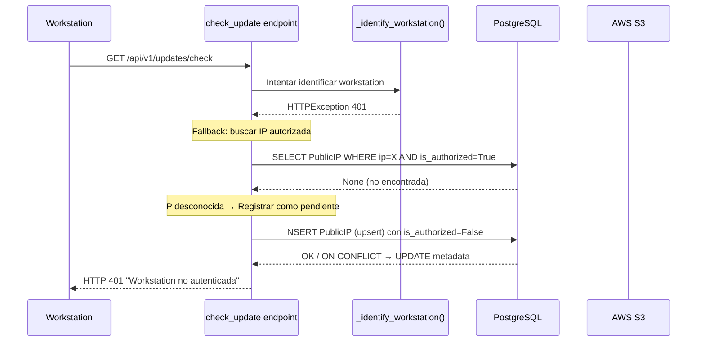
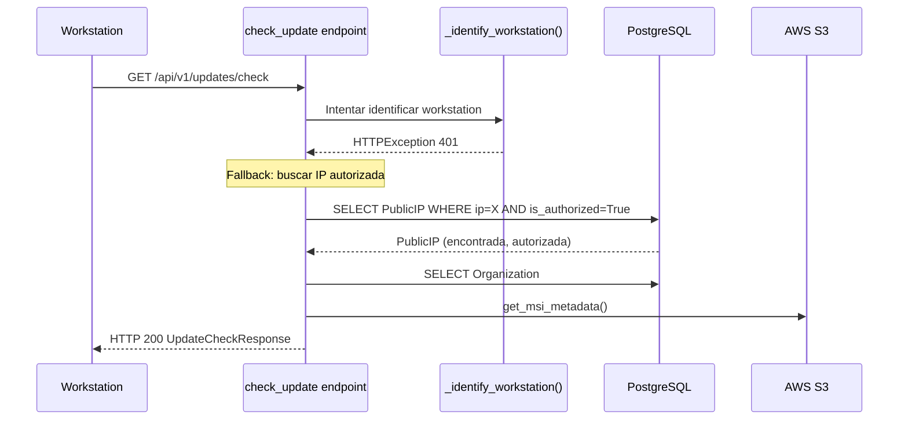

# Design Document: Pending IP Registration

## Overview

Esta feature agrega el registro automático de IPs públicas desconocidas como "pendientes de aprobación" dentro del flujo existente de `check_update`. Cuando una workstation no puede ser autenticada por ningún método (token, X-Workstation-ID, o IP autorizada), el backend registra la IP en la tabla `public_ips` con `is_authorized=False` antes de retornar el HTTP 401 habitual.

El objetivo es dar visibilidad a los administradores sobre nuevas ubicaciones que intentan conectarse, sin alterar el comportamiento del cliente ni degradar el rendimiento del endpoint.

**Decisiones clave:**
- La lógica de registro se inserta en `check_update` (dentro del bloque `except HTTPException` que actualmente solo re-lanza el 401)
- Se utiliza un patrón upsert (INSERT ... ON CONFLICT UPDATE) para idempotencia
- Los errores de DB durante el registro se capturan silenciosamente para no romper el flujo 401
- No se requieren cambios al modelo `PublicIP` ni migraciones nuevas — los campos `first_seen`, `last_hostname` y `last_user` ya existen (migración 009)

## Architecture



### Flujo para IP autorizada (sin cambios)



## Components and Interfaces

### Componente: `_register_pending_ip()`

Nueva función helper en `updates.py` que encapsula la lógica de registro pendiente.

```python
def _register_pending_ip(db: Session, request: Request) -> None:
    """
    Registra una IP pública desconocida como pendiente de aprobación.
    
    Usa upsert (INSERT ... ON CONFLICT) para idempotencia.
    Solo actualiza metadata (last_hostname, last_user) si el registro
    existente tiene is_authorized=False.
    
    Errores de BD se capturan silenciosamente — no deben interrumpir
    el flujo HTTP 401 al cliente.
    """
```

**Parámetros:**
- `db: Session` — sesión SQLAlchemy existente (la misma del endpoint)
- `request: Request` — objeto Request de FastAPI para extraer IP y headers

**Retorna:** `None` (fire-and-forget, errores capturados internamente)

**Efectos secundarios:**
- INSERT o UPDATE en tabla `public_ips`
- Commit de la sesión si éxito
- Rollback + log warning si fallo

### Integración en `check_update`

La llamada a `_register_pending_ip` se inserta en el bloque `else` del fallback por IP pública, justo antes de lanzar el `HTTPException 401`:

```python
# Dentro de check_update, en el bloque except HTTPException:
else:
    # Tampoco se pudo identificar la organización
    # → Registrar IP como pendiente antes de retornar 401
    _register_pending_ip(db, request)
    raise HTTPException(
        status_code=status.HTTP_401_UNAUTHORIZED,
        detail="Workstation no autenticada"
    )
```

### Interfaces existentes que NO se modifican

| Componente | Motivo |
|---|---|
| `_identify_workstation()` | Su lógica de identificación no cambia |
| `list_pending_public_ips` | Ya lista IPs con `is_authorized=False`, funciona sin cambios |
| `authorize_public_ip` | Ya autoriza IPs pendientes, funciona sin cambios |
| Modelo `PublicIP` | Ya tiene todos los campos necesarios |
| Response schemas | `PublicIPPendingResponse` ya incluye `last_hostname` y `last_user` |

## Data Models

### PublicIP (sin cambios — campos ya existentes)

| Campo | Tipo | Descripción |
|---|---|---|
| `id` | UUID | PK, auto-generado |
| `ip_address` | String(45) | IP pública, UNIQUE constraint |
| `is_authorized` | Boolean | False para pendientes |
| `organization_id` | UUID (nullable) | NULL hasta que admin autorice |
| `first_seen` | DateTime | UTC timestamp de primera detección |
| `last_hostname` | String(255, nullable) | Valor del header X-Workstation-ID |
| `last_user` | String(255, nullable) | Valor del header X-Workstation-Local-IP |
| `created_at` | DateTime | Timestamp de creación del registro |
| `authorized_at` | DateTime (nullable) | Cuándo fue autorizada |

### Migraciones

**No se requiere nueva migración.** Los campos `last_hostname`, `last_user` y `first_seen` ya existen gracias a:
- `first_seen`: Definido en el modelo original (migración 001)
- `last_hostname`, `last_user`: Agregados en migración `009_add_pending_ip_metadata`

### Patrón Upsert (PostgreSQL)

Se usa SQLAlchemy Core con `INSERT ... ON CONFLICT` para evitar race conditions:

```python
from sqlalchemy.dialects.postgresql import insert as pg_insert

stmt = pg_insert(PublicIP).values(
    ip_address=client_ip,
    is_authorized=False,
    organization_id=None,
    first_seen=now,
    last_hostname=hostname_header,
    last_user=user_header,
).on_conflict_do_update(
    index_elements=['ip_address'],
    set_={
        'last_hostname': hostname_header,  # Solo si is_authorized=False
        'last_user': user_header,
    },
    where=(PublicIP.is_authorized == False),  # No tocar IPs autorizadas
)
```

La cláusula `WHERE` en el `ON CONFLICT DO UPDATE` garantiza que:
- IPs autorizadas (`is_authorized=True`) nunca se modifican
- Solo se actualiza metadata de IPs que siguen como pendientes

## Correctness Properties

*A property is a characteristic or behavior that should hold true across all valid executions of a system — essentially, a formal statement about what the system should do. Properties serve as the bridge between human-readable specifications and machine-verifiable correctness guarantees.*

### Property 1: Registro pendiente para IP desconocida

*For any* valid IP address (IPv4 o IPv6) que no exista previamente en la tabla `public_ips`, cuando se recibe una solicitud no autenticada en el endpoint `/updates/check`, el sistema debe crear un registro en `public_ips` con `is_authorized=False`, `organization_id=NULL`, `ip_address` igual a la IP del cliente, y `first_seen` dentro de un margen de 5 segundos respecto a la hora UTC actual.

**Validates: Requirements 1.1, 1.2, 5.3**

### Property 2: Captura de metadata desde headers

*For any* solicitud que genera un registro pendiente, si el header `X-Workstation-ID` tiene un valor no vacío entonces `last_hostname` debe coincidir con ese valor; si el header `X-Workstation-Local-IP` tiene un valor no vacío entonces `last_user` debe coincidir con ese valor; si un header está ausente o vacío, el campo correspondiente debe ser NULL.

**Validates: Requirements 1.3, 1.4, 1.5**

### Property 3: Idempotencia — sin registros duplicados

*For any* dirección IP que ya exista en la tabla `public_ips` (independientemente de su estado de autorización), enviar N solicitudes adicionales desde esa misma IP no debe incrementar el conteo total de registros con ese `ip_address` (siempre debe ser exactamente 1).

**Validates: Requirements 2.1, 2.5**

### Property 4: Actualización selectiva de metadata en IP pendiente

*For any* registro pendiente existente (`is_authorized=False`), cuando llega una solicitud con un header `X-Workstation-ID` no vacío, solo el campo `last_hostname` se actualiza con el nuevo valor; si llega con `X-Workstation-Local-IP` no vacío, solo `last_user` se actualiza. Los campos cuyo header correspondiente no está presente en la solicitud deben conservar su valor anterior sin cambios.

**Validates: Requirements 2.2, 2.3**

### Property 5: IPs autorizadas son inmutables al registro pendiente

*For any* registro en `public_ips` con `is_authorized=True`, cuando una solicitud llega desde esa misma IP (en un escenario donde la autenticación falla por otra razón), los campos `last_hostname`, `last_user`, `is_authorized` y `organization_id` de ese registro deben permanecer idénticos antes y después de la solicitud.

**Validates: Requirements 2.4, 4.2**

### Property 6: Respuesta HTTP 401 invariante para IPs no autorizadas

*For any* dirección IP que no esté autorizada (ya sea completamente desconocida o ya registrada como pendiente), la respuesta del endpoint debe ser idéntica: HTTP 401 con body `{"detail": "Workstation no autenticada"}`. No debe haber diferencia observable por el cliente entre ambos casos.

**Validates: Requirements 3.1, 3.2, 3.4**

### Property 7: Resiliencia ante fallos de BD en el registro

*For any* tipo de error de base de datos durante la operación de registro pendiente (constraint violation, timeout de conexión, deadlock, o cualquier otra excepción), el endpoint debe seguir retornando HTTP 401 (nunca HTTP 5xx) y la sesión de base de datos debe quedar en estado limpio (rollback completado).

**Validates: Requirements 5.1**

## Error Handling

### Estrategia de errores en `_register_pending_ip`

| Error | Causa | Acción |
|---|---|---|
| `IntegrityError` | Race condition en UNIQUE constraint (caso improbable con upsert) | Rollback, log WARNING, continuar |
| `OperationalError` | Conexión a BD perdida, timeout | Rollback, log WARNING, continuar |
| `Exception` (genérica) | Cualquier error inesperado | Rollback, log WARNING, continuar |

**Principio rector:** La operación de registro pendiente NUNCA debe causar que el endpoint retorne un código de error distinto a 401. El `try/except` debe ser amplio y capturar cualquier excepción.

### Patrón de implementación

```python
def _register_pending_ip(db: Session, request: Request) -> None:
    try:
        # ... lógica de upsert ...
        db.commit()
    except Exception as e:
        db.rollback()
        logger.warning(
            "Error al registrar IP pendiente: ip=%s, error=%s",
            get_client_ip(request),
            str(e),
        )
```

### Consideraciones de timeout

El requisito 5.4 establece un máximo de 500ms para la operación. PostgreSQL con el patrón upsert sobre un índice UNIQUE es típicamente <10ms. Si se detecta latencia excesiva, la operación se aborta vía `statement_timeout` a nivel de sesión o se confía en el timeout general de la conexión del pool de SQLAlchemy.

## Testing Strategy

### Property-Based Tests (PBT)

Se utilizará **Hypothesis** (librería PBT para Python) con mínimo 100 iteraciones por propiedad.

| Property | Estrategia de generación |
|---|---|
| P1: Registro pendiente | Generar IPs válidas (IPv4/IPv6), simular requests sin auth |
| P2: Metadata desde headers | Generar combinaciones de headers (presentes/ausentes, valores aleatorios) |
| P3: Idempotencia | Generar IP + repetir N veces (N ∈ [2, 20]) |
| P4: Actualización selectiva | Generar registro existente + headers parciales |
| P5: IPs autorizadas inmutables | Generar registros autorizados + requests con headers |
| P6: Respuesta 401 invariante | Generar IPs desconocidas vs. pendientes, comparar responses |
| P7: Resiliencia ante fallos | Inyectar excepciones aleatorias en DB mock |

**Configuración:**
- Framework: `pytest` + `hypothesis`
- Base de datos: SQLite in-memory para tests unitarios, PostgreSQL para tests de integración con upsert
- Mocking: S3 mockeado para evitar dependencias externas
- Tag format: `Feature: pending-ip-registration, Property N: {description}`

### Unit Tests (ejemplo-based)

| Test | Escenario |
|---|---|
| `test_register_pending_ip_basic` | IP nueva → verificar registro creado |
| `test_register_pending_ip_with_all_headers` | Headers presentes → metadata capturada |
| `test_register_pending_ip_no_headers` | Sin headers → campos NULL |
| `test_authorized_ip_not_modified` | IP autorizada → sin cambios en registro |
| `test_register_pending_ip_db_failure` | Simular fallo DB → response sigue siendo 401 |
| `test_log_warning_on_unauthorized` | Verificar que se emite log WARNING con campos correctos |
| `test_check_update_authorized_ip_unchanged` | Flujo completo para IP autorizada → HTTP 200 sin pasar por lógica pendiente |

### Integration Tests

| Test | Escenario |
|---|---|
| `test_upsert_concurrent_requests` | Múltiples requests simultáneas desde misma IP → solo 1 registro |
| `test_full_flow_unknown_ip_then_authorize` | IP desconocida → registra pendiente → admin autoriza → siguiente request OK |
| `test_endpoint_performance_under_load` | Verificar que latencia < 500ms bajo carga normal |
