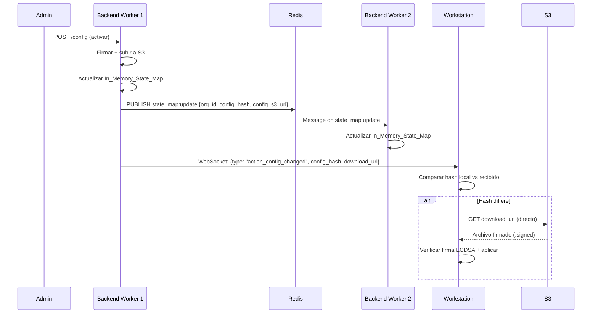
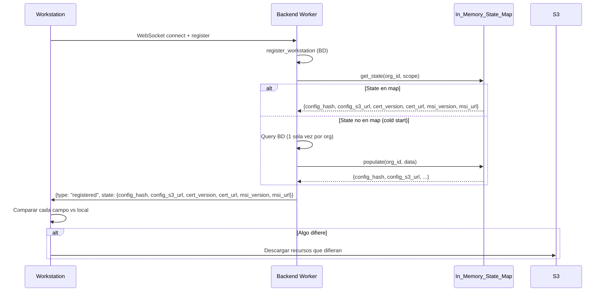

# Design Document: Push-Based Distribution

## Overview

Rediseño completo del flujo de distribución de configuraciones, certificados ECDSA y MSI para eliminar el polling HTTP que causa pool exhaustion con ~300 workstations simultáneas. El nuevo flujo es 100% push-based vía WebSocket, con descarga directa desde S3.

**Problema actual**: Las workstations consultan `/workstations/{id}/config/info` y `/workstations/{id}/config/download` cada 30 segundos, generando ~600 queries/minuto a PostgreSQL que saturan el connection pool (5-10 conexiones en t3.small).

**Solución**: Un In-Memory State Map por worker que cachea el estado de distribución por organización, sincronizado vía Redis pub/sub. Los cambios se pushean proactivamente a las workstations vía WebSocket con URLs de S3 para descarga directa, eliminando completamente las queries a BD en la ruta de distribución.

### Decisiones de diseño clave

| Decisión | Alternativas consideradas | Justificación |
|----------|---------------------------|---------------|
| State Map por org (no por workstation) | Map por workstation_id | ~300 WS vs ~5 orgs. Menos memoria, menos queries al cargar |
| Redis pub/sub (no Redis Streams) | Streams con persistencia | Ya usamos pub/sub para WS routing. Simplicidad > durabilidad (BD es source of truth) |
| URLs públicas S3 para configs/certs | Presigned URLs para todo | Configs firmados y certs ya son públicos (bucket con política pública). Solo MSI necesita presigned |
| Canal dedicado `state_map:update` | Reusar canales org:{id} | Separar concerns: org:{id} es para operadores, state_map:update es inter-worker para estado |
| Scope resolution en state map | Solo org-level | Mantiene la jerarquía existente (org > vlan > workstation) sin queries por WS |

## Architecture

```mermaid
graph TB
    subgraph "Backend Worker 1"
        SM1[In-Memory State Map]
        WS_MGR1[WebSocket Manager]
        API1[FastAPI Endpoints]
    end

    subgraph "Backend Worker 2"
        SM2[In-Memory State Map]
        WS_MGR2[WebSocket Manager]
        API2[FastAPI Endpoints]
    end

    subgraph "Redis"
        PUB_SUB[pub/sub: state_map:update]
        WR[WorkerRegistry]
    end

    subgraph "PostgreSQL"
        ORG_TABLE[organizations]
        AC_TABLE[action_configs]
    end

    subgraph "S3"
        CONFIGS[configs/{org_id}/{hash}.signed]
        CERTS[certs/{org_id}/v{n}.cer]
        MSI[versions/{v}/AlwaysPrint.msi]
    end

    subgraph "Workstations (C#)"
        WS1[Workstation 1..N]
    end

    Admin -->|"Activa config"| API1
    API1 -->|"1. Update state map"| SM1
    SM1 -->|"2. Publish"| PUB_SUB
    PUB_SUB -->|"3. Receive"| SM2
    API1 -->|"4. Push msg"| WS_MGR1
    WS_MGR1 -->|"Config_Push_Message"| WS1
    WS1 -->|"Descarga directa"| CONFIGS
    WS1 -->|"Descarga directa"| CERTS
    WS1 -->|"Presigned URL"| MSI

    SM1 -.->|"Carga inicial"| ORG_TABLE
    SM1 -.->|"Carga inicial"| AC_TABLE
```

### Flujo de distribución (push)



### Flujo de registro enriquecido



## Components and Interfaces

### 1. StateMapService (Backend - Python)

**Archivo**: `app/services/state_map_service.py`

```python
class OrgDistributionState:
    """Estado de distribución de una organización."""
    config_hash: str | None          # Hash SHA256 corto (8 chars) de la config activa
    config_s3_url: str | None        # URL pública S3 del .signed
    cert_version: int                 # Versión del cert ECDSA (0 = sin cert)
    cert_url: str | None             # URL pública S3 del .cer
    msi_version: str | None          # Versión target del MSI
    msi_url: str | None              # Presigned URL S3 del MSI (regenerar si expira)
    msi_url_expires_at: float        # Timestamp de expiración de la presigned URL
    # Sub-estructura por scope (para resolución jerárquica)
    vlan_configs: dict[str, VlanConfigState]  # vlan_id → state
    ws_configs: dict[str, WsConfigState]      # workstation_id → state


class StateMapService:
    """Servicio de mapa de estado en memoria por worker."""

    def __init__(self, redis_url: str | None = None):
        self._state: dict[str, OrgDistributionState] = {}  # org_id → state
        self._redis_url = redis_url
        self._redis = None
        self._pubsub = None
        self._listener_task = None

    async def initialize(self, db_session_factory) -> None:
        """Carga estado inicial desde BD para todas las orgs activas."""

    async def get_state(self, org_id: str) -> OrgDistributionState | None:
        """Retorna el estado de distribución de una org (O(1) lookup)."""

    async def resolve_workstation_state(self, org_id: str, vlan_id: str | None, ws_id: str) -> dict:
        """Resuelve el estado efectivo para una workstation aplicando herencia de scope."""

    async def update_config(self, org_id: str, config_hash: str, config_s3_url: str,
                            scope: str, scope_id: str | None) -> None:
        """Actualiza config en el map local y publica a Redis."""

    async def update_cert(self, org_id: str, cert_version: int, cert_url: str) -> None:
        """Actualiza cert en el map local y publica a Redis."""

    async def update_msi(self, org_id: str, msi_version: str, msi_url: str) -> None:
        """Actualiza MSI en el map local y publica a Redis."""

    async def _publish_update(self, org_id: str, update_type: str, data: dict) -> None:
        """Publica cambio en canal state_map:update de Redis."""

    async def _on_redis_message(self, message: dict) -> None:
        """Handler para mensajes recibidos en state_map:update."""

    async def _load_org_state(self, db, org_id: str) -> OrgDistributionState:
        """Carga estado de una org desde BD (1 query con JOINs)."""
```

### 2. PushDistributionService (Backend - Python)

**Archivo**: `app/services/push_distribution_service.py`

```python
class PushDistributionService:
    """Coordina el envío de push messages a workstations tras cambios de estado."""

    def __init__(self, state_map: StateMapService, connection_manager):
        self._state_map = state_map
        self._conn_mgr = connection_manager

    async def push_config_change(self, org_id: str, config_hash: str,
                                  download_url: str, scope: str,
                                  scope_id: str | None) -> int:
        """
        Envía Config_Push_Message a workstations afectadas.
        Retorna número de mensajes enviados.
        Zero BD queries (datos del state map + connection manager).
        """

    async def push_msi_update(self, org_id: str, msi_version: str,
                               download_url: str, file_size: int) -> int:
        """Envía MSI_Push_Message a todas las workstations online de la org."""

    async def push_cert_rotation(self, org_id: str, cert_version: int,
                                  cert_url: str) -> int:
        """Envía Cert_Push_Message a todas las workstations online de la org."""

    def _get_target_workstations(self, org_id: str, scope: str,
                                  scope_id: str | None) -> list[str]:
        """
        Determina qué workstations deben recibir el push.
        Filtra por scope usando org_ids y _ws_vlan_ids del connection_manager.
        """
```

### 3. Mensajes WebSocket (Backend → Workstation)

#### Config_Push_Message
```json
{
    "type": "action_config_changed",
    "config_hash": "a1b2c3d4",
    "download_url": "https://bucket.s3.region.amazonaws.com/configs/org_id/a1b2c3d4.signed",
    "scope": "org"
}
```

#### MSI_Push_Message
```json
{
    "type": "check_update",
    "download_url": "https://bucket.s3.region.amazonaws.com/versions/2.1.0/AlwaysPrint.msi?X-Amz-...",
    "version": "2.1.0",
    "file_size": 15728640
}
```

#### Cert_Push_Message
```json
{
    "type": "cert_rotated",
    "cert_url": "https://bucket.s3.region.amazonaws.com/certs/org_id/v3.cer",
    "cert_version": 3
}
```

#### Registration_Enrichment (en respuesta `registered`)
```json
{
    "type": "registered",
    "workstation_id": "uuid-...",
    "state": {
        "config_hash": "a1b2c3d4",
        "config_s3_url": "https://bucket.s3.region.amazonaws.com/configs/org_id/a1b2c3d4.signed",
        "cert_version": 3,
        "cert_url": "https://bucket.s3.region.amazonaws.com/certs/org_id/v3.cer",
        "msi_version": "2.1.0",
        "msi_url": "https://bucket.s3.region.amazonaws.com/versions/2.1.0/AlwaysPrint.msi?X-Amz-..."
    }
}
```

### 4. Modificaciones al Cliente C# (Workstation)

#### PushMessageHandler (nuevo)

**Archivo**: `AlwaysPrintTray/Cloud/PushMessageHandler.cs`

Responsabilidades:
- Procesar mensajes `action_config_changed`, `check_update`, `cert_rotated`
- Comparar estado recibido vs estado local
- Iniciar descargas directas desde S3
- Manejar retry con backoff exponencial
- Cache del último estado recibido (para manual check)

#### Modificaciones a CloudManager

- Almacenar `lastKnownState` del registro enriquecido
- Exponer método `GetCachedState()` para manual check
- Eliminar polling periódico a `/config/info`

#### Modificaciones a ConfigManager

- Eliminar llamadas HTTP a `/config/download`
- Agregar método `DownloadFromS3(url)` para descarga directa
- Mantener verificación ECDSA del archivo descargado

### 5. Redis Channel: `state_map:update`

**Formato de mensaje:**
```json
{
    "origin_worker_id": "worker_12345",
    "org_id": "uuid-org",
    "update_type": "config|cert|msi",
    "data": {
        "config_hash": "a1b2c3d4",
        "config_s3_url": "https://...",
        "scope": "org",
        "scope_id": null
    }
}
```

## Data Models

### OrgDistributionState (In-Memory)

```python
@dataclass
class VlanConfigState:
    config_hash: str
    config_s3_url: str

@dataclass
class WsConfigState:
    config_hash: str
    config_s3_url: str

@dataclass
class OrgDistributionState:
    # Config activa a nivel org (default)
    config_hash: str | None = None
    config_s3_url: str | None = None

    # Certificado ECDSA
    cert_version: int = 0
    cert_url: str | None = None

    # MSI
    msi_version: str | None = None
    msi_url: str | None = None
    msi_url_expires_at: float = 0.0  # epoch timestamp

    # Config overrides por scope
    vlan_configs: dict[str, VlanConfigState] = field(default_factory=dict)
    ws_configs: dict[str, WsConfigState] = field(default_factory=dict)
```

### State Map Update (Redis payload)

```python
@dataclass
class StateMapUpdate:
    origin_worker_id: str
    org_id: str
    update_type: str  # "config" | "cert" | "msi"
    data: dict        # Campos actualizados según update_type
```

### Workstation Local State (C# - en memoria del Tray)

```csharp
public class DistributionState
{
    public string ConfigHash { get; set; }
    public string ConfigS3Url { get; set; }
    public int CertVersion { get; set; }
    public string CertUrl { get; set; }
    public string MsiVersion { get; set; }
    public string MsiUrl { get; set; }
    public DateTime LastUpdated { get; set; }
}
```

### Carga inicial desde BD (query)

```sql
-- Una sola query por organización al inicializar el state map
SELECT
    o.id AS org_id,
    o.ecdsa_cert_version AS cert_version,
    o.ecdsa_cert_s3_key AS cert_s3_key,
    o.target_version AS msi_version,
    o.auto_update_enabled,
    ac.config_hash,
    ac.storage_path AS config_s3_key,
    ac.scope,
    ac.vlan_id,
    ac.workstation_id
FROM organizations o
LEFT JOIN action_configs ac ON ac.organization_id = o.id AND ac.is_active = true
WHERE o.is_active = true;
```

## Correctness Properties

*A property is a characteristic or behavior that should hold true across all valid executions of a system — essentially, a formal statement about what the system should do. Properties serve as the bridge between human-readable specifications and machine-verifiable correctness guarantees.*

### Property 1: State map initialization completeness

*For any* set of active organizations in the database, after `StateMapService.initialize()` completes, the in-memory state map SHALL contain an entry for every active organization with its correct config_hash, cert_version, and msi_version matching the database values.

**Validates: Requirements 1.1**

### Property 2: State map local update consistency

*For any* state change event (config activation, cert rotation, or MSI version change), after the local worker processes the change, the In_Memory_State_Map entry for that organization SHALL reflect the new values (config_hash/config_s3_url, cert_version/cert_url, or msi_version/msi_url respectively) and the previous values SHALL be overwritten.

**Validates: Requirements 1.2, 1.3, 1.4**

### Property 3: Cross-worker state synchronization round-trip

*For any* state change published by Worker A to the `state_map:update` Redis channel, when Worker B receives and processes that message, Worker B's In_Memory_State_Map SHALL contain identical values for the affected organization as Worker A's map for the fields included in the update.

**Validates: Requirements 1.5, 8.1, 8.2**

### Property 4: State map scope structure

*For any* organization with multiple active configs at different scopes (org, vlan, workstation), the state map SHALL maintain the org-level config as the default entry AND preserve scope-specific overrides in the appropriate sub-structures (vlan_configs, ws_configs), keyed by their respective scope IDs.

**Validates: Requirements 1.6**

### Property 5: Diff-based download decision

*For any* push message (config_hash, cert_version, or msi_version) received by a workstation, the workstation SHALL initiate a download if and only if the received value differs from its local value. When the received value equals the local value, no download SHALL be initiated.

**Validates: Requirements 2.2, 2.3, 2.4, 3.2, 3.3, 3.4, 4.2, 4.3, 5.2, 6.1**

### Property 6: Exponential backoff retry on S3 failure

*For any* failed S3 download (config or cert), the workstation SHALL retry with delays following the sequence [1s, 2s, 4s] for a maximum of 3 attempts, and the total number of attempts SHALL never exceed 3.

**Validates: Requirements 2.5, 4.4**

### Property 7: Registration enrichment completeness

*For any* successful workstation registration where the In_Memory_State_Map has data for the workstation's organization, the registration response SHALL include all six fields: config_hash, config_s3_url, cert_version, cert_url, msi_version, msi_url — with values matching the state map's resolved state for that workstation's scope.

**Validates: Requirements 5.1**

### Property 8: Zero database queries in distribution hot path

*For any* push distribution event (Config_Push_Message, MSI_Push_Message, or Cert_Push_Message) sent to N workstations where N > 0, the backend SHALL execute exactly 0 database queries during the message construction and delivery phase. Similarly, for any registration enrichment where the state map is already populated for the organization, the enrichment data SHALL be served with 0 database queries.

**Validates: Requirements 9.1, 9.2**

### Property 9: Load efficiency per organization

*For any* state map cache-miss for organization X (cold start or first workstation of that org registering), the backend SHALL execute at most 1 database query to populate the complete state for organization X, regardless of how many workstations from that organization subsequently register.

**Validates: Requirements 9.3**

## Error Handling

### Backend

| Escenario | Comportamiento | Recovery |
|-----------|----------------|----------|
| Redis no disponible al publicar update | Log warning, state map local queda actualizado. Eventual consistency cuando Redis se recupere | Reconexión con exponential backoff (existente en RedisConnectionManager) |
| Redis no disponible al iniciar | State map se carga desde BD normalmente. No hay sync inter-worker hasta que Redis vuelva | Background reconnect task |
| BD no disponible al iniciar worker | Startup falla (comportamiento existente) | Uvicorn reinicia el worker |
| S3 falla al subir config firmada | Endpoint retorna 500 al admin. No se actualiza state map | Admin reintenta la operación |
| Presigned URL de MSI expira en state map | Se regenera lazily cuando se necesita (msi_url_expires_at check) | Auto-regeneración con threshold de 5 minutos antes de expiración |
| Inconsistencia detectada entre workers | Log ERROR con org_id y valores divergentes | Próximo cambio de estado corrige; puede forzarse con re-init manual |
| Workstation se desconecta durante push | Fire-and-forget delivery. WS recibirá estado correcto en próximo registro | Registration_Enrichment al reconectar |

### Workstation (C#)

| Escenario | Comportamiento | Recovery |
|-----------|----------------|----------|
| Descarga S3 falla (config/cert) | Retry con backoff [1s, 2s, 4s], máx 3 intentos | Si 3 intentos fallan, log error y esperar próximo push |
| Presigned URL MSI expirada (403) | Solicitar nueva URL al backend via HTTP fallback (`/updates/download`) | Una sola request HTTP, luego reintentar descarga |
| WebSocket desconectado | Reconexión con jitter (existente). Registration_Enrichment sincroniza estado | Lógica de reconexión existente |
| Estado local corrupto/inexistente | Manual check dispara HTTP fallback para obtener estado completo | Un solo request HTTP al backend |
| Firma ECDSA no verifica | Rechazar config descargada (fail-closed). Log error | No aplicar, esperar próximo push con config correcta |

### Principios de resiliencia

1. **Fail-closed para verificación de firmas**: Si la firma no verifica, la config NO se aplica.
2. **Eventual consistency aceptable**: Entre workers, un desfase de <1s es tolerable.
3. **BD es source of truth**: El state map es un caché. En caso de duda, se puede re-cargar desde BD.
4. **Fire-and-forget para push**: Si una WS no recibe el push, se sincronizará al reconectar vía Registration_Enrichment.

## Testing Strategy

### Property-Based Tests (Backend - Python)

Usaremos **Hypothesis** (ya presente en el proyecto) para los property tests.

Cada property test ejecuta mínimo 100 iteraciones con datos generados aleatoriamente.

**Tests planificados:**

1. **State map initialization** — Genera conjuntos aleatorios de organizaciones con configs/certs/MSI, verifica que `initialize()` produce un mapa correcto.
   - Tag: `Feature: push-based-distribution, Property 1: State map initialization completeness`

2. **State map local update** — Genera secuencias aleatorias de cambios (config, cert, MSI), aplica cada uno, verifica que el mapa refleja solo el último estado.
   - Tag: `Feature: push-based-distribution, Property 2: State map local update consistency`

3. **Cross-worker sync round-trip** — Genera updates aleatorios, serializa/deserializa vía JSON (simula Redis), verifica que el receptor reconstruye el mismo estado.
   - Tag: `Feature: push-based-distribution, Property 3: Cross-worker state synchronization round-trip`

4. **Scope resolution** — Genera orgs con múltiples configs a diferentes scopes, verifica que `resolve_workstation_state()` retorna la config del scope más específico.
   - Tag: `Feature: push-based-distribution, Property 4: State map scope structure`

5. **Diff-based decision** — Genera pares (local_state, push_message), verifica que la decisión de descarga es correcta (descarga sii difiere).
   - Tag: `Feature: push-based-distribution, Property 5: Diff-based download decision`

6. **Zero DB queries** — Genera N workstations, mockea DB con contador, ejecuta push/enrichment, verifica contador = 0.
   - Tag: `Feature: push-based-distribution, Property 8: Zero database queries in distribution hot path`

7. **Load efficiency** — Genera N workstations de la misma org, simula cache misses secuenciales, verifica que solo el primero hace query.
   - Tag: `Feature: push-based-distribution, Property 9: Load efficiency per organization`

### Unit Tests (Backend - Python)

- Registration enrichment con state map vacío (fallback a BD)
- Registration enrichment con state map poblado (zero queries)
- Redis desconectado durante publish (graceful fallback)
- Presigned URL refresh cuando está por expirar
- Scope resolution: org < vlan < workstation priority

### Integration Tests (Backend - Python)

- Flujo completo: admin activa config → state map update → Redis publish → push to WS
- Flujo de registro: WS conecta → registration enrichment con datos correctos
- Multi-worker: cambio en worker 1 visible en worker 2 vía Redis
- Fallback: legacy endpoints siguen funcionando durante transición

### Unit Tests (Client - C#)

- `PushMessageHandler` procesa `action_config_changed` correctamente
- `PushMessageHandler` procesa `check_update` correctamente
- `PushMessageHandler` procesa `cert_rotated` correctamente
- Hash comparison: equal → no download, different → download
- Version comparison: same → no download, different → download
- Cert version comparison: higher → download, equal/lower → ignore
- Retry backoff: verify delays [1s, 2s, 4s] and max 3 attempts
- Manual check uses cached state when available
- Manual check falls back to HTTP when no cached state

### Property-Based Tests Configuration

```python
# settings para Hypothesis
from hypothesis import settings as hyp_settings

hyp_settings.register_profile(
    "push-distribution",
    max_examples=100,
    deadline=None,  # Sin timeout para tests con mocks async
)
```
