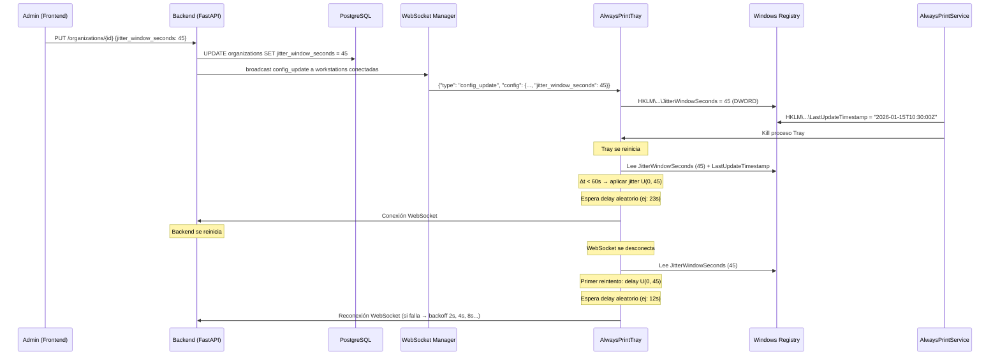

# Design Document: Reconnection Jitter

## Overview

Este diseño implementa jitter configurable para reconexiones WebSocket de workstations al backend de AlwaysPrint. El objetivo es prevenir el efecto "thundering herd" cuando múltiples workstations (200-300+) se reconectan simultáneamente tras eventos masivos (actualización MSI, reinicio de Tray vía comando, caída del backend).

La solución introduce un campo `jitter_window_seconds` a nivel de organización que define la ventana temporal dentro de la cual las reconexiones se distribuyen aleatoriamente con distribución uniforme. El valor se propaga a las workstations via el mecanismo existente de `config_update` WebSocket y se persiste localmente en el registro de Windows para uso offline.

### Decisiones de diseño clave

1. **Jitter uniforme, no exponencial**: Se usa distribución uniforme U(0, W) en vez de exponencial porque el objetivo es distribuir reconexiones equitativamente en la ventana, no penalizar a clientes que fallan repetidamente.
2. **Configuración por organización**: El jitter window es un parámetro a nivel de organización (no por VLAN ni por workstation) porque el thundering herd es un problema de escala a nivel de toda la flota.
3. **Persistencia en Registry**: El valor se almacena localmente para que el Tray pueda aplicar jitter al arrancar sin depender de conectividad de red.
4. **Detección por timestamp**: Se usa un mecanismo de timestamp en Registry (escrito por el Service antes del reinicio/actualización) para que el Tray detecte si su arranque es resultado de un evento masivo.

## Architecture



### Componentes afectados

| Capa | Componente | Cambio |
|------|-----------|--------|
| Backend | Organization model | Agregar columna `jitter_window_seconds` |
| Backend | OrganizationUpdate schema | Agregar campo con validación ge=5, le=300 |
| Backend | OrganizationResponse schema | Incluir campo en respuesta |
| Backend | Config Service | Incluir `jitter_window_seconds` de la org en effective config |
| Backend | Alembic | Migración `016_add_jitter_window_orgs` |
| Client | RegistryConfigManager | Leer/escribir `JitterWindowSeconds` |
| Client | CloudWebSocketClient | Modificar `ScheduleReconnect` para jitter en primer intento |
| Client | CloudManager / HandleConfigUpdate | Persistir `jitter_window_seconds` en Registry |
| Client | TrayApplicationContext (startup) | Lógica de detección de evento masivo + delay |
| Client | AlwaysPrintService | Escribir timestamps antes de restart/update |
| Frontend | Organization settings page | Input numérico + cálculo de tasa |

## Components and Interfaces

### Backend

#### Organization Model (cambio)

```python
# En app/models/organization.py
# Ventana de jitter para reconexiones (segundos)
# Controla la distribución temporal de reconexiones tras eventos masivos
jitter_window_seconds = Column(Integer, nullable=False, default=30, server_default='30')
```

#### OrganizationUpdate Schema (cambio)

```python
# En app/schemas/organization.py
jitter_window_seconds: Optional[int] = Field(
    None, ge=5, le=300,
    description="Ventana de jitter en segundos para reconexiones (5-300)"
)
```

#### Config Service (cambio)

El método `get_effective_config` debe incluir `jitter_window_seconds` leyéndolo directamente de la organización (no del GlobalConfig/VLANConfig/WorkstationConfig, ya que es un campo a nivel de org):

```python
# Después de resolver los campos con precedencia, agregar jitter de la org
org = db.query(Organization).filter_by(id=workstation.organization_id).first()
config["jitter_window_seconds"] = org.jitter_window_seconds if org else 30
```

#### Broadcast tras actualización

Cuando se actualiza `jitter_window_seconds` de una organización, el endpoint de actualización debe disparar un broadcast de `config_update` a todas las workstations conectadas de esa organización. Se reutiliza el mecanismo existente del `ConnectionManager.broadcast_to_organization()`.

### Client (C# .NET 4.8)

#### JitterCalculator (nueva clase)

Clase pura que encapsula la lógica de cálculo de jitter, facilitando testing unitario:

```csharp
namespace AlwaysPrint.Shared.Configuration
{
    /// <summary>
    /// Calcula el delay de jitter para reconexiones basándose en timestamps
    /// y la ventana de jitter configurada.
    /// </summary>
    public static class JitterCalculator
    {
        private const int DefaultJitterWindowSeconds = 30;
        private const int MinJitterWindow = 5;
        private const int MaxJitterWindow = 300;
        private const int RecentThresholdSeconds = 60;

        /// <summary>
        /// Calcula el delay en milisegundos antes de conectar al WebSocket.
        /// Retorna 0 si no se requiere jitter.
        /// </summary>
        public static (int delayMs, string? reason) ComputeStartupDelay(
            DateTime utcNow,
            DateTime? lastUpdateTimestamp,
            DateTime? lastRestartTimestamp,
            int jitterWindowSeconds,
            Random? rng = null)
        { ... }

        /// <summary>
        /// Calcula el delay para el primer intento de reconexión tras desconexión.
        /// </summary>
        public static int ComputeReconnectionDelay(int jitterWindowSeconds, Random? rng = null)
        { ... }

        /// <summary>
        /// Normaliza el jitter window: si está fuera de [5, 300], retorna 30.
        /// </summary>
        public static int NormalizeJitterWindow(int rawValue) { ... }
    }
}
```

#### RegistryConfigManager (cambios)

Nuevos métodos y campos:

```csharp
// Lectura de JitterWindowSeconds (DWORD)
public int LoadJitterWindowSeconds() { ... }

// Escritura de JitterWindowSeconds (DWORD) - llamado por Tray en config_update
public void SaveJitterWindowSeconds(int value) { ... }

// Lectura de LastUpdateTimestamp (String ISO 8601)
public DateTime? LoadLastUpdateTimestamp() { ... }

// Escritura de LastUpdateTimestamp (String ISO 8601) - llamado por Service
public void SaveLastUpdateTimestamp(DateTime utcNow) { ... }

// Lectura de LastRestartTimestamp (String ISO 8601)
public DateTime? LoadLastRestartTimestamp() { ... }

// Escritura de LastRestartTimestamp (String ISO 8601) - llamado por Service
public void SaveLastRestartTimestamp(DateTime utcNow) { ... }
```

#### CloudWebSocketClient (cambio en ScheduleReconnect)

```csharp
// Antes (actual):
private int _currentDelayMs = InitialDelayMs; // 1000

// Después:
// Primer intento post-desconexión usa jitter U(0, JitterWindowSeconds)
// Intentos subsecuentes: backoff exponencial 2s, 4s, 8s... hasta 60s
private bool _isFirstReconnect = true;

private void ScheduleReconnect()
{
    int delay;
    if (_isFirstReconnect && !_longRetryMode)
    {
        int jitterWindow = _registry.LoadJitterWindowSeconds();
        jitterWindow = JitterCalculator.NormalizeJitterWindow(jitterWindow);
        delay = JitterCalculator.ComputeReconnectionDelay(jitterWindow);
        _isFirstReconnect = false;
        _currentDelayMs = 2000; // Siguiente intento arranca en 2s
    }
    else if (_longRetryMode)
    {
        delay = LongRetryDelayMs;
    }
    else
    {
        delay = _currentDelayMs;
        _currentDelayMs = Math.Min(_currentDelayMs * 2, MaxDelayMs);
    }
    // ... resto de la lógica de reconexión
}
```

El flag `_isFirstReconnect` se resetea a `true` en `OnConnected` (cuando la conexión se establece exitosamente).

### Frontend (Next.js / TypeScript)

#### Componente JitterWindowInput

Ubicado en la página de configuración de organización:

```tsx
// Input numérico con validación 5-300
// Muestra cálculo: "Con X segundos de ventana y N workstations activas,
// aproximadamente N/X conexiones por segundo durante eventos masivos"
```

Se integra en la página existente de settings de organización, consultando el endpoint de workstation count para obtener N.

## Data Models

### Backend - Cambio en tabla `organizations`

| Campo | Tipo | Default | Nullable | Descripción |
|-------|------|---------|----------|-------------|
| jitter_window_seconds | Integer | 30 | False | Ventana de distribución de reconexiones en segundos (5-300) |

### Migración Alembic

```python
# 016_add_jitter_window_orgs.py
revision: str = '016_add_jitter_window_orgs'
down_revision: Union[str, None] = '015_add_offline_timeout'

def upgrade() -> None:
    op.add_column(
        'organizations',
        sa.Column('jitter_window_seconds', sa.Integer(), nullable=False, server_default='30')
    )

def downgrade() -> None:
    op.drop_column('organizations', 'jitter_window_seconds')
```

### Client - Registry values (HKLM\SOFTWARE\Robles.AI\AlwaysPrint)

| Clave | Tipo | Writer | Reader | Descripción |
|-------|------|--------|--------|-------------|
| JitterWindowSeconds | DWORD | Tray (config_update) | Tray (startup, reconnect) | Ventana de jitter en segundos |
| LastUpdateTimestamp | String (ISO 8601) | Service (post-msiexec) | Tray (startup) | Timestamp de última actualización |
| LastRestartTimestamp | String (ISO 8601) | Service (pre-restart) | Tray (startup) | Timestamp de último reinicio de Tray |

### Payload config_update (cambio)

Campo adicional en el JSON de configuración efectiva:

```json
{
  "type": "config_update",
  "config": {
    "corporate_queue_name": "LexmarkBBVA",
    "search_targets": {...},
    "pending_task_polling_minutes": 3,
    "bootstrap_domains": "apps.iol.pe",
    "connectivity_checks": [...],
    "locale": "es",
    "telemetry_enabled": true,
    "telemetry_interval_seconds": 300,
    "jitter_window_seconds": 30,
    "config_hash": "abc12345"
  }
}
```

## Correctness Properties

*A property is a characteristic or behavior that should hold true across all valid executions of a system—essentially, a formal statement about what the system should do. Properties serve as the bridge between human-readable specifications and machine-verifiable correctness guarantees.*

### Property 1: Backend validation accepts valid values and rejects invalid values

*For any* integer value V, if V is in the range [5, 300] then a PATCH/PUT request to update `jitter_window_seconds` with V SHALL succeed and persist V; if V is outside [5, 300] or is not an integer, the request SHALL be rejected and the stored value SHALL remain unchanged.

**Validates: Requirements 1.2, 1.3**

### Property 2: Config payload always includes jitter_window_seconds

*For any* workstation belonging to an organization with `jitter_window_seconds` = W, the `config_update` payload sent to that workstation SHALL contain `jitter_window_seconds` equal to W.

**Validates: Requirements 1.4**

### Property 3: Jitter delay bounds for recent trigger events

*For any* jitter window W in [5, 300] and any trigger timestamp (update or restart) that is less than 60 seconds old relative to current time, the computed startup delay SHALL be >= 0 and < W*1000 milliseconds.

**Validates: Requirements 3.1, 4.1**

### Property 4: No jitter for old trigger events

*For any* trigger timestamp (update or restart) that is 60 seconds or more old relative to current time, the computed startup delay SHALL be 0 milliseconds.

**Validates: Requirements 3.2, 4.2**

### Property 5: Dual recent timestamps produce single jitter using closest timestamp

*For any* two timestamps (LastUpdateTimestamp and LastRestartTimestamp) both within 60 seconds of current time, the system SHALL apply jitter exactly once, selecting the timestamp closest to the current time as the jitter source.

**Validates: Requirements 4.4**

### Property 6: Invalid or future timestamps are treated as absent

*For any* timestamp string that is not valid ISO 8601 or that represents a time in the future relative to the current system clock, the system SHALL treat it as absent and compute a startup delay of 0 milliseconds.

**Validates: Requirements 3.4, 4.5**

### Property 7: Invalid JitterWindowSeconds falls back to default

*For any* `JitterWindowSeconds` value read from the Registry that is outside the range [5, 300] (including when the key is absent), the system SHALL use 30 as the effective jitter window for all delay calculations.

**Validates: Requirements 3.5, 5.4**

### Property 8: First WebSocket reconnection uses jitter delay

*For any* valid jitter window W in [5, 300], when a WebSocket disconnection occurs during runtime, the first reconnection attempt SHALL be delayed by a value in [0, W*1000) milliseconds (uniformly distributed).

**Validates: Requirements 5.1**

### Property 9: Frontend calculation correctness

*For any* jitter window X in [5, 300] and active workstation count N > 0, the displayed calculation text SHALL indicate approximately N/X connections per second.

**Validates: Requirements 6.2**

### Property 10: Frontend validation rejects out-of-range values

*For any* numeric value V where V < 5 or V > 300, the frontend SHALL display a validation error and SHALL NOT submit the value to the backend.

**Validates: Requirements 6.4**

## Error Handling

### Backend

| Escenario | Comportamiento |
|-----------|---------------|
| Valor fuera de rango (< 5 o > 300) | HTTP 422 Validation Error con detalle del campo |
| Valor no entero | HTTP 422 Validation Error |
| Organización no encontrada | HTTP 404 |
| Error de BD al persistir | HTTP 500, log estructurado |
| Broadcast falla (workstation desconectada) | Ignorar silenciosamente (la workstation obtendrá config al reconectar) |

### Client (Tray)

| Escenario | Comportamiento |
|-----------|---------------|
| Registry key `JitterWindowSeconds` ausente | Usar default 30 |
| Registry key fuera de rango [5, 300] | Usar default 30 |
| Timestamp inválido (no ISO 8601) | Tratar como ausente, no aplicar jitter |
| Timestamp en el futuro | Tratar como ausente, no aplicar jitter |
| Fallo al escribir Registry | Loggear error con `AlwaysPrintLogger.WriteWarning`, continuar sin interrumpir |
| Excepción en cálculo de jitter | Loggear error, conectar sin delay (fail-open) |

### Client (Service)

| Escenario | Comportamiento |
|-----------|---------------|
| Fallo al escribir `LastUpdateTimestamp` | Loggear error, continuar con actualización |
| Fallo al escribir `LastRestartTimestamp` | Loggear error, continuar con reinicio |

### Frontend

| Escenario | Comportamiento |
|-----------|---------------|
| Valor fuera de [5, 300] | Mostrar error de validación inline |
| Fallo al obtener workstation count | Mostrar cálculo sin tasa (N=0) |
| Backend rechaza update | Mostrar error toast, restaurar valor anterior |
| Timeout de red | Mostrar error genérico, mantener valor en input |

## Testing Strategy

### Unit Tests (C# - JitterCalculator)

Tests con ejemplos concretos para la clase `JitterCalculator`:
- Timestamp de hace 30s con jitter window 45 → delay en [0, 45000) ms
- Timestamp de hace 120s → delay = 0
- Timestamp ausente (null) → delay = 0
- Timestamp futuro → delay = 0
- Timestamp inválido → delay = 0
- JitterWindow = 0 → se usa default 30
- JitterWindow = 500 → se usa default 30
- Ambos timestamps recientes → solo un delay, usando el más cercano
- Reconnection delay con jitter window 60 → delay en [0, 60000)

### Property-Based Tests (Python - Backend con Hypothesis)

Se usa **Hypothesis** como librería de property-based testing.

Configuración: mínimo **100 iteraciones** por property test.

Cada test lleva el tag: `Feature: reconnection-jitter, Property {N}: {title}`

| Property | Test |
|----------|------|
| 1 | Generar enteros válidos [5,300] → PUT exitoso; generar inválidos → 422 |
| 2 | Para cualquier org con jitter configurado, verificar presencia en config payload |
| 3 | Generar window ∈ [5,300] + timestamp con Δt < 60s → delay ∈ [0, W*1000) |
| 4 | Generar timestamp con Δt ≥ 60s → delay = 0 |
| 5 | Generar dos timestamps ambos < 60s → un solo delay, timestamp más cercano |
| 6 | Generar strings no-ISO-8601 + timestamps futuros → delay = 0 |
| 7 | Generar jitter window fuera [5,300] → effective = 30 |
| 8 | Generar window ∈ [5,300] → reconnection delay ∈ [0, W*1000) |
| 9 | Generar X ∈ [5,300], N > 0 → texto muestra N/X |
| 10 | Generar V < 5 o V > 300 → validación rechaza |

### Integration Tests

- Config sync end-to-end: actualizar jitter en org → verificar que config_update llega con el valor correcto
- Registry persistence: escribir/leer JitterWindowSeconds roundtrip
- Startup flow: simular arranque con timestamps recientes y verificar que la conexión se retrasa

### Nota sobre mocking en property tests del client

Para las Properties 3-8 que testean `JitterCalculator`, se inyecta un `Random` con seed fijo para hacer los tests determinísticos al verificar rangos. Se usa `new Random(seed)` pasado como parámetro al calculador.
