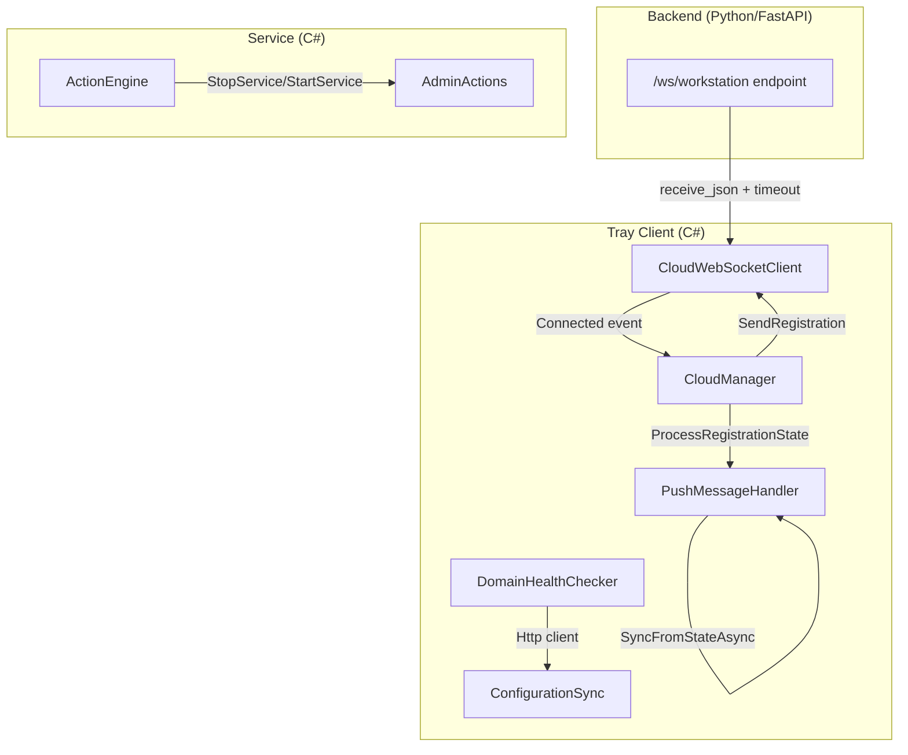

# Design Document: Reconnection Reliability Fixes

## Overview

Este diseño aborda 4 bugs de fiabilidad identificados en producción que afectan la reconexión WebSocket, la auto-actualización de MSI, la sincronización de configuración por proxy, y la ejecución de acciones con servicios opcionales. Los fixes son independientes entre sí pero comparten el contexto de reconexión.

**Principio de diseño**: Cada fix es mínimo e incremental — modifica solo las líneas necesarias sin reestructurar los componentes existentes. Se preservan todas las verificaciones y protecciones existentes.

---

## Architecture

Los 4 fixes operan en componentes distintos de la arquitectura AlwaysPrint:



**Impacto por componente:**

| Componente | Archivo | Fix |
|------------|---------|-----|
| PushMessageHandler | `AlwaysPrintTray/Cloud/PushMessageHandler.cs` | #1 — Agregar chequeo MSI en SyncFromStateAsync |
| DomainHealthChecker | `AlwaysPrintTray/Bootstrap/DomainHealthChecker.cs` | #2 — Inicializar HttpClient con ProxyHelper |
| Backend WebSocket | `backend/app/api/v1/websocket/workstation.py` | #3 — Agregar asyncio.wait_for con timeout 10s |
| CloudWebSocketClient | `AlwaysPrintTray/Cloud/CloudWebSocketClient.cs` | #3 — Enviar register antes del evento Connected |
| AdminActions | `AlwaysPrintService/Actions/AdminActions.cs` | #4 — Catch InvalidOperationException en Stop/StartService |

---

## Components and Interfaces

### Fix 1: MSI Version Check in SyncFromStateAsync

**Problema**: `SyncFromStateAsync` ya compara `ConfigHash` y `CertVersion` pero NO evalúa `MsiVersion`. Cuando una workstation se reconecta y recibe el `DistributionState` enriquecido, la versión MSI se ignora y la workstation no se auto-actualiza hasta que llega un push explícito `check_update`.

**Solución**: Agregar un bloque de comparación de `MsiVersion` en `SyncFromStateAsync`, siguiendo el mismo patrón existente para ConfigHash y CertVersion.

**Método a modificar**: `PushMessageHandler.SyncFromStateAsync(DistributionState state)`

**Cambio específico**: Después del bloque existente que compara `state.MsiVersion` (líneas ~225-270 del archivo actual), el código ya tiene la lógica de comparación de MSI. Sin embargo, la comparación actual usa `string.Equals` (igualdad exacta). El bug es que **la versión local se obtiene del Assembly.GetExecutingAssembly()** que retorna formato `X.X.X.X` (4 segmentos) mientras que `state.MsiVersion` puede venir como `X.X.X` (3 segmentos) desde el backend.

**Corrección**: Normalizar la comparación de versiones usando `Version.TryParse` para comparación semántica en lugar de igualdad de strings. Si el parse falla en cualquiera de los dos lados, caer a comparación string (comportamiento actual).

```csharp
// En SyncFromStateAsync, sección 3 (Comparar versión de MSI):
if (!string.IsNullOrEmpty(state.MsiVersion))
{
    string currentVersion = System.Reflection.Assembly.GetExecutingAssembly()
        .GetName().Version?.ToString() ?? "0.0.0.0";

    // Comparación semántica: soporta 3 vs 4 segmentos
    bool versionsMatch;
    if (Version.TryParse(currentVersion, out var localVer) &&
        Version.TryParse(state.MsiVersion, out var remoteVer))
    {
        versionsMatch = (localVer >= remoteVer);
    }
    else
    {
        versionsMatch = currentVersion.Equals(state.MsiVersion, StringComparison.OrdinalIgnoreCase);
    }

    if (!versionsMatch)
    {
        // ... lógica existente de descarga MSI ...
    }
}
```

**Decisión de diseño**: Se usa `localVer >= remoteVer` (no `==`) para evitar downgrades involuntarios si una workstation tiene una versión más nueva que la distribuida.

---

### Fix 2: Proxy Support for DomainHealthChecker HttpClient

**Problema**: `DomainHealthChecker._http` se inicializa como `new HttpClient { Timeout = 10s }` sin handler de proxy. En redes corporativas con proxy obligatorio (Zscaler), las peticiones HTTP desde `ConfigurationSync` (que usa `DomainHealthChecker.Http`) fallan con timeout porque no pasan por el proxy.

**Solución**: Inicializar el `_http` static field usando `ProxyHelper.CreateHandler()`.

**Archivo a modificar**: `AlwaysPrintTray/Bootstrap/DomainHealthChecker.cs`

**Cambio específico**:

```csharp
// ANTES:
private static readonly HttpClient _http = new HttpClient
{
    Timeout = TimeSpan.FromSeconds(TimeoutSecs)
};

// DESPUÉS:
private static readonly HttpClient _http = new HttpClient(ProxyHelper.CreateHandler(), disposeHandler: false)
{
    Timeout = TimeSpan.FromSeconds(TimeoutSecs)
};
```

**Notas de diseño**:
- `disposeHandler: false` porque el HttpClient es static y nunca se dispose (intencional para evitar socket exhaustion).
- `ProxyHelper.CreateHandler()` ya configura `UseProxy = true`, `Proxy = WebRequest.GetSystemWebProxy()` y `Credentials = CredentialCache.DefaultCredentials`.
- El import `using AlwaysPrintTray.Cloud;` ya está implícito si están en el mismo assembly; si no, agregarlo (ProxyHelper está en namespace `AlwaysPrintTray.Cloud`, DomainHealthChecker en `AlwaysPrintTray.Bootstrap`).
- El `RecycleConnectionPool()` existente seguirá funcionando porque opera sobre `ServicePointManager` (capa inferior) que es independiente del handler.

**Impacto**: `CloudWebSocketClient` ya usa `ProxyHelper.GetSystemProxyUri()` para su WebSocket. Con este fix, **toda la comunicación HTTP del Tray** (health check + config sync) también pasa por el proxy.

---

### Fix 3: WebSocket Register Race Condition

**Problema**: Existe una ventana de tiempo entre `websocket.accept()` y la llegada del mensaje `register`:
1. Backend hace `await websocket.receive_json()` sin timeout — si el cliente tarda en enviar register (ej: GC pause, CPU spike), el backend espera indefinidamente hasta TCP timeout.
2. El cliente dispara `Connected` event de forma asíncrona, y `SendRegistration()` se ejecuta después de que el event loop del receive loop ya está activo, creando posibilidad de que un `pong` o `status_update` llegue antes que el `register`.

**Solución (Backend)**: Envolver `receive_json()` con `asyncio.wait_for(timeout=10)`.

**Archivo**: `backend/app/api/v1/websocket/workstation.py`

**Cambio**:

```python
import asyncio

# ANTES:
data = await websocket.receive_json()

# DESPUÉS:
try:
    data = await asyncio.wait_for(websocket.receive_json(), timeout=10.0)
except asyncio.TimeoutError:
    await _safe_close(websocket, 1008, "Timeout esperando mensaje de registro")
    return
```

**Solución (Cliente)**: Enviar el mensaje `register` directamente en `ConnectInternalAsync` ANTES de disparar el evento `Connected`. Esto garantiza que el register es el primer mensaje en el wire.

**Archivo**: `AlwaysPrintTray/Cloud/CloudWebSocketClient.cs`

**Cambio en `ConnectInternalAsync()`**:

```csharp
// ANTES (en ConnectInternalAsync, después de ConnectAsync exitoso):
Connected?.Invoke();
await ReceiveLoopAsync(ws, token).ConfigureAwait(false);

// DESPUÉS:
// Disparar Connected PRIMERO para que CloudManager envíe register síncronamente
// ANTES de entrar al receive loop. El evento Connected es síncrono (Action delegate)
// y SendRegistration() dentro de OnConnected() usa _wsClient.Send() que es fire-and-forget
// pero encola el mensaje inmediatamente.
Connected?.Invoke();

// Dar tiempo mínimo para que el SendAsync del register se complete antes de entrar
// al receive loop (evita que el servidor reciba otro mensaje antes del register).
// El Send() ya serializa vía SemaphoreSlim, pero queremos asegurar orden en el wire.
await Task.Delay(50, token).ConfigureAwait(false);

await ReceiveLoopAsync(ws, token).ConfigureAwait(false);
```

**Análisis alternativo**: La implementación actual ya llama `Connected?.Invoke()` síncronamente y `OnConnected()` → `SendRegistration()` envía el register inmediatamente. El verdadero problema es que `Send()` usa `Task.Run(async () => ...)` internamente — el mensaje se encola pero no se envía antes de que `ReceiveLoopAsync` empiece a procesar mensajes entrantes del servidor.

**Solución refinada**: Cambiar `ConnectInternalAsync` para enviar el register síncronamente (await) antes del receive loop:

```csharp
// En ConnectInternalAsync, después de ConnectAsync exitoso:
lock (_lock)
{
    IsConnected     = true;
    _currentDelayMs = InitialDelayMs;
    _longRetryMode  = false;
    _isFirstReconnect = true;
    _connectedSince = DateTime.UtcNow;
}

AlwaysPrintLogger.WriteTrayInfo(
    "CloudWebSocketClient: conexión WebSocket establecida exitosamente.");

// Disparar Connected para que CloudManager envíe register
Connected?.Invoke();

// Esperar a que el register sea enviado efectivamente al wire.
// El semáforo _sendLock garantiza exclusión, pero necesitamos esperar
// a que el Task.Run interno del Send() complete el envío real.
// Solución: agregar un método SendAndWaitAsync() o hacer un corto delay.
await Task.Delay(100, token).ConfigureAwait(false);

// Iniciar bucle de recepción
await ReceiveLoopAsync(ws, token).ConfigureAwait(false);
```

**Decisión de diseño**: No refactorizamos `Send()` para hacerlo awaitable (impacto amplio) — en su lugar, el delay de 100ms es suficiente para que el register sea escrito al socket antes de entrar al receive loop. El backend con su timeout de 10s es el safety net definitivo.

---

### Fix 4: Tolerant Handling of Non-Existent Services

**Problema**: `ServiceController(serviceName)` lanza `InvalidOperationException` cuando el servicio no existe en el registro de Windows. Esto propaga la excepción al `ActionEngine` que marca la acción como fallida, abortando las acciones subsecuentes en un bloque `Conditional`.

**Solución**: Wrap the `ServiceController` instantiation in a try-catch que detecte el caso "servicio no existe" y retorne `true` (éxito operacional — "no había nada que detener/iniciar").

**Archivo**: `AlwaysPrintService/Actions/AdminActions.cs`

**Cambio en `StopService()`**:

```csharp
public static bool StopService(string serviceName, int gracefulTimeoutSeconds = 30, bool forceKillOnTimeout = false)
{
    try
    {
        AlwaysPrintLogger.WriteInfo($"StopService: deteniendo {serviceName}, timeout={gracefulTimeoutSeconds}s, force={forceKillOnTimeout}");
        
        using (var sc = new ServiceController(serviceName))
        {
            // Forzar lectura del Status para detectar si el servicio existe.
            // ServiceController no valida existencia en el constructor —
            // lanza InvalidOperationException al acceder a Status/Start()/Stop().
            var _ = sc.Status;
            
            if (sc.Status == ServiceControllerStatus.Stopped)
            {
                AlwaysPrintLogger.WriteInfo($"StopService: {serviceName} ya está detenido");
                return true;
            }
            
            if (sc.Status != ServiceControllerStatus.StopPending)
            {
                sc.Stop();
            }
            
            sc.WaitForStatus(ServiceControllerStatus.Stopped, TimeSpan.FromSeconds(gracefulTimeoutSeconds));
            
            AlwaysPrintLogger.WriteInfo($"StopService: {serviceName} detenido correctamente");
            return true;
        }
    }
    catch (InvalidOperationException ex) when (IsServiceNotFound(ex))
    {
        // Servicio no instalado en esta workstation — no es un error operacional
        AlwaysPrintLogger.WriteWarning(
            $"StopService: servicio '{serviceName}' no encontrado en esta workstation. " +
            "Retornando éxito (nada que detener).");
        return true;
    }
    catch (System.TimeoutException)
    {
        AlwaysPrintLogger.WriteWarning($"StopService: timeout deteniendo {serviceName}");
        
        if (forceKillOnTimeout)
        {
            AlwaysPrintLogger.WriteWarning($"StopService: intentando kill forzado de {serviceName}");
        }
        
        return false;
    }
    catch (Exception ex)
    {
        AlwaysPrintLogger.WriteError($"StopService: error deteniendo {serviceName}: {ex.Message}", ex);
        return false;
    }
}
```

**Cambio análogo en `StartService()`** con el mismo patrón de catch.

**Método helper**:

```csharp
/// <summary>
/// Determina si una InvalidOperationException indica que el servicio no existe.
/// ServiceController lanza esta excepción con un InnerException de tipo
/// System.ComponentModel.Win32Exception con NativeErrorCode 1060 (ERROR_SERVICE_DOES_NOT_EXIST).
/// </summary>
private static bool IsServiceNotFound(InvalidOperationException ex)
{
    if (ex.InnerException is System.ComponentModel.Win32Exception win32Ex)
    {
        // ERROR_SERVICE_DOES_NOT_EXIST = 1060
        return win32Ex.NativeErrorCode == 1060;
    }
    
    // Fallback: verificar mensaje (menos confiable, pero cubre edge cases)
    return ex.Message.Contains("was not found") ||
           ex.Message.Contains("no se encontró") ||
           ex.Message.Contains("does not exist");
}
```

**Decisión de diseño**: 
- Se usa `when (IsServiceNotFound(ex))` para NO suprimir otras `InvalidOperationException` que indiquen errores reales (ej: servicio en estado de transición).
- Se retorna `true` (no `false`) porque desde la perspectiva del ActionEngine, "detener un servicio que no existe" es un no-op exitoso — el estado deseado (servicio detenido) ya se cumple.
- El error code 1060 (`ERROR_SERVICE_DOES_NOT_EXIST`) es el estándar de Windows para servicios no registrados en SCM.

---

## Data Models

No se modifican modelos de datos. Los cambios son exclusivamente en lógica de control y manejo de errores.

**`DistributionState`** (existente, sin cambios):
```csharp
public class DistributionState
{
    public string? ConfigHash { get; set; }
    public string? ConfigS3Url { get; set; }
    public int CertVersion { get; set; }
    public string? CertUrl { get; set; }
    public string? CertHash { get; set; }
    public string? MsiVersion { get; set; }
    public string? MsiUrl { get; set; }
    public long MsiFileSize { get; set; }
    public DateTime LastUpdated { get; set; }
}
```

---

## Error Handling

### Fix 1 (MSI Version)
- Si `Version.TryParse` falla en cualquiera de los lados → fallback a comparación string (sin crash).
- Si `MsiUrl` es null pero `MsiVersion` difiere → log warning, incrementar `updatedCount`, no intentar descarga.
- Si la descarga falla → log error dentro del `Task.Run` existente (no propaga al caller).

### Fix 2 (Proxy HttpClient)
- Si `ProxyHelper.CreateHandler()` falla → no se puede inicializar `DomainHealthChecker` (error fatal en startup). Esto no debería ocurrir ya que `WebRequest.GetSystemWebProxy()` siempre retorna un proxy (directo si no hay configuración).
- Si el proxy es inalcanzable → timeout de 10s por dominio en `CheckAll()`, luego reciclaje de pool (mecanismo existente).

### Fix 3 (Race Condition)
- Backend: Si timeout expira → close con 1008 + reason descriptivo. No crash, no leak.
- Backend: Si `receive_json()` lanza excepción durante el wait → capturada por el try/except existente del endpoint.
- Cliente: `Task.Delay(100)` respeta el `CancellationToken` — si se cancela durante el delay, no entra al receive loop.

### Fix 4 (Service Not Found)
- `IsServiceNotFound()` verifica `NativeErrorCode == 1060` como criterio primario (confiable).
- Fallback por string matching para edge cases de localización del OS.
- Errores genuinos (`AccessDeniedException`, `TimeoutException`, etc.) NO son capturados por el filtro `when`.

---

## Testing Strategy

### Enfoque General

Dado que estos fixes son correcciones de bugs con comportamientos específicos de error handling, configuración de infraestructura, y timing de I/O, **property-based testing no es apropiado**:
- Fix 1: Side-effect (descarga + pipe message) con input space limitado (par de versiones)
- Fix 2: Configuración de infraestructura (proxy setup)
- Fix 3: Comportamiento de timing (timeout, ordering)
- Fix 4: Manejo de excepciones específicas del OS

### Unit Tests (por fix)

**Fix 1 — MSI Version Comparison**:
- Test: `SyncFromStateAsync` con `MsiVersion` más nueva → verifica que se invoca `UpdateDownloader`
- Test: `SyncFromStateAsync` con `MsiVersion` igual → verifica que NO se invoca download
- Test: `SyncFromStateAsync` con `MsiVersion` = "1.2.3" vs local "1.2.3.0" → compara semánticamente
- Test: `SyncFromStateAsync` con `MsiVersion` más nueva pero `MsiUrl` null → verifica warning log
- Test: `SyncFromStateAsync` con `MsiVersion` más vieja que local → NO descarga (no downgrade)

**Fix 2 — Proxy HttpClient**:
- Test: Compilación exitosa con el nuevo inicializador
- Test: `DomainHealthChecker.Http` no es null y tiene handler configurado
- Smoke test: `CheckAll()` con dominio alcanzable funciona correctamente

**Fix 3 — Race Condition (Backend)**:
- Test: Conectar WebSocket, no enviar nada, verificar close con 1008 después de ~10s
- Test: Conectar WebSocket, enviar register dentro de 10s → flujo normal
- Test: Enviar mensaje no-register → close 1008 "First message must be register"

**Fix 3 — Race Condition (Cliente)**:
- Test: `ConnectInternalAsync` dispara Connected y espera delay antes de receive loop
- Test: Verificar que register es el primer mensaje enviado al wire

**Fix 4 — Service Not Found**:
- Test: `StopService("ServicioInexistente")` → retorna `true`
- Test: `StartService("ServicioInexistente")` → retorna `true`  
- Test: `StopService("LPDSVC")` (servicio existente, detenido) → retorna `true`
- Test: `IsServiceNotFound` con `Win32Exception(1060)` → retorna `true`
- Test: `IsServiceNotFound` con `Win32Exception(5)` (access denied) → retorna `false`

### Integration Tests

**Fix 3 (Backend)**:
- Test end-to-end: workstation real conectando al backend con registro exitoso
- Test end-to-end: verificar que la reconexión no produce 1008 espurio

**Fix 4 (ActionEngine)**:
- Test: Ejecutar `.alwaysconfig` con `StopService` para servicio inexistente → acciones siguientes se ejecutan
- Test: Bloque `Conditional` con `StopService` + `DeleteFolderContents` + `StartService` donde el servicio no existe → todas las acciones completan

### Validación Manual

- Desplegar backend con timeout y verificar en logs que workstations reconectan sin errores 1008
- Verificar en workstation con proxy que `ConfigurationSync` descarga correctamente
- Verificar en workstation sin el servicio LPDSVC que la config `.alwaysconfig` se ejecuta completa
