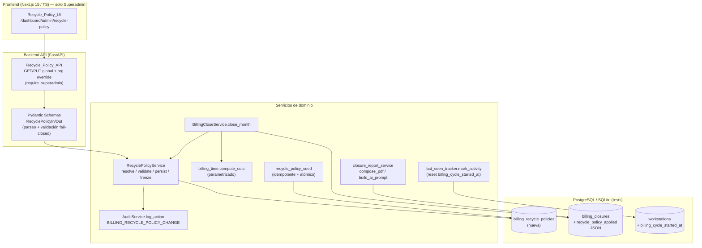
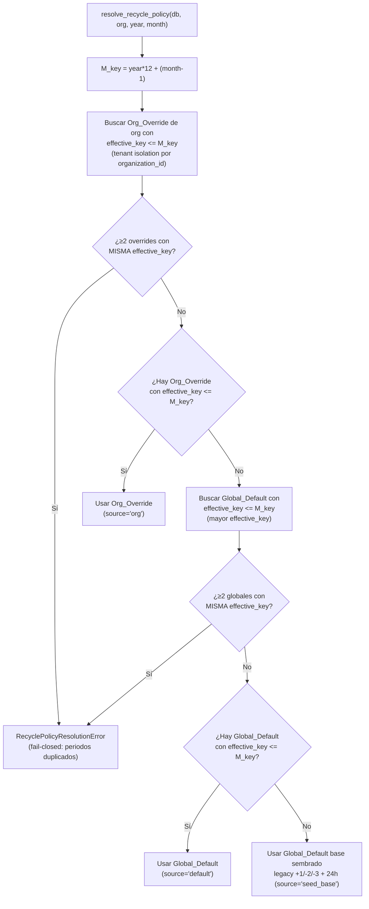
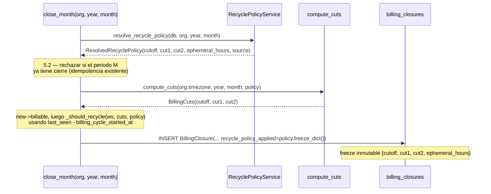
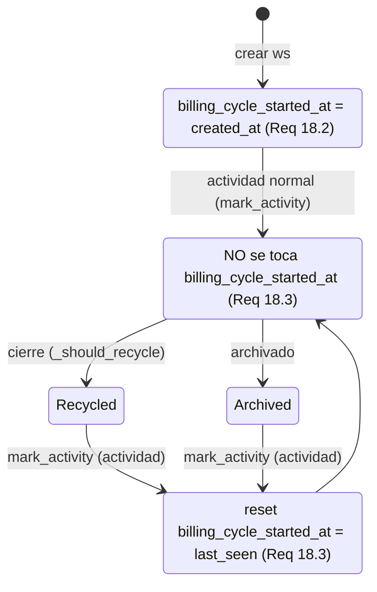

# Design Document

## Overview

Esta feature convierte la **política de reciclaje** del módulo Usage and Billing —hoy hardcodeada— en configuración persistente, versionada por periodo y congelada en cada cierre. Actualmente:

- Los tres offsets de mes (`cutoff=M+1`, `cut1=M-2`, `cut2=M-3`) están hardcodeados en `app/services/billing_time.py::compute_cuts` vía las llamadas literales `_shift_month(year, month, +1/-2/-3)`.
- El umbral de uso efímero (24h) vive como la constante `_CASE1_MAX_USE_SECONDS = 24*60*60` en `app/services/billing_close_service.py`, y el uso efímero se mide como `last_seen - created_at`.

El diseño introduce un **Recycle_Policy_Service** que replica el patrón `resolve_plan` de `BillingService` (Global_Default + Org_Override), pero con dos diferencias sustanciales de diseño:

1. **Versionado por periodo, no por fecha de ejecución.** La resolución compara `Effective_From_Period` (año-mes) contra el periodo `M` del cierre usando la clave cronológica entera `key = year*12 + (month-1)`. Esto hace la política robusta ante cierres retroactivos: un cierre de un mes viejo ejecutado hoy resuelve la política que estaba vigente ESE mes, no la de hoy.
2. **Freeze en el cierre.** Cada `BillingClosure` congela la política que aplicó en una columna nueva `recycle_policy_applied` (JSON NOT NULL). El PDF, el prompt de IA y cualquier recálculo leen de ahí, garantizando inmutabilidad histórica y determinismo.

Además, se introduce la columna `workstations.billing_cycle_started_at` para medir el uso efímero sobre el **ciclo de actividad vigente** (que se reinicia al reactivar una workstation desde `recycled`/`archived`), preservando `created_at` para su semántica histórica (auditoría, UI y el alcance del cierre `created_at < cutoff`).

Todo el comportamiento es **fail-closed**: validación previa a persistir, auditoría transaccional (sin auditoría no hay cambio), seed y backfill atómicos, y PDF/prompt que abortan si la política congelada falta o está corrupta.

### Principios de diseño heredados del repo (impact-analysis)

- **No se elimina ninguna verificación** para resolver compatibilidad; se resuelve manteniendo la garantía (freeze inmutable, fail-closed).
- **Un formato de datos que cambia obliga a actualizar a TODOS sus lectores.** `billing_closures` gana `recycle_policy_applied` → el PDF, el prompt de IA y el recálculo deben leerla; el backup/restore la transporta.
- **Un componente shared que cambia obliga a revisar TODOS los callers.** `compute_cuts` y `_should_recycle` cambian de firma → sus únicos callers (`close_month`) se actualizan; se documenta que ningún otro caller queda roto.
- **Backward-compat por defecto legacy.** La política legacy `+1/-2/-3` + 24h reproduce exactamente el comportamiento actual.

## Architecture

### Componentes



### Flujo de resolución de política por periodo



Nota clave sobre AC 3.6: si el Org_Override existe pero su `effective_key > M_key` (override futuro), la query de override no lo selecciona (filtra por `<= M_key`), por lo que la resolución **cae limpiamente al Global_Default** vigente para `M`. No requiere lógica especial.

### Flujo de cierre con freeze



## Data Models

### Nueva tabla: `billing_recycle_policies`

**Decisión: UNA tabla, no dos.** Se justifica frente a la alternativa de dos tablas (una global, una por org, análoga a `BillingRatePlan`/`BillingOrgPlan`):

- Los planes tarifarios usan **dos** tablas porque tienen esquemas distintos (`BillingRatePlan` tiene `is_default`/`name`; `BillingOrgPlan` congela `tiers` por suscripción anual). La política de reciclaje, en cambio, tiene **el mismo esquema** en global y en override (los mismos 4 parámetros + un periodo efectivo).
- El único discriminante es "global vs org", que se modela con `organization_id NULL = Global_Default`. Esto simplifica la resolución (una sola tabla, dos queries filtradas) y el seed.
- El versionado por periodo (varias filas por scope, cada una con su `effective_from`) encaja mejor en una tabla plana indexada por `(organization_id, effective_key)`.

```python
# app/models/billing.py  (nueva clase)

class BillingRecyclePolicy(Base):
    """
    Política de reciclaje configurable, versionada por periodo (año-mes) prospectivo.

    organization_id NULL  -> Global_Default del sistema.
    organization_id != NULL -> Org_Override de esa organización.

    Una fila por (scope, effective period). La resolución elige la de mayor
    effective_key <= M_key para el periodo M del cierre.
    """
    __tablename__ = "billing_recycle_policies"

    id = Column(GUID, primary_key=True, default=uuid.uuid4)
    # NULL = Global_Default; no-NULL = Org_Override (tenant isolation).
    organization_id = Column(
        GUID, ForeignKey("organizations.id", ondelete="CASCADE"),
        nullable=True, index=True,
    )

    # Recycle_Rule: tres offsets de mes con signo.
    cutoff_offset = Column(Integer, nullable=False)  # legacy +1
    cut1_offset = Column(Integer, nullable=False)    # legacy -2
    cut2_offset = Column(Integer, nullable=False)    # legacy -3

    # Ephemeral_Use_Threshold en horas.
    ephemeral_hours = Column(Integer, nullable=False)  # legacy 24

    # Effective_From_Period como año-mes + clave cronológica entera (year*12 + (month-1)).
    # effective_key se persiste para indexar y comparar sin recomputar; año/mes se guardan
    # para lectura humana y para reconstruir el AAAA-MM en la API/UI.
    effective_from_year = Column(Integer, nullable=False)   # 2000..2999
    effective_from_month = Column(Integer, nullable=False)  # 1..12
    effective_key = Column(Integer, nullable=False, index=True)  # year*12 + (month-1)

    created_by_id = Column(GUID, ForeignKey("users.id", ondelete="SET NULL"), nullable=True)
    created_at = Column(DateTime, nullable=False, default=datetime.utcnow)
    updated_at = Column(DateTime, nullable=False, default=datetime.utcnow, onupdate=datetime.utcnow)

    __table_args__ = (
        CheckConstraint("effective_from_month BETWEEN 1 AND 12", name="ck_recycle_policy_month"),
        # NO se usa UniqueConstraint sobre (organization_id, effective_key) porque en Postgres
        # NULL != NULL y no agruparía los globales; la unicidad por scope se valida en el
        # servicio (fail-closed) y se detecta en resolución (AC 3.3). Ver "Policy Resolution".
        Index("ix_recycle_policy_scope_key", "organization_id", "effective_key"),
    )
```

**Notas de tipo:** se reutiliza `GUID` (compatibilidad SQLite/PostgreSQL) igual que el resto del módulo. `effective_key` es redundante con `(year, month)` pero se persiste por rendimiento (índice) y para evitar recomputarlo en cada comparación; la migración lo deriva y el servicio lo mantiene consistente en cada escritura.

### Columna nueva en `billing_closures`: `recycle_policy_applied`

```python
# Añadida a BillingClosure
recycle_policy_applied = Column(JSON, nullable=False, server_default="{}")
```

Contiene el **freeze** de la política resuelta para el periodo:

```json
{
  "cutoff": 1,
  "cut1": -2,
  "cut2": -3,
  "ephemeral_hours": 24
}
```

- `NOT NULL` con `server_default="{}"` como red de seguridad para el backfill (igual criterio que `last_seen`/`amount`). El backfill (Req 6) rellena `{+1,-2,-3,24}` legacy; el `server_default="{}"` NO es una política válida (freeze vacío) y el PDF/prompt lo tratan como corrupto (fail-closed, Req 11.4/12.3) — de ahí que el backfill sea obligatorio y transaccional.
- Es **inmutable** una vez escrito (Req 4.4). Ningún flujo hace UPDATE de esta columna salvo el backfill de la migración.

### Columna nueva en `workstations`: `billing_cycle_started_at`

```python
# Añadida a Workstation (junto a last_seen / billing_status)
billing_cycle_started_at = Column(
    DateTime, nullable=False,
    default=datetime.utcnow,                    # init = created_at al crear (Req 18.2)
    server_default=text("CURRENT_TIMESTAMP"),   # red de seguridad para inserts que lo omitan
)
```

Sigue exactamente el mismo patrón que `last_seen`: `NOT NULL`, `server_default CURRENT_TIMESTAMP` como red de seguridad (un DEFAULT SQL no puede referenciar `created_at` de la misma fila), e inicialización explícita al valor correcto en el código de registro.

### Migración en 3 pasos (columna NOT NULL sobre tabla poblada)

Para `billing_cycle_started_at` (patrón idéntico al usado para `last_seen`), en la migración `039_add_recycle_policy`:

```
1. ADD COLUMN billing_cycle_started_at DateTime NULL
2. UPDATE workstations SET billing_cycle_started_at = created_at   -- Req 18.6
3. ALTER COLUMN billing_cycle_started_at SET NOT NULL
   (+ server_default CURRENT_TIMESTAMP)
```

El mismo patrón conceptual aplica a `billing_closures.recycle_policy_applied`:

```
1. ADD COLUMN recycle_policy_applied JSON NULL  (o NOT NULL server_default '{}')
2. Backfill transaccional: UPDATE cada closure sin política -> {+1,-2,-3,24}  (Req 6)
3. (si se creó NULL) ALTER COLUMN SET NOT NULL server_default '{}'
```

Y crea la tabla `billing_recycle_policies` + siembra las políticas iniciales (Req 16) dentro de la misma migración (data migration, patrón de `036`/`037`). El seed y el backfill comparten la transacción de la migración: si algo falla, `op.get_bind()` revierte todo (atomicidad, Req 6.3/16.3).

## Policy Resolution

El `RecyclePolicyService` replica el patrón `BillingService.resolve_plan`, pero comparando por **periodo** en vez de por fecha de ejecución.

```python
# app/services/recycle_policy_service.py

@dataclass(frozen=True)
class ResolvedRecyclePolicy:
    cutoff: int
    cut1: int
    cut2: int
    ephemeral_hours: int
    source: str          # "org" | "default" | "seed_base"
    policy_id: Optional[str] = None

    def freeze_dict(self) -> dict:
        """Payload inmutable a congelar en billing_closures.recycle_policy_applied."""
        return {
            "cutoff": self.cutoff, "cut1": self.cut1,
            "cut2": self.cut2, "ephemeral_hours": self.ephemeral_hours,
        }


# Política legacy base (Req 3.5 / 6.1): comportamiento idéntico al hardcodeado actual.
LEGACY_POLICY = ResolvedRecyclePolicy(
    cutoff=1, cut1=-2, cut2=-3, ephemeral_hours=24, source="seed_base"
)


class RecyclePolicyResolutionError(Exception):
    """Fail-closed: no se pudo resolver una política (p.ej. periodos efectivos duplicados)."""


class RecyclePolicyService:
    def resolve_recycle_policy(
        self, db: Session, org: Organization, year: int, month: int
    ) -> ResolvedRecyclePolicy:
        ...

    @staticmethod
    def period_key(year: int, month: int) -> int:
        return year * 12 + (month - 1)
```

**Algoritmo `resolve_recycle_policy` (Req 3.2/3.4/3.5/3.6, 2.3/2.4/2.5):**

1. `m_key = period_key(year, month)`.
2. **Org_Override** (tenant isolation): traer todas las filas con `organization_id == org.id AND effective_key <= m_key`, ordenadas por `effective_key DESC`.
   - Si dos filas comparten la mayor `effective_key` (empate en el tope aplicable) → `RecyclePolicyResolutionError` (Req 3.3, fail-closed). No se modifica estado.
   - Si hay al menos una → devolver la de mayor `effective_key` (`source="org"`).
3. **Global_Default**: traer filas con `organization_id IS NULL AND effective_key <= m_key`, ordenadas `effective_key DESC`.
   - Mismo chequeo de empate en el tope (Req 3.3).
   - Si hay al menos una → devolverla (`source="default"`).
4. Si no hay ninguna con `effective_key <= m_key` → devolver `LEGACY_POLICY` (`source="seed_base"`, Req 3.5).

La resolución **ignora la fecha de ejecución** por completo (Req 3.4/10.1): solo depende de `(year, month)`, `org.id` y las filas de política. Esto es lo que hace robusto el cierre retroactivo.

### Casos borde

| Caso | Requisito | Comportamiento |
|---|---|---|
| Org_Override futuro (`effective_key > m_key`) | 3.6 | La query filtra `<= m_key` → no lo ve → cae a Global_Default de M. |
| Sin política alguna para M | 3.5 | Devuelve `LEGACY_POLICY` (base sembrada). |
| Empate de `effective_key` en el tope aplicable (mismo scope) | 3.3 | `RecyclePolicyResolutionError`, no persiste ni modifica. |
| BBVA override 2026-09, cerrar 2026-09..∞ | 3.7 | `m_key >= key(2026,9)` → usa override (semántica inclusiva). |
| BBVA override 2026-09, cerrar 2026-05..2026-08 | 3.8 | `m_key < key(2026,9)` → usa política previa (global). |

La semántica de vigencia es **inclusiva**: `M >= Effective_From_Period` (usa `<=` en `effective_key`), tal como fija la nota de negocio del requirements. El propio periodo efectivo YA usa la política nueva.

## Recycle Engine Integration

### `compute_cuts` parametrizado (`billing_time.py`)

Se añade un parámetro con los offsets. **Decisión: exigir la política explícitamente** (sin default silencioso) para evitar que un caller nuevo herede accidentalmente el legacy. El único caller (`close_month`) siempre resuelve la política antes. Para no romper firmas se acepta un objeto ligero:

```python
class RecycleRule(NamedTuple):
    cutoff: int
    cut1: int
    cut2: int

def compute_cuts(
    timezone_name: str, year: int, month: int, rule: RecycleRule
) -> BillingCuts:
    # antes: _shift_month(year, month, +1 / -2 / -3) hardcodeado
    cutoff_y, cutoff_m = _shift_month(year, month, rule.cutoff)
    cut1_y, cut1_m = _shift_month(year, month, rule.cut1)
    cut2_y, cut2_m = _shift_month(year, month, rule.cut2)
    return BillingCuts(
        cutoff=_local_month_start_utc_naive(timezone_name, cutoff_y, cutoff_m),
        cut1=_local_month_start_utc_naive(timezone_name, cut1_y, cut1_m),
        cut2=_local_month_start_utc_naive(timezone_name, cut2_y, cut2_m),
    )
```

`_shift_month` y `_local_month_start_utc_naive` no cambian: ya soportan cualquier offset entero (usan un contador absoluto de meses). Con `RecycleRule(1, -2, -3)` el resultado es **byte-a-byte idéntico** al actual (backward-compat).

### `_should_recycle` con uso efímero por ciclo (`billing_close_service.py`)

```python
def _should_recycle(
    self, ws: Workstation, cuts: BillingCuts, ephemeral_hours: int
) -> bool:
    last_seen = ws.last_seen  # crudo (Req 10.1)
    # Caso 2 — abandono: last_seen < cut2 (independiente del uso).
    if last_seen < cuts.cut2:
        return True
    # Caso 1 — poco uso: last_seen < cut1 AND uso_del_ciclo < umbral.
    if last_seen < cuts.cut1:
        uso = (last_seen - ws.billing_cycle_started_at).total_seconds()  # Req 18.4 (NO created_at)
        if uso < ephemeral_hours * 3600:
            return True
    return False
```

Cambios frente al actual:
- Se elimina `_CASE1_MAX_USE_SECONDS` (constante hardcodeada) → `ephemeral_hours` de la política congelada.
- El uso efímero se mide como `last_seen - billing_cycle_started_at` (Req 18.4), **no** `last_seen - created_at`.

### `close_month` — orquestación (Req 4.1, 10.2)

```python
# ── 3. Resolver la política ANTES de compute_cuts (Req 3, 4.1) ──
policy = recycle_policy_service.resolve_recycle_policy(db, org, year, month)
rule = RecycleRule(policy.cutoff, policy.cut1, policy.cut2)

# ── 3'. Cortes con la regla resuelta ──
cuts = compute_cuts(org.timezone, year, month, rule)
# ... new->billable ...
# ... _should_recycle(ws, cuts, policy.ephemeral_hours) ...

closure = BillingClosure(
    ...,
    recycle_policy_applied=policy.freeze_dict(),   # FREEZE inmutable (Req 4.1)
)
```

El `cutoff` sigue definiendo el alcance del recálculo (`created_at < cuts.cutoff`); con la política configurable, ese `cutoff` proviene ahora de `rule.cutoff` (legacy `+1`). El resto de `close_month` (idempotencia, secuencialidad, snapshot, monto, estado vivo) no cambia.

### Determinismo — restricción a nivel de interfaz (Req 10.3)

Para forzar que la decisión de reciclaje use **solo** los insumos permitidos, se extrae una función pura verificable:

```python
# app/services/recycle_decision.py

@dataclass(frozen=True)
class RecycleInputs:
    created_at: datetime
    billing_cycle_started_at: datetime
    last_seen: datetime           # crudo
    timezone: str
    policy: ResolvedRecyclePolicy # congelada

def decide_recycle(inputs: RecycleInputs, year: int, month: int) -> bool:
    """Decisión pura y determinista. NO recibe la Workstation ni la Session:
    la firma restringe los insumos a los cinco permitidos (Req 10.3)."""
    rule = RecycleRule(inputs.policy.cutoff, inputs.policy.cut1, inputs.policy.cut2)
    cuts = compute_cuts(inputs.timezone, year, month, rule)
    if inputs.last_seen < cuts.cut2:
        return True
    if inputs.last_seen < cuts.cut1:
        uso = (inputs.last_seen - inputs.billing_cycle_started_at).total_seconds()
        return uso < inputs.policy.ephemeral_hours * 3600
    return False
```

`_should_recycle` pasa a ser un adaptador que construye `RecycleInputs` desde la `Workstation` y delega en `decide_recycle`. Así el núcleo de decisión es una función pura sin acceso a BD ni a "reloj de pared", lo que hace la reproducibilidad (Req 10.2) verificable por property-based testing.

## billing_cycle_started_at Lifecycle



- **Init (Req 18.2):** al crear la workstation, `billing_cycle_started_at = created_at`. Se hace en el registro (`services/workstation.py`) igual que hoy se inicializa `last_seen = first_seen`; el `default=datetime.utcnow` del modelo es la red de seguridad.
- **Reset (Req 18.3):** SOLO en la transición `recycled`/`archived → billable` por actividad. Se implementa dentro de `_reactivate_if_needed` en `last_seen_tracker.py`:

```python
def _reactivate_if_needed(ws: Workstation, ts: datetime) -> bool:
    if ws.billing_status in _REACTIVATABLE_STATES and billing_state_machine.can_transition(
        ws.billing_status, _BILLABLE
    ):
        ws.billing_status = _BILLABLE
        ws.billing_cycle_started_at = ts   # Req 18.3 — reset al ts de la actividad
        return True
    return False
```

`mark_activity(db, ws, ts)` pasa `ts` a `_reactivate_if_needed`. La actividad normal (que no reactiva) NO toca el campo (Req 18.3, cláusula negativa). `created_at` nunca se modifica (Req 18.5).

- **Migración (Req 18.6):** backfill `= created_at` para todas las ws existentes (comportamiento idéntico al previo para ws no reactivadas).
- **Backup/restore (Req 18.7):** es dato crudo persistente. Viaja en el dump de la tabla `workstations` (ya listada en `backup_service.py`); no requiere cambios en la lista de tablas. El restore lo restaura tal cual, sin recomputar.

## Validation

Validación **en dos capas** (Req 7.6): schema Pydantic en la API y re-validación en el servicio antes de persistir (independiente del schema). Ambas fail-closed.

### Parseo de la Recycle_Rule (Req 1.3, 7.1)

Formato string `"+1/-2/-3"`: exactamente 3 enteros con **signo explícito** separados por `/`. Regex de validación: `^[+-]\d+/[+-]\d+/[+-]\d+$`. Rechaza `"1/-2/-3"` (falta signo), `"+1/-2"` (2 componentes), `"+1/-2/-3/-4"` (4 componentes).

### Reglas de validación (todas fail-closed, errores agregados — Req 7.7)

| Regla | Requisito | Condición de rechazo |
|---|---|---|
| Formato | 7.1 | No parsea a 3 enteros con signo explícito |
| Orden | 7.2 | NO `cutoff > cut1 >= cut2` |
| Cutoff mínimo | 7.3 | `cutoff < +1` |
| Rango offset | 7.4 | Algún offset fuera de `[-24, +1]` |
| Umbral efímero | 7.5 | `ephemeral_hours` fuera de `[1, 168]` |
| Periodo efectivo | 7.8, 3.1 | Mes fuera de `[1,12]` o año fuera de `[2000,2999]` |

El servicio devuelve **una lista de errores** (uno por regla violada, Req 7.7), no solo el primero. La API los propaga como mensajes explícitos por regla (Req 17.5).

```python
@dataclass
class PolicyValidationError:
    rule: str        # "format" | "order" | "cutoff_min" | "offset_range" | "ephemeral_range" | "period"
    message: str     # mensaje en español, explícito

class RecyclePolicyValidationException(Exception):
    def __init__(self, errors: list[PolicyValidationError]): ...

def validate_policy(cutoff, cut1, cut2, ephemeral_hours, eff_year, eff_month) -> None:
    """Agrega TODAS las violaciones y lanza RecyclePolicyValidationException si hay alguna."""
```

### Conflicto con cierres existentes (Req 5.3)

Antes de persistir un cambio, el servicio calcula el conjunto de periodos `M` que el nuevo `Effective_From_Period` afectaría (todos los `M >= effective_key` dentro del scope) y verifica que **ninguno** ya tenga un `BillingClosure`:

```python
def assert_no_closed_periods_affected(db, org_id_or_None, effective_key) -> None:
    # Para override: cierres de esa org con period_key >= effective_key.
    # Para global: se evalúa contra los cierres de TODAS las orgs sin override propio
    #   vigente en ese periodo (un cierre existente cuya política resuelta sería la global).
    # Si existe alguno -> rechazar (fail-closed), NO persistir, error identificando el conflicto.
```

Como los cierres son inmutables y no se reprocesan (Req 5.1/5.2), permitir un cambio que "debería" haber aplicado a un mes ya cerrado crearía una incoherencia entre lo congelado y lo configurado; por eso se rechaza en origen.

### Preservación ante rechazo (Req 7.9)

Toda validación ocurre **antes** de cualquier escritura. Si la validación falla, no se ejecuta ningún INSERT/UPDATE, por lo que la política previamente persistida queda intacta por construcción.

## Fail-closed Behaviors

| Comportamiento | Requisito | Diseño |
|---|---|---|
| **Auditoría transaccional** | 9.5 | El INSERT del `AuditLog` va en la **misma transacción** que el UPSERT de la política. Si la auditoría falla, `db.rollback()` revierte también el cambio de política. (Difiere del `_audit_closure` existente, que es fail-safe porque el cierre ya está commiteado; aquí es fail-closed a propósito.) |
| **Seed atómico** | 16.3 | Global_Default + Org_Override de BBVA se insertan en la misma transacción de la migración; si uno falla, rollback total. |
| **Backfill atómico** | 6.3 | Un solo `UPDATE ... WHERE recycle_policy_applied vacío` (o iteración dentro de una transacción); si alguna fila falla, rollback y la migración no se marca completa. |
| **PDF aborta sin política** | 11.4 | `compose_pdf` lee `header.recycle_policy_applied`; si falta o está corrupta (freeze vacío `{}`, claves faltantes, tipos inválidos), lanza error y NO genera PDF. |
| **Prompt IA aborta, PDF fail-safe** | 12.3 | `build_ai_prompt` valida la política congelada; si falta/corrupta, lanza y falla SOLO el AI_Analysis. El PDF cae al comportamiento fail-safe existente ("IA no disponible", `analysis=None`) y se genera igual. |

Función compartida de validación del freeze:

```python
def parse_frozen_policy(raw: dict) -> ResolvedRecyclePolicy:
    """Valida el freeze de un closure. Lanza FrozenPolicyCorruptError si falta o es inválido."""
    if not raw or not all(k in raw for k in ("cutoff", "cut1", "cut2", "ephemeral_hours")):
        raise FrozenPolicyCorruptError(...)
    # validar tipos int y coherencia básica; devolver ResolvedRecyclePolicy(source="frozen")
```

## API Design

Endpoints REST, todos **solo Superadmin** (`require_superadmin`, Req 8). Namespace sugerido `app/api/v1/endpoints/recycle_policy.py`.

| Método | Ruta | Propósito | Req |
|---|---|---|---|
| GET | `/api/v1/billing/recycle-policy/global` | Leer Global_Default(s) | 17.1 |
| PUT | `/api/v1/billing/recycle-policy/global` | Crear/editar Global_Default | 17.2, 8.1 |
| GET | `/api/v1/billing/recycle-policy/org/{organization_id}` | Leer Org_Override(s) | 17.1, 2.5 |
| PUT | `/api/v1/billing/recycle-policy/org/{organization_id}` | Crear/editar Org_Override | 17.2, 8.1 |

### Schemas Pydantic

```python
class RecyclePolicyIn(BaseModel):
    rule: str                    # "+1/-2/-3" — validado por regex + parseo
    ephemeral_hours: int         # [1, 168]
    effective_from_year: int     # [2000, 2999]
    effective_from_month: int    # [1, 12]

    @field_validator("rule")
    def _parse_rule(cls, v): ...  # 3 enteros con signo explícito (Req 7.1)

class RecyclePolicyOut(BaseModel):
    id: str
    scope: str                   # "global" | "org"
    organization_id: Optional[str]
    rule: str                    # formateado "+1/-2/-3" (Req 1.4, 17.4)
    ephemeral_hours: int
    effective_from: str          # "AAAA-MM" (Req 3.1)
    created_at: datetime
```

La API valida el schema y luego invoca `RecyclePolicyService`, que **re-valida** (Req 7.6) y persiste. Un usuario no-superadmin recibe 403 (Req 8.2). Los errores de validación se devuelven como lista explícita por regla (Req 17.5).

## UI Design

Pantalla en `app/dashboard/admin/recycle-policy/page.tsx` (o similar), visible **solo a Superadmin** (Req 8.3, controles ocultos para otros roles vía guard de rol, igual que las páginas admin existentes).

- Sección **Global_Default**: muestra la Recycle_Rule como string `"+1/-2/-3"` (Req 17.4) y `ephemeral_hours` en horas; formulario de edición.
- Sección **Org_Override**: selector de organización + tabla de overrides con su `effective_from` (AAAA-MM).
- Formato de la regla: campo de texto `"+1/-2/-3"` + campo numérico de horas. Validación en cliente (feedback inmediato) pero la fuente de verdad es la validación del backend.
- **Errores por regla** (Req 17.5): al fallar la validación, se muestran todos los mensajes de error retornados por la API (uno por regla violada), sin rechazo silencioso.
- TypeScript estricto (sin `any`), componentes de `components/ui/`.

## PDF & AI Prompt Changes

Ambos leen la política **congelada** del cierre (`header.recycle_policy_applied`), nunca la política vigente (Req 11.3, 12.1).

### PDF (`compose_pdf` en `closure_report_service.py`)

- Nueva subsección en el bloque "Conceptos, tarifas y modalidad" (o una sección propia "Política de reciclaje aplicada"): describe **en prosa** (Req 11.1/11.2):
  - La Recycle_Rule `"+1/-2/-3"` y el significado de cada offset: `cutoff` (fin del periodo facturado M+1), `cut1` (corte de poco uso / Caso 1), `cut2` (corte de abandono / Caso 2).
  - El `ephemeral_hours` (umbral de uso efímero).
- Texto saneado con `_sanitize_latin1` (fuente Helvetica de fpdf2), igual que el resto del PDF.
- **Fail-closed (Req 11.4):** al inicio de `compose_pdf` se llama `parse_frozen_policy(header.recycle_policy_applied)`; si falta/corrupta, aborta y retorna error, sin generar un PDF sin política.

### Prompt IA (`build_ai_prompt`)

- Nueva sección en el prompt (Req 12.1) con la política congelada, para que el LLM explique los cortes y el umbral.
- Los totales/montos del cierre no cambian al regenerar el análisis (Req 12.2): el prompt es informativo, no recalcula nada.
- **Fail-closed (Req 12.3):** valida el freeze; si falta/corrupta, lanza → falla SOLO el AI_Analysis. El caller de generación del reporte pasa `analysis=None` a `compose_pdf`, que cae al fail-safe "IA no disponible" y genera el PDF igual (el fallo del prompt NO bloquea el PDF).

## Audit

Se añade `BILLING_RECYCLE_POLICY_CHANGE` al enum `ActionType` (`app/models/audit.py`), con su etiqueta en MAYÚSCULA (mismo criterio que `BILLING_MODE_CHANGE`, `RATE_PLAN_EDIT`, etc.), y una migración que agrega la etiqueta al tipo `actiontype` de PostgreSQL (patrón de `037_add_billing_audit_actions.py`).

```python
BILLING_RECYCLE_POLICY_CHANGE = "BILLING_RECYCLE_POLICY_CHANGE"
```

Cada cambio persistido registra (Req 9.1–9.4), en la **misma transacción** (fail-closed, Req 9.5):

```python
AuditService().log_action(
    db=db,
    action_type=ActionType.BILLING_RECYCLE_POLICY_CHANGE,
    entity_type="BillingRecyclePolicy",
    entity_id=str(policy.id),
    user_id=str(actor_id),                       # identidad (Req 9.4)
    organization_id=str(org_id) if org_id else None,  # org afectada o None=global (Req 9.3)
    old_values={"rule": prev_rule, "ephemeral_hours": prev_eph, ...},  # valor anterior (Req 9.2)
    new_values={"rule": new_rule, "ephemeral_hours": new_eph, "scope": scope, ...},
)
# Si log_action falla -> excepción -> db.rollback() revierte también el cambio de política.
```

## Seed

`app/services/recycle_policy_seed.py`, idempotente y atómico, invocado desde la migración `039` (patrón de `billing_seed.seed_default_rate_plans`).

```python
# Global_Default legacy (Req 16.1)
GLOBAL_DEFAULT = dict(cutoff=1, cut1=-2, cut2=-3, ephemeral_hours=24,
                      effective_from_year=2000, effective_from_month=1)  # base "desde siempre"

# Org_Override BBVA (Req 16.2)
BBVA_OVERRIDE = dict(cutoff=1, cut1=0, cut2=-1, ephemeral_hours=24,
                     effective_from_year=2026, effective_from_month=9)

def seed_recycle_policies(connection) -> list:
    """Idempotente: si ya existe un Global_Default (organization_id IS NULL), no re-inserta.
    Atómico: comparte la transacción de la migración; si algo falla, rollback total (Req 16.3)."""
```

**Identificación segura de BBVA (Req 16.2):** buscar la organización BBVA por un identificador estable (nombre exacto `"BBVA"` o un slug/id conocido) con `SELECT ... WHERE name = 'BBVA'`. Si no se encuentra la org (p.ej. entorno de test sin BBVA), el seed del override se **omite sin fallar** (log de advertencia) y solo se siembra el Global_Default; sembrar un override huérfano (con `organization_id` inexistente) rompería la FK. La idempotencia evita duplicar el override si ya existe uno para BBVA con esa `effective_key`.

`effective_from` del Global_Default se fija en un periodo base muy antiguo (`2000-01`) para que cualquier `M` real cumpla `M_key >= effective_key` y la resolución nunca caiga innecesariamente al `LEGACY_POLICY` en memoria.

## Correctness Properties

*A property is a characteristic or behavior that should hold true across all valid executions of a system — essentially, a formal statement about what the system should do. Properties serve as the bridge between human-readable specifications and machine-verifiable correctness guarantees.*

Las siguientes propiedades son universalmente cuantificadas y aptas para property-based testing con Hypothesis. El determinismo del recálculo y las validaciones son críticos, por lo que reciben propiedades dedicadas.

### Property 1: Round-trip parse/format de la Recycle_Rule

*For any* tripleta de offsets con signo `(cutoff, cut1, cut2)`, formatear la regla al string `"+c/+c1/+c2"` y volver a parsearla produce la misma tripleta; e inversamente, para todo string válido, `format(parse(s)) == s`.

**Validates: Requirements 1.3, 1.4**

### Property 2: Resolución selecciona el máximo effective_key aplicable con fallback

*For any* conjunto de políticas de una organización (Global_Default + Org_Override, cada una con su `effective_key`) y cualquier periodo `M`, `resolve_recycle_policy` devuelve: el Org_Override de mayor `effective_key <= M_key` si existe alguno; en su defecto el Global_Default de mayor `effective_key <= M_key`; y si ninguno cumple `<= M_key`, la política legacy base. Un Org_Override con `effective_key > M_key` nunca es seleccionado.

**Validates: Requirements 2.3, 2.4, 3.2, 3.5, 3.6**

### Property 3: Resolución es independiente de la fecha de ejecución (determinismo retroactivo)

*For any* conjunto de políticas, periodo `M` y cualquier par de "fechas de ejecución" simuladas, la política resuelta para `M` es idéntica: la resolución depende solo de `(org, year, month)` y de las filas de política, nunca del reloj de pared.

**Validates: Requirements 3.4, 10.1**

### Property 4: Periodos efectivos duplicados en el mismo scope se rechazan sin mutar estado

*For any* conjunto de políticas de un mismo scope que contenga dos o más filas con idéntica `effective_key` en el tope aplicable a `M`, la resolución lanza `RecyclePolicyResolutionError` y deja el conjunto de políticas sin modificar.

**Validates: Requirements 3.3**

### Property 5: Reproducibilidad e inmutabilidad del recálculo con política congelada

*For any* organización, conjunto de workstations y política congelada, ejecutar el cierre mes a mes, luego borrar los cierres, resetear `billing_status` a `new` y recalcular con la MISMA política congelada, reproduce de forma idéntica tanto los `billing_status` resultantes como los montos (`amount`) de cada periodo. Además, un cambio posterior de la política configurable deja byte-idénticos los `BillingClosure` ya generados.

**Validates: Requirements 4.1, 4.3, 5.1, 5.2, 10.2**

### Property 6: Un cambio de política que afectaría periodos ya cerrados se rechaza y no se persiste

*For any* estado con uno o más `BillingClosure` existentes y cualquier cambio de política cuyo `Effective_From_Period` tenga vigencia sobre el periodo de alguno de esos cierres, el servicio y la API rechazan el cambio (fail-closed), no lo persisten y preservan la política previa.

**Validates: Requirements 5.3**

### Property 7: Validación fail-closed rechaza políticas inválidas y preserva la previa

*For any* política que viole al menos una regla de validación (formato, orden `cutoff > cut1 >= cut2`, `cutoff >= +1`, offset en `[-24,+1]`, ephemeral en `[1,168]`, periodo con mes en `[1,12]`), el servicio rechaza la política, no la persiste y la política previamente persistida permanece sin cambios.

**Validates: Requirements 7.1, 7.2, 7.3, 7.4, 7.5, 7.8, 7.9**

### Property 8: Se reporta un error por cada regla violada

*For any* política inválida, el conjunto de errores retornados por la validación coincide exactamente con el conjunto de reglas que la entrada viola (ni de más ni de menos).

**Validates: Requirements 7.7**

### Property 9: Comportamiento del reciclaje por tipo de uso con `+1/0/-1`

*For any* workstation cuyo uso del ciclo (`last_seen - billing_cycle_started_at`) sea menor al umbral (efímero) que aparece en `M` y sin actividad en `M+1`/`M+2`, con la política `+1/0/-1`, la secuencia de estados es `billable, recycled, recycled`; *for any* workstation con uso mayor o igual al umbral (normal) en las mismas condiciones, la secuencia es `billable, billable, recycled`. En ambos casos, si registra actividad en `M+x` con `x > 2`, su estado en `M+x` es `billable`.

**Validates: Requirements 13.1, 13.2, 14.1, 14.2, 18.4**

### Property 10: Facturación garantizada en el primer cierre

*For any* workstation nueva en su primer periodo de cierre `M`, el estado resultante del cierre es `billable`; nunca es `recycled` en ese primer periodo.

**Validates: Requirements 15.1, 15.2**

### Property 11: `billing_cycle_started_at` se inicializa igual a `created_at`

*For any* workstation recién creada, `billing_cycle_started_at` es igual a `created_at`.

**Validates: Requirements 18.2**

### Property 12: Reset condicional de `billing_cycle_started_at` solo en reactivación

*For any* workstation y actividad con timestamp `ts`, `mark_activity` reinicia `billing_cycle_started_at = ts` si y solo si el estado de origen era `recycled` o `archived` (transición a `billable`); en cualquier otra transición o actividad, `billing_cycle_started_at` se preserva sin cambios.

**Validates: Requirements 18.3**

### Property 13: `created_at` es invariante ante reactivación

*For any* workstation reactivada desde `recycled`/`archived` a `billable` por actividad, `created_at` permanece sin modificarse.

**Validates: Requirements 18.5**

## Testing Strategy

**Enfoque dual (unit + property-based) complementado con integration.** El módulo de facturación ya usa este patrón; el entorno de tests corre bajo el env conda `alwaysprint` con SQLite en memoria (los modelos usan el tipo `GUID` compatible SQLite/PostgreSQL).

### Property-based testing (Hypothesis)

Se usa **Hypothesis** (ya presente en el repo — ver `.hypothesis/` en la raíz), NO se implementa PBT desde cero. Cada propiedad de la sección anterior se implementa con **una** prueba de property-based con **mínimo 100 iteraciones** (`@settings(max_examples=100)`), etiquetada con un comentario que referencia la propiedad del diseño:

```
# Feature: recycle-policy-config, Property 5: Reproducibilidad e inmutabilidad del recálculo con política congelada
```

Generadores (strategies) clave:
- **Offsets/reglas**: `st.integers(min_value=-24, max_value=1)` para offsets válidos; strategies dirigidas que violan cada regla para las properties de validación (7, 8).
- **Políticas + periodos**: listas de `(effective_year, effective_month)` con y sin empates, más un `M` objetivo, para las properties de resolución (2, 3, 4).
- **Workstations**: strategies de `created_at`, `billing_cycle_started_at`, `last_seen` (naive UTC) coherentes, para las properties de reciclaje y ciclo de vida (9–13). El núcleo puro `decide_recycle` (sin BD) permite ejecutar miles de iteraciones baratas.
- **Reproducibilidad (Property 5)**: se genera un escenario (org + ws + política), se corre el cierre real sobre SQLite en memoria, se resetea y se recalcula; el costo se acota usando pocos meses por caso.

### Unit tests (ejemplos y edge cases)

- Round-trip de parseo con casos límite (`"+1/-2/-3"`, signos faltantes, componentes de más/menos).
- Ejemplos concretos de la semántica inclusiva de BBVA (AC 3.7/3.8): `M=2026-09` usa override; `M=2026-08` usa previa.
- Backfill legacy (AC 6.1/6.2), backfill atómico con fallo forzado (6.3).
- Seed idempotente/atómico (16.1–16.3): correr 2× no duplica; fallo → rollback.
- Auditoría: contenido old/new, org o global, usuario (9.1–9.4); fallo de auditoría → rollback del cambio (9.5).
- PDF: contiene la regla `"+1/-2/-3"` y las horas en prosa (11.1–11.3); freeze corrupto → aborta (11.4).
- Prompt IA: incluye la política (12.1), regenerar no cambia totales (12.2), freeze corrupto → prompt falla pero PDF fail-safe "IA no disponible" (12.3).
- Doble validación: llamar al servicio directo con entrada inválida sigue rechazando (7.6).

### Integration tests

- Endpoints GET/PUT global y org override con rol Superadmin (200) y sin rol (403) — Req 8, 17.
- Formato de salida `"+1/-2/-3"` y `effective_from` `"AAAA-MM"` en las respuestas (17.4).
- Backup/restore preserva `billing_cycle_started_at` y `recycle_policy_applied` (18.7, 4.x).

## Migration & Backfill Plan

Migración Alembic **`039_add_recycle_policy.py`** (`down_revision = "038"`), en una sola transacción (`op.get_bind()`), patrón de `036`/`037`:

1. **Tabla `billing_recycle_policies`**: `op.create_table(...)` con las columnas y el índice `ix_recycle_policy_scope_key` y el CheckConstraint del mes.
2. **`workstations.billing_cycle_started_at`** (3 pasos): ADD nullable → `UPDATE workstations SET billing_cycle_started_at = created_at` (Req 18.6) → SET NOT NULL + `server_default CURRENT_TIMESTAMP`.
3. **`billing_closures.recycle_policy_applied`**: ADD (`NOT NULL server_default '{}'`) → **backfill** transaccional `UPDATE billing_closures SET recycle_policy_applied = '{"cutoff":1,"cut1":-2,"cut2":-3,"ephemeral_hours":24}' WHERE recycle_policy_applied = '{}' OR recycle_policy_applied IS NULL` (Req 6.1). Si el backfill deja alguna fila sin política válida, la migración falla y revierte (Req 6.3).
4. **Seed** `seed_recycle_policies(op.get_bind())`: Global_Default legacy (2000-01) + Org_Override BBVA (2026-09) si la org BBVA existe (Req 16). Idempotente.
5. **Enum de auditoría**: agregar la etiqueta `BILLING_RECYCLE_POLICY_CHANGE` al tipo `actiontype` (patrón de `037`).

`downgrade()`: drop de la columna `recycle_policy_applied`, drop de `billing_cycle_started_at`, drop de la tabla `billing_recycle_policies`. (La etiqueta de enum agregada no se remueve, consistente con las migraciones de auditoría previas.)

Todo (esquema + backfill + seed) comparte la transacción de la migración: atomicidad todo-o-nada.

## Backward Compatibility & Impact Analysis

Checklist de impacto (regla `impact-analysis` del repo):

**¿Se elimina/debilita alguna verificación?** No. Se preservan idempotencia, secuencialidad, tenant isolation y el sustento inmutable. Se AÑADEN verificaciones (validación fail-closed, freeze inmutable, auditoría transaccional).

**¿Cambia algún formato de datos? → listar todos los lectores.** Sí, `billing_closures` gana `recycle_policy_applied`:
- `closure_report_service.compose_pdf` → lee el freeze y lo describe en prosa (actualizado, fail-closed).
- `closure_report_service.build_ai_prompt` → lee el freeze (actualizado, fail-closed con degradación).
- `billing_close_service.close_month` → escribe el freeze.
- `backup_service` / `restore_service` → transportan la columna en el dump de `billing_closures` (no requieren cambio de código: serializan por modelo).
- `workstations` gana `billing_cycle_started_at`: lo leen `_should_recycle`/`decide_recycle`; lo escriben el registro (init) y `mark_activity` (reset). Viaja en backup/restore del dump de `workstations`.

**¿Se modifican componentes compartidos? → revisar callers.**
- `compute_cuts(timezone, year, month)` → `compute_cuts(timezone, year, month, rule)`. **Único caller: `close_month`** (verificado en el código). Ningún otro módulo lo invoca; se actualiza ese caller. Con `RecycleRule(1,-2,-3)` el resultado es idéntico byte-a-byte al actual.
- `_should_recycle(ws, cuts)` → `_should_recycle(ws, cuts, ephemeral_hours)`. Es privado de `BillingCloseService`; único caller interno actualizado.
- `_reactivate_if_needed(ws)` → `_reactivate_if_needed(ws, ts)`. Caller único `mark_activity`, actualizado.

**No se reprocesa nada.** Cambiar la política nunca altera cierres existentes (Req 5.1/5.2); los cierres viejos conservan su freeze (o el legacy por backfill). La columna viva `billing_status` no se recalcula por un cambio de política.

**La app sigue calculando igual con la política legacy.** El Global_Default sembrado es `+1/-2/-3 + 24h` desde 2000-01, y el backfill congela ese mismo legacy en los cierres históricos. Antes de que un Superadmin edite algo, el comportamiento observable es idéntico al actual. El único cambio de comportamiento intencional es la medición del uso efímero sobre `billing_cycle_started_at` en lugar de `created_at`; como la migración inicializa `billing_cycle_started_at = created_at`, para toda workstation **no reactivada** el cálculo es idéntico al previo. La diferencia solo se manifiesta tras una reactivación (que es precisamente el bug que Req 18 corrige).
