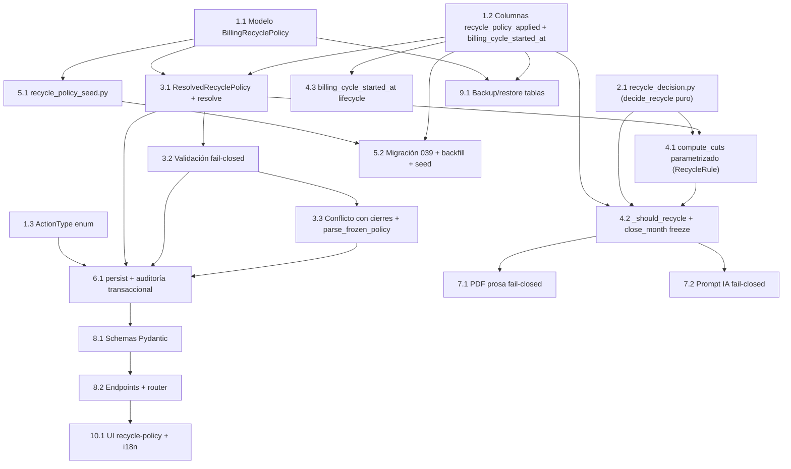

# Implementation Plan: Recycle Policy Config

## Overview

Plan de implementación incremental para hacer configurable la política de reciclaje del módulo Usage and Billing. La construcción va de abajo hacia arriba: primero los modelos y la migración (schema + backfill + seed), luego el servicio de resolución/validación y la función pura de decisión, después la integración en el motor de cierre y el ciclo de vida de `billing_cycle_started_at`, seguido de auditoría/seed, PDF/prompt IA, API, UI, backup/restore y finalmente los tests unitarios y property-based que cubren las 13 Correctness Properties.

Cada tarea se apoya en las anteriores, sin código huérfano: los símbolos nuevos se cablean a sus callers en el mismo bloque en que se introducen. Las subtareas marcadas con `*` son tests opcionales (no bloquean el MVP funcional), pero siguen incluidas en el Task Dependency Graph.

Stack: Python 3.12, FastAPI, SQLAlchemy, Alembic (env conda `alwaysprint`, SQLite con tipo `GUID` en tests); frontend Next.js 15 / TypeScript con next-intl.

## Task Dependency Graph



## Tasks

- [x] 1. Modelos de datos y enum de auditoría
  - [x] 1.1 Crear el modelo `BillingRecyclePolicy` en `app/models/billing.py`
    - Definir la clase `BillingRecyclePolicy(Base)` con `__tablename__ = "billing_recycle_policies"`, `id` GUID, `organization_id` GUID nullable (FK a `organizations.id` ondelete CASCADE, `NULL` = Global_Default), `cutoff_offset`/`cut1_offset`/`cut2_offset` Integer NOT NULL, `ephemeral_hours` Integer NOT NULL, `effective_from_year`/`effective_from_month`/`effective_key` Integer NOT NULL, `created_by_id`, `created_at`, `updated_at`
    - Añadir `CheckConstraint("effective_from_month BETWEEN 1 AND 12", name="ck_recycle_policy_month")` e `Index("ix_recycle_policy_scope_key", "organization_id", "effective_key")`
    - Reutilizar el tipo `GUID` del módulo (compat SQLite/PostgreSQL)
    - _Requirements: 1.1, 1.2, 2.1, 2.2, 3.1_

  - [x] 1.2 Añadir columnas `recycle_policy_applied` y `billing_cycle_started_at`
    - En `app/models/billing.py::BillingClosure` añadir `recycle_policy_applied = Column(JSON, nullable=False, server_default="{}")`
    - En `app/models/workstation.py::Workstation` añadir `billing_cycle_started_at = Column(DateTime, nullable=False, default=datetime.utcnow, server_default=text("CURRENT_TIMESTAMP"))`
    - _Requirements: 4.1, 4.4, 18.1_

  - [x] 1.3 Añadir `BILLING_RECYCLE_POLICY_CHANGE` al enum `ActionType`
    - En `app/models/audit.py` agregar `BILLING_RECYCLE_POLICY_CHANGE = "BILLING_RECYCLE_POLICY_CHANGE"` (etiqueta en MAYÚSCULA, mismo criterio que `BILLING_MODE_CHANGE`)
    - _Requirements: 9.1_

- [x] 2. Núcleo puro de decisión de reciclaje
  - [x] 2.1 Crear `app/services/recycle_decision.py` con `decide_recycle` puro
    - Definir `RecycleInputs` (`@dataclass frozen`) con exactamente los cinco insumos permitidos: `created_at`, `billing_cycle_started_at`, `last_seen` (crudo), `timezone`, `policy` (congelada)
    - Implementar `decide_recycle(inputs, year, month) -> bool`: Caso 2 abandono `last_seen < cut2`; Caso 1 poco uso `last_seen < cut1 AND (last_seen - billing_cycle_started_at) < ephemeral_hours*3600`; sin acceso a BD ni reloj de pared
    - La firma restringe los insumos a nivel de interfaz (no solo documentación)
    - _Requirements: 10.1, 10.3, 18.4_

  - [x] 2.2 Property test — decisión pura por tipo de uso con `+1/0/-1`
    - `# Feature: recycle-policy-config, Property 9: Comportamiento del reciclaje por tipo de uso con +1/0/-1`
    - Hypothesis, `@settings(max_examples=100)`; generar `created_at`/`billing_cycle_started_at`/`last_seen` coherentes; verificar secuencias `billable,recycled,recycled` (efímero) y `billable,billable,recycled` (normal), y `billable` en `M+x` con `x>2`
    - _Property: 9_ _Requirements: 13.1, 13.2, 14.1, 14.2, 18.4_

  - [x] 2.3 Property test — facturación garantizada en primer cierre
    - `# Feature: recycle-policy-config, Property 10: Facturación garantizada en el primer cierre`
    - _Property: 10_ _Requirements: 15.1, 15.2_

- [x] 3. Recycle_Policy_Service: resolución, validación y conflictos
  - [x] 3.1 Crear `app/services/recycle_policy_service.py` con `ResolvedRecyclePolicy` y `resolve_recycle_policy`
    - Definir `ResolvedRecyclePolicy` (`@dataclass frozen`: `cutoff`, `cut1`, `cut2`, `ephemeral_hours`, `source`, `policy_id`) con `freeze_dict()`; constante `LEGACY_POLICY`; excepción `RecyclePolicyResolutionError`; helper estático `period_key(year, month) = year*12 + (month-1)`
    - Implementar `resolve_recycle_policy(db, org, year, month)`: query Org_Override (`organization_id == org.id AND effective_key <= m_key`, orden `effective_key DESC`, tenant isolation) → fallback Global_Default (`organization_id IS NULL AND effective_key <= m_key`) → fallback `LEGACY_POLICY`; empate de `effective_key` en el tope aplicable ⇒ `RecyclePolicyResolutionError` sin mutar estado; ignorar por completo la fecha de ejecución
    - _Requirements: 2.3, 2.4, 2.5, 3.2, 3.3, 3.4, 3.5, 3.6, 3.7, 3.8_

  - [x] 3.2 Property test — resolución selecciona máximo effective_key con fallback
    - `# Feature: recycle-policy-config, Property 2: Resolución selecciona el máximo effective_key aplicable con fallback`
    - _Property: 2_ _Requirements: 2.3, 2.4, 3.2, 3.5, 3.6_

  - [x] 3.3 Property test — resolución independiente de la fecha de ejecución
    - `# Feature: recycle-policy-config, Property 3: Resolución es independiente de la fecha de ejecución`
    - _Property: 3_ _Requirements: 3.4, 10.1_

  - [x] 3.4 Property test — periodos efectivos duplicados se rechazan sin mutar estado
    - `# Feature: recycle-policy-config, Property 4: Periodos efectivos duplicados en el mismo scope se rechazan sin mutar estado`
    - _Property: 4_ _Requirements: 3.3_

  - [x] 3.5 Implementar validación fail-closed en `recycle_policy_service.py`
    - Definir `PolicyValidationError` (rule + message en español), `RecyclePolicyValidationException(errors: list)`, parseo de la Recycle_Rule string (`^[+-]\d+/[+-]\d+/[+-]\d+$`) y formateo `"+1/-2/-3"`
    - Implementar `validate_policy(cutoff, cut1, cut2, ephemeral_hours, eff_year, eff_month)` agregando TODAS las violaciones: formato, orden `cutoff > cut1 >= cut2`, `cutoff >= +1`, offset en `[-24,+1]`, ephemeral en `[1,168]`, periodo mes `[1,12]`/año `[2000,2999]`
    - _Requirements: 1.3, 1.4, 7.1, 7.2, 7.3, 7.4, 7.5, 7.7, 7.8, 7.9_

  - [x] 3.6 Property test — round-trip parse/format de la Recycle_Rule
    - `# Feature: recycle-policy-config, Property 1: Round-trip parse/format de la Recycle_Rule`
    - _Property: 1_ _Requirements: 1.3, 1.4_

  - [x] 3.7 Property test — validación fail-closed y un error por regla violada
    - `# Feature: recycle-policy-config, Property 7: Validación fail-closed rechaza políticas inválidas y preserva la previa`
    - `# Feature: recycle-policy-config, Property 8: Se reporta un error por cada regla violada` (test separado)
    - _Property: 7_ _Property: 8_ _Requirements: 7.1, 7.2, 7.3, 7.4, 7.5, 7.7, 7.8, 7.9_

  - [x] 3.8 Implementar `assert_no_closed_periods_affected` y `parse_frozen_policy`
    - `assert_no_closed_periods_affected(db, org_id_or_None, effective_key)`: para override, cierres de esa org con `period_key >= effective_key`; para global, cierres de orgs sin override propio vigente; si existe alguno ⇒ rechazar (fail-closed), no persistir, error identificando el conflicto
    - `parse_frozen_policy(raw) -> ResolvedRecyclePolicy`: valida presencia de claves `cutoff/cut1/cut2/ephemeral_hours` y tipos int; lanza `FrozenPolicyCorruptError` si falta o es inválido (freeze `{}` = corrupto)
    - _Requirements: 5.3, 11.4, 12.3_

  - [x] 3.9 Property test — cambio que afecta periodos ya cerrados se rechaza
    - `# Feature: recycle-policy-config, Property 6: Un cambio de política que afectaría periodos ya cerrados se rechaza y no se persiste`
    - _Property: 6_ _Requirements: 5.3_

- [x] 4. Integración en el motor de cierre y ciclo de vida de actividad
  - [x] 4.1 Parametrizar `compute_cuts` con `RecycleRule` en `app/services/billing_time.py`
    - Definir `RecycleRule(NamedTuple)` (`cutoff`, `cut1`, `cut2`); cambiar la firma a `compute_cuts(timezone_name, year, month, rule)` usando `_shift_month` con `rule.cutoff/cut1/cut2` (sin default silencioso)
    - Verificar que con `RecycleRule(1,-2,-3)` el resultado es byte-a-byte idéntico al actual
    - _Requirements: 4.1, 10.1_

  - [x] 4.2 Actualizar `_should_recycle` y `close_month` en `app/services/billing_close_service.py`
    - Reescribir `_should_recycle(ws, cuts, ephemeral_hours)` como adaptador que construye `RecycleInputs` desde la `Workstation` y delega en `decide_recycle`; eliminar la constante `_CASE1_MAX_USE_SECONDS`; medir uso como `last_seen - billing_cycle_started_at`
    - En `close_month`: resolver la política vía `recycle_policy_service.resolve_recycle_policy(db, org, year, month)` ANTES de `compute_cuts`, construir `RecycleRule`, pasar `policy.ephemeral_hours` a `_should_recycle`, y persistir `recycle_policy_applied=policy.freeze_dict()` en el `BillingClosure` (freeze inmutable)
    - _Requirements: 4.1, 4.2, 4.3, 5.1, 5.2, 10.2_

  - [x] 4.3 Property test — reproducibilidad e inmutabilidad del recálculo
    - `# Feature: recycle-policy-config, Property 5: Reproducibilidad e inmutabilidad del recálculo con política congelada`
    - Correr cierre mes a mes sobre SQLite en memoria, borrar cierres, resetear `billing_status='new'`, recalcular con la misma política congelada; verificar `billing_status` y `amount` idénticos y cierres previos byte-idénticos
    - _Property: 5_ _Requirements: 4.1, 4.3, 5.1, 5.2, 10.2_

  - [x] 4.4 Implementar ciclo de vida de `billing_cycle_started_at`
    - En `app/services/workstation.py`: inicializar `billing_cycle_started_at = created_at` al registrar la workstation (Req 18.2), sin tocar `created_at`
    - En `app/services/last_seen_tracker.py`: cambiar `_reactivate_if_needed(ws, ts)` para resetear `ws.billing_cycle_started_at = ts` SOLO en la transición `recycled`/`archived → billable`; propagar `ts` desde `mark_activity`; no tocar el campo en actividad normal ni modificar `created_at`
    - _Requirements: 18.2, 18.3, 18.5_

  - [x] 4.5 Property tests — inicialización, reset condicional e invariancia de created_at
    - `# Feature: recycle-policy-config, Property 11: billing_cycle_started_at se inicializa igual a created_at`
    - `# Feature: recycle-policy-config, Property 12: Reset condicional de billing_cycle_started_at solo en reactivación`
    - `# Feature: recycle-policy-config, Property 13: created_at es invariante ante reactivación`
    - _Property: 11_ _Property: 12_ _Property: 13_ _Requirements: 18.2, 18.3, 18.5_

- [x] 5. Checkpoint — asegurar que los tests del núcleo pasan
  - Ensure all tests pass, ask the user if questions arise.

- [x] 6. Seed y migración
  - [x] 6.1 Crear `app/services/recycle_policy_seed.py` (idempotente + atómico)
    - Definir `GLOBAL_DEFAULT` (`+1/-2/-3`, 24h, `2000-01`) y `BBVA_OVERRIDE` (`+1/0/-1`, 24h, `2026-09`); implementar `seed_recycle_policies(connection)` idempotente (no re-inserta si ya existe Global_Default); localizar BBVA por identificador estable (`name = 'BBVA'`) y omitir el override sin fallar si no existe la org
    - _Requirements: 16.1, 16.2, 16.3, 3.5_

  - [x] 6.2 Crear migración Alembic `039_add_recycle_policy.py` (`down_revision = "038"`)
    - `create_table` de `billing_recycle_policies` con índice `ix_recycle_policy_scope_key` y CheckConstraint del mes
    - `billing_cycle_started_at` en 3 pasos: ADD nullable → `UPDATE workstations SET billing_cycle_started_at = created_at` → SET NOT NULL + `server_default CURRENT_TIMESTAMP`
    - `recycle_policy_applied`: ADD (`NOT NULL server_default '{}'`) → backfill transaccional `UPDATE billing_closures SET recycle_policy_applied = '{"cutoff":1,"cut1":-2,"cut2":-3,"ephemeral_hours":24}' WHERE recycle_policy_applied = '{}' OR IS NULL`; abortar/revertir si queda alguna fila sin política válida
    - Invocar `seed_recycle_policies(op.get_bind())` y agregar la etiqueta `BILLING_RECYCLE_POLICY_CHANGE` al tipo `actiontype` (patrón de `037`); todo en la transacción de la migración; implementar `downgrade()` (drop columnas + tabla)
    - _Requirements: 6.1, 6.3, 16.1, 16.2, 16.3, 18.6, 9.1_

  - [x] 6.3 Tests de migración/seed/backfill (unit + integration)
    - Backfill legacy `+1/-2/-3`+24h (6.1/6.2); backfill atómico con fallo forzado revierte (6.3); seed idempotente correr 2× no duplica y fallo → rollback (16.1–16.3); `billing_cycle_started_at = created_at` en ws existentes (18.6)
    - _Requirements: 6.1, 6.2, 6.3, 16.1, 16.2, 16.3, 18.6_

- [x] 7. Persistencia con auditoría, PDF y prompt IA
  - [x] 7.1 Implementar persist con auditoría transaccional en `recycle_policy_service.py`
    - Implementar el upsert de política que: valida (`validate_policy`), chequea conflicto (`assert_no_closed_periods_affected`), calcula `effective_key`, y en la MISMA transacción inserta/actualiza la política y registra `AuditService().log_action(action_type=BILLING_RECYCLE_POLICY_CHANGE, ...)` con `old_values`/`new_values`, `organization_id` (o None=global) e identidad del usuario; si la auditoría falla ⇒ `db.rollback()` (fail-closed)
    - _Requirements: 9.1, 9.2, 9.3, 9.4, 9.5, 5.3, 7.9_

  - [x] 7.2 Tests de auditoría transaccional
    - Contenido old/new, org o global, usuario (9.1–9.4); fallo de auditoría → rollback del cambio (9.5)
    - _Requirements: 9.1, 9.2, 9.3, 9.4, 9.5_

  - [x] 7.3 PDF: describir la política congelada en prosa (fail-closed) en `app/services/closure_report_service.py`
    - En `compose_pdf`: al inicio llamar `parse_frozen_policy(header.recycle_policy_applied)` y abortar con error si falta/corrupta (sin generar PDF); añadir subsección en prosa que describe la Recycle_Rule `"+1/-2/-3"` y el significado de `cutoff`/`cut1`/`cut2` y `ephemeral_hours`, saneada con `_sanitize_latin1`; leer SIEMPRE el freeze, nunca la política vigente
    - _Requirements: 11.1, 11.2, 11.3, 11.4, 6.2_

  - [x] 7.4 Prompt IA: incluir la política congelada (fail-closed con degradación) en `closure_report_service.py`
    - En `build_ai_prompt`: validar el freeze vía `parse_frozen_policy`; si falta/corrupta, lanzar y fallar SOLO el AI_Analysis; añadir sección con la política congelada; el caller pasa `analysis=None` a `compose_pdf` (fail-safe "IA no disponible", el PDF se genera igual); no recalcular totales al regenerar
    - _Requirements: 12.1, 12.2, 12.3_

  - [x] 7.5 Tests de PDF y prompt IA fail-closed
    - PDF contiene la regla `"+1/-2/-3"` y las horas en prosa (11.1–11.3); freeze corrupto → aborta (11.4); prompt incluye política (12.1), regenerar no cambia totales (12.2), freeze corrupto → prompt falla pero PDF fail-safe (12.3)
    - _Requirements: 11.1, 11.2, 11.3, 11.4, 12.1, 12.2, 12.3_

- [x] 8. API de gestión de la política
  - [x] 8.1 Crear schemas Pydantic `RecyclePolicyIn`/`RecyclePolicyOut`
    - En `app/schemas/` definir `RecyclePolicyIn` (`rule` con `field_validator` que parsea 3 enteros con signo explícito, `ephemeral_hours` `[1,168]`, `effective_from_year` `[2000,2999]`, `effective_from_month` `[1,12]`) y `RecyclePolicyOut` (`id`, `scope`, `organization_id`, `rule` formateada `"+1/-2/-3"`, `ephemeral_hours`, `effective_from` `"AAAA-MM"`, `created_at`)
    - _Requirements: 1.4, 3.1, 7.1, 7.6, 17.4_

  - [x] 8.2 Crear `app/api/v1/endpoints/recycle_policy.py` y registrar el router
    - GET/PUT `/billing/recycle-policy/global` y GET/PUT `/billing/recycle-policy/org/{organization_id}`, todos con `require_superadmin`; la API valida el schema y luego invoca al servicio que re-valida (doble capa) y persiste; devolver lista explícita de errores por regla; registrar el router en `app/api/v1/router.py` (junto a `billing_closures`, prefix `/billing`)
    - _Requirements: 8.1, 8.2, 17.1, 17.2, 17.3, 17.5, 2.5, 7.6_

  - [x] 8.3 Integration tests de endpoints y permisos
    - GET/PUT global y org con Superadmin (200) y sin rol (403) — Req 8, 17; formato de salida `"+1/-2/-3"` y `effective_from` `"AAAA-MM"` (17.4); errores por regla en respuesta de validación (17.5)
    - _Requirements: 8.1, 8.2, 17.1, 17.2, 17.4, 17.5_

- [x] 9. Backup/restore y UI
  - [x] 9.1 Incluir `billing_recycle_policies` en backup y restore
    - Añadir `("billing_recycle_policies", BillingRecyclePolicy)` a la lista de tablas de `app/services/backup_service.py` y `app/services/restore_service.py` (respetando el orden de FK: después de `organizations`/`users`); verificar que `workstations.billing_cycle_started_at` y `billing_closures.recycle_policy_applied` viajan en los dumps por modelo
    - _Requirements: 18.7, 4.4_

  - [x] 9.2 Test de backup/restore de las columnas y tabla nuevas
    - Verificar que un round-trip backup→restore preserva `billing_cycle_started_at`, `recycle_policy_applied` y las filas de `billing_recycle_policies`
    - _Requirements: 18.7, 4.4_

  - [x] 9.3 Crear la página `app/dashboard/admin/recycle-policy` (solo Superadmin) con i18n
    - Página Next.js/TS estricto visible solo a Superadmin (guard de rol como las páginas admin existentes): sección Global_Default (regla `"+1/-2/-3"` + horas, formulario), sección Org_Override (selector de org + tabla con `effective_from` AAAA-MM); mostrar errores por regla devueltos por la API sin rechazo silencioso; textos vía next-intl en `es.json` y `en.json`; componentes de `components/ui/`
    - _Requirements: 8.3, 17.4, 17.5_

- [x] 10. Checkpoint final — asegurar que todos los tests pasan
  - Ensure all tests pass, ask the user if questions arise.

## Notes

- Las subtareas marcadas con `*` son tests (unit, property-based con Hypothesis, integration) y pueden posponerse para un MVP más rápido, pero cubren las 13 Correctness Properties y los comportamientos fail-closed.
- Cada property test usa Hypothesis con `@settings(max_examples=100)` (mínimo 100 iteraciones) y el tag `# Feature: recycle-policy-config, Property N: <nombre>`.
- Cobertura de requisitos: R1 (1.1,3.5,8.1), R2 (1.1,3.1), R3 (1.1,3.1,6.2), R4 (1.2,4.2,7.3), R5 (3.8,4.2,7.1), R6 (6.2,7.3), R7 (3.5,8.1,8.2), R8 (8.2,9.3), R9 (1.3,7.1), R10 (2.1,4.1,4.2), R11 (7.3), R12 (7.4), R13/R14/R15 (2.1,2.2,2.3), R16 (6.1,6.2), R17 (8.1,8.2,9.3), R18 (1.2,4.4,6.2,9.1).
- Cobertura de properties: P1 (3.6), P2 (3.2), P3 (3.3), P4 (3.4), P5 (4.3), P6 (3.9), P7/P8 (3.7), P9 (2.2), P10 (2.3), P11/P12/P13 (4.5).

## Task Dependency Graph

```json
{
  "waves": [
    { "id": 0, "tasks": ["1.1", "1.3", "2.1"] },
    { "id": 1, "tasks": ["1.2", "2.2", "2.3"] },
    { "id": 2, "tasks": ["3.1", "4.1"] },
    { "id": 3, "tasks": ["3.2", "3.3", "3.4", "3.5"] },
    { "id": 4, "tasks": ["3.6", "3.7", "3.8", "4.4"] },
    { "id": 5, "tasks": ["3.9", "4.2", "4.5", "6.1"] },
    { "id": 6, "tasks": ["4.3", "6.2", "7.1", "9.1"] },
    { "id": 7, "tasks": ["6.3", "7.2", "7.3", "7.4", "9.2"] },
    { "id": 8, "tasks": ["7.5", "8.1"] },
    { "id": 9, "tasks": ["8.2"] },
    { "id": 10, "tasks": ["8.3", "9.3"] }
  ]
}
```
