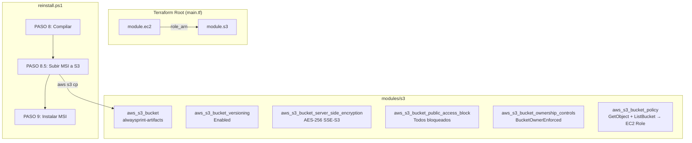

# Documento de Diseño: Almacenamiento S3 para MSI

## Overview

Este diseño describe la implementación de un módulo Terraform para provisionar un bucket S3 seguro (`alwaysprint-artifacts`) y la modificación del script `reinstall.ps1` para subir automáticamente el MSI compilado al bucket. La arquitectura sigue el patrón modular existente del proyecto Terraform y se integra como un nuevo paso (PASO 8.5) entre la compilación y la instalación.

### Decisiones de Diseño

1. **Nombre de bucket hardcodeado**: `alwaysprint-artifacts` se define como local en el módulo, no como variable, ya que es un nombre fijo del proyecto.
2. **Sin nuevas variables en terraform.tfvars**: El módulo S3 reutiliza `project_name` y `environment` existentes, y obtiene el ARN del rol EC2 directamente del output del módulo EC2.
3. **Bucket policy (no IAM policy)**: Se usa una bucket policy para otorgar acceso de lectura al rol EC2, manteniendo los permisos del bucket autocontenidos en el módulo S3.
4. **Nuevo output en módulo EC2**: Se agrega `role_arn` al módulo EC2 para pasar el ARN al módulo S3.

## Architecture



## Components and Interfaces

### Componente 1: Módulo Terraform S3 (`modules/s3/`)

#### Archivos

| Archivo | Propósito |
|---------|-----------|
| `modules/s3/main.tf` | Recursos del bucket S3, políticas y configuración |
| `modules/s3/variables.tf` | Variables de entrada del módulo |
| `modules/s3/outputs.tf` | Outputs del módulo (nombre y ARN del bucket) |

#### Variables de Entrada

| Variable | Tipo | Descripción |
|----------|------|-------------|
| `project_name` | `string` | Nombre del proyecto (para tags) |
| `environment` | `string` | Ambiente de despliegue (para tags) |
| `ec2_role_arn` | `string` | ARN del rol IAM del EC2 para la bucket policy |

#### Outputs

| Output | Valor | Descripción |
|--------|-------|-------------|
| `bucket_name` | `aws_s3_bucket.artifacts.id` | Nombre del bucket |
| `bucket_arn` | `aws_s3_bucket.artifacts.arn` | ARN del bucket |

### Componente 2: Output adicional en módulo EC2

Se agrega un nuevo output `role_arn` en `modules/ec2/outputs.tf`:

```hcl
output "role_arn" {
  description = "ARN del rol IAM asignado al EC2"
  value       = aws_iam_role.ec2.arn
}
```

### Componente 3: Integración en Root Module

Invocación del módulo S3 en `main.tf` raíz:

```hcl
module "s3" {
  source       = "./modules/s3"
  project_name = var.project_name
  environment  = var.environment
  ec2_role_arn = module.ec2.role_arn

  depends_on = [module.ec2]
}
```

Outputs adicionales en `outputs.tf` raíz:

```hcl
output "s3_bucket_name" {
  description = "Nombre del bucket S3 de artefactos MSI"
  value       = module.s3.bucket_name
}

output "s3_bucket_arn" {
  description = "ARN del bucket S3 de artefactos MSI"
  value       = module.s3.bucket_arn
}
```

### Componente 4: PASO 8.5 en `reinstall.ps1`

Nuevo bloque PowerShell insertado entre PASO 8 (compilación) y PASO 9 (instalación):

```powershell
# PASO 8.5: Subir MSI a S3
Write-Step "`nPASO 8.5: Subiendo MSI al bucket S3..." "Info"
if ($hasChanges -and (Test-Path $msiPath)) {
    Write-Step "Preparando subida al bucket S3..." "Info"
    $s3Destination = "s3://alwaysprint-artifacts/latest/AlwaysPrint.msi"
    $buildDate = Get-Date -Format "yyyy-MM-ddTHH:mm:ssZ"
    $shortCommit = $afterCommit.Substring(0, 7)
    $metadata = "version=$shortCommit,build-date=$buildDate,commit-hash=$afterCommit"

    try {
        Write-Step "Destino: $s3Destination" "Info"
        Write-Step "Metadata: version=$shortCommit, build-date=$buildDate" "Info"
        $s3Output = aws s3 cp $msiPath $s3Destination --metadata $metadata 2>&1
        if ($LASTEXITCODE -ne 0) {
            throw "aws s3 cp fallo con codigo $LASTEXITCODE`: $s3Output"
        }
        Write-Step "MSI subido exitosamente a S3" "Success"
    } catch {
        Write-Step "Error al subir MSI a S3: $($_.Exception.Message)" "Warning"
        $respuesta = Read-Host "¿Desea continuar con la instalacion? (S/N)"
        if ($respuesta -notin @("S", "s", "Si", "si", "SI")) {
            throw "Instalacion abortada por el usuario tras fallo de subida a S3"
        }
        Write-Step "Continuando sin subida a S3 por decision del usuario..." "Warning"
    }
} else {
    if (-not $hasChanges) {
        Write-Step "Omitiendo subida a S3 (sin cambios detectados)" "Info"
    } else {
        Write-Step "Omitiendo subida a S3 (MSI no encontrado)" "Warning"
    }
}
```

## Data Models

### Estructura del Bucket S3

```
alwaysprint-artifacts/
└── latest/
    └── AlwaysPrint.msi          # Última versión compilada
        metadata:
          version: "abc1234"     # Short commit hash (7 chars)
          build-date: "2026-05-20T14:30:00Z"  # ISO 8601
          commit-hash: "abc1234..."            # Full SHA
```

### Recursos Terraform del Módulo S3

```hcl
# modules/s3/main.tf

locals {
  # Nombre fijo del bucket — no se parametriza
  bucket_name = "alwaysprint-artifacts"
}

resource "aws_s3_bucket" "artifacts" {
  bucket = local.bucket_name

  tags = {
    Name        = local.bucket_name
    Project     = var.project_name
    Environment = var.environment
  }
}

resource "aws_s3_bucket_versioning" "artifacts" {
  bucket = aws_s3_bucket.artifacts.id
  versioning_configuration {
    status = "Enabled"
  }
}

resource "aws_s3_bucket_server_side_encryption_configuration" "artifacts" {
  bucket = aws_s3_bucket.artifacts.id
  rule {
    apply_server_side_encryption_by_default {
      sse_algorithm = "AES256"
    }
  }
}

resource "aws_s3_bucket_public_access_block" "artifacts" {
  bucket                  = aws_s3_bucket.artifacts.id
  block_public_acls       = true
  block_public_policy     = true
  ignore_public_acls      = true
  restrict_public_buckets = true
}

resource "aws_s3_bucket_ownership_controls" "artifacts" {
  bucket = aws_s3_bucket.artifacts.id
  rule {
    object_ownership = "BucketOwnerEnforced"
  }
}

resource "aws_s3_bucket_policy" "artifacts" {
  bucket = aws_s3_bucket.artifacts.id

  policy = jsonencode({
    Version = "2012-10-17"
    Statement = [
      {
        Sid       = "PermitirLecturaEC2"
        Effect    = "Allow"
        Principal = { AWS = var.ec2_role_arn }
        Action    = ["s3:GetObject"]
        Resource  = "${aws_s3_bucket.artifacts.arn}/*"
      },
      {
        Sid       = "PermitirListadoEC2"
        Effect    = "Allow"
        Principal = { AWS = var.ec2_role_arn }
        Action    = ["s3:ListBucket"]
        Resource  = aws_s3_bucket.artifacts.arn
      }
    ]
  })
}
```

## Error Handling

### Terraform

- Si el bucket ya existe (nombre global ocupado), `terraform apply` fallará con error claro de AWS. No se requiere manejo especial ya que el nombre es fijo y propio del proyecto.
- El `depends_on` en el módulo S3 garantiza que el rol EC2 exista antes de crear la bucket policy, evitando errores de referencia a ARN inexistente.

### PowerShell (PASO 8.5)

| Escenario | Comportamiento |
|-----------|---------------|
| Compilación exitosa + MSI existe | Intenta subir a S3 |
| Subida exitosa | Continúa a PASO 9 |
| Subida falla (error AWS CLI) | Muestra warning, pregunta al usuario si continuar |
| Usuario responde "S" | Continúa a PASO 9 sin subida |
| Usuario responde "N" | Lanza excepción, script termina en bloque catch |
| Sin cambios ($hasChanges = $false) | Omite subida, log informativo |
| MSI no encontrado | Omite subida, log de advertencia |

### Prerrequisitos de AWS CLI

El PASO 8.5 asume que:
- AWS CLI está instalado en la workstation
- Las credenciales AWS están configuradas (perfil default o variables de entorno)
- El usuario/rol que ejecuta el script tiene permisos `s3:PutObject` en el bucket

## Testing Strategy

### Por qué NO se aplica Property-Based Testing

Esta feature es exclusivamente Infrastructure as Code (Terraform) y scripting procedural (PowerShell). No hay funciones puras con input/output variable que justifiquen PBT:

- **Terraform**: Es configuración declarativa. Se valida con `terraform validate` y `terraform plan`.
- **PowerShell**: El PASO 8.5 es una operación de side-effect (subir archivo a S3) con flujo condicional simple.

### Estrategia de Validación

| Componente | Método de Validación |
|------------|---------------------|
| Módulo S3 (Terraform) | `terraform validate`, `terraform plan`, inspección manual del plan |
| Integración root module | `terraform plan` completo para verificar dependencias |
| PASO 8.5 (PowerShell) | Ejecución manual en workstation con verificación de bucket |
| Bucket policy | Verificar acceso desde EC2 con `aws s3 ls s3://alwaysprint-artifacts/` |

### Validaciones Manuales Post-Deploy

1. **Terraform**: Ejecutar `terraform apply` y verificar que el bucket se crea con todas las configuraciones.
2. **Script**: Ejecutar `reinstall.ps1` en una workstation con cambios pendientes y verificar que el MSI aparece en S3.
3. **Acceso EC2**: Desde la instancia EC2, ejecutar `aws s3 ls s3://alwaysprint-artifacts/latest/` para confirmar acceso de lectura.
4. **Metadata**: Verificar metadata del objeto con `aws s3api head-object --bucket alwaysprint-artifacts --key latest/AlwaysPrint.msi`.

## Notes

- El bucket `alwaysprint-artifacts` es global en AWS. Si el nombre está ocupado, se deberá elegir un nombre alternativo (ej: `alwaysprint-artifacts-prod`).
- El script asume que la workstation donde se ejecuta `reinstall.ps1` tiene permisos de escritura al bucket (credenciales del desarrollador, no del EC2).
- El EC2 solo necesita lectura (para futuras descargas desde workstations remotas vía el backend).
