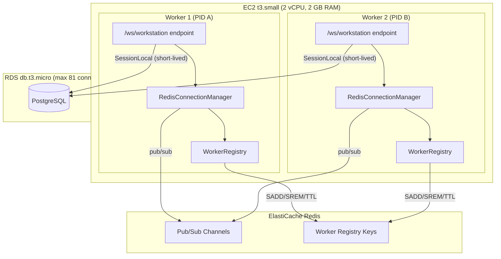
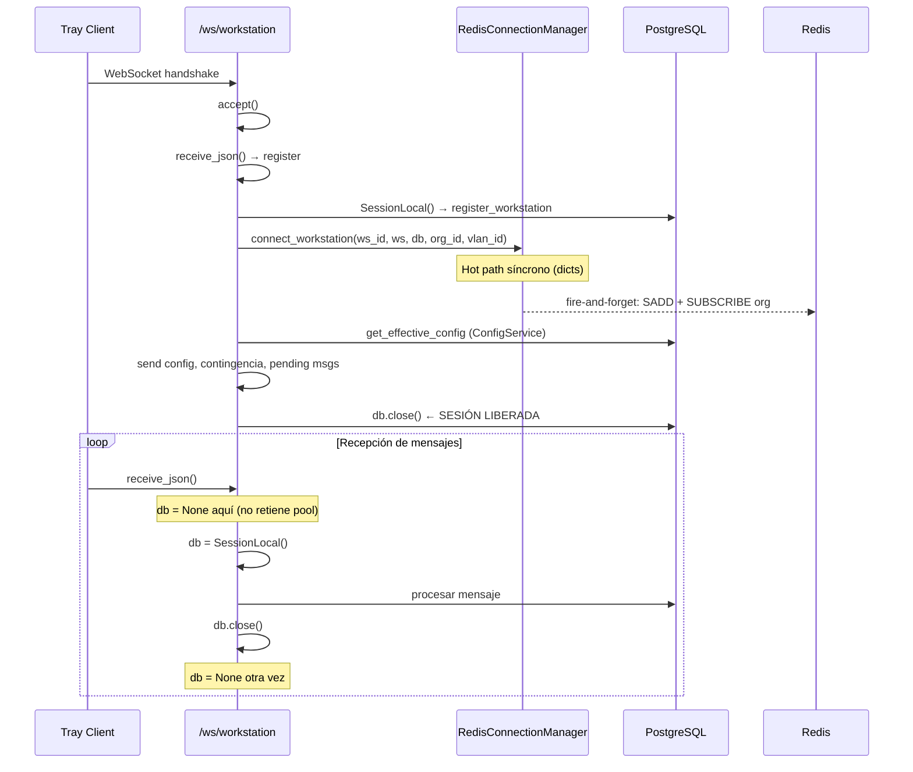

# Design Document: stable-multi-worker-redis

## Overview

Este diseño describe cómo activar el modo multi-worker (2 uvicorn workers) coordinados vía Redis pub/sub, reutilizando el `RedisConnectionManager` y `WorkerRegistry` ya implementados, sin introducir el `RegistrationCache` que causó exhaustión del pool de conexiones PostgreSQL.

La estrategia central es:
1. Convertir `websocket_manager.py` en un **factory** condicional que instancia `RedisConnectionManager` o `ConnectionManager` según `REDIS_URL`.
2. Mantener el patrón de **sesiones cortas** (SessionLocal) en el endpoint WebSocket, cerrándolas antes de cada `await`.
3. Añadir un **lint guard** que impida importar `RegistrationCache` en archivos del flujo WebSocket.
4. Configurar el pool de BD para operar dentro de los límites de RDS db.t3.micro (81 conexiones max).

El RedisConnectionManager ya implementa: canales consolidados (`worker:{id}`, `org:{org_id}`, `global:broadcast`), fire-and-forget connect, lazy org subscribe/unsubscribe, exponential backoff de reconexión, y tenant isolation. Este diseño NO modifica su lógica interna — solo lo conecta al resto del sistema.

## Architecture



### Flujo de una conexión WebSocket



## Components and Interfaces

### 1. Factory en websocket_manager.py

El módulo `websocket_manager.py` se convierte en un factory que selecciona el manager según configuración:

```python
# websocket_manager.py
from app.core.config import settings

if settings.REDIS_URL:
    from app.services.redis_connection_manager import RedisConnectionManager
    connection_manager = RedisConnectionManager(redis_url=settings.REDIS_URL)
else:
    from app.services.websocket_manager_impl import ConnectionManager
    connection_manager = ConnectionManager()
```

**Nota**: El `ConnectionManager` actual se mueve a un módulo interno (`websocket_manager_impl.py` o se mantiene en el mismo archivo con el factory al final). El import público sigue siendo `from app.services.websocket_manager import connection_manager`.

### 2. Interfaz pública compartida

Ambos managers DEBEN implementar estos métodos (duck typing):

| Método | Firma |
|--------|-------|
| `connect_workstation` | `(workstation_id, websocket, db, organization_id, vlan_id=None)` |
| `disconnect_workstation` | `(workstation_id, db, websocket=None)` |
| `send_to_workstation` | `(workstation_id, message) → bool` |
| `send_direct_to_workstation` | `(workstation_id, message) → bool` |
| `broadcast_to_organization` | `(organization_id, message, db)` |
| `handle_pong` | `(workstation_id)` |
| `update_last_activity` | `(workstation_id)` |
| `start_ping_loop` | `(db_session_factory)` |
| `stop_ping_loop` | `()` |
| `graceful_shutdown_workstations` | `(reason)` |
| `get_online_workstations` | `() → List[str]` |
| `get_online_operators` | `() → List[str]` |
| `get_connection_count` | `() → dict` |
| `register_command_waiter` | `(command_id) → Event` |
| `resolve_command_response` | `(command_id, response) → bool` |
| `wait_for_command_response` | `(command_id, timeout) → Optional[dict]` |
| `connect_operator` | `(user_id, websocket)` |
| `disconnect_operator` | `(user_id, websocket)` |
| `send_to_operator` | `(user_id, message)` |
| `broadcast_to_all_operators` | `(message)` |

### 3. Adaptación de connect_workstation en el endpoint

El endpoint `workstation.py` ya tiene la llamada:
```python
await connection_manager.connect_workstation(
    workstation_id=workstation_id,
    websocket=websocket,
    db=db,
    organization_id=str(workstation.organization_id)
)
```

Se debe añadir `vlan_id`:
```python
await connection_manager.connect_workstation(
    workstation_id=workstation_id,
    websocket=websocket,
    db=db,
    organization_id=str(workstation.organization_id),
    vlan_id=str(workstation.vlan_id) if workstation.vlan_id else None
)
```

El `ConnectionManager` actual necesita aceptar `vlan_id` como parámetro (lo ignora en modo single-worker).

### 4. Inicialización en lifespan

```python
@asynccontextmanager
async def lifespan(app: FastAPI):
    # ... (SQLite init, scalability_collector) ...
    
    # Inicializar Redis si el manager lo requiere
    if hasattr(connection_manager, 'initialize'):
        await connection_manager.initialize()
    
    # Iniciar ping loop
    ping_task = asyncio.create_task(
        connection_manager.start_ping_loop(SessionLocal)
    )
    
    yield
    
    # Shutdown
    await connection_manager.graceful_shutdown_workstations(
        reason="Servidor reiniciando (deploy/reciclaje)"
    )
    connection_manager.stop_ping_loop()
    ping_task.cancel()
    # ...
```

### 5. Lint guard para RegistrationCache

Un test de importaciones prohibidas que se ejecuta en CI:

```python
# tests/test_import_ban.py
"""Verifica que RegistrationCache no se importa en el flujo WebSocket."""

BANNED_IMPORT = "registration_cache"
WS_FLOW_FILES = [
    "app/api/v1/websocket/workstation.py",
    "app/api/v1/websocket/operator.py",
    "app/services/websocket_manager.py",
    "app/services/redis_connection_manager.py",
    "app/services/worker_registry.py",
]

def test_no_registration_cache_in_ws_flow():
    for filepath in WS_FLOW_FILES:
        content = Path(filepath).read_text()
        assert BANNED_IMPORT not in content, (
            f"PROHIBIDO: {filepath} importa o referencia '{BANNED_IMPORT}'. "
            f"Usar ConfigService + queries inline en su lugar."
        )
```

### 6. Configuración de settings

Nuevas variables de entorno a añadir en `config.py`:

```python
# === CONFIGURACIÓN MULTI-WORKER ===
UVICORN_WORKERS: int = 1
WORKER_REGISTRY_TTL: int = 60  # segundos
WS_REDIS_RECONNECT_MAX_INTERVAL: int = 30  # segundos (backoff cap)
```

Con validador:
```python
@model_validator(mode="after")
def _validate_multi_worker(self) -> "Settings":
    if self.UVICORN_WORKERS > 1 and not self.REDIS_URL:
        raise ValueError(
            "REDIS_URL es requerido cuando UVICORN_WORKERS > 1. "
            "Multi-worker necesita Redis para coordinación inter-worker."
        )
    return self
```

## Data Models

No se introducen nuevos modelos de BD. Los datos relevantes ya existen:

### Redis Keys (esquema consolidado existente)

| Key Pattern | Type | TTL | Propósito |
|-------------|------|-----|-----------|
| `workers:{worker_id}:workstations` | SET | WORKER_REGISTRY_TTL (60s) | Workstation IDs en este worker |
| `workers:{worker_id}:heartbeat` | STRING | WORKER_REGISTRY_TTL (60s) | Indicador de worker vivo |

### Redis Pub/Sub Channels

| Channel | Publisher | Subscriber |
|---------|-----------|------------|
| `worker:{worker_id}` | Cualquier worker (mensajes dirigidos + cmd_response) | El worker owner |
| `org:{org_id}` | Worker que origina broadcast org | Workers con WS de esa org |
| `global:broadcast` | Cualquier worker | Todos los workers |

### Pool de conexiones PostgreSQL

| Parámetro | Valor | Cálculo |
|-----------|-------|---------|
| DB_POOL_SIZE | 20 | Por worker |
| DB_MAX_OVERFLOW | 10 | Por worker |
| Max por worker | 30 | pool_size + max_overflow |
| Max total (2 workers) | 60 | 2 × 30 |
| RDS max_connections | 81 | db.t3.micro |
| Margen libre | 21 | Para Alembic, admin, monitoring |

## Correctness Properties

*A property is a characteristic or behavior that should hold true across all valid executions of a system — essentially, a formal statement about what the system should do. Properties serve as the bridge between human-readable specifications and machine-verifiable correctness guarantees.*

### Property 1: Interface compliance

*For any* method name in the required public interface list (connect_workstation, disconnect_workstation, send_to_workstation, broadcast_to_organization, handle_pong, update_last_activity, start_ping_loop, stop_ping_loop, graceful_shutdown_workstations, get_online_workstations, get_connection_count, register_command_waiter, resolve_command_response, wait_for_command_response, connect_operator, disconnect_operator, send_to_operator, broadcast_to_all_operators, get_online_operators, send_direct_to_workstation), both ConnectionManager and RedisConnectionManager SHALL have that name as a callable attribute.

**Validates: Requirements 1.4, 10.3**

### Property 2: RegistrationCache import ban

*For any* Python source file in the WebSocket flow (workstation.py, operator.py, websocket_manager.py, redis_connection_manager.py, worker_registry.py), the file content SHALL NOT contain the string "registration_cache" as an import or reference.

**Validates: Requirements 3.3, 3.4**

### Property 3: Session lifecycle — no DB held during WebSocket await

*For any* connected workstation processing a sequence of N messages in the loop, immediately before each call to `await websocket.receive_json()` and immediately after processing each message (before the next loop iteration), the database session variable SHALL be None (closed).

**Validates: Requirements 4.1, 4.2, 4.3**

### Property 4: Pool sizing constraint

*For any* valid deployment configuration, `UVICORN_WORKERS × (DB_POOL_SIZE + DB_MAX_OVERFLOW)` SHALL be less than or equal to `RDS_MAX_CONNECTIONS - RESERVED_CONNECTIONS` (where RESERVED_CONNECTIONS = 21 for admin/monitoring).

**Validates: Requirements 5.5**

### Property 5: Multi-worker requires Redis URL

*For any* integer value of UVICORN_WORKERS greater than 1, if REDIS_URL is None or empty, the Settings validation SHALL raise a ValueError preventing startup.

**Validates: Requirements 2.2**

## Error Handling

### Redis no disponible al startup

- `RedisConnectionManager.initialize()` captura `ConnectionError`/`TimeoutError`
- Loguea warning y opera en modo local (fallback graceful)
- Inicia reconnect loop en background con exponential backoff (1s→30s)
- Las workstations se conectan y operan normalmente sin coordinación inter-worker

### Redis se desconecta durante operación

- El `_redis_listener` detecta la excepción, marca `_redis_available = False`
- Inicia `_handle_redis_reconnect()` en background
- Durante la desconexión:
  - Entregas locales siguen funcionando
  - Mensajes cross-worker se pierden silenciosamente (log warning)
  - `broadcast_to_organization` solo entrega a WS locales
- Al reconectar: re-suscribe canales, re-registra workstations en WorkerRegistry

### Pool de BD agotado

- `DB_POOL_TIMEOUT=30`: si no hay conexión disponible en 30s, SQLAlchemy lanza `TimeoutError`
- El endpoint captura la excepción en el loop y envía error al cliente
- La sesión corta (crear → usar → cerrar) minimiza el tiempo de retención
- El batch disconnect (3s delay) agrupa desconexiones masivas en un solo UPDATE

### Worker crashea (sin graceful shutdown)

- El heartbeat key en Redis expira tras `WORKER_REGISTRY_TTL` (60s)
- Otros workers detectan que el SET de workstations expiró
- Workstations reconnectan al Nginx upstream, que las enruta a un worker vivo
- El worker vivo ejecuta limpieza inicial al arrancar: marca offline a fantasmas

### Errores en el flujo WebSocket

- Toda excepción no esperada en el loop se captura en el `except Exception` externo
- El `finally` block siempre ejecuta `disconnect_workstation` y cierra la sesión temporal
- Si el DB close falla, se loguea y continúa (no se re-lanza)

## Testing Strategy

### Property-Based Tests (Hypothesis)

Se usará **Hypothesis** (ya instalado y en uso en el proyecto) para los 5 correctness properties:

| Property | Iteraciones | Generador principal |
|----------|-------------|---------------------|
| Interface compliance | 100 | `st.sampled_from(REQUIRED_METHODS)` |
| Import ban | 100 | `st.sampled_from(WS_FLOW_FILES)` |
| Session lifecycle | 100 | Secuencias de mensajes `st.lists(st.sampled_from(MSG_TYPES))` |
| Pool sizing | 100 | `st.integers(min_value=1, max_value=10)` para workers, pool_size, overflow |
| Multi-worker requires Redis | 100 | `st.integers(min_value=2, max_value=16)` para workers |

Cada test tendrá un tag comment:
```python
# Feature: stable-multi-worker-redis, Property N: {property_text}
```

Configuración: `@settings(max_examples=100)`

### Unit Tests (pytest)

- Factory selection: 2 tests (con/sin REDIS_URL)
- Lifespan initialize(): 1 test (mock RedisConnectionManager)
- vlan_id propagation en connect_workstation: 1 test
- ConnectionManager acepta vlan_id sin error: 1 test

### Integration Tests (load-test.py existente)

- 1000 WS simultáneas (500/worker): verificar P95 < 500ms
- Verificar `pg_stat_activity` durante carga: 0 idle-in-transaction > 5s
- Verificar RSS < 1.5 GB con 2 workers

### Existing Property Tests

Los 15 property tests de `redis-pubsub-channel-consolidation` deben seguir pasando sin modificación:
- `test_subscription_count_invariant.py` (3 tests)
- `test_lazy_org_subscribe.py` (3 tests)
- `test_pubsub_lifecycle_symmetry.py` (3 tests)
- `test_message_routing_channel.py` (3 tests)
- `test_fire_and_forget_resilience.py` (1 test)
- `test_worker_registry_lifecycle.py` (4 tests — incluye heartbeat + TTL)

Otros tests relacionados que deben seguir pasando:
- `test_graceful_fallback_redis_unavailable.py`
- `test_in_memory_mode_without_redis.py`
- `test_local_delivery_matching.py`
- `test_ping_loop_isolation.py`
- `test_tenant_isolation.py`
- `test_tenant_isolation_command_delivery.py`
- `test_worker_independent_registration.py`
