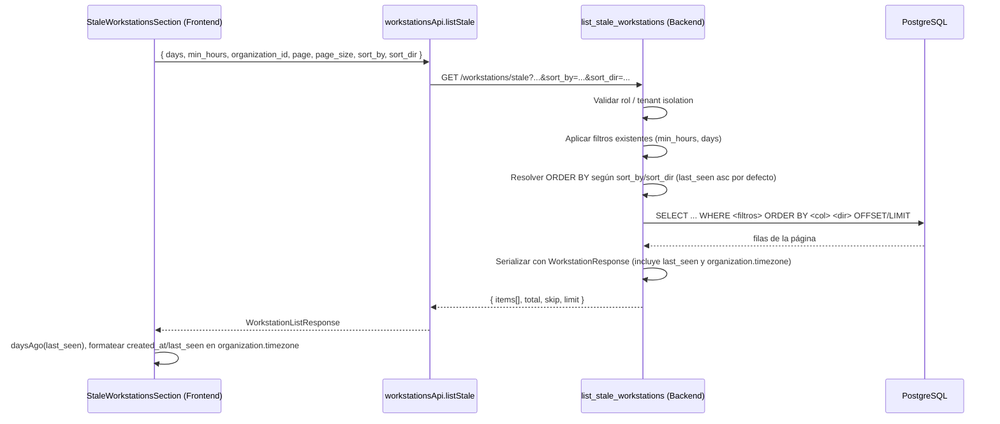

# Design Document

## Overview

Este diseño aborda la corrección y mejora del reporte de **Estaciones IP Inactivas** (`StaleWorkstationsSection`) en AlwaysPrint Cloud. El cambio tiene una **naturaleza dual**:

1. **Fix de datos de solo lectura (causa raíz).** La columna "Días inactiva" siempre muestra `0d` porque el backend calcula la antigüedad con `last_seen` (migración 036, columna real de actividad), pero el schema de respuesta `WorkstationResponse` **no expone** `last_seen`. El frontend, al no recibir ese campo, cae a `updated_at` — que se actualiza con cualquier cambio de registro (`onupdate=datetime.utcnow`) y por eso vale "casi ahora", dejando la antigüedad en cero. La solución raíz es **exponer `last_seen` de forma aditiva** en el backend (`WorkstationResponse`) y en el tipo del frontend (`Workstation`), y usarlo tanto para calcular "Días inactiva" como para la columna "Última conexión".

2. **Mejoras de servidor y de presentación.** Ordenamiento server-side por cualquier columna sobre el dataset completo (antes de paginar), presentación de fecha **y hora** convertida a la **zona horaria de la organización** (no la del navegador), paginación no tapada por el FAB de información, resaltado de estaciones críticas (≥ 180 días), y internacionalización de todos los textos nuevos.

### Alineación con la regla de análisis de impacto

- **No se modifica ni se debilita la lógica de filtrado existente** del backend (`last_seen - created_at > min_hours*3600` Y `last_seen < now - days`). El ordenamiento se añade **después** de aplicar los filtros y **antes** de la paginación.
- El cambio de `last_seen` es **aditivo**: `WorkstationResponse` y `Workstation` conservan todos sus campos actuales (incluido `updated_at`), sin renombrar ni eliminar nada.
- Se preserva el **aislamiento por inquilino**: operador solo su organización; administrador puede filtrar por organización.
- **No hay migración de base de datos**: la columna `last_seen` ya existe (migración 036, `NOT NULL`, `server_default CURRENT_TIMESTAMP`).

## Architecture

### Flujo del request `/workstations/stale` con ordenamiento server-side



Puntos clave del flujo:

- El **ORDER BY se aplica antes** de `offset`/`limit`, de modo que el ordenamiento es sobre el **dataset completo filtrado**, no sobre la página visible (Req 8.10).
- El backend **serializa `last_seen`** en cada item, y el frontend ya recibe `organization.timezone` porque `OrganizationBasicResponse` incluye `timezone` (Req 1, 6).
- El frontend, al cambiar columna o dirección de ordenamiento, **reinicia a la página 1** y reenvía `sort_by`/`sort_dir` (Req 8.13).

### Nota sobre la carga de la relación `organization`

El endpoint actual serializa con `WorkstationResponse.from_orm(w)` sin `joinedload(Workstation.organization)`. Como la presentación de fechas depende de `organization.timezone`, el diseño requiere **eager-load de la organización** (`joinedload`) en la consulta base para evitar N+1 y garantizar que `timezone` viaje en cada item. Esto es aditivo y no altera filtros.

### Archivos afectados

| Capa | Archivo | Cambio |
|---|---|---|
| Backend | `app/schemas/workstation.py` | Añadir `last_seen: datetime` a `WorkstationResponse` (aditivo). |
| Backend | `app/api/v1/endpoints/workstations.py` (`list_stale_workstations`) | Añadir params `sort_by`/`sort_dir`, mapear a ORDER BY, eager-load `organization`. Preservar filtros y tenant isolation. |
| Frontend | `src/types/workstation.ts` (`Workstation`) | Añadir `last_seen: string` (aditivo). |
| Frontend | `src/lib/api.ts` (`workstationsApi.listStale`) | Añadir `sort_by`/`sort_dir` opcionales a los params. |
| Frontend | `src/components/config/StaleWorkstationsSection.tsx` | Usar `last_seen` para días/última conexión; formateo fecha+hora en timezone de la org; estado de sort; headers clicables; fix de paginación; resaltado ≥180d; tooltip de "actividad mínima". |
| i18n | `messages/es.json`, `messages/en.json` (namespace `config`) | Claves nuevas de ayuda, encabezados/indicadores de sort, etc. |

**No hay migración de base de datos.**

## Components and Interfaces

### Backend — Endpoint `list_stale_workstations`

Nueva firma (aditiva sobre la actual):

```python
from enum import Enum

class StaleSortBy(str, Enum):
    ip = "ip"
    hostname = "hostname"
    current_user = "current_user"
    organizacion = "organizacion"
    created_at = "created_at"
    last_seen = "last_seen"
    dias_inactiva = "dias_inactiva"

class StaleSortDir(str, Enum):
    asc = "asc"
    desc = "desc"

@router.get("/stale", response_model=WorkstationListResponse)
def list_stale_workstations(
    days: int = Query(90, ge=1),
    min_hours: int = Query(24, ge=1),
    organization_id: Optional[UUID] = Query(None),
    page: int = Query(1, ge=1),
    page_size: int = Query(20, ge=1, le=200),
    sort_by: StaleSortBy = Query(StaleSortBy.last_seen),   # default preserva comportamiento
    sort_dir: StaleSortDir = Query(StaleSortDir.asc),      # default preserva comportamiento
    current_user: User = Depends(get_current_user),
    db: Session = Depends(get_db),
):
    ...
```

Mapeo `sort_by` → expresión de ordenamiento SQLAlchemy (Req 8.1, 8.7, 8.11):

```python
# La consulta base incluye joinedload(Workstation.organization) y, para
# ordenar por nombre de organización, un outerjoin explícito a Organization.
sort_columns = {
    StaleSortBy.ip:            Workstation.ip_private,
    StaleSortBy.hostname:      Workstation.hostname,
    StaleSortBy.current_user:  Workstation.current_user,
    StaleSortBy.organizacion:  Organization.name,      # requiere outerjoin(Organization)
    StaleSortBy.created_at:    Workstation.created_at,
    StaleSortBy.last_seen:     Workstation.last_seen,
    # dias_inactiva no tiene columna física: es una función monótona decreciente
    # de last_seen (a mayor días inactiva, más antiguo last_seen). Se ordena por
    # last_seen en dirección INVERTIDA respecto a la solicitada.
    StaleSortBy.dias_inactiva: Workstation.last_seen,
}

column = sort_columns[sort_by]

# Inversión para dias_inactiva: "días DESC" == "last_seen ASC"
effective_dir = sort_dir
if sort_by == StaleSortBy.dias_inactiva:
    effective_dir = StaleSortDir.asc if sort_dir == StaleSortDir.desc else StaleSortDir.desc

order_expr = column.asc() if effective_dir == StaleSortDir.asc else column.desc()
```

Reglas de construcción de la consulta (Req 8.10, 8.12, 9):

- Los filtros `and_(func.extract("epoch", last_seen - created_at) > min_hours*3600, last_seen < now - days)` **no cambian**.
- El tenant isolation **no cambia**: operador → `organization_id == current_user.organization_id`; admin → filtro opcional por `organization_id`.
- `total = base_query.count()` se calcula sobre el conjunto filtrado (no depende del sort).
- El `order_by(order_expr)` se aplica **antes** de `.offset(...).limit(...)`.
- Cuando `sort_by == organizacion`, se usa `outerjoin(Organization)` para poder ordenar por `Organization.name` sin excluir estaciones cuya relación pudiera faltar.

Trazabilidad: **Req 1 (last_seen), Req 8 (sort_by/sort_dir), Req 9 (aislamiento y filtros).**

### Backend — Schema `WorkstationResponse`

```python
class WorkstationResponse(BaseModel):
    ...
    created_at: datetime
    updated_at: datetime
    last_seen: datetime            # NUEVO (aditivo). Columna real de actividad (migración 036).
    ...
    organization: Optional['OrganizationBasicResponse'] = None  # ya expone timezone
```

- El campo se puebla automáticamente vía `from_attributes=True` a partir de `Workstation.last_seen`.
- Todos los campos existentes se conservan (Req 1.4).

Trazabilidad: **Req 1.1, 1.2, 1.4.**

### Frontend — Tipo `Workstation`

```typescript
export interface Workstation {
  ...
  created_at: string
  updated_at: string
  last_seen: string   // NUEVO (aditivo), cadena ISO de fecha-hora
  ...
  organization?: Organization   // ya incluye timezone
}
```

Trazabilidad: **Req 2.1, 2.2.**

### Frontend — API client `workstationsApi.listStale`

```typescript
listStale(params: {
  days?: number
  min_hours?: number
  organization_id?: string
  page?: number
  page_size?: number
  sort_by?: 'ip' | 'hostname' | 'current_user' | 'organizacion'
    | 'created_at' | 'last_seen' | 'dias_inactiva'   // NUEVO
  sort_dir?: 'asc' | 'desc'                           // NUEVO
}): Promise<WorkstationListResponse>
```

Los nuevos parámetros son opcionales; si se omiten, el backend usa `last_seen`/`asc`.

Trazabilidad: **Req 8.7, 8.8, 8.13.**

### Frontend — Componente `StaleWorkstationsSection`

**1. Cálculo de "Días inactiva" desde `last_seen` (Req 3).**

```typescript
function daysAgo(dateStr: string): number {
  return Math.floor((Date.now() - new Date(dateStr).getTime()) / 86400000)
}
// Uso en cards y tabla:
const inactive = daysAgo(ws.last_seen)   // antes: ws.updated_at (BUG)
```

**2. Formateo de fecha + hora en la zona horaria de la organización (Req 6).**

Los timestamps se almacenan en UTC (naive). Se convierten a la zona de la organización (`ws.organization?.timezone`), con fallback `'UTC'`, usando `Intl.DateTimeFormat` (nunca la zona del navegador):

```typescript
function formatDateTimeInOrgTz(dateStr: string, timeZone: string | undefined): string {
  // Los timestamps del backend son UTC naive: asegurar interpretación UTC.
  const utc = dateStr.endsWith('Z') ? dateStr : dateStr + 'Z'
  return new Intl.DateTimeFormat(undefined, {
    timeZone: timeZone ?? 'UTC',
    year: 'numeric', month: '2-digit', day: '2-digit',
    hour: '2-digit', minute: '2-digit',
  }).format(new Date(utc))
}
// Uso idéntico en cards (footer) y tabla:
formatDateTimeInOrgTz(ws.created_at, ws.organization?.timezone)   // "Registrada"
formatDateTimeInOrgTz(ws.last_seen, ws.organization?.timezone)    // "Última conexión"
```

Para BBVA (`timezone` = UTC-5) las fechas se muestran en UTC-5 (Req 6.5).

**3. Columna "Última conexión" usa `last_seen` (Req 4).**

Tanto en cards como en tabla, "Última conexión" pasa de `ws.updated_at` a `ws.last_seen`.

**4. Estado y control de ordenamiento (Req 8).**

```typescript
type SortBy = 'ip' | 'hostname' | 'current_user' | 'organizacion'
  | 'created_at' | 'last_seen' | 'dias_inactiva'
type SortDir = 'asc' | 'desc'

const [sortBy, setSortBy] = useState<SortBy>('last_seen')
const [sortDir, setSortDir] = useState<SortDir>('asc')

function handleSort(col: SortBy) {
  if (col === sortBy) {
    setSortDir((d) => (d === 'asc' ? 'desc' : 'asc'))  // Req 8.3 / 8.4
  } else {
    setSortBy(col)
    setSortDir('asc')
  }
  setPage(1)   // Req 8.13: volver a página 1
}
// sortBy/sortDir se incluyen en las dependencias del efecto que llama listStale.
```

Encabezados de tabla clicables con indicador de dirección (icono asc/desc de lucide-react) y textos i18n; la columna activa se refleja según `sortBy`/`sortDir` (Req 8.2, 8.5, 8.6, 8.14).

**5. Fix de paginación no tapada por el FAB_Info (Req 7).**

El bloque de paginación se mantiene visible y clicable reservando espacio inferior y elevando el bloque por encima del FAB:

- Añadir padding inferior al contenedor del reporte (p. ej. `pb-24`) para reservar espacio.
- Renderizar la paginación con un contexto de apilamiento superior al FAB (`relative z-10`), garantizando que no quede cubierta al hacer scroll al final.

**6. Resaltado crítico ≥ 180 días (Req 11.2).**

```typescript
const CRITICAL_INACTIVE_DAYS = 180
const isCritical = inactive >= CRITICAL_INACTIVE_DAYS
// El Badge de "Días inactiva" cambia a estilo crítico (rojo) cuando isCritical.
```

**7. Tooltip/ayuda para "Actividad mínima (horas)" (Req 5).**

Etiqueta y texto de ayuda (tooltip) obtenidos desde `t('...')` del namespace `config`, explicando que descarta estaciones activas menos de N horas (`last_seen - created_at`).

**8. Tipado estricto e i18n (Req 10, 11.3).** Sin `any`; todo texto visible vía `useTranslations('config')`.

Trazabilidad: **Req 3, 4, 5, 6, 7, 8, 10, 11.**

### i18n — claves nuevas (namespace `config`)

Se agregan en `es.json` y `en.json` con idéntica estructura (Req 10.2). Ejemplos:

| Clave | es | en |
|---|---|---|
| `staleMinHoursHelp` | "Descarta estaciones que estuvieron activas menos de N horas (last_seen − registrada)." | "Excludes stations active fewer than N hours (last_seen − created)." |
| `staleSortAsc` | "Ascendente" | "Ascending" |
| `staleSortDesc` | "Descendente" | "Descending" |
| `staleSortedBy` | "Ordenado por {column} ({dir})" | "Sorted by {column} ({dir})" |

(Las claves de encabezado `staleColIp`, `staleColHostname`, etc. ya existen y se reutilizan.)

Trazabilidad: **Req 5.3, 8.6, 10.**

## Data Models

No se crea ninguna tabla ni migración. Se ajustan dos modelos de transporte (ambos de forma aditiva) y se define el modelo de estado del componente.

### `WorkstationResponse` (backend)

| Campo | Tipo | Estado |
|---|---|---|
| ... (todos los actuales) | ... | Conservados sin cambios |
| `created_at` | `datetime` | Existente |
| `updated_at` | `datetime` | Existente (se conserva) |
| `last_seen` | `datetime` | **NUEVO (aditivo)** |
| `organization.timezone` | `str` | Existente (ya expuesto) |

### `Workstation` (frontend)

| Campo | Tipo | Estado |
|---|---|---|
| ... (todos los actuales) | ... | Conservados sin cambios |
| `last_seen` | `string` | **NUEVO (aditivo)** |

### Valores de ordenamiento

- `sort_by ∈ { ip, hostname, current_user, organizacion, created_at, last_seen, dias_inactiva }`
- `sort_dir ∈ { asc, desc }`
- Defaults: `sort_by = last_seen`, `sort_dir = asc`.

### Estado de ordenamiento en el componente

```typescript
{ sortBy: SortBy; sortDir: SortDir }   // inicial: { 'last_seen', 'asc' }
```

## Correctness Properties

*Una propiedad es una característica o comportamiento que debe cumplirse en todas las ejecuciones válidas de un sistema — esencialmente, una afirmación formal sobre lo que el sistema debe hacer. Las propiedades sirven de puente entre especificaciones legibles por humanos y garantías de correctitud verificables por máquina.*

Este reporte combina lógica pura verificable por propiedades (invariantes de ordenamiento, equivalencia de `dias_inactiva`, conversión de zona horaria) con aspectos de UI e infraestructura que se cubren mejor con pruebas de ejemplo/integración (ver Testing Strategy).

### Property 1: El ordenamiento no altera el conjunto filtrado

*Para todo* conjunto de estaciones que cumple los filtros (`days`, `min_hours`, tenant), y *para toda* combinación de `sort_by`/`sort_dir`, el conjunto de estaciones devuelto (unión de todas las páginas) es exactamente el mismo conjunto que sin ordenar: cambia únicamente el orden, nunca la pertenencia ni la cardinalidad.

**Validates: Requirements 8.10, 8.12, 9.3, 9.4**

### Property 2: `dias_inactiva` descendente equivale a `last_seen` ascendente

*Para todo* conjunto de estaciones filtradas, ordenar por `sort_by=dias_inactiva` con `sort_dir=desc` produce el mismo orden que ordenar por `sort_by=last_seen` con `sort_dir=asc`; y `dias_inactiva` ascendente equivale a `last_seen` descendente.

**Validates: Requirements 8.11**

### Property 3: `total` y la paginación son consistentes con el filtro e independientes del sort

*Para todo* conjunto filtrado y *para toda* combinación de `sort_by`/`sort_dir` y tamaño de página, el `total` devuelto es igual al número de elementos filtrados y la concatenación de todas las páginas (en orden) no repite ni omite ningún elemento.

**Validates: Requirements 8.10**

### Property 4: El aislamiento por inquilino se mantiene bajo cualquier ordenamiento

*Para todo* usuario con rol Operador y *para toda* combinación de `sort_by`/`sort_dir`, toda estación devuelta pertenece a la organización del usuario; y *para todo* Administrador que filtra por una organización, toda estación devuelta pertenece a esa organización.

**Validates: Requirements 9.1, 9.2**

### Property 5: La conversión de zona horaria es idempotente respecto a la zona de la organización

*Para todo* timestamp UTC y *para toda* zona horaria de organización, formatear el timestamp en esa zona produce siempre el mismo instante local (idempotente e independiente de la zona del navegador); dos timestamps UTC iguales rinden la misma cadena para la misma zona.

**Validates: Requirements 6.4, 6.5, 6.6**

## Error Handling

| Situación | Manejo |
|---|---|
| `sort_by` inválido | FastAPI valida contra el `Enum` → responde `422`; el frontend solo envía valores del conjunto admitido, por lo que en la práctica cae al default. |
| `sort_dir` inválido | Validado por `Enum` → `422`; frontend usa `asc`/`desc` únicamente. Ausencia → default `asc`. |
| `sort_by`/`sort_dir` ausentes | Default `last_seen`/`asc` (Req 8.9), preserva comportamiento actual. |
| `timezone` ausente o inválida en la organización | Fallback a `'UTC'` en `formatDateTimeInOrgTz`. |
| `organization` anidada `null` | En tabla/cards mostrar `'—'` para nombre y usar `'UTC'` para las fechas. |
| `last_seen` siempre presente (NOT NULL) | Aun así, `formatDateTimeInOrgTz` y `daysAgo` manejan cadenas no parseables de forma defensiva (retorno seguro). |
| Acceso cruzado entre organizaciones | Se preserva el `403` de tenant isolation del backend; el sort nunca amplía el alcance. |

## Testing Strategy

Enfoque dual: pruebas de ejemplo/integración para infraestructura y UI, y pruebas basadas en propiedades para la lógica pura (ordenamiento, equivalencia de `dias_inactiva`, conversión de zona horaria). Las pruebas de propiedades se ejecutan con **mínimo 100 iteraciones** y se etiquetan con la propiedad de diseño correspondiente.

### Backend

Pruebas de integración/ejemplo (pytest):

- `last_seen` está presente en cada item de la respuesta de `/workstations/stale` (Req 1).
- Ordenar por cada columna (`ip`, `hostname`, `current_user`, `organizacion`, `created_at`, `last_seen`, `dias_inactiva`) en `asc` y `desc` produce el orden esperado (Req 8.1–8.4).
- Sin params `sort_by`/`sort_dir` → orden `last_seen` ascendente (Req 8.9).
- El ordenamiento se aplica antes de paginar: dos páginas consecutivas son coherentes y no se solapan (Req 8.10).
- Tenant isolation preservado bajo cualquier sort: operador no ve otra organización; admin filtrado ve solo la seleccionada (Req 9.1, 9.2).
- Los filtros `days`/`min_hours` no cambian sus resultados respecto al comportamiento previo (Req 9.3, 9.4).

Pruebas basadas en propiedades (Hypothesis; mocks/fixtures de datos en memoria — sin llamadas externas):

- **Property 1**: para conjuntos generados de estaciones filtradas y cualquier `sort_by`/`sort_dir`, la unión de páginas es igual (como conjunto) al conjunto filtrado.
  - Tag: `Feature: stale-stations-report-improvements, Property 1: El ordenamiento no altera el conjunto filtrado`
- **Property 2**: `dias_inactiva desc` ≡ `last_seen asc` (y viceversa) para cualquier conjunto generado.
  - Tag: `Feature: stale-stations-report-improvements, Property 2: dias_inactiva DESC equivale a last_seen ASC`
- **Property 3**: `total` = |conjunto filtrado| y la concatenación de páginas no repite ni omite elementos, para cualquier tamaño de página.
  - Tag: `Feature: stale-stations-report-improvements, Property 3: total y paginacion consistentes con el filtro`
- **Property 4**: bajo cualquier `sort_by`/`sort_dir`, toda estación devuelta respeta el aislamiento por inquilino.
  - Tag: `Feature: stale-stations-report-improvements, Property 4: aislamiento por inquilino bajo cualquier orden`

Librería sugerida: **Hypothesis** (Python). No se implementa PBT desde cero.

### Frontend

Pruebas de ejemplo/UI (Jest + Testing Library):

- `daysAgo` se calcula desde `ws.last_seen` (no `updated_at`); una estación con `last_seen` de hace 200 días muestra `200d` (Req 3).
- "Última conexión" muestra `last_seen` en cards y tabla (Req 4).
- El formateo de fecha+hora convierte a la zona de la organización (ej. UTC-5 para BBVA) en cards (footer) y tabla, no a la del navegador (Req 6).
- Cambiar columna/dirección dispara refetch con `sort_by`/`sort_dir` y reinicia `page` a 1 (Req 8.13).
- El indicador de columna activa refleja `sortBy`/`sortDir` (Req 8.5, 8.14).
- La paginación permanece clicable y no queda tapada por el FAB al hacer scroll (Req 7).
- El resaltado crítico se aplica cuando `daysInactive >= 180` (Req 11.2).
- Todos los textos visibles provienen de `next-intl`; no hay strings hardcodeados; sin `any` (Req 10, 11.3).

Pruebas basadas en propiedades (fast-check, opcional para lógica pura de presentación):

- **Property 5**: `formatDateTimeInOrgTz` es idempotente por zona: para cualquier timestamp UTC y zona de organización, dos llamadas iguales rinden la misma cadena, y el resultado es independiente de la zona del navegador.
  - Tag: `Feature: stale-stations-report-improvements, Property 5: conversion de timezone idempotente por zona`

### Por qué ciertos criterios no son PBT

- La disposición del FAB/paginación (Req 7) y el resaltado visual (Req 11) son de renderizado UI: se cubren con pruebas de ejemplo/DOM, no con propiedades.
- La presencia de `last_seen` en el schema (Req 1) y la internacionalización (Req 10) son verificaciones estructurales/de contrato: pruebas de ejemplo y validación de claves i18n.
