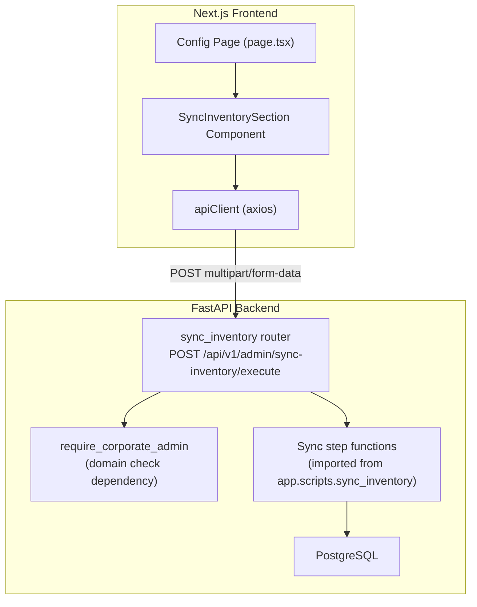
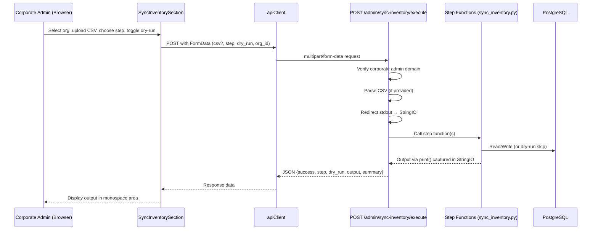

# Design Document: Sync Inventory Dashboard

## Overview

This feature adds an inventory synchronization section to the System Configuration page, allowing Corporate Admins to execute the 6 steps of `sync_inventory.py` from the web UI without SSH access. The design leverages synchronous HTTP requests (no WebSocket needed), a single POST endpoint that imports step functions directly, and stdout capture via `StringIO` to relay script output to the frontend.

The feature follows the established pattern of restricted features (same as RemoteTerminalSection): domain-check in both frontend (hide UI) and backend (reject API calls with 403).

## Architecture

### High-Level Component Diagram



### Data Flow



## Components and Interfaces

### Backend

#### New File: `app/api/v1/endpoints/sync_inventory.py`

```python
router = APIRouter(prefix="/admin/sync-inventory", tags=["Sync Inventory"])
```

**Dependency: `require_corporate_admin`**

```python
ALLOWED_DOMAINS = ["@robles.ai", "@sistemas.com.pe"]

async def require_corporate_admin(
    current_user: User = Depends(require_admin)
) -> User:
    """
    Verifica que el admin autenticado pertenezca a un dominio corporativo autorizado.
    Raises HTTP 403 si el dominio no coincide.
    """
    email = (current_user.email or "").lower()
    if not any(email.endswith(domain) for domain in ALLOWED_DOMAINS):
        raise HTTPException(
            status_code=status.HTTP_403_FORBIDDEN,
            detail="Solo administradores corporativos pueden ejecutar sincronización de inventario."
        )
    return current_user
```

**Endpoint: `POST /api/v1/admin/sync-inventory/execute`**

```python
@router.post("/execute")
async def execute_sync_step(
    step: int = Form(..., ge=1, le=7),          # 1-6 individual, 7 = "all"
    dry_run: bool = Form(True),
    organization_id: UUID = Form(...),
    csv_file: Optional[UploadFile] = File(None),
    db: Session = Depends(get_db),
    current_user: User = Depends(require_corporate_admin),
) -> SyncExecutionResponse:
```

Parameters:
- `step`: Integer 1-6 for individual steps, 7 for "run all"
- `dry_run`: Boolean, defaults to True (safe by default)
- `organization_id`: UUID of target organization
- `csv_file`: Optional CSV file (required for steps 1-3 and "run all")

**Response Schema: `SyncExecutionResponse`**

```python
class StepResult(BaseModel):
    step: int
    name: str
    success: bool
    output: str
    error: Optional[str] = None

class SyncExecutionResponse(BaseModel):
    success: bool
    dry_run: bool
    steps_executed: List[StepResult]
    total_output: str
```

**Implementation Strategy:**

1. Validate CSV is provided when needed (steps 1-3 or "all")
2. Validate organization exists
3. Parse CSV into `csv_rows` list and extract `csv_vlans` dict (same logic as `main()`)
4. For each step to execute:
   - Redirect `sys.stdout` to a `StringIO` buffer
   - Call the step function with the db session
   - Capture output from buffer
   - If exception occurs, rollback and capture error
5. Return aggregated results

**stdout capture pattern:**

```python
import sys
from io import StringIO

buffer = StringIO()
old_stdout = sys.stdout
sys.stdout = buffer
try:
    step_function(db, org_id, ...)
finally:
    sys.stdout = old_stdout
output = buffer.getvalue()
```

**CSV Validation:**

Required columns: `VLAN_CODE`, `VLAN_NAME`, `IP`, `MODELO`, `SERIE`, `UBICACION`, `DIRECCION`, `DISTRITO`, `PROVINCIA`, `DEPARTAMENTO`, `TIPO`

Validation returns HTTP 422 with details if columns are missing.

#### Router Registration (in `app/api/v1/router.py`)

```python
from app.api.v1.endpoints import sync_inventory

api_router.include_router(
    sync_inventory.router,
    tags=["Sync Inventory"]
)
```

### Frontend

#### New Component: `src/components/config/SyncInventorySection.tsx`

A self-contained section component rendered inside the config page when user is a Corporate Admin.

**Props:** None (uses hooks internally for auth and org data)

**Internal State:**

```typescript
interface SyncInventoryState {
  selectedOrgId: string | null
  csvFile: File | null
  csvRowCount: number | null
  csvError: string | null
  dryRun: boolean                     // default: true
  selectedStep: number | null         // 1-6 or 7 for "all"
  isExecuting: boolean
  results: StepResult[]
}
```

**Key behaviors:**
- Checks `user?.email?.toLowerCase()` for allowed domains — renders null otherwise
- Organization selector (useQuery for `organizationsApi.list()`)
- File upload with client-side header validation
- Step cards with visual distinction (CSV_Steps vs DB_Steps)
- Dry-run toggle (enabled by default, visual banner when active)
- Execution output in monospace scrollable area
- Loading state disabling buttons during execution

#### API Client Addition (`src/lib/api.ts`)

```typescript
export const syncInventoryApi = {
  execute: async (params: {
    step: number
    dry_run: boolean
    organization_id: string
    csv_file?: File
  }): Promise<SyncExecutionResponse> => {
    const formData = new FormData()
    formData.append('step', params.step.toString())
    formData.append('dry_run', params.dry_run.toString())
    formData.append('organization_id', params.organization_id)
    if (params.csv_file) {
      formData.append('csv_file', params.csv_file)
    }
    const response = await apiClient.post<SyncExecutionResponse>(
      '/admin/sync-inventory/execute',
      formData,
      {
        headers: { 'Content-Type': 'multipart/form-data' },
        timeout: 120000,  // 2 min timeout for "run all"
      }
    )
    return response.data
  },
}
```

#### TypeScript Interfaces (`src/types/index.ts` or inline)

```typescript
interface StepResult {
  step: number
  name: string
  success: boolean
  output: string
  error?: string
}

interface SyncExecutionResponse {
  success: boolean
  dry_run: boolean
  steps_executed: StepResult[]
  total_output: string
}
```

#### Config Page Integration (`src/app/dashboard/config/page.tsx`)

The config page conditionally renders `<SyncInventorySection />`. The component itself handles its own access control (returns null if not corporate admin), matching the RemoteTerminalSection pattern.

#### i18n Keys (namespace: `syncInventory`)

New namespace `syncInventory` in `messages/en.json` and `messages/es.json` with keys for:
- Section title and description
- Step labels (1-6) and descriptions
- Buttons: Run, Run All, Upload CSV
- Dry-run toggle label and banner text
- Output area placeholder
- Error messages (CSV invalid, no CSV for CSV step, execution failed)
- Organization selector label
- Summary labels (created, updated, deleted, unchanged, skipped)

## Data Models

No new database tables required. This feature operates on existing models:
- `Organization` (for org selection and validation)
- `VLAN` (steps 1, 2, 5, 6)
- `Workstation` (steps 2, 5, 6)
- `Device` (steps 3, 4)

**Transient data structures (in-memory only):**

| Structure | Source | Used By |
|-----------|--------|---------|
| `csv_rows: list[dict]` | Parsed from uploaded CSV | Steps 1, 2, 3 |
| `csv_vlans: dict[str, str]` | Extracted from csv_rows (code→name) | Steps 1, 2 |
| `code_to_id: dict[str, str]` | Output of Step 1 (VLAN code→DB id) | Steps 2, 3 |

**Transaction management:**
- Individual step: single transaction per step. Rollback on error.
- "Run All": each step commits independently. If step N fails, steps 1..N-1 remain committed, step N is rolled back. This matches the script's current behavior.

## Error Handling

| Error Condition | HTTP Status | Behavior |
|----------------|-------------|----------|
| User not admin | 403 | Rejected by `require_admin` |
| User admin but wrong domain | 403 | Rejected by `require_corporate_admin` |
| Organization not found | 404 | Endpoint validates org exists |
| CSV missing when required (steps 1-3, "all") | 422 | Return error with descriptive message |
| CSV missing required columns | 422 | List missing columns in error detail |
| CSV parse error (encoding, malformed) | 422 | Return parse error details |
| Database error during step execution | 500 | Rollback transaction, return captured output + error |
| Step function raises exception | Captured | `StepResult.success = false`, error in response body |

**Frontend error handling:**
- Network errors: axios interceptor redirects to maintenance (existing behavior)
- 403: should not occur if UI is properly hidden, but toast with error message
- 422: display validation error in UI (red badge near upload area or step card)
- 500: display error output in monospace area with error styling
- Timeout (>120s): toast indicating the operation took too long

## Testing Strategy

### Unit Tests (Backend)

1. **`require_corporate_admin` dependency**: Verify allowed/disallowed emails
2. **CSV validation**: Test with valid CSV, missing columns, malformed data, empty file
3. **Step execution isolation**: Mock step functions, verify correct ones are called based on `step` parameter
4. **stdout capture**: Verify output from step functions is captured correctly
5. **Transaction rollback on error**: Mock a step to raise, verify rollback
6. **"Run All" sequential execution**: Verify steps execute in order 1-6

### Unit Tests (Frontend)

1. **Access control**: Component renders null when user email doesn't match domains
2. **CSV upload validation**: Client-side header check accepts/rejects files
3. **Step selection**: Only one step or "all" can be active at a time
4. **Dry-run toggle**: Default state is enabled, visual indicator shown
5. **Loading state**: Buttons disabled during execution
6. **Error display**: Validation and execution errors shown correctly

### Integration Tests

1. **Full flow**: Upload CSV → select step → execute → verify DB changes (dry_run=false)
2. **Dry-run flow**: Execute with dry_run=true → verify no DB changes
3. **Permission denied**: Non-corporate admin gets 403
4. **CSV-step without CSV**: Verify 422 response

### Property-Based Testing Assessment

PBT is **NOT appropriate** for this feature because:
- The sync operations are side-effect-heavy (database writes)
- The core logic is CRUD operations against existing DB records
- The CSV parsing is straightforward column mapping
- No pure transformation functions with large input spaces suitable for property generation

The testing strategy relies on example-based unit tests and integration tests, which are the correct approach for this type of administrative CRUD/sync feature.
