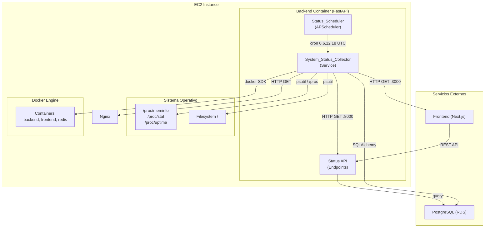
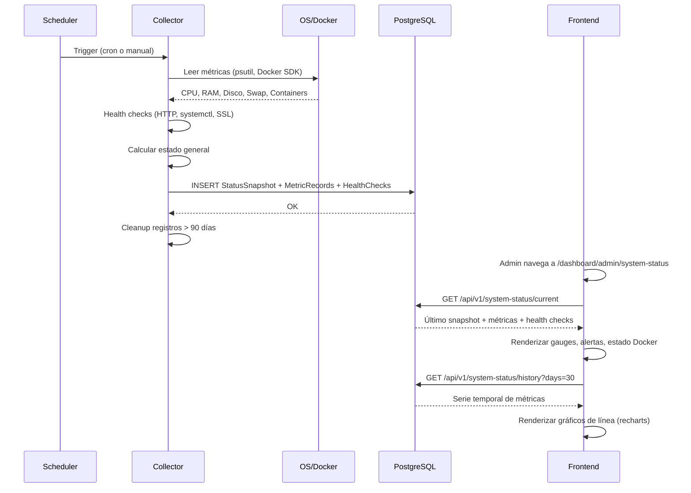
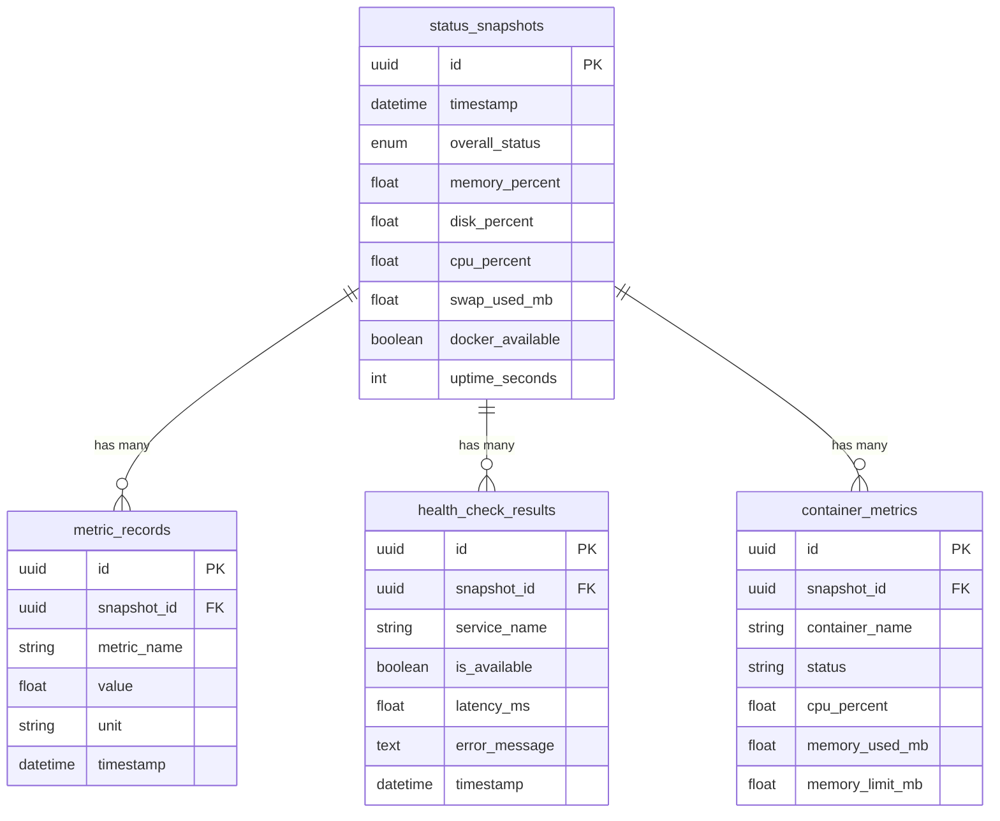

# Design Document: System Status Monitoring

## Overview

Sistema de monitoreo automatizado que recolecta métricas de infraestructura (CPU, memoria, disco, swap, Docker, servicios) directamente desde la instancia EC2 donde corre el backend, las almacena en PostgreSQL con retención de 90 días, y las presenta en un dashboard gráfico exclusivo para administradores con reportes históricos de 30 días y alertas visuales por umbrales.

**Decisiones clave de diseño:**

1. **Recolección local (sin SSM)**: El backend corre en la misma EC2, por lo que usa `psutil` y el Docker SDK directamente en lugar de SSM commands remotos. Esto elimina latencia, costos de SSM, y dependencias externas.

2. **APScheduler para programación**: Se integra con el ciclo de vida de FastAPI via lifespan. Ejecuta cada 6 horas (0:00, 6:00, 12:00, 18:00 UTC) con soporte de reintento y protección contra ejecuciones concurrentes.

3. **Almacenamiento relacional normalizado**: Un `StatusSnapshot` padre con `MetricRecord` y `HealthCheckResult` hijos. Permite queries eficientes tanto para el estado actual como para series temporales.

4. **Frontend con recharts**: Gráficos de línea temporal integrados con el stack existente (Next.js + React + shadcn/ui). Gauges circulares para estado actual, line charts para históricos.

## Architecture





## Components and Interfaces

### Backend Components

#### 1. `app/services/system_status.py` — SystemStatusCollector

Servicio principal de recolección de métricas.

```python
class SystemStatusCollector:
    """Recolecta métricas del sistema operativo, Docker y servicios."""
    
    async def collect_all() -> StatusSnapshotCreate:
        """Ejecuta recolección completa. Orquesta sub-recolectores."""
    
    def collect_os_metrics() -> OsMetrics:
        """RAM, disco, CPU, swap, uptime via psutil."""
    
    async def collect_docker_metrics() -> list[ContainerMetrics]:
        """Stats por contenedor via Docker SDK."""
    
    async def collect_health_checks() -> list[HealthCheckResult]:
        """Verifica backend, frontend, nginx, redis, RDS, SSL."""
    
    def calculate_overall_status(metrics, health_checks) -> OverallStatus:
        """Determina healthy/degraded/critical según umbrales."""
```

#### 2. `app/services/status_scheduler.py` — StatusScheduler

Gestiona la programación y ejecución del collector.

```python
class StatusScheduler:
    """Programa ejecuciones cada 6h y gestiona ejecuciones manuales."""
    
    def start(scheduler: AsyncIOScheduler) -> None:
        """Registra jobs en APScheduler."""
    
    async def trigger_manual_collection(db: Session) -> StatusSnapshot:
        """Ejecuta recolección bajo demanda. Protege contra concurrencia."""
    
    def is_running() -> bool:
        """Indica si hay una recolección en progreso."""
```

#### 3. `app/api/v1/endpoints/system_status.py` — API Endpoints

| Método | Ruta | Descripción | Auth |
|--------|------|-------------|------|
| GET | `/system-status/current` | Último snapshot completo | `require_admin` |
| GET | `/system-status/history` | Serie temporal (query: days, metric) | `require_admin` |
| GET | `/system-status/services` | Historial de disponibilidad | `require_admin` |
| POST | `/system-status/collect` | Trigger recolección manual | `require_admin` |
| GET | `/system-status/alerts` | Alertas activas (umbrales superados) | `require_admin` |

#### 4. `app/models/system_status.py` — Modelos SQLAlchemy

Tres tablas: `status_snapshots`, `metric_records`, `health_check_results`.

#### 5. `app/schemas/system_status.py` — Pydantic Schemas

Schemas de request/response para la API.

### Frontend Components

#### 1. `src/app/dashboard/admin/system-status/page.tsx` — Página principal

Dashboard con tabs: "Estado Actual" y "Histórico".

#### 2. Componentes de visualización (en la misma página o extraídos):

- **MetricGauge**: Gauge circular para CPU/RAM/Disco (0-100%)
- **ContainerStatusCard**: Estado de cada contenedor Docker
- **ServiceHealthTable**: Tabla de health checks con indicadores
- **AlertBanner**: Banner fijo para estado critical
- **AlertsList**: Lista de threshold alerts activas
- **HistoryChart**: Gráfico de línea temporal (recharts)
- **StatsSummary**: Promedio/máximo/mínimo del período

### Interfaces (Schemas)

```python
# === Request Schemas ===

class HistoryQueryParams:
    days: int = 30  # 7, 14, 30
    metric: Optional[str] = None  # cpu, memory, disk, swap

# === Response Schemas ===

class StatusSnapshotResponse:
    id: UUID
    timestamp: datetime
    overall_status: str  # healthy, degraded, critical
    os_metrics: OsMetricsResponse
    docker_metrics: list[ContainerMetricsResponse]
    health_checks: list[HealthCheckResponse]
    alerts: list[AlertResponse]

class OsMetricsResponse:
    memory_total_mb: float
    memory_used_mb: float
    memory_available_mb: float
    memory_percent: float
    disk_total_mb: float
    disk_used_mb: float
    disk_available_mb: float
    disk_percent: float
    cpu_percent: float
    swap_total_mb: float
    swap_used_mb: float
    swap_available_mb: float
    uptime_seconds: int

class ContainerMetricsResponse:
    name: str
    status: str  # running, stopped, restarting
    cpu_percent: float
    memory_used_mb: float
    memory_limit_mb: float
    network_rx_bytes: int
    network_tx_bytes: int
    uptime_seconds: int

class HealthCheckResponse:
    service_name: str
    is_available: bool
    latency_ms: Optional[float]
    error_message: Optional[str]
    details: Optional[dict]  # SSL days remaining, etc.

class HistoryDataPoint:
    timestamp: datetime
    value: float

class HistoryResponse:
    metric: str
    unit: str
    data_points: list[HistoryDataPoint]
    stats: MetricStats

class MetricStats:
    average: float
    maximum: float
    minimum: float
    data_coverage_percent: float

class ServiceUptimeResponse:
    service_name: str
    uptime_percent: float
    total_checks: int
    successful_checks: int

class AlertResponse:
    metric_name: str
    current_value: float
    threshold: float
    severity: str  # warning, critical
```

## Data Models

### Tabla: `status_snapshots`

| Columna | Tipo | Descripción |
|---------|------|-------------|
| id | UUID (PK) | Identificador único |
| timestamp | DateTime (UTC) | Momento de la recolección |
| overall_status | Enum(healthy, degraded, critical) | Estado general calculado |
| memory_percent | Float | % memoria usada |
| disk_percent | Float | % disco usado |
| cpu_percent | Float | % CPU promedio |
| swap_used_mb | Float | Swap usado en MB |
| memory_total_mb | Float | RAM total |
| memory_used_mb | Float | RAM usada |
| memory_available_mb | Float | RAM disponible |
| disk_total_mb | Float | Disco total |
| disk_used_mb | Float | Disco usado |
| disk_available_mb | Float | Disco disponible |
| swap_total_mb | Float | Swap total |
| swap_available_mb | Float | Swap disponible |
| uptime_seconds | Integer | Uptime del SO |
| docker_available | Boolean | Si Docker respondió |
| created_at | DateTime | Timestamp de inserción |

**Índices:**
- `ix_status_snapshots_timestamp` en `timestamp` (queries de rango temporal)
- `ix_status_snapshots_overall_status` en `overall_status`

### Tabla: `metric_records`

| Columna | Tipo | Descripción |
|---------|------|-------------|
| id | UUID (PK) | Identificador único |
| snapshot_id | UUID (FK → status_snapshots) | Snapshot padre |
| metric_name | String(100) | Nombre (cpu_percent, memory_percent, etc.) |
| value | Float | Valor numérico |
| unit | String(20) | Unidad (percent, mb, seconds, bytes) |
| timestamp | DateTime (UTC) | Momento de recolección |

**Índices:**
- `ix_metric_records_snapshot_id` en `snapshot_id`
- `ix_metric_records_name_timestamp` en `(metric_name, timestamp)` (queries de serie temporal)

### Tabla: `health_check_results`

| Columna | Tipo | Descripción |
|---------|------|-------------|
| id | UUID (PK) | Identificador único |
| snapshot_id | UUID (FK → status_snapshots) | Snapshot padre |
| service_name | String(100) | Nombre del servicio |
| is_available | Boolean | Disponible o no |
| latency_ms | Float (nullable) | Latencia de respuesta |
| error_message | Text (nullable) | Mensaje de error |
| details_json | Text (nullable) | JSON con detalles extra (SSL days, etc.) |
| timestamp | DateTime (UTC) | Momento de verificación |

**Índices:**
- `ix_health_checks_snapshot_id` en `snapshot_id`
- `ix_health_checks_service_timestamp` en `(service_name, timestamp)` (uptime queries)

### Tabla: `container_metrics`

| Columna | Tipo | Descripción |
|---------|------|-------------|
| id | UUID (PK) | Identificador único |
| snapshot_id | UUID (FK → status_snapshots) | Snapshot padre |
| container_name | String(100) | Nombre del contenedor |
| status | String(20) | running, stopped, restarting |
| cpu_percent | Float | % CPU del contenedor |
| memory_used_mb | Float | Memoria usada |
| memory_limit_mb | Float | Límite de memoria |
| network_rx_bytes | BigInteger | Bytes recibidos |
| network_tx_bytes | BigInteger | Bytes enviados |
| uptime_seconds | Integer | Tiempo activo |

**Índices:**
- `ix_container_metrics_snapshot_id` en `snapshot_id`

### Migración Alembic

Archivo: `alembic/versions/YYYYMMDDHHMMSS_add_system_status_tables.py`

Crea las 4 tablas con sus índices y foreign keys con `ondelete="CASCADE"`.

### Diagrama ER




## Correctness Properties

*A property is a characteristic or behavior that should hold true across all valid executions of a system—essentially, a formal statement about what the system should do. Properties serve as the bridge between human-readable specifications and machine-verifiable correctness guarantees.*

### Property 1: Metric calculation correctness

*For any* raw system values (memory total/used/available, disk total/used/available, CPU raw, swap total/used/available), the collector SHALL produce metrics where: percent = round(used / total * 100, 1), all values are expressed in MB (converted from bytes by dividing by 1048576), and available = total - used (within floating point tolerance).

**Validates: Requirements 1.1, 1.2, 1.3, 1.4**

### Property 2: Docker stats parsing correctness

*For any* valid Docker stats/inspect JSON response containing container name, state, CPU percentage, memory usage, memory limit, and network I/O, the parser SHALL produce a ContainerMetrics object where all fields are correctly extracted, memory values are in MB, network values are in bytes, and status is one of (running, stopped, restarting).

**Validates: Requirements 1.5, 1.7**

### Property 3: Partial failure resilience

*For any* subset of metric collectors that raise exceptions during a collection cycle, the remaining collectors SHALL still produce their metrics successfully, and the failed metrics SHALL be reported as unavailable without interrupting the overall collection.

**Validates: Requirements 1.8, 1.9**

### Property 4: Backend health check classification

*For any* HTTP response body string, the backend health check SHALL classify the service as available if and only if the response contains the substring "healthy", and as unavailable otherwise.

**Validates: Requirements 2.1**

### Property 5: Frontend health check classification by status code

*For any* HTTP status code in the range 100-599, the frontend health check SHALL classify the service as available if and only if the code is 200, 302, or 307, and as unavailable for any other code.

**Validates: Requirements 2.2**

### Property 6: SSL certificate days classification

*For any* SSL certificate expiry date and current date, the SSL checker SHALL calculate days_remaining = (expiry - now).days and classify as: "valid" if days_remaining > 14, "warning" if 1 <= days_remaining <= 14, "expired" if days_remaining <= 0.

**Validates: Requirements 2.6**

### Property 7: Health check summary counts

*For any* list of health check results with statuses (available, warning, unavailable), the summary SHALL report counts where ok_count + warning_count + failed_count equals the total number of checks, and each count matches the actual number of results with that status.

**Validates: Requirements 2.8**

### Property 8: Concurrency protection

*For any* sequence of concurrent collection trigger attempts (manual or scheduled), the scheduler SHALL execute at most one collection at a time, and all concurrent requests received while a collection is in progress SHALL be rejected with an "already running" indication.

**Validates: Requirements 3.6**

### Property 9: Snapshot persistence round-trip

*For any* valid StatusSnapshot with associated MetricRecords, HealthCheckResults, and ContainerMetrics, persisting to the database and reading back SHALL produce data equivalent to the original (all field values match within floating point tolerance for numeric fields).

**Validates: Requirements 4.1, 4.2, 4.5**

### Property 10: Data retention cleanup

*For any* set of StatusSnapshots with varying timestamps, the cleanup process SHALL delete all snapshots (and their associated MetricRecords, HealthCheckResults, ContainerMetrics via CASCADE) where timestamp is older than 90 days from the current time, and SHALL preserve all snapshots within the 90-day window.

**Validates: Requirements 4.3, 4.4**

### Property 11: Transaction atomicity on failure

*For any* StatusSnapshot write operation that fails at any point during insertion (snapshot, metrics, health checks, or container metrics), the database SHALL contain no partial data from that failed operation (complete rollback).

**Validates: Requirements 4.7**

### Property 12: Threshold alert generation

*For any* metric value and its defined threshold (memory > 80%, disk > 85%, CPU > 90%, SSL < 14 days), a Threshold_Alert SHALL be generated if and only if the value exceeds the threshold. When the value returns within the threshold, the alert SHALL no longer be present.

**Validates: Requirements 8.1, 8.2, 8.3, 8.4, 8.7**

### Property 13: Time range filtering

*For any* set of metric data points and a selected time range (7, 14, or 30 days), the history query SHALL return only data points whose timestamp falls within the selected range (now - days, now], and SHALL exclude all data points outside that range.

**Validates: Requirements 7.1, 7.2**

### Property 14: Aggregate statistics correctness

*For any* non-empty list of metric values within a time period, the statistics SHALL report: average = sum(values) / count(values), maximum = max(values), minimum = min(values), all rounded to 1 decimal place.

**Validates: Requirements 7.4**

### Property 15: Service uptime calculation

*For any* sequence of health check results for a service over a time period, the uptime percentage SHALL equal (count of available results / total results) * 100, rounded to 2 decimal places.

**Validates: Requirements 7.5**

### Property 16: Data coverage calculation

*For any* time period with expected data points (based on collection frequency) and actual data points available, the coverage percentage SHALL equal (actual_count / expected_count) * 100, and intervals without data SHALL be correctly identified as gaps.

**Validates: Requirements 7.6**

## Error Handling

### Backend — Collector Errors

| Escenario | Comportamiento | Logging |
|-----------|---------------|---------|
| Docker daemon no disponible | Continuar con métricas OS, `docker_available=False` | WARNING con detalle del error |
| Métrica individual falla (ej: /proc/meminfo no legible) | Reportar métrica como `null`, continuar con las demás | ERROR con nombre de métrica y excepción |
| Health check timeout (>10s) | Marcar servicio como no disponible, registrar latencia como null | WARNING con nombre del servicio |
| PostgreSQL no disponible al escribir | Reintentar 3 veces (5s entre intentos), si falla mantener en memoria | ERROR con intento y excepción |
| Escritura parcial falla | Rollback completo de la transacción | ERROR con detalle de la operación fallida |
| Ejecución programada excede 10 min | Cancelar, registrar timeout, reintentar una vez en 5 min | ERROR con duración |
| Reintento también falla | No reintentar más, esperar siguiente ejecución programada | CRITICAL con ambos errores |
| Solicitud manual mientras hay ejecución en curso | Retornar HTTP 409 Conflict con mensaje explicativo | INFO con timestamp de ejecución en curso |

### Backend — API Errors

| Escenario | HTTP Status | Response |
|-----------|-------------|----------|
| Usuario sin token | 401 Unauthorized | `{"detail": "Not authenticated"}` |
| Token inválido/expirado | 401 Unauthorized | `{"detail": "Token inválido o expirado"}` |
| Usuario sin rol admin | 403 Forbidden | `{"detail": "Se requieren permisos de administrador"}` |
| No hay snapshots disponibles | 200 OK | `{"data": null, "message": "No hay datos disponibles"}` |
| Parámetro `days` inválido | 422 Unprocessable Entity | Validación Pydantic |
| Error interno del collector | 500 Internal Server Error | `{"detail": "Error en la recolección de métricas"}` |

### Frontend — Error States

| Escenario | Comportamiento UI |
|-----------|-------------------|
| API retorna error | Toast con mensaje de error, mantener datos previos |
| Recolección manual falla | Rehabilitar botón, toast de error |
| Recolección manual timeout (30s) | Rehabilitar botón, toast "La recolección no pudo completarse" |
| No hay datos históricos | Mostrar gráfico vacío con mensaje "Sin datos para el período" |
| Datos parciales en período | Mostrar gaps en gráfico, indicar % de cobertura |
| Pérdida de conexión | Mostrar banner "Sin conexión", reintentar al reconectar |

## Testing Strategy

### Property-Based Tests (Hypothesis — Python)

Se usará **Hypothesis** como librería de property-based testing para Python. Cada property test ejecutará un mínimo de 100 iteraciones.

**Tests a implementar:**

1. **test_metric_calculation_correctness** — Property 1
   - Genera valores aleatorios de memoria/disco/swap/CPU
   - Verifica cálculos de porcentaje y conversión a MB
   - Tag: `Feature: system-status-monitoring, Property 1: Metric calculation correctness`

2. **test_docker_stats_parsing** — Property 2
   - Genera JSON de Docker stats con valores aleatorios
   - Verifica extracción correcta de campos
   - Tag: `Feature: system-status-monitoring, Property 2: Docker stats parsing correctness`

3. **test_partial_failure_resilience** — Property 3
   - Genera subconjuntos aleatorios de collectors que fallan
   - Verifica que los demás siguen funcionando
   - Tag: `Feature: system-status-monitoring, Property 3: Partial failure resilience`

4. **test_backend_health_classification** — Property 4
   - Genera strings aleatorios (con/sin "healthy")
   - Verifica clasificación correcta
   - Tag: `Feature: system-status-monitoring, Property 4: Backend health check classification`

5. **test_frontend_health_classification** — Property 5
   - Genera status codes aleatorios (100-599)
   - Verifica clasificación correcta (200/302/307 = available)
   - Tag: `Feature: system-status-monitoring, Property 5: Frontend health check classification`

6. **test_ssl_days_classification** — Property 6
   - Genera fechas de expiración aleatorias
   - Verifica cálculo de días y clasificación
   - Tag: `Feature: system-status-monitoring, Property 6: SSL certificate days classification`

7. **test_health_summary_counts** — Property 7
   - Genera listas aleatorias de resultados de health checks
   - Verifica que los conteos suman el total
   - Tag: `Feature: system-status-monitoring, Property 7: Health check summary counts`

8. **test_snapshot_round_trip** — Property 9
   - Genera snapshots aleatorios completos
   - Escribe y lee de DB, verifica equivalencia
   - Tag: `Feature: system-status-monitoring, Property 9: Snapshot persistence round-trip`

9. **test_retention_cleanup** — Property 10
   - Genera snapshots con timestamps aleatorios (algunos >90 días)
   - Ejecuta cleanup, verifica que solo quedan los de <=90 días
   - Tag: `Feature: system-status-monitoring, Property 10: Data retention cleanup`

10. **test_threshold_alert_generation** — Property 12
    - Genera valores aleatorios para cada métrica
    - Verifica que alertas se generan iff umbral superado
    - Tag: `Feature: system-status-monitoring, Property 12: Threshold alert generation`

11. **test_time_range_filtering** — Property 13
    - Genera data points con timestamps aleatorios
    - Aplica filtros de rango, verifica inclusión/exclusión correcta
    - Tag: `Feature: system-status-monitoring, Property 13: Time range filtering`

12. **test_aggregate_statistics** — Property 14
    - Genera listas aleatorias de valores numéricos
    - Verifica avg/max/min correctos
    - Tag: `Feature: system-status-monitoring, Property 14: Aggregate statistics correctness`

13. **test_uptime_calculation** — Property 15
    - Genera secuencias aleatorias de resultados (available/unavailable)
    - Verifica cálculo de uptime %
    - Tag: `Feature: system-status-monitoring, Property 15: Service uptime calculation`

14. **test_data_coverage** — Property 16
    - Genera conjuntos de timestamps esperados vs reales
    - Verifica cálculo de cobertura %
    - Tag: `Feature: system-status-monitoring, Property 16: Data coverage calculation`

### Unit Tests (pytest)

- Health check timeout behavior (mock httpx con timeout)
- Docker unavailable graceful degradation
- Scheduler retry logic (1 retry after 5 min)
- Scheduler double-failure (no more retries)
- API auth: 401 sin token, 403 sin admin
- Empty state response (no snapshots)
- Transaction rollback on partial write failure

### Integration Tests

- Full collection cycle end-to-end (con Docker y psutil reales en CI)
- APScheduler job registration y ejecución
- Alembic migration up/down
- API endpoints con DB real (SQLite en tests)

### Frontend Tests (vitest + React Testing Library)

- Threshold color determination logic
- Gauge rendering con valores límite (0%, 50%, 100%)
- Empty state rendering
- Alert list capping (max 10 visible)
- Time range filter state management
