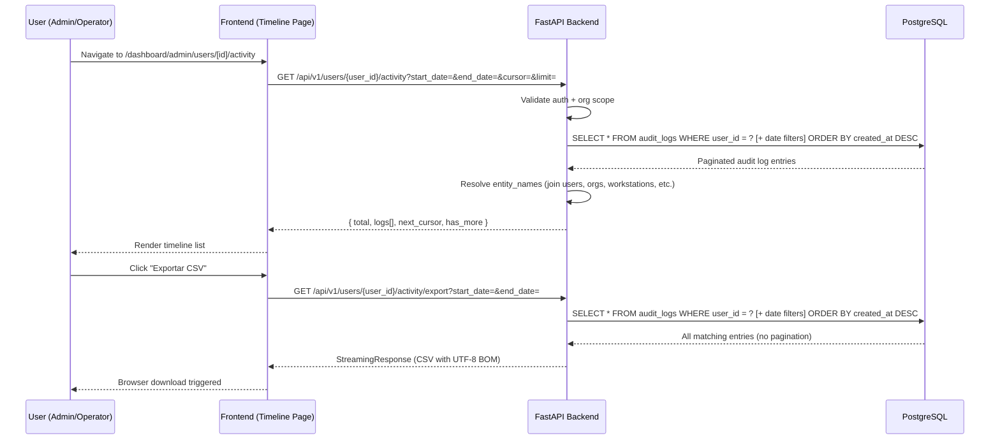
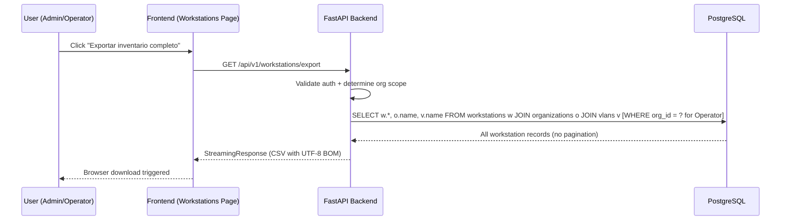

# Design Document: User Activity Export

## Overview

This feature adds two compliance-oriented capabilities to AlwaysPrint Cloud Manager:

1. **User Activity Timeline** — A new backend endpoint (`GET /api/v1/users/{user_id}/activity`) and a dedicated frontend page that displays the complete activity history for a specific user, with date range filtering and CSV export.

2. **Workstation Inventory Export** — A new backend endpoint (`GET /api/v1/workstations/export`) and a frontend button on the Workstations page that exports the complete workstation inventory as CSV (UTF-8 BOM for Excel).

Both capabilities integrate with the existing `AuditLog` model and respect the role-based access control (Admin/Operator/ReadOnly).

### Key Design Decisions

- **Reuse existing audit query logic**: The `GET /api/v1/audit/` endpoint already supports `user_id` filtering. The new activity endpoint will reuse the same query patterns from `audit.py` but with a simplified interface focused on a single user.
- **Streaming CSV generation**: Use `StreamingResponse` for CSV exports to handle large datasets without loading all records into memory at once.
- **No new database models**: Both features query existing tables (`audit_logs`, `workstations`) — no migrations needed.
- **Frontend routing**: The Timeline page lives at `/dashboard/admin/users/[userId]/activity`, accessible from the Users list via a link button.

## Architecture

```mermaid
graph TB
    subgraph Frontend [Next.js Frontend]
        UP[Users Page] -->|"Ver actividad" link| TP[Timeline Page]
        TP -->|GET /users/{id}/activity| BE
        TP -->|GET /users/{id}/activity/export| BE
        WP[Workstations Page] -->|"Exportar inventario" button| BE
        WP -->|GET /workstations/export| BE
    end

    subgraph Backend [FastAPI Backend]
        BE[API Router v1]
        BE --> UA[users/{id}/activity endpoint]
        BE --> UE[users/{id}/activity/export endpoint]
        BE --> WE[workstations/export endpoint]
        UA --> AQ[Audit Query Logic]
        UE --> CSV1[CSV Generator - Activity]
        WE --> CSV2[CSV Generator - Workstations]
        AQ --> DB[(PostgreSQL)]
        CSV1 --> AQ
        CSV2 --> WQ[Workstation Query]
        WQ --> DB
    end

    subgraph Auth [Authorization Layer]
        AUTH[get_current_user + org scope check]
        UA --> AUTH
        UE --> AUTH
        WE --> AUTH
    end
```

### Data Flow: User Activity Timeline



### Data Flow: Workstation Inventory Export



## Components and Interfaces

### Backend Components

#### 1. New Endpoint File: `app/api/v1/endpoints/user_activity.py`

Handles both the paginated timeline endpoint and the CSV export for user activity.

```python
# Router registered at: /api/v1/users/{user_id}/activity
# Methods:
#   GET /                → Paginated activity list (cursor-based)
#   GET /export          → CSV export (streaming)
```

**Dependencies:**
- `get_current_user` from `app.core.security`
- `AuditLog` model from `app.models.audit`
- `User` model from `app.models.user`
- Reuses `_resolve_entity_names` logic from `audit.py`

#### 2. New Endpoint in: `app/api/v1/endpoints/workstations.py`

Add a new `GET /export` route to the existing workstations router.

```python
# Added to existing workstations.router:
#   GET /export          → CSV export (streaming, all workstations)
```

#### 3. New Service: `app/services/export_csv.py`

Shared CSV generation utility used by both export endpoints.

```python
class CSVExportService:
    @staticmethod
    def generate_activity_csv(logs: list, entity_names: dict) -> Generator[str, None, None]:
        """Yields CSV rows for user activity export."""
        
    @staticmethod
    def generate_workstation_csv(workstations: list) -> Generator[str, None, None]:
        """Yields CSV rows for workstation inventory export."""
        
    @staticmethod
    def utf8_bom() -> bytes:
        """Returns UTF-8 BOM bytes."""
```

### Frontend Components

#### 4. New Page: `src/app/dashboard/admin/users/[userId]/activity/page.tsx`

Timeline page showing user activity with date range filters and export button.

**Key elements:**
- User info header (full_name, email)
- Date range picker (start_date, end_date)
- Timeline list with infinite scroll (cursor-based pagination)
- Export CSV button
- Empty state when no results

#### 5. Modified Page: `src/app/dashboard/workstations/page.tsx`

Add "Exportar inventario completo" button to the existing page header.

#### 6. API Extensions: `src/lib/api.ts`

New methods added to `usersApi`:

```typescript
export const usersApi = {
  // ... existing methods ...
  
  /** Obtener actividad del usuario con paginación por cursor. */
  activity: async (userId: string, params?: {
    start_date?: string;
    end_date?: string;
    cursor?: string;
    limit?: number;
  }): Promise<AuditLogListResponse> => { ... },
  
  /** Descargar CSV de actividad del usuario. */
  exportActivity: async (userId: string, params?: {
    start_date?: string;
    end_date?: string;
  }): Promise<void> => { ... },
}

export const workstationsApi = {
  // ... existing methods ...
  
  /** Descargar CSV de inventario completo de workstations. */
  exportInventory: async (): Promise<void> => { ... },
}
```

#### 7. New i18n Namespace: `timeline` (in `messages/es.json` and `messages/en.json`)

Translation keys for the new Timeline page and export functionality.

### API Endpoint Specifications

#### `GET /api/v1/users/{user_id}/activity`

**Request:**
| Parameter | Type | Location | Required | Description |
|-----------|------|----------|----------|-------------|
| user_id | UUID | path | Yes | Target user ID |
| start_date | datetime (ISO) | query | No | Filter: created_at >= start_date |
| end_date | datetime (ISO) | query | No | Filter: created_at <= end_date |
| cursor | string | query | No | Cursor for pagination (base64 encoded timestamp\|uuid) |
| limit | int (1-100) | query | No | Items per page (default: 15) |

**Response (200):**
```json
{
  "total": 142,
  "page": 1,
  "page_size": 15,
  "logs": [
    {
      "id": "uuid",
      "user_id": "uuid",
      "workstation_id": "uuid | null",
      "organization_id": "uuid | null",
      "action_type": "create",
      "entity_type": "workstation",
      "entity_id": "uuid",
      "entity_name": "w01230p01",
      "old_values": null,
      "new_values": { "hostname": "PC-001" },
      "ip_address": "192.168.1.50",
      "created_at": "2026-06-15T10:30:00"
    }
  ],
  "next_cursor": "base64string",
  "has_more": true
}
```

**Error responses:**
- `403 Forbidden` — Operator accessing user outside their organization
- `404 Not Found` — user_id does not exist

#### `GET /api/v1/users/{user_id}/activity/export`

**Request:**
| Parameter | Type | Location | Required | Description |
|-----------|------|----------|----------|-------------|
| user_id | UUID | path | Yes | Target user ID |
| start_date | datetime (ISO) | query | No | Filter: created_at >= start_date |
| end_date | datetime (ISO) | query | No | Filter: created_at <= end_date |

**Response (200):**
- Content-Type: `text/csv; charset=utf-8`
- Content-Disposition: `attachment; filename="activity_{user_email}_{start_date}_{end_date}.csv"`
- Body: UTF-8 BOM + CSV content

**CSV columns:** `timestamp, action_type, entity_type, entity_name, old_values, new_values, ip_address`

#### `GET /api/v1/workstations/export`

**Request:** No query parameters (all records exported).

**Response (200):**
- Content-Type: `text/csv; charset=utf-8`
- Content-Disposition: `attachment; filename="workstations_inventory_{YYYY-MM-DD}.csv"`
- Body: UTF-8 BOM + CSV content

**CSV columns:** `hostname, ip_private, current_user, organization_name, tray_version, action_config_name, last_connection, is_online, vlan_name`

**Scoping:**
- Admin: all workstations across all organizations
- Operator: only workstations in their organization

## Data Models

No new database models are required. The feature queries existing tables:

### Existing Models Used

| Model | Table | Usage |
|-------|-------|-------|
| `AuditLog` | `audit_logs` | Source for user activity timeline |
| `User` | `users` | Target user info + authorization check |
| `Workstation` | `workstations` | Source for inventory export |
| `Organization` | `organizations` | Join for organization_name in exports |
| `VLAN` | `vlans` | Join for vlan_name in workstation export |

### New Pydantic Schemas

```python
# In app/schemas/audit.py (extend existing)

class UserActivityExportParams(BaseModel):
    """Query parameters for user activity export."""
    start_date: Optional[datetime] = None
    end_date: Optional[datetime] = None
```

No schema changes needed for the workstation export (it returns a file, not JSON).

## Correctness Properties

*A property is a characteristic or behavior that should hold true across all valid executions of a system — essentially, a formal statement about what the system should do. Properties serve as the bridge between human-readable specifications and machine-verifiable correctness guarantees.*

### Property 1: User activity filter returns only target user's logs

*For any* set of audit logs in the database and any valid user_id, the activity endpoint SHALL return only logs where `log.user_id == user_id`, and all returned logs SHALL be ordered by `created_at` descending.

**Validates: Requirements 1.1**

### Property 2: Date range filtering preserves bounds

*For any* user activity query with start_date and/or end_date parameters, all returned audit log entries SHALL have `created_at >= start_date` (when start_date is provided) AND `created_at <= end_date` (when end_date is provided).

**Validates: Requirements 1.2, 1.3**

### Property 3: Operator tenant isolation

*For any* Operator user and any target user_id where the target user's organization_id differs from the Operator's organization_id, the activity endpoint and the activity export endpoint SHALL return HTTP 403 Forbidden.

**Validates: Requirements 1.4, 3.5, 4.3**

### Property 4: Admin unrestricted access

*For any* Admin user and any valid target user_id (regardless of organization), the activity endpoint SHALL return a successful response (never 403) and the workstation export SHALL include workstations from ALL organizations.

**Validates: Requirements 1.5, 4.4**

### Property 5: All action types are included without filtering

*For any* user who has audit logs with every possible ActionType, the activity endpoint SHALL return logs of all action_types without filtering any out.

**Validates: Requirements 1.6**

### Property 6: Activity export equivalence with API

*For any* user_id and date range, the set of entries in the exported CSV SHALL be equivalent to the complete (unpaginated) set of entries returned by the activity API endpoint with the same filters.

**Validates: Requirements 3.1**

### Property 7: Activity CSV column completeness

*For any* exported activity CSV file, every row SHALL contain exactly the columns: timestamp, action_type, entity_type, entity_name, old_values, new_values, ip_address.

**Validates: Requirements 3.2**

### Property 8: Workstation export includes all records (no pagination)

*For any* user with access to N workstations, the workstation export CSV SHALL contain exactly N data rows (one per accessible workstation), regardless of any pagination that the list endpoint might apply.

**Validates: Requirements 4.1**

### Property 9: Workstation CSV column completeness

*For any* exported workstation inventory CSV file, every row SHALL contain exactly the columns: hostname, ip_private, current_user, organization_name, tray_version, action_config_name, last_connection, is_online, vlan_name.

**Validates: Requirements 4.2**

### Property 10: UTF-8 BOM encoding for Excel compatibility

*For any* exported CSV file (both activity and workstation), the file content SHALL begin with the UTF-8 BOM byte sequence (0xEF, 0xBB, 0xBF).

**Validates: Requirements 4.5**

### Property 11: Export filename follows naming convention

*For any* activity export, the Content-Disposition filename SHALL match the pattern `activity_{email}_{start}_{end}.csv`. *For any* workstation export, it SHALL match `workstations_inventory_{YYYY-MM-DD}.csv`.

**Validates: Requirements 3.3, 4.6**

## Error Handling

| Scenario | HTTP Status | Frontend Behavior |
|----------|-------------|-------------------|
| User not found | 404 Not Found | Redirect to users list with error toast |
| Operator accessing user in different org | 403 Forbidden | Error toast: "Sin permisos para ver este usuario" |
| ReadOnly user accessing export | 403 Forbidden | Button not rendered (hidden by role check) |
| Database connection error during export | 500 Internal Server Error | Error toast + log error server-side |
| Export generates empty CSV (no data) | 200 OK (file with headers only) | Download completes, file has headers but no data rows |
| Invalid date range (start > end) | 422 Unprocessable Entity | Form validation prevents submission |
| Invalid cursor format | 400 Bad Request | Reset pagination to first page |

### Backend Error Handling Strategy

- All export endpoints wrap the query in `try/except` to catch database errors
- Errors are logged with `logger.exception()` including user_id and request context
- The CSV streaming generator yields headers first, so if an error occurs mid-stream, the response will be partial (acceptable for large exports — the alternative would require buffering all data in memory)

### Frontend Error Handling Strategy

- Export buttons use a loading state (`isExporting`) to prevent duplicate requests
- Failed exports show a toast notification via `useToast()` with localized error messages
- Network timeouts (> 60s for large exports) show a specific timeout message

## Testing Strategy

### Unit Tests (pytest)

- **Activity endpoint authorization**: Verify 403 for operator cross-org access, 200 for admin
- **Date range filtering**: Specific examples with known dates
- **CSV format validation**: Verify headers, BOM, encoding
- **Empty state handling**: Export with no matching logs returns headers-only CSV
- **Filename generation**: Verify pattern with special characters in email (sanitized)

### Property-Based Tests (Hypothesis)

The following properties are suitable for property-based testing with the Hypothesis library (Python):

- **Property 1** (user filter): Generate random audit log datasets, query by user_id, verify all returned logs belong to that user and are ordered
- **Property 2** (date range): Generate random timestamps and date bounds, verify filtering correctness
- **Property 3** (tenant isolation): Generate random org assignments, verify 403/200 based on org match
- **Property 5** (all action types): Generate logs with all ActionType values, verify none are filtered
- **Property 7** (CSV columns): Generate random audit data, export, verify column structure
- **Property 9** (workstation CSV columns): Generate random workstation data, export, verify column structure
- **Property 10** (BOM): Generate any export, verify BOM prefix

**Library:** `hypothesis` (already in project — `.hypothesis/` directory exists)
**Minimum iterations:** 100 per property test
**Tag format:** `# Feature: user-activity-export, Property {N}: {title}`

### Integration Tests

- End-to-end flow: Create user → perform actions → fetch activity → export CSV → verify content matches
- Workstation export with multiple organizations: Verify admin sees all, operator sees only their org
- Large dataset export (1000+ records): Verify streaming doesn't timeout

### Frontend Tests (Optional)

- Component render test: Timeline page shows user info, filter controls, and export button
- Empty state: Verify empty state message when no activity
- Role-based visibility: Export button hidden for ReadOnly users

## File-by-File Implementation Plan

### Backend Files

| # | File | Action | Description |
|---|------|--------|-------------|
| 1 | `app/services/export_csv.py` | Create | Shared CSV generation service (BOM, streaming generators) |
| 2 | `app/api/v1/endpoints/user_activity.py` | Create | Activity timeline + export endpoints |
| 3 | `app/api/v1/endpoints/workstations.py` | Modify | Add `GET /export` endpoint |
| 4 | `app/api/v1/router.py` | Modify | Register user_activity router under `/users` prefix |
| 5 | `app/schemas/audit.py` | Modify (minor) | Add `UserActivityExportParams` if needed |

### Frontend Files

| # | File | Action | Description |
|---|------|--------|-------------|
| 6 | `src/lib/api.ts` | Modify | Add `usersApi.activity()`, `usersApi.exportActivity()`, `workstationsApi.exportInventory()` |
| 7 | `src/types/audit.ts` or `src/types/index.ts` | Modify | Ensure `AuditLogListResponse` type is exported (already exists) |
| 8 | `src/app/dashboard/admin/users/[userId]/activity/page.tsx` | Create | Timeline page component |
| 9 | `src/app/dashboard/admin/users/page.tsx` | Modify | Add "Ver actividad" link/button per user row |
| 10 | `src/app/dashboard/workstations/page.tsx` | Modify | Add "Exportar inventario completo" button in header |
| 11 | `messages/es.json` | Modify | Add `timeline` namespace with Spanish translations |
| 12 | `messages/en.json` | Modify | Add `timeline` namespace with English translations |

### Test Files

| # | File | Action | Description |
|---|------|--------|-------------|
| 13 | `tests/test_user_activity.py` | Create | Unit + property tests for activity endpoint |
| 14 | `tests/test_workstation_export.py` | Create | Unit + property tests for workstation export |
| 15 | `tests/test_export_csv_service.py` | Create | Unit tests for CSV generation service |
