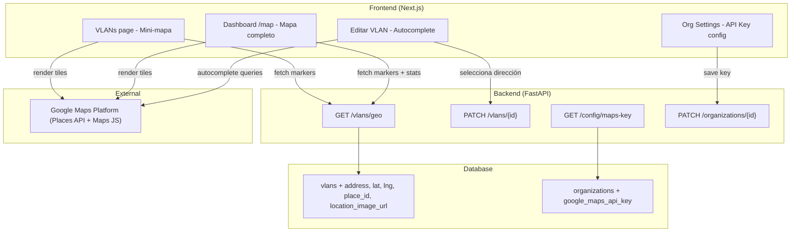

# Design Document: vlan-geolocation

## Overview

Implementación de georreferenciación de VLANs usando Google Maps. Incluye: almacenamiento de API Key por organización, campos de geolocalización en el modelo VLAN, autocompletado de direcciones via Google Places, mapa interactivo en dashboard con filtro de organización, y mini-mapa en la página de VLANs.

## Architecture



## Components and Interfaces

### 1. Database Migration (Alembic)

Archivo: `alembic/versions/020_add_vlan_geolocation.py`

```python
def upgrade():
    op.add_column('vlans', sa.Column('address', sa.String(500), nullable=True))
    op.add_column('vlans', sa.Column('latitude', sa.Float, nullable=True))
    op.add_column('vlans', sa.Column('longitude', sa.Float, nullable=True))
    op.add_column('vlans', sa.Column('place_id', sa.String(100), nullable=True))
    op.add_column('vlans', sa.Column('location_image_url', sa.String(500), nullable=True))
    op.add_column('organizations', sa.Column('google_maps_api_key', sa.String(200), nullable=True))

def downgrade():
    op.drop_column('vlans', 'location_image_url')
    op.drop_column('vlans', 'place_id')
    op.drop_column('vlans', 'longitude')
    op.drop_column('vlans', 'latitude')
    op.drop_column('vlans', 'address')
    op.drop_column('organizations', 'google_maps_api_key')
```

### 2. Model Changes

**VLAN** (app/models/vlan.py) — campos después de `action_config_mandatory`:
```python
from sqlalchemy import Float

address = Column(String(500), nullable=True)
latitude = Column(Float, nullable=True)
longitude = Column(Float, nullable=True)
place_id = Column(String(100), nullable=True)
location_image_url = Column(String(500), nullable=True)
```

**Organization** (app/models/organization.py) — campo después de `openai_api_key`:
```python
google_maps_api_key = Column(String(200), nullable=True)
```

### 3. Backend Endpoints

#### GET `/api/v1/vlans/geo`
Retorna VLANs con coordenadas + estadísticas de WS para renderizar mapa.

```python
class VLANGeoResponse(BaseModel):
    id: str
    name: str
    organization_id: str
    organization_name: str
    address: str
    latitude: float
    longitude: float
    location_image_url: Optional[str] = None
    ws_total: int
    ws_online: int
    ws_offline: int
    ws_contingency: int
```

- Solo incluye VLANs con latitude/longitude no-null
- Tenant isolation: operadores solo ven su org
- Admin: filtro opcional por `organization_id`

#### GET `/api/v1/config/maps-key`
- Retorna API Key de Google Maps de la org del usuario autenticado
- 404 si no hay key configurada
- Rate-limit: 10 req/min

#### PATCH `/api/v1/vlans/{id}` (extensión)
- Acepta: address, latitude, longitude, place_id, location_image_url
- Validación: latitude y longitude deben venir juntos o ninguno

#### PATCH `/api/v1/organizations/{id}` (extensión)
- Acepta: google_maps_api_key
- Validación: si no vacío, debe empezar con "AIza" y tener >= 39 chars
- GET enmascara la key: `AIza...xxxx`

### 4. Frontend Dependencies

```json
"@react-google-maps/api": "^2.20.3",
"@googlemaps/markerclusterer": "^2.5.3"
```

### 5. Frontend Components

| Componente | Path | Responsabilidad |
|-----------|------|-----------------|
| `GoogleMapsProvider` | `components/maps/GoogleMapsProvider.tsx` | Carga SDK con API key |
| `AddressAutocomplete` | `components/maps/AddressAutocomplete.tsx` | Input Places Autocomplete + mini preview |
| `VlanMapPage` | `app/dashboard/map/page.tsx` | Mapa completo + filtro org |
| `VlanMiniMap` | `components/maps/VlanMiniMap.tsx` | Mapa pequeño en página VLANs |
| `MarkerInfoWindow` | `components/maps/MarkerInfoWindow.tsx` | Popup con stats al click |

### 6. Frontend Pages

#### `/dashboard/map` (nueva)
- Sidebar: entrada "Mapa" bajo MONITORING/OPERATIONS
- Filtro: "Todas las organizaciones" o específica (solo admin)
- Google Map fullscreen con markers por VLAN
- MarkerClusterer para agrupación
- InfoWindow: nombre, dirección, imagen, stats (total/online/offline/contingency)
- Badge de color: verde (>80% online), amarillo (50-80%), rojo (<50%)

#### Editar VLAN (modal existente - extensión)
- Campo "Dirección" con AddressAutocomplete
- Mini-mapa preview (200px) debajo del input
- Campo "URL de imagen" (opcional)
- Sin API key → campo disabled con mensaje

#### Página VLANs (existente - extensión)
- VlanMiniMap arriba de la lista (colapsable)
- Click marker → scroll/highlight VLAN en lista
- Solo visible si >=1 VLAN con coordenadas

#### Organization Edit (extensión tab General)
- Campo "Google Maps API Key" (type=password)
- Mostrar últimos 4 chars tras guardar
- Helper: "Requerida para geolocalización de VLANs"

## Data Models

### Nuevos campos en `vlans`

| Campo | Tipo | Nullable | Descripción |
|-------|------|----------|-------------|
| address | VARCHAR(500) | Sí | Dirección formateada |
| latitude | Float | Sí | Latitud (-90 a 90) |
| longitude | Float | Sí | Longitud (-180 a 180) |
| place_id | VARCHAR(100) | Sí | Google Place ID |
| location_image_url | VARCHAR(500) | Sí | URL foto de la ubicación |

### Nuevo campo en `organizations`

| Campo | Tipo | Nullable | Descripción |
|-------|------|----------|-------------|
| google_maps_api_key | VARCHAR(200) | Sí | API Key de Google Maps |

## Security

1. API Key en plaintext en BD (mismo patrón que `openai_api_key`)
2. GET de org retorna key mascarada (`AIza...xxxx`)
3. `/config/maps-key` solo para autenticados de la org
4. Key se usa client-side (requerido por Google Maps JS SDK)
5. Restringir key por dominio en GCP Console (documentar)

## Error Handling

| Escenario | Comportamiento |
|-----------|----------------|
| Org sin API key | Autocomplete disabled, mapa placeholder |
| Places API falla | Toast error, no se guardan coordenadas |
| VLAN sin coordenadas | No aparece en mapa, badge "Sin ubicación" |
| API key inválida | Google Maps error, frontend muestra alerta |
| Muchas VLANs (>100) | MarkerClusterer agrupa |

## i18n (namespace: `map`)

Keys necesarias en es.json y en.json:
- title, subtitle, filterAll, filterOrg
- noApiKey, noApiKeyDesc, noLocations, noLocationsDesc
- wsTotal, wsOnline, wsOffline, wsContingency
- addressLabel, addressPlaceholder, imageLabel, imagePlaceholder
- miniMapToggle, configureKey

## Testing Strategy

### Backend (pytest)
- Migration: columnas existen
- GET /vlans/geo: solo VLANs con lat/lng, tenant isolation, stats correctos
- PATCH /vlans/{id}: acepta campos geo, valida lat+lng juntos
- GET /config/maps-key: retorna key, 404 sin key
- PATCH /organizations/{id}: guarda key, GET la enmascara

### Frontend (vitest)
- AddressAutocomplete: render, onSelect
- VlanMapPage: markers para data mock
- VlanMiniMap: auto-fit bounds
- Org edit: campo API key, masking
