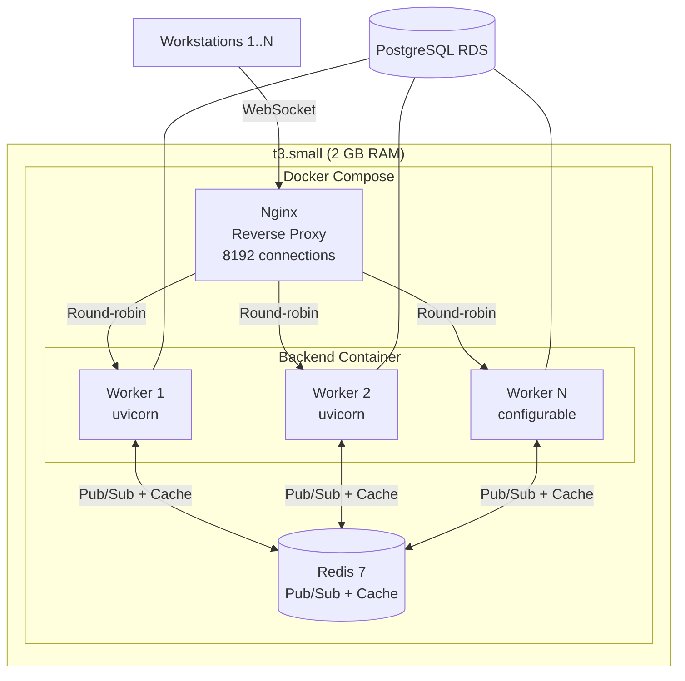
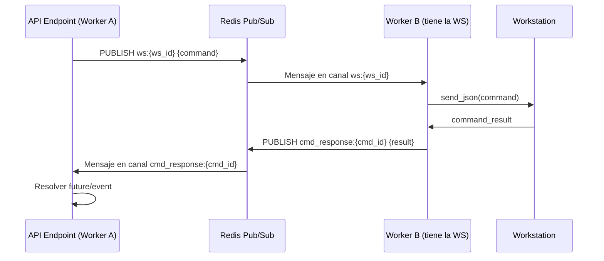

# Design Document: WebSocket Scaling con Redis

## Overview

Este diseño transforma el backend de AlwaysPrint Cloud Management de un modelo single-worker con estado en memoria a un modelo multi-worker con Redis como broker de mensajes y cache de registro. El objetivo es soportar 8100 conexiones WebSocket simultáneas en una instancia t3.small (2 vCPU, 2 GB RAM).

**Decisiones clave:**
1. Redis pub/sub para comunicación inter-worker (no Redis Streams, por simplicidad y latencia)
2. Cache de registro con TTL configurable para eliminar queries redundantes al hot path
3. Modelo híbrido: cada worker mantiene estado local (dict workstation→WebSocket) + coordina vía Redis
4. Fallback graceful: si Redis cae, los workers operan de forma independiente sin interrumpir conexiones locales
5. Sin cambios al protocolo WebSocket del cliente C#

**Restricciones:**
- Python 3.12, FastAPI, SQLAlchemy sync, uvicorn
- Redis 7 Alpine ya disponible en docker-compose
- Solo entorno DEV inicialmente
- Instancia t3.small: 2 GB RAM, ~150 MB overhead SO → ~1.8 GB disponibles para la aplicación

## Architecture



### Canales Redis Pub/Sub

| Canal | Propósito | Publisher | Subscriber |
|-------|-----------|-----------|------------|
| `ws:{workstation_id}` | Comando a workstation específica | Cualquier worker | Worker que tiene la conexión |
| `org:{organization_id}` | Broadcast a todas las WS de una org | Cualquier worker | Workers con WS de esa org |
| `global:broadcast` | Mensajes a todos los workers | Admin/sistema | Todos los workers |
| `cmd_response:{command_id}` | Respuesta de comando | Worker con la WS | Worker que originó el comando |

### Flujo de Mensaje Cross-Worker



## Components and Interfaces

### 1. RedisConnectionManager (reemplaza ConnectionManager actual)

**Responsabilidades:**
- Mantener estado local de conexiones (workstation_id → WebSocket)
- Suscribirse/desuscribirse de canales Redis por workstation
- Escuchar mensajes pub/sub y entregarlos localmente
- Publicar mensajes a workstations en otros workers
- Fallback a operación local si Redis no disponible

```python
class RedisConnectionManager:
    """Gestor de conexiones WebSocket con coordinación via Redis pub/sub."""
    
    def __init__(self, redis_url: Optional[str] = None):
        # Estado local (igual que antes)
        self.workstation_connections: Dict[str, WebSocket] = {}
        self.operator_connections: Dict[str, Set[WebSocket]] = {}
        self.last_pong: Dict[str, datetime] = {}
        self.last_activity: Dict[str, datetime] = {}
        self.org_ids: Dict[str, str] = {}
        
        # Redis
        self._redis_url = redis_url
        self._pubsub: Optional[aioredis.PubSub] = None
        self._redis: Optional[aioredis.Redis] = None
        self._listener_task: Optional[asyncio.Task] = None
        self._redis_available: bool = False
        
        # Worker identity
        self._worker_id: str = f"worker_{os.getpid()}"
        
        # Comando waiters (mismo patrón actual + Redis)
        self._pending_command_responses: Dict[str, Tuple[asyncio.Event, List]] = {}
    
    async def initialize(self) -> None:
        """Conectar a Redis, suscribir canal global, iniciar listener."""
        ...
    
    async def connect_workstation(
        self, workstation_id: str, websocket: WebSocket,
        db: Session, organization_id: str
    ) -> None:
        """Registra conexión local + suscribe canales Redis."""
        ...
    
    async def disconnect_workstation(
        self, workstation_id: str, db: Session, websocket: WebSocket = None
    ) -> None:
        """Desconecta local + desuscribe canales Redis + limpia registro."""
        ...
    
    async def send_to_workstation(
        self, workstation_id: str, message: dict, db: Session
    ) -> bool:
        """Envía local si está aquí, o publica en Redis si está en otro worker."""
        ...
    
    async def broadcast_to_organization(
        self, organization_id: str, message: dict, db: Session
    ) -> None:
        """Envía a locales + publica en canal org:{org_id} para otros workers."""
        ...
    
    async def _redis_listener(self) -> None:
        """Loop que procesa mensajes entrantes del pub/sub."""
        ...
    
    async def _handle_redis_reconnect(self) -> None:
        """Reconnexión exponencial: 1s, 2s, 4s, 8s, 16s, 30s max."""
        ...
```

### 2. RegistrationCache

**Responsabilidades:**
- Cachear datos de organización, VLAN, config efectiva, estado contingencia
- Invalidar cache cuando se modifican datos vía API
- Fallback transparente a PostgreSQL si Redis no disponible

```python
class RegistrationCache:
    """Cache de datos de registro en Redis con fallback a PostgreSQL."""
    
    def __init__(self, redis: Optional[aioredis.Redis], ttl_seconds: int = 300):
        self._redis = redis
        self._ttl = ttl_seconds
    
    async def get_organization_data(
        self, organization_id: str, db: Session
    ) -> dict:
        """Obtiene datos de org desde cache o BD."""
        ...
    
    async def get_vlan_data(
        self, vlan_id: str, db: Session
    ) -> dict:
        """Obtiene datos de VLAN desde cache o BD."""
        ...
    
    async def get_effective_config(
        self, workstation_id: str, db: Session
    ) -> dict:
        """Obtiene config efectiva desde cache o BD."""
        ...
    
    async def get_forced_contingency_state(
        self, workstation_id: str, organization_id: str,
        vlan_id: Optional[str], db: Session
    ) -> dict:
        """Obtiene estado de contingencia forzada desde cache o BD."""
        ...
    
    async def invalidate_organization(self, organization_id: str) -> None:
        """Invalida todas las keys de una organización."""
        ...
    
    async def invalidate_vlan(self, vlan_id: str, organization_id: str) -> None:
        """Invalida keys de una VLAN específica."""
        ...
```

### 3. WorkerRegistry

**Responsabilidades:**
- Registrar qué workstations están en qué worker (Redis SET con TTL)
- Detectar workers muertos vía expiración de keys
- Resolver a qué worker enviar un comando

```python
class WorkerRegistry:
    """Registro de workstations por worker con TTL para detección de crashes."""
    
    def __init__(self, redis: aioredis.Redis, worker_id: str, ttl: int = 60):
        self._redis = redis
        self._worker_id = worker_id
        self._ttl = ttl
    
    async def register_workstation(self, workstation_id: str) -> None:
        """Registra workstation en el set del worker con TTL."""
        ...
    
    async def unregister_workstation(self, workstation_id: str) -> None:
        """Elimina workstation del set del worker."""
        ...
    
    async def heartbeat(self) -> None:
        """Renueva TTL del set del worker (llamar periódicamente)."""
        ...
    
    async def cleanup_on_shutdown(self) -> None:
        """Elimina todo el set del worker (shutdown graceful)."""
        ...
    
    async def find_worker_for_workstation(self, workstation_id: str) -> Optional[str]:
        """Busca en qué worker está una workstation."""
        ...
```

### 4. Modificaciones al WebSocket Handler

El handler (`workstation.py`) se modifica para:
1. Reemplazar `print()` con `structlog` (structured logging)
2. Usar `RegistrationCache` para el hot path
3. Ejecutar queries sync en `run_in_executor`
4. Resolver contingencia forzada en una sola query (JOIN)

### 5. Health Check Endpoint

```python
@router.get("/api/v1/health/detailed")
async def health_detailed():
    """Health check con estado de Redis y conexiones por worker."""
    return {
        "status": "healthy",
        "redis": {"connected": True, "latency_ms": 1.2},
        "worker_id": "worker_12345",
        "connections": {
            "workstations": 2700,
            "operators": 5
        },
        "memory_mb": 450
    }
```

## Data Models

### Redis Key Schema

```
# Pub/Sub channels
ws:{workstation_id}           → Comandos dirigidos a una workstation
org:{organization_id}         → Broadcasts organizacionales
global:broadcast              → Broadcasts globales
cmd_response:{command_id}     → Respuestas de comandos

# Cache keys (con namespace por org)
cache:org:{organization_id}:data             → JSON datos de organización
cache:org:{organization_id}:public_ips       → JSON lista de IPs públicas
cache:vlan:{vlan_id}:data                    → JSON datos de VLAN
cache:config:{workstation_id}:effective      → JSON config efectiva
cache:contingency:{workstation_id}:state     → JSON estado contingencia forzada

# Worker registry
workers:{worker_id}:workstations             → SET de workstation_ids (TTL 60s)
workers:{worker_id}:heartbeat                → timestamp (TTL 60s)
```

### Formato de Mensajes Pub/Sub

```json
// Comando a workstation (canal ws:{workstation_id})
{
    "type": "command",
    "command_id": "uuid",
    "command_type": "check_update",
    "params": {},
    "source_worker": "worker_12345",
    "organization_id": "org_uuid"
}

// Broadcast organizacional (canal org:{organization_id})
{
    "type": "forced_contingency",
    "enabled": true,
    "source": "organization",
    "source_name": "BBVA Peru",
    "printer_ip": "192.168.1.100",
    "organization_id": "org_uuid"
}

// Respuesta de comando (canal cmd_response:{command_id})
{
    "command_id": "uuid",
    "success": true,
    "output": "...",
    "workstation_id": "ws_uuid"
}
```

### Configuración (nuevas variables de entorno)

| Variable | Default | Descripción |
|----------|---------|-------------|
| `REDIS_URL` | `None` | URL de conexión Redis (ya existe) |
| `UVICORN_WORKERS` | `1` | Número de workers uvicorn |
| `CACHE_TTL_SECONDS` | `300` | TTL del cache de registro (ya existe) |
| `DB_POOL_SIZE` | `30` | Tamaño del pool de conexiones BD |
| `DB_MAX_OVERFLOW` | `10` | Overflow del pool BD |
| `WS_REDIS_RECONNECT_MAX_INTERVAL` | `30` | Intervalo máximo de reconexión Redis (segundos) |
| `WORKER_REGISTRY_TTL` | `60` | TTL de registro de worker (segundos) |

### Estimación de Memoria (8100 conexiones, 2 workers)

| Componente | Por conexión | Total |
|------------|-------------|-------|
| WebSocket (uvicorn/websockets) | ~50 KB | ~405 MB |
| Dict local (workstation_id → ws) | ~200 B | ~1.6 MB |
| Asyncio tasks (ping loop, listener) | ~10 KB | ~20 KB/worker |
| Redis client (por worker) | — | ~5 MB/worker |
| Python base + FastAPI | — | ~80 MB/worker |
| **Total estimado (2 workers)** | — | **~600 MB** |

Con Redis (~30 MB) + overhead: **~650 MB total** → dentro del presupuesto de 1.8 GB.


## Correctness Properties

*A property is a characteristic or behavior that should hold true across all valid executions of a system — essentially, a formal statement about what the system should do. Properties serve as the bridge between human-readable specifications and machine-verifiable correctness guarantees.*

### Property 1: Message Routing to Correct Channel

*For any* message type (workstation command, organization broadcast, or command response) and any target identifier, the system SHALL publish the message to the correctly-formatted Redis channel: `ws:{workstation_id}` for workstation commands, `org:{organization_id}` for organization broadcasts, and `cmd_response:{command_id}` for command responses.

**Validates: Requirements 1.1, 1.3, 1.6**

### Property 2: Local Delivery Only to Matching Connections

*For any* message received on a Redis pub/sub channel, the Connection_Manager SHALL deliver it only to locally-connected WebSockets that match the channel's target. For `ws:{id}`, deliver only to the WebSocket with that workstation_id. For `org:{id}`, deliver only to workstations whose org_id equals the channel's organization_id. No non-matching connection shall receive the message.

**Validates: Requirements 1.2, 1.4, 5.3**

### Property 3: Tenant Isolation at Command Delivery

*For any* Cross_Worker_Command with originating organization_id X targeting a workstation with registered organization_id Y, the Connection_Manager SHALL deliver the command if and only if X == Y. If X != Y, the message SHALL be discarded.

**Validates: Requirements 5.4, 5.5**

### Property 4: Cache Key Namespacing by Organization

*For any* cache operation (read or write) performed by the RegistrationCache, the Redis key SHALL contain the organization_id as a namespace prefix, ensuring that data from organization A is never accessible when querying for organization B.

**Validates: Requirements 5.2**

### Property 5: Cache Hit Eliminates Database Query

*For any* cacheable data type (organization data, VLAN data, effective configuration, forced contingency state) and any valid identifier, if the data exists in Redis with a non-expired TTL, the RegistrationCache SHALL return the cached data without executing any PostgreSQL query.

**Validates: Requirements 3.1, 3.2, 3.3, 3.4**

### Property 6: Cache Miss Round-Trip

*For any* cache miss (data not present in Redis or TTL expired), the RegistrationCache SHALL query PostgreSQL, store the result in Redis with the configured TTL, and return the data. After this operation, an immediate subsequent request for the same data SHALL be served from cache (Property 5).

**Validates: Requirements 3.5**

### Property 7: Cache Invalidation on Modification

*For any* modification to organization data or VLAN configuration performed via the API, all related Redis cache keys (including organization data, VLAN data, effective configuration, and forced contingency state for affected workstations) SHALL be deleted from Redis.

**Validates: Requirements 3.8**

### Property 8: Graceful Fallback When Redis Unavailable

*For any* operation (message delivery to local workstation, registration data retrieval, command response) when Redis is unreachable, the system SHALL complete the operation using local state or direct PostgreSQL queries without raising an error to the client.

**Validates: Requirements 1.7, 3.7, 4.6**

### Property 9: Connection Lifecycle Pub/Sub Symmetry

*For any* workstation_id, after calling `connect_workstation`, the Redis pub/sub SHALL be subscribed to channel `ws:{workstation_id}`. After calling `disconnect_workstation`, the Redis pub/sub SHALL be unsubscribed from that channel. At any point, the set of subscribed workstation channels equals the set of locally-connected workstation_ids.

**Validates: Requirements 1.9**

### Property 10: Worker Registry Lifecycle

*For any* workstation_id, after `connect_workstation`, the workstation_id SHALL appear in the Redis set `workers:{worker_id}:workstations`. After `disconnect_workstation`, it SHALL be removed. After `graceful_shutdown`, the set SHALL be empty and all WebSockets SHALL have received close code 1001.

**Validates: Requirements 2.2, 2.3**

### Property 11: Ping Loop Isolation

*For any* worker with a set of locally-connected workstations L, the Death_Ping loop SHALL only send ping messages to workstations in L. No workstation connected to a different worker shall receive a ping from this worker.

**Validates: Requirements 2.5**

### Property 12: Single-Query Contingency Equivalence

*For any* workstation with any combination of organization, VLAN, and workstation-level forced_contingency flags, the optimized single-query resolution SHALL produce the same result (enabled/disabled, source, source_name, printer_ip) as the current sequential 3-query approach.

**Validates: Requirements 4.5**

### Property 13: Worker-Independent Registration Result

*For any* workstation registration request, the sequence of messages sent to the client (registered, config_update, forced_contingency, pending messages) SHALL be identical regardless of which worker handles the connection.

**Validates: Requirements 6.5**

### Property 14: In-Memory Mode Without Redis

*For any* configuration where REDIS_URL is None or empty, the system SHALL operate using the in-memory ConnectionManager without attempting any Redis connection, and all local message delivery SHALL function correctly.

**Validates: Requirements 7.3**

## Observabilidad y Logging Temporal

### Structured Logging con structlog

Reemplazar todos los `print()` del WebSocket handler con structured logging que incluya campos clave para debugging:

```python
import structlog

logger = structlog.get_logger()

# Ejemplo de uso en el flujo de registro
logger.info("ws.connection_accepted", worker_id=worker_id)
logger.info("ws.register_received", worker_id=worker_id, ip_private=ip_private, cidr=cidr)
logger.info("ws.cache_hit", data_type="organization", org_id=org_id, worker_id=worker_id)
logger.info("ws.cache_miss", data_type="vlan", vlan_id=vlan_id, worker_id=worker_id)
logger.info("ws.registration_complete", workstation_id=ws_id, latency_ms=elapsed, cache_hits=3, db_queries=1)
```

### Logging Temporal para Validación (DEV only)

Durante la fase de validación, activar logging detallado adicional para verificar el comportamiento del sistema multi-worker. Este logging se desactiva con una variable de entorno `WS_DEBUG_LOGGING=false` una vez validado.

**Eventos a loggear con nivel DEBUG:**

| Evento | Campos | Propósito |
|--------|--------|-----------|
| `redis.publish` | channel, message_type, worker_id | Verificar que los mensajes se envían al canal correcto |
| `redis.receive` | channel, message_type, worker_id | Verificar que los mensajes se reciben en el worker correcto |
| `redis.subscribe` | channel, workstation_id, worker_id | Verificar suscripción por workstation |
| `redis.unsubscribe` | channel, workstation_id, worker_id | Verificar desuscripción limpia |
| `redis.reconnect_attempt` | attempt, delay_seconds, worker_id | Tracking de reconexiones |
| `redis.connection_restored` | downtime_seconds, worker_id | Confirmación de recuperación |
| `cache.hit` | key, data_type, ttl_remaining | Verificar eficacia del cache |
| `cache.miss` | key, data_type, worker_id | Detectar cache misses inesperados |
| `cache.set` | key, data_type, ttl_seconds | Verificar que se almacena correctamente |
| `cache.invalidate` | keys_deleted, trigger, org_id | Verificar invalidación |
| `worker.register_ws` | workstation_id, worker_id, total_local | Tracking de distribución |
| `worker.unregister_ws` | workstation_id, worker_id, total_local | Tracking de desconexiones |
| `worker.heartbeat` | worker_id, ws_count, memory_mb | Salud por worker |
| `delivery.local` | workstation_id, message_type, worker_id | Entrega local exitosa |
| `delivery.remote_publish` | workstation_id, message_type, target_channel | Routing a otro worker |
| `delivery.org_broadcast` | org_id, local_count, message_type | Fan-out organizacional |
| `tenant.validation_ok` | workstation_id, org_id, message_type | Verificación de tenant exitosa |
| `tenant.validation_fail` | workstation_id, ws_org_id, msg_org_id | ALERTA: posible violación |
| `registration.hot_path_timing` | workstation_id, steps (dict con ms por paso) | Desglose de latencia |

**Ejemplo de log de timing del hot path:**

```python
logger.debug(
    "registration.hot_path_timing",
    workstation_id=ws_id,
    worker_id=worker_id,
    total_ms=total_elapsed,
    steps={
        "register_workstation_ms": 45,
        "cache_org_data_ms": 2,       # cache hit
        "cache_vlan_data_ms": 1,       # cache hit
        "cache_config_ms": 3,          # cache hit
        "resolve_contingency_ms": 8,   # single query
        "send_registered_ms": 1,
        "send_config_ms": 1,
        "send_contingency_ms": 1,
        "send_pending_msgs_ms": 5,
    }
)
```

**Configuración:**

| Variable | Default | Descripción |
|----------|---------|-------------|
| `WS_DEBUG_LOGGING` | `true` (DEV) | Activa/desactiva logging temporal detallado |
| `WS_LOG_TIMING` | `true` (DEV) | Activa desglose de timing del hot path |

### Métricas del Health Check Detallado

El endpoint `/api/v1/health/detailed` expondrá estadísticas en tiempo real para monitoreo:

```json
{
    "status": "healthy",
    "worker_id": "worker_12345",
    "redis": {
        "connected": true,
        "latency_ms": 0.8,
        "subscriptions": 2700
    },
    "connections": {
        "workstations": 2700,
        "operators": 3
    },
    "cache": {
        "hits_last_minute": 450,
        "misses_last_minute": 12,
        "hit_ratio_pct": 97.4
    },
    "registration": {
        "p95_latency_ms": 120,
        "total_last_minute": 45
    },
    "memory_mb": 320,
    "uptime_seconds": 3600
}
```

## Error Handling

### Redis Failures

| Escenario | Comportamiento | Impacto |
|-----------|---------------|---------|
| Redis connection lost | Exponential backoff (1s→30s max), continúa operación local | Cross-worker commands no llegan hasta reconexión |
| Redis timeout en PUBLISH | Log warning, operación local continúa | Mensaje se pierde para workers remotos |
| Redis timeout en GET (cache) | Fallback a PostgreSQL | Latencia de registro aumenta |
| Redis OOM | Log error, fallback a PostgreSQL | Cache inoperativo hasta recuperación |

### PostgreSQL Failures

| Escenario | Comportamiento | Impacto |
|-----------|---------------|---------|
| DB unreachable durante cache-miss | Return error, NO cachear valor vacío | Registration falla, WebSocket se cierra con 1011 |
| DB connection pool exhausted | Queue request, timeout 30s | Latencia alta, posible cierre con 1011 |
| DB slow query (>5s) | run_in_executor evita bloquear event loop | Otras conexiones no afectadas |

### Worker Failures

| Escenario | Comportamiento | Impacto |
|-----------|---------------|---------|
| Worker crash (SIGKILL) | Redis TTL expira registros en ≤60s | Workstations se reconectan a otro worker |
| Worker graceful shutdown (SIGTERM) | Cierra WebSockets con 1001, limpia Redis | Workstations se reconectan inmediatamente |
| Worker memory pressure | OS puede enviar SIGKILL si excede cgroup | Tratado como crash |

### Seguridad (Tenant Isolation)

| Escenario | Comportamiento |
|-----------|---------------|
| Mensaje con org_id no coincide con WS | Discard + log security warning |
| org_id no determinable en delivery | Discard + log security warning |
| Cache key sin namespace org_id | NUNCA debe ocurrir (validado por Property 4) |

## Testing Strategy

### Property-Based Testing (PBT)

**Librería:** `hypothesis` (Python, ya presente en el proyecto — se observa directorio `.hypothesis/`)

**Configuración:**
- Mínimo 100 iteraciones por propiedad
- Cada test referencia su propiedad del diseño vía tag en docstring

**Tests de propiedad a implementar:**

| Property | Módulo bajo test | Generadores |
|----------|-----------------|-------------|
| 1: Channel routing | `RedisConnectionManager.send_to_workstation`, `broadcast_to_organization` | UUIDs aleatorios, tipos de mensaje |
| 2: Local delivery matching | `RedisConnectionManager._handle_pubsub_message` | Conjuntos de conexiones con org_ids variados |
| 3: Tenant isolation | `RedisConnectionManager._deliver_command` | Pares (command.org_id, ws.org_id) |
| 4: Cache key namespace | `RegistrationCache._build_key` | org_ids, tipos de datos |
| 5: Cache hit | `RegistrationCache.get_*` | Datos pre-cargados en mock Redis |
| 6: Cache miss round-trip | `RegistrationCache.get_*` | Datos NO en Redis, mock DB |
| 7: Cache invalidation | `RegistrationCache.invalidate_*` | org_ids, vlan_ids, tipos de datos |
| 8: Redis fallback | `RedisConnectionManager`, `RegistrationCache` | Operaciones con Redis=None/unreachable |
| 9: Pub/Sub lifecycle | `RedisConnectionManager.connect/disconnect` | Secuencias de connect/disconnect |
| 10: Worker registry | `WorkerRegistry.register/unregister/cleanup` | Secuencias de operaciones |
| 11: Ping isolation | `RedisConnectionManager.start_ping_loop` | Conjuntos de conexiones particionados |
| 12: Contingency equivalence | `resolve_forced_contingency_optimized` vs `resolve_forced_contingency_sequential` | Combinaciones de flags org/vlan/ws |
| 13: Worker-independent registration | `registration_flow` | Workstation data + worker assignment |
| 14: In-memory mode | `ConnectionManager factory` | REDIS_URL=None scenarios |

**Tag format:** `# Feature: websocket-scaling-redis, Property {N}: {title}`

### Unit Tests (Example-Based)

- Startup sequence (global:broadcast subscription before accepting connections)
- Specific WebSocket close codes (1008, 1011, 1001, 1000)
- Registration flow message sequence
- Health check endpoint response format
- Configuration defaults and overrides

### Integration Tests

- 2 workers + Redis: command cross-worker delivery
- Worker crash simulation (TTL expiry)
- Load test: 8100 connections, p95 latency < 500ms
- Broadcast latency < 2s under load
- Memory consumption < 1.8 GB under load

### Smoke Tests

- UVICORN_WORKERS >= 2 in DEV config
- No `print()` calls in WebSocket handler
- Docker-compose network connectivity (backend → redis)
- DB_POOL_SIZE and DB_MAX_OVERFLOW from env vars
