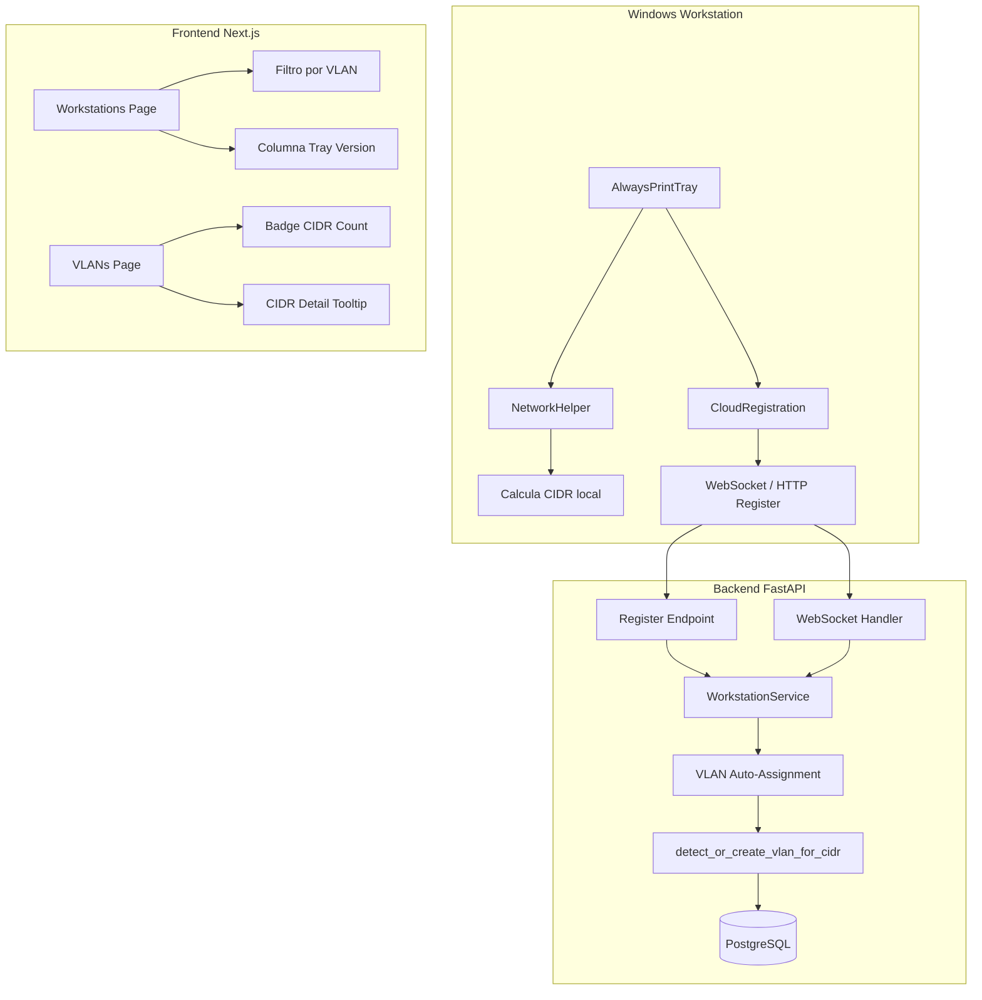
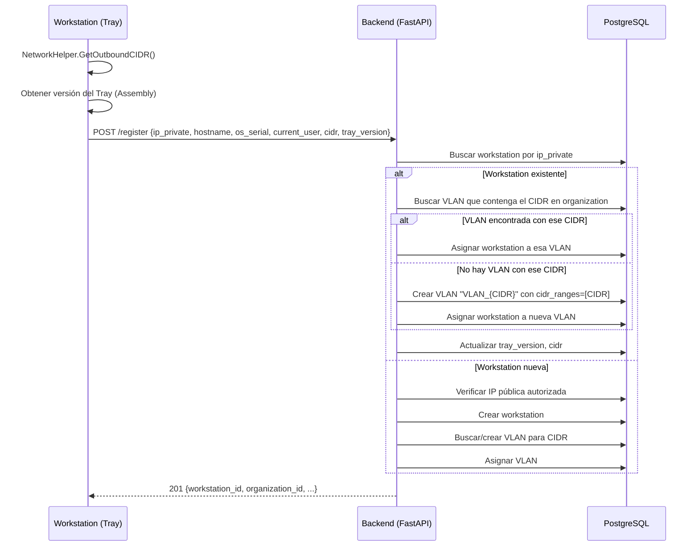
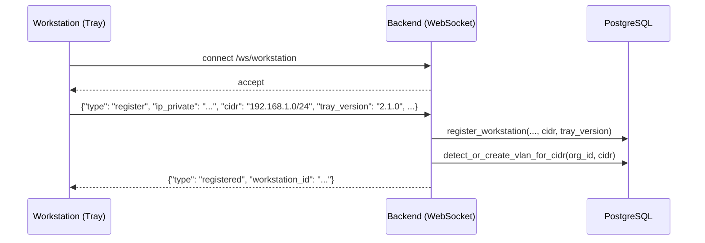

# Design Document: Workstation CIDR & VLAN Registration

## Overview

Esta feature extiende el flujo de registro de workstations en AlwaysPrint para incluir información de red (CIDR) y versión del Tray, permitiendo la asignación automática de VLANs basada en el segmento de red reportado por cada workstation.

Actualmente, el registro envía `ip_private`, `hostname`, `os_serial` y `current_user`. La detección de VLAN se hace comparando la IP privada contra los rangos CIDR existentes. Esta feature cambia el paradigma: la workstation calcula su propio CIDR (IP + máscara de subred de la interfaz que sale a Internet) y lo envía al backend, que lo usa para asignar o auto-crear VLANs.

Adicionalmente, se mejora la UI del listado de workstations (filtro por VLAN, versión del Tray visible) y se agregan indicadores visuales de salud en el registro de VLANs (badges verde/amarillo/rojo según cantidad de CIDRs por VLAN).

## Architecture



## Sequence Diagrams

### Flujo de Registro con CIDR



### Flujo WebSocket con CIDR



## Components and Interfaces

### Component 1: NetworkHelper (C# - Cliente)

**Purpose**: Calcular el CIDR de la interfaz de red que se usa para salir a Internet.

**Interface**:
```csharp
public static class NetworkHelper
{
    // Existente
    public static string GetOutboundLocalIP();
    
    // Nuevo: obtiene el CIDR (IP de red + prefijo) de la interfaz principal
    public static string GetOutboundCIDR();
    
    // Nuevo: obtiene la máscara de subred de la interfaz principal
    public static IPAddress? GetOutboundSubnetMask();
}
```

**Responsibilities**:
- Detectar la interfaz de red principal (la que tiene gateway)
- Obtener la máscara de subred de esa interfaz
- Calcular el network address aplicando la máscara a la IP
- Devolver el CIDR en formato `network/prefix` (ej: `192.168.1.0/24`)

### Component 2: CloudRegistration (C# - Cliente)

**Purpose**: Enviar CIDR y versión del Tray durante el registro.

**Interface actualizada**:
```csharp
// Datos de registro actualizados
var registerData = new
{
    ip_private = localIP,
    hostname = Environment.MachineName,
    os_serial = GetOsSerial(),
    current_user = Environment.UserName,
    cidr = NetworkHelper.GetOutboundCIDR(),           // NUEVO
    tray_version = GetTrayVersion()                    // NUEVO
};
```

### Component 3: WorkstationService (Python - Backend)

**Purpose**: Lógica de negocio para registro con auto-asignación de VLAN por CIDR.

**Interface actualizada**:
```python
class WorkstationService:
    def register_workstation(
        self,
        db: Session,
        ip_private: str,
        public_ip: str,
        hostname: Optional[str] = None,
        os_serial: Optional[str] = None,
        current_user: Optional[str] = None,
        cidr: Optional[str] = None,          # NUEVO
        tray_version: Optional[str] = None   # NUEVO
    ) -> tuple[Optional[Workstation], bool, str]: ...
    
    def detect_or_create_vlan_for_cidr(
        self,
        db: Session,
        organization_id: str,
        cidr: str
    ) -> Optional[str]: ...
```

### Component 4: Frontend - Workstations Page (TypeScript)

**Purpose**: Mostrar versión del Tray y permitir filtro por VLAN cuando se selecciona organización.

**Interface**:
```typescript
// Nuevo filtro de VLAN (aparece cuando se selecciona organización)
interface WorkstationFilters {
  search?: string;
  is_online?: boolean;
  contingency_active?: boolean;
  organization_id?: string;
  vlan_id?: string;  // NUEVO: filtro por VLAN
}

// Tipo Workstation extendido
interface Workstation {
  // ... campos existentes ...
  tray_version?: string;  // NUEVO
  cidr?: string;          // NUEVO
}
```

### Component 5: Frontend - VLANs Page (TypeScript)

**Purpose**: Mostrar indicadores visuales de salud CIDR por VLAN.

**Interface**:
```typescript
// Badge de salud CIDR
type CidrHealthLevel = 'green' | 'yellow' | 'red';

function getCidrHealthLevel(cidrCount: number): CidrHealthLevel {
  if (cidrCount === 1) return 'green';
  if (cidrCount === 2) return 'yellow';
  return 'red'; // 3+
}
```

## Data Models

### Workstation Model (actualizado)

```python
class Workstation(Base):
    __tablename__ = "workstations"
    
    # ... campos existentes ...
    
    # NUEVOS CAMPOS
    cidr = Column(String(45), nullable=True)          # CIDR reportado: "192.168.1.0/24"
    tray_version = Column(String(50), nullable=True)  # Versión del Tray: "2.1.0.0"
```

**Validation Rules**:
- `cidr`: formato válido IPv4 CIDR (x.x.x.x/prefix donde prefix 8-30), nullable para backward compatibility
- `tray_version`: string libre, máximo 50 chars, nullable

### WorkstationRegisterRequest Schema (actualizado)

```python
class WorkstationRegisterRequest(BaseModel):
    ip_private: str
    hostname: Optional[str] = None
    os_serial: Optional[str] = None
    current_user: Optional[str] = None
    cidr: str                                # NUEVO - obligatorio
    tray_version: Optional[str] = None       # NUEVO
    
    @field_validator('cidr')
    @classmethod
    def validate_cidr(cls, v: str) -> str:
        try:
            ipaddress.ip_network(v, strict=False)
        except ValueError:
            raise ValueError(f"CIDR inválido: {v}")
        return str(ipaddress.ip_network(v, strict=False))
```

### VLAN Model (sin cambios estructurales)

El modelo VLAN existente ya soporta múltiples CIDRs via `cidr_ranges: JSON`. La auto-creación simplemente crea una VLAN nueva con un solo CIDR en el array.

## Algorithmic Pseudocode

### Algoritmo: detect_or_create_vlan_for_cidr

```python
def detect_or_create_vlan_for_cidr(
    self,
    db: Session,
    organization_id: str,
    cidr: str
) -> Optional[str]:
    """
    Busca una VLAN existente que contenga el CIDR reportado.
    Si no existe, auto-crea una VLAN con nombre VLAN_{CIDR}.
    
    Precondiciones:
    - cidr es un string CIDR válido (ya validado por Pydantic)
    - organization_id es un UUID válido de una organización existente
    
    Postcondiciones:
    - Retorna el UUID de la VLAN asignada (existente o nueva)
    - Si se crea VLAN nueva, tiene name="VLAN_{cidr}" y cidr_ranges=[cidr]
    - La VLAN pertenece a la organización indicada
    """
    # Normalizar CIDR
    normalized_cidr = str(ipaddress.ip_network(cidr, strict=False))
    
    # Buscar VLANs de la organización
    vlans = db.query(VLAN).filter_by(organization_id=organization_id).all()
    
    # Verificar si alguna VLAN ya contiene este CIDR exacto
    for vlan in vlans:
        if normalized_cidr in (vlan.cidr_ranges or []):
            return str(vlan.id)
    
    # No encontrada: auto-crear VLAN
    new_vlan = VLAN(
        organization_id=organization_id,
        name=f"VLAN_{normalized_cidr}",
        description=f"Auto-creada durante registro de workstation con CIDR {normalized_cidr}",
        cidr_ranges=[normalized_cidr]
    )
    db.add(new_vlan)
    db.flush()
    
    return str(new_vlan.id)
```

**Preconditions:**
- `cidr` es un string CIDR válido (validado previamente por Pydantic schema)
- `organization_id` corresponde a una organización existente y activa

**Postconditions:**
- Siempre retorna un UUID de VLAN válido (nunca None si el CIDR es válido)
- Si se crea una VLAN nueva, su nombre sigue el patrón `VLAN_{network/prefix}`
- La VLAN creada pertenece a la organización indicada

**Loop Invariants:**
- En el loop de búsqueda: todas las VLANs revisadas hasta el momento no contienen el CIDR buscado

### Algoritmo: GetOutboundCIDR (C#)

```csharp
/// <summary>
/// Calcula el CIDR de la interfaz de red principal.
/// 
/// Precondiciones:
/// - El sistema tiene al menos una interfaz de red activa con gateway
/// 
/// Postcondiciones:
/// - Retorna string en formato "x.x.x.x/prefix" (ej: "192.168.1.0/24")
/// - Si no puede determinar, retorna null
/// - El network address es calculado correctamente (IP AND mask)
/// </summary>
public static string? GetOutboundCIDR()
{
    var interfaces = NetworkInterface.GetAllNetworkInterfaces()
        .Where(ni => ni.OperationalStatus == OperationalStatus.Up
                  && ni.NetworkInterfaceType != NetworkInterfaceType.Loopback
                  && ni.NetworkInterfaceType != NetworkInterfaceType.Tunnel)
        .OrderBy(ni => GetInterfacePriority(ni));

    foreach (var ni in interfaces)
    {
        var ipProps = ni.GetIPProperties();
        var gateways = ipProps.GatewayAddresses
            .Where(g => g.Address.AddressFamily == AddressFamily.InterNetwork)
            .ToList();

        if (!gateways.Any()) continue;

        var unicast = ipProps.UnicastAddresses
            .FirstOrDefault(a => a.Address.AddressFamily == AddressFamily.InterNetwork
                              && !IPAddress.IsLoopback(a.Address));

        if (unicast == null) continue;

        // Calcular network address: IP AND SubnetMask
        byte[] ipBytes = unicast.Address.GetAddressBytes();
        byte[] maskBytes = unicast.IPv4Mask.GetAddressBytes();
        byte[] networkBytes = new byte[4];
        
        for (int i = 0; i < 4; i++)
            networkBytes[i] = (byte)(ipBytes[i] & maskBytes[i]);

        IPAddress networkAddress = new IPAddress(networkBytes);
        int prefixLength = CountBits(maskBytes);

        return $"{networkAddress}/{prefixLength}";
    }

    return null;
}

private static int CountBits(byte[] mask)
{
    int bits = 0;
    foreach (byte b in mask)
    {
        byte temp = b;
        while (temp != 0)
        {
            bits += temp & 1;
            temp >>= 1;
        }
    }
    return bits;
}
```

## Key Functions with Formal Specifications

### Function: register_workstation (actualizada)

```python
def register_workstation(
    self, db, ip_private, public_ip, hostname=None, 
    os_serial=None, current_user=None, cidr=None, tray_version=None
) -> tuple[Optional[Workstation], bool, str]:
```

**Preconditions:**
- `ip_private` es una dirección IPv4 válida no vacía
- `public_ip` es una dirección IPv4 válida o "unknown"
- `cidr` es un CIDR IPv4 válido obligatorio (x.x.x.x/prefix)
- `tray_version` si presente, es un string no vacío ≤ 50 chars

**Postconditions:**
- Si workstation existente: actualiza `cidr`, `tray_version`, re-evalúa VLAN
- Si workstation nueva y IP autorizada: crea workstation con VLAN auto-asignada
- El campo `vlan_id` siempre refleja la VLAN correcta para el CIDR reportado

### Function: detect_or_create_vlan_for_cidr

```python
def detect_or_create_vlan_for_cidr(self, db, organization_id, cidr) -> Optional[str]:
```

**Preconditions:**
- `cidr` es un string CIDR normalizado válido
- `organization_id` es un UUID de organización existente

**Postconditions:**
- Retorna UUID de VLAN (nunca None para CIDR válido)
- Si VLAN existente contiene el CIDR exacto → retorna esa VLAN
- Si no existe → crea VLAN con nombre `VLAN_{cidr}` y retorna su UUID
- La VLAN creada tiene `cidr_ranges = [cidr]`

## Example Usage

### Cliente C# - Registro con CIDR

```csharp
// En CloudRegistration.TryRegisterAsync()
string localIP = NetworkHelper.GetOutboundLocalIP();
string? cidr = NetworkHelper.GetOutboundCIDR();
string trayVersion = GetTrayVersion(); // Assembly version

var registerData = new
{
    ip_private = localIP,
    hostname = Environment.MachineName,
    os_serial = GetOsSerial(),
    current_user = Environment.UserName,
    cidr = cidr,                    // "192.168.1.0/24"
    tray_version = trayVersion      // "2.1.0.0"
};
```

### WebSocket - Mensaje de registro actualizado

```json
{
    "type": "register",
    "ip_private": "192.168.1.50",
    "hostname": "W10PC001",
    "os_serial": "XXXXX-XXXXX",
    "current_user": "jperez",
    "cidr": "192.168.1.0/24",
    "tray_version": "2.1.0.0"
}
```

### Backend - Asignación de VLAN por CIDR

```python
# En WorkstationService.register_workstation()
# CIDR es obligatorio — siempre se usa para asignar VLAN
vlan_id = self.detect_or_create_vlan_for_cidr(db, str(org_id), cidr)

workstation.vlan_id = vlan_id
workstation.cidr = cidr
workstation.tray_version = tray_version
```

### Frontend - Badge de salud CIDR en VLANs

```typescript
function CidrHealthBadge({ cidrCount }: { cidrCount: number }) {
  if (cidrCount === 1) {
    return <Badge className="bg-green-100 text-green-800">1 CIDR ✓</Badge>;
  }
  if (cidrCount === 2) {
    return <Badge className="bg-yellow-100 text-yellow-800">2 CIDRs ⚠</Badge>;
  }
  return <Badge className="bg-red-100 text-red-800">{cidrCount} CIDRs ✗</Badge>;
}
```

## Correctness Properties

*A property is a characteristic or behavior that should hold true across all valid executions of a system—essentially, a formal statement about what the system should do. Properties serve as the bridge between human-readable specifications and machine-verifiable correctness guarantees.*

### Property 1: CIDR Calculation Correctness

*For any* valid IPv4 address and valid subnet mask, applying the bitwise AND operation and computing the prefix length SHALL produce a string in the format `network_address/prefix_length` that represents a valid IPv4 network, and the network address SHALL have all host bits set to zero.

**Validates: Requirements 1.1, 1.2**

### Property 2: CIDR Normalization Idempotence

*For any* valid CIDR string, normalizing it with `ipaddress.ip_network(cidr, strict=False)` SHALL be idempotent — normalizing the result a second time SHALL produce the same string.

**Validates: Requirements 2.4, 9.3**

### Property 3: Invalid CIDR Rejection

*For any* string that is not a valid IPv4 CIDR notation, or has a prefix length outside the range 8-30, the CIDR validator SHALL reject it and return a descriptive error.

**Validates: Requirements 2.3, 9.1, 9.2**

### Property 4: VLAN Assignment Consistency

*For any* valid CIDR and organization, calling `detect_or_create_vlan_for_cidr` SHALL return a non-null VLAN UUID, and the returned VLAN's `cidr_ranges` SHALL contain the normalized CIDR. If a matching VLAN already exists, it SHALL be reused; otherwise a new VLAN named `VLAN_{CIDR}` SHALL be created.

**Validates: Requirements 3.1, 3.2, 3.3**

### Property 5: Registration Idempotence

*For any* CIDR, registering multiple workstations with the same CIDR within the same organization SHALL result in all workstations pointing to the same VLAN, and exactly one VLAN containing that CIDR SHALL exist.

**Validates: Requirements 3.4**

### Property 6: CIDR Uniqueness per Organization

*For any* organization, a given CIDR SHALL appear in the `cidr_ranges` of at most one VLAN. Attempting to add a CIDR that already exists in another VLAN of the same organization SHALL be rejected.

**Validates: Requirements 4.1, 4.2**

### Property 7: Tenant Isolation

*For any* auto-created VLAN, its `organization_id` SHALL match the registering workstation's organization. Querying VLANs SHALL only return results for the specified organization. The same CIDR MAY exist in different organizations without conflict.

**Validates: Requirements 5.1, 5.2, 5.3**

### Property 8: VLAN Re-assignment on CIDR Change

*For any* workstation that re-registers with a different CIDR, the workstation's `vlan_id` SHALL be updated to point to the VLAN corresponding to the new CIDR, and the workstation's stored `cidr` SHALL reflect the new value.

**Validates: Requirements 2.5**

### Property 9: CIDR Health Badge Mapping

*For any* non-negative integer count of CIDRs in a VLAN's `cidr_ranges`, the health badge function SHALL return `green` when count equals 1, `yellow` when count equals 2, and `red` when count is 3 or greater.

**Validates: Requirements 8.2, 8.3, 8.4**

### Property 10: VLAN Filter Correctness

*For any* selected VLAN filter, the filtered workstation list SHALL contain only workstations whose `vlan_id` matches the selected VLAN, and SHALL contain all such workstations from the dataset.

**Validates: Requirements 6.2**

## Error Handling

### Error 1: CIDR inválido en registro

**Condition**: Cliente envía un CIDR malformado (ej: "192.168.1.0/33", "abc")
**Response**: Pydantic validator rechaza con 422 Unprocessable Entity
**Recovery**: Cliente puede reintentar sin CIDR (campo opcional, fallback a legacy)

### Error 2: No se puede detectar CIDR en cliente

**Condition**: `GetOutboundCIDR()` retorna null (sin interfaz con gateway, sin máscara)
**Response**: El cliente no puede registrarse — muestra error en el Tray
**Recovery**: El usuario debe verificar su conexión de red. Sin CIDR no hay registro.

### Error 3: Race condition en auto-creación de VLAN

**Condition**: Dos workstations del mismo CIDR se registran simultáneamente
**Response**: La segunda encuentra la VLAN ya creada por la primera (query antes de crear)
**Recovery**: Si hay unique constraint violation, reintentar query de búsqueda

### Error 4: CIDR duplicado entre VLANs

**Condition**: Admin intenta agregar un CIDR a una VLAN que ya existe en otra VLAN de la misma organización
**Response**: Backend rechaza con 409 Conflict: "El CIDR ya está asignado a otra VLAN"
**Recovery**: Admin debe eliminar el CIDR de la otra VLAN primero, o mover workstations manualmente

## Testing Strategy

### Unit Testing

- Validación de CIDR en Pydantic schema (casos válidos e inválidos)
- `detect_or_create_vlan_for_cidr`: VLAN existente vs auto-creación
- `GetOutboundCIDR`: cálculo correcto de network address y prefix
- Badge de salud: mapeo correcto de count a color

### Property-Based Testing

**Library**: pytest + hypothesis (backend), FsCheck (cliente C#)

- Para cualquier IP válida y máscara válida, `GetOutboundCIDR` produce un CIDR válido
- Para cualquier CIDR válido, `detect_or_create_vlan_for_cidr` siempre retorna un UUID
- Idempotencia: registrar la misma workstation con el mismo CIDR dos veces no crea VLAN duplicada

### Integration Testing

- Registro HTTP completo con CIDR → verificar VLAN asignada
- Registro WebSocket con CIDR → verificar VLAN asignada
- Registro sin CIDR → verificar fallback a detect_vlan_for_ip
- Auto-creación de VLAN → verificar nombre y cidr_ranges

## Performance Considerations

- La búsqueda de VLAN por CIDR itera todas las VLANs de la organización. Para organizaciones con muchas VLANs (>100), considerar índice o cache.
- El cálculo de CIDR en el cliente es O(1) - solo operaciones de bits sobre la interfaz principal.
- La auto-creación de VLAN es una operación infrecuente (solo la primera vez que un CIDR nuevo aparece).

## Security Considerations

- **Tenant isolation**: VLANs auto-creadas siempre se asocian a la organización de la IP pública autorizada, nunca a otra.
- **Validación de CIDR**: Se valida con `ipaddress.ip_network()` para prevenir inyección de datos malformados.
- **No se confía en el CIDR del cliente para decisiones de seguridad**: solo se usa para agrupación lógica.
- **El campo CIDR es informativo**: un cliente malicioso podría enviar un CIDR falso, pero solo afectaría su propia agrupación dentro de su organización.

## Dependencies

- **Backend**: `ipaddress` (stdlib Python) - ya en uso
- **Cliente**: `System.Net.NetworkInformation` (ya en uso en NetworkHelper)
- **Frontend**: Sin dependencias nuevas (usa componentes existentes de shadcn/ui)
- **Base de datos**: Migración Alembic para agregar columnas `cidr` y `tray_version` a tabla `workstations`
