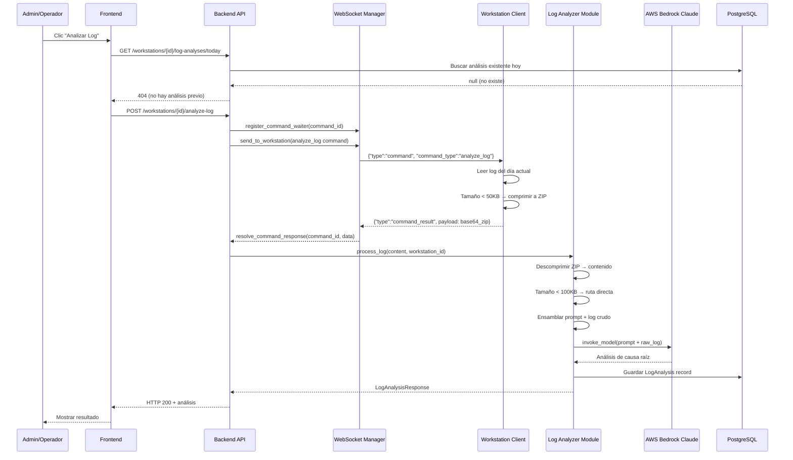
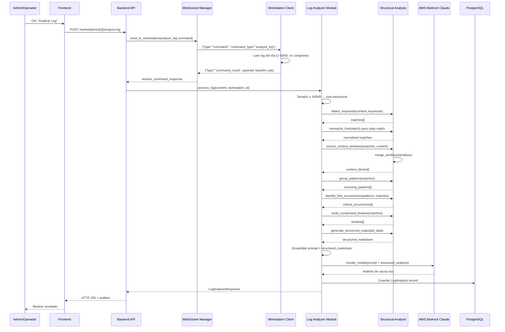
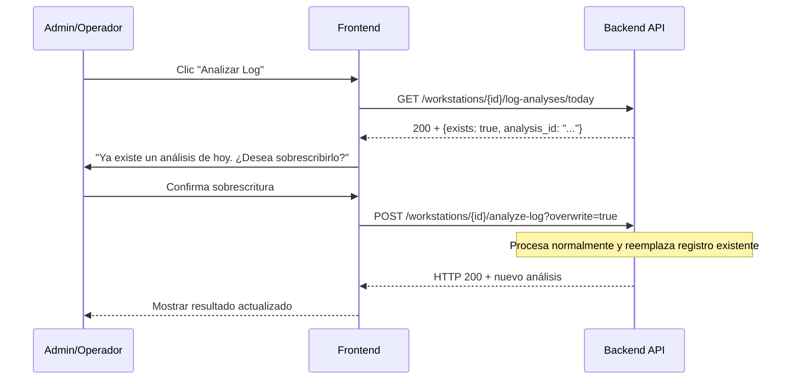

# Design Document: Workstation Log Analyzer

## Overview

Servicio backend de análisis de logs de workstations AlwaysPrint, integrado como módulo dentro de la aplicación FastAPI existente en `AlwaysPrintProject/Cloud/backend/`. El análisis se ejecuta **bajo demanda** cuando un administrador u operador solicita el diagnóstico de una workstation específica desde el dashboard frontend.

**Flujo principal:**
1. Admin/Operador hace clic en "Analizar Log" en el menú de acciones de una workstation
2. Frontend envía POST al backend con el workstation_id
3. Backend envía comando `analyze_log` vía WebSocket a la workstation
4. Workstation lee log del día actual, comprime si < 50KB, y envía al backend
5. Backend descomprime si necesario, determina ruta de procesamiento por tamaño
6. **Ruta directa** (< 100KB): log crudo + prompt → LLM
7. **Ruta estructural** (≥ 100KB): análisis estructural → datos + prompt → LLM
8. Respuesta del LLM se almacena en BD y se retorna al frontend

**Decisiones de diseño clave:**
- Reutiliza la infraestructura WebSocket existente (`connection_manager`, `register_command_waiter`, `wait_for_command_response`)
- Módulo de análisis estructural como funciones puras independientes (testables sin I/O)
- AWS Bedrock Claude 3.5 Sonnet para análisis LLM (región us-west-2)
- Un análisis por workstation por día (overwrite con confirmación)
- Tenant isolation en todas las queries (filtro por `organization_id`)

## Architecture

### Diagrama de componentes

```mermaid
flowchart TD
    subgraph Frontend["Frontend (Next.js)"]
        BTN[Botón 'Analizar Log']
        DIALOG[Diálogo de confirmación]
        RESULT[Vista de resultado]
    end

    subgraph Backend["Backend (FastAPI)"]
        EP_ANALYZE[POST /workstations/{id}/analyze-log]
        EP_CHECK[GET /workstations/{id}/log-analyses/today]
        EP_HISTORY[GET /workstations/{id}/log-analyses]
        EP_SINGLE[GET /log-analyses/{id}]
        WS_MGR[ConnectionManager]
        
        subgraph LogAnalyzer["Módulo log_analyzer"]
            ROUTER[route_by_size]
            DIRECT[direct_llm_path]
            STRUCTURAL[structural_analysis_path]
            
            subgraph StructuralFns["Funciones estructurales"]
                DETECT[detect_keywords]
                NORMALIZE[normalize_line]
                CONTEXT[extract_context_windows]
                MERGE[merge_windows]
                GROUP[group_patterns]
                TIMELINE[build_condensed_timeline]
                CRITICAL[identify_first_occurrences]
                OUTPUT[generate_structured_output]
            end
        end
        
        LLM_SVC[LLM Service - Bedrock]
        DB[(PostgreSQL)]
    end

    subgraph Workstation["Workstation Client (C#)"]
        WS_HANDLER[WebSocket Handler]
        LOG_READER[Log File Reader]
        COMPRESSOR[ZIP Compressor]
    end

    BTN -->|POST| EP_ANALYZE
    EP_ANALYZE -->|command: analyze_log| WS_MGR
    WS_MGR -->|WebSocket| WS_HANDLER
    WS_HANDLER --> LOG_READER
    LOG_READER --> COMPRESSOR
    COMPRESSOR -->|command_result + payload| WS_MGR
    WS_MGR -->|log data| ROUTER
    ROUTER -->|< 100KB| DIRECT
    ROUTER -->|>= 100KB| STRUCTURAL
    STRUCTURAL --> DETECT --> NORMALIZE --> GROUP
    STRUCTURAL --> CONTEXT --> MERGE
    GROUP --> TIMELINE
    GROUP --> CRITICAL
    MERGE --> OUTPUT
    TIMELINE --> OUTPUT
    CRITICAL --> OUTPUT
    DIRECT --> LLM_SVC
    OUTPUT --> LLM_SVC
    LLM_SVC --> DB
    DB --> RESULT
```

### Diagrama de secuencia - Ruta directa (log pequeño < 100KB)



### Diagrama de secuencia - Ruta estructural (log grande ≥ 100KB)



### Diagrama de secuencia - Análisis con overwrite



### Estructura de archivos del módulo

```
AlwaysPrintProject/Cloud/backend/
├── app/
│   ├── api/v1/endpoints/
│   │   └── log_analysis.py          # Endpoints REST
│   ├── models/
│   │   └── log_analysis.py          # Modelo SQLAlchemy
│   ├── schemas/
│   │   └── log_analysis.py          # Schemas Pydantic
│   ├── services/
│   │   ├── log_analysis.py          # Servicio orquestador
│   │   ├── log_processor.py         # Análisis estructural (funciones puras)
│   │   └── llm_service.py           # Integración AWS Bedrock
│   └── core/
│       └── config.py                 # + nuevas settings de log analyzer
├── alembic/versions/
│   └── YYYYMMDD_add_log_analyses.py  # Migración de BD
└── tests/
    ├── test_log_processor.py         # Property tests + unit tests
    ├── test_log_analysis_service.py  # Integration tests
    └── test_llm_service.py           # Mock tests
```

## Components and Interfaces

### 1. Endpoints REST (`app/api/v1/endpoints/log_analysis.py`)

```python
from fastapi import APIRouter, Depends, HTTPException, Query, status
from uuid import UUID
from sqlalchemy.orm import Session

from app.core.database import get_db
from app.core.security import get_current_user
from app.models.user import User
from app.schemas.log_analysis import (
    LogAnalysisResponse,
    LogAnalysisListResponse,
    LogAnalysisTodayCheckResponse,
)

router = APIRouter()


@router.post(
    "/{workstation_id}/analyze-log",
    response_model=LogAnalysisResponse,
    status_code=status.HTTP_200_OK,
    responses={
        404: {"description": "Workstation no encontrada"},
        408: {"description": "Timeout esperando respuesta de la workstation"},
        409: {"description": "Workstation offline o análisis existente sin confirmación"},
        502: {"description": "Error del servicio LLM"},
    }
)
async def analyze_workstation_log(
    workstation_id: UUID,
    overwrite: bool = Query(False, description="Sobrescribir análisis existente del día"),
    current_user: User = Depends(get_current_user),
    db: Session = Depends(get_db),
) -> LogAnalysisResponse:
    """
    Solicitar análisis de log del día actual de una workstation.
    
    Flujo:
    1. Verificar workstation existe y permisos
    2. Verificar si ya existe análisis del día (si no overwrite, retornar 409)
    3. Enviar comando analyze_log vía WebSocket
    4. Esperar respuesta con log data
    5. Procesar log (directo o estructural según tamaño)
    6. Invocar LLM
    7. Guardar resultado y retornar
    """
    ...


@router.get(
    "/{workstation_id}/log-analyses/today",
    response_model=LogAnalysisTodayCheckResponse,
    status_code=status.HTTP_200_OK,
    responses={404: {"description": "No hay análisis para hoy"}},
)
async def check_today_analysis(
    workstation_id: UUID,
    current_user: User = Depends(get_current_user),
    db: Session = Depends(get_db),
) -> LogAnalysisTodayCheckResponse:
    """Verificar si existe un análisis del día actual para la workstation."""
    ...


@router.get(
    "/{workstation_id}/log-analyses",
    response_model=LogAnalysisListResponse,
    status_code=status.HTTP_200_OK,
)
async def list_workstation_analyses(
    workstation_id: UUID,
    page: int = Query(1, ge=1),
    page_size: int = Query(20, ge=1, le=100),
    current_user: User = Depends(get_current_user),
    db: Session = Depends(get_db),
) -> LogAnalysisListResponse:
    """Listar historial de análisis de una workstation, paginado."""
    ...


@router.get(
    "/log-analyses/{analysis_id}",
    response_model=LogAnalysisResponse,
    status_code=status.HTTP_200_OK,
    responses={404: {"description": "Análisis no encontrado"}},
)
async def get_analysis(
    analysis_id: UUID,
    current_user: User = Depends(get_current_user),
    db: Session = Depends(get_db),
) -> LogAnalysisResponse:
    """Obtener un análisis específico por su ID."""
    ...
```

### 2. Servicio orquestador (`app/services/log_analysis.py`)

```python
from typing import Optional
from datetime import date
from sqlalchemy.orm import Session

from app.models.log_analysis import LogAnalysis
from app.services.log_processor import (
    decompress_if_needed,
    route_by_size,
    run_structural_analysis,
    assemble_direct_payload,
    assemble_structural_payload,
)
from app.services.llm_service import LLMService


class LogAnalysisService:
    """Servicio orquestador del análisis de logs de workstations."""

    def __init__(self):
        self.llm_service = LLMService()

    async def process_log(
        self,
        db: Session,
        workstation_id: str,
        organization_id: str,
        raw_payload: bytes,
        is_compressed: bool,
        original_filename: str,
        original_size: int,
        overwrite: bool = False,
    ) -> LogAnalysis:
        """
        Procesa un log recibido de una workstation.
        
        Parámetros:
            db: Sesión de base de datos
            workstation_id: UUID de la workstation
            organization_id: UUID de la organización
            raw_payload: Contenido del log (puede ser ZIP)
            is_compressed: Si el payload viene comprimido
            original_filename: Nombre original del archivo
            original_size: Tamaño original en bytes
            overwrite: Si debe sobrescribir análisis existente del día
        
        Retorna:
            LogAnalysis: Registro guardado con el resultado del análisis
        """
        ...

    def get_today_analysis(
        self, db: Session, workstation_id: str, organization_id: str
    ) -> Optional[LogAnalysis]:
        """Obtener análisis del día actual para una workstation."""
        ...

    def get_analysis_history(
        self,
        db: Session,
        workstation_id: str,
        organization_id: str,
        page: int = 1,
        page_size: int = 20,
    ) -> tuple[list[LogAnalysis], int]:
        """Obtener historial paginado de análisis."""
        ...

    def get_analysis_by_id(
        self, db: Session, analysis_id: str, organization_id: str
    ) -> Optional[LogAnalysis]:
        """Obtener un análisis por ID con filtro de tenant."""
        ...
```

### 3. Módulo de análisis estructural (`app/services/log_processor.py`)

```python
"""
Módulo de procesamiento estructural de logs.

Contiene funciones puras para análisis de logs grandes (≥ 100KB).
Cada función es independiente y testable sin I/O externo.
"""

import io
import re
import zipfile
from dataclasses import dataclass, field
from typing import Optional


# === ESTRUCTURAS DE DATOS ===

@dataclass
class MatchInfo:
    """Información de una línea que coincide con un patrón."""
    line_number: int          # 1-based
    timestamp: Optional[str]  # "YYYY-MM-DD HH:MM:SS" o None
    content: str              # Contenido completo (max 10000 chars)
    normalized: str           # Versión normalizada para agrupación


@dataclass
class ContextBlock:
    """Bloque de contexto alrededor de uno o más hallazgos."""
    start_line: int
    end_line: int
    lines: list[tuple[int, str]]  # [(line_number, content), ...]
    match_lines: set[int]         # Líneas que son matches (marcadas con >>)


@dataclass
class RecurringPattern:
    """Patrón normalizado con conteo de ocurrencias."""
    normalized_text: str
    count: int
    first_line: int
    first_timestamp: Optional[str]
    raw_example: str          # Truncado a 500 chars


@dataclass
class TimelineEntry:
    """Entrada en la línea de tiempo condensada."""
    time_group: str           # "YYYY-MM-DD HH:MM" o "YYYY-MM-DD HH:00"
    total_count: int
    event_types: dict[str, int]


@dataclass
class StructuralAnalysisResult:
    """Resultado completo del análisis estructural."""
    source_name: str
    file_size_bytes: int
    total_lines: int
    earliest_timestamp: Optional[str]
    latest_timestamp: Optional[str]
    total_matches: int
    unique_patterns: int
    patterns: list[RecurringPattern]
    critical_occurrences: list[MatchInfo]
    context_blocks: list[ContextBlock]
    timeline: list[TimelineEntry]
    blocks_omitted: int = 0
    head_sample: list[str] = field(default_factory=list)
    tail_sample: list[str] = field(default_factory=list)
    no_matches: bool = False


# === FUNCIONES PRINCIPALES ===

def decompress_if_needed(
    payload: bytes, is_compressed: bool
) -> tuple[str, list[tuple[str, str]]]:
    """
    Descomprime payload ZIP si es necesario.
    
    Parámetros:
        payload: Bytes del payload recibido
        is_compressed: Flag indicando si viene comprimido
    
    Retorna:
        Tupla (contenido_concatenado, [(filename, content), ...])
    
    Raises:
        ValueError: Si ZIP corrupto o sin archivos .log/.txt válidos
    """
    ...


def route_by_size(content: str, threshold_bytes: int = 102400) -> str:
    """
    Determina la ruta de procesamiento según tamaño del contenido.
    
    Parámetros:
        content: Contenido del log como string
        threshold_bytes: Umbral en bytes (default 100KB)
    
    Retorna:
        "direct" si < threshold, "structural" si >= threshold
    """
    ...


def detect_keywords(
    line: str, keywords: list[str], case_insensitive: bool = True
) -> bool:
    """
    Determina si una línea contiene alguno de los keywords.
    
    Parámetros:
        line: Contenido de la línea
        keywords: Lista de patrones a buscar (substring match)
        case_insensitive: Si True, comparación case-insensitive
    
    Retorna:
        True si la línea contiene al menos un keyword.
    """
    ...


def parse_timestamp(line: str) -> Optional[str]:
    """
    Extrae timestamp en formato YYYY-MM-DD HH:MM:SS de una línea.
    
    Parámetros:
        line: Línea de log
    
    Retorna:
        String del timestamp o None si no se encuentra.
    """
    ...


def normalize_line(line: str) -> str:
    """
    Aplica normalizaciones en orden fijo para agrupar patrones repetidos.
    
    Orden de aplicación:
    1. Timestamps → [TIMESTAMP]
    2. UUIDs → [UUID]
    3. IPv4 → [IP]
    4. Rutas temporales Windows → [TEMP_PATH]
    5. Secuencias numéricas (2+ dígitos) → [NUMBER]
    
    Parámetros:
        line: Línea original
    
    Retorna:
        Línea normalizada.
    """
    ...


def extract_context_windows(
    matches: list[MatchInfo],
    lines: list[str],
    context_size: int = 20,
) -> list[ContextBlock]:
    """
    Extrae ventanas de contexto alrededor de cada match y fusiona solapamientos.
    
    Parámetros:
        matches: Lista de matches encontrados
        lines: Todas las líneas del archivo (indexadas desde 0)
        context_size: Líneas antes/después de cada match
    
    Retorna:
        Lista de ContextBlocks fusionados.
    """
    ...


def merge_windows(
    windows: list[tuple[int, int, set[int]]]
) -> list[tuple[int, int, set[int]]]:
    """
    Fusiona ventanas solapantes o adyacentes en bloques contiguos.
    
    Parámetros:
        windows: Lista de (start, end, match_lines) ordenada por start
    
    Retorna:
        Lista fusionada sin solapamientos.
    """
    ...


def group_patterns(matches: list[MatchInfo]) -> list[RecurringPattern]:
    """
    Agrupa matches por forma normalizada y cuenta ocurrencias.
    
    Parámetros:
        matches: Lista de matches con campo normalized
    
    Retorna:
        Lista de RecurringPattern ordenada por count descendente.
    """
    ...


def select_blocks(
    blocks: list[ContextBlock],
    patterns: list[RecurringPattern],
    max_blocks: int = 30,
) -> tuple[list[ContextBlock], int]:
    """
    Selecciona bloques respetando max_blocks.
    Prioriza bloques con primera ocurrencia de cada patrón distinto.
    
    Parámetros:
        blocks: Todos los bloques candidatos
        patterns: Patrones para identificar primeras ocurrencias
        max_blocks: Límite máximo
    
    Retorna:
        Tupla (bloques_seleccionados, bloques_omitidos).
    """
    ...


def identify_first_occurrences(
    patterns: list[RecurringPattern], matches: list[MatchInfo]
) -> list[MatchInfo]:
    """
    Identifica primera ocurrencia de cada patrón recurrente.
    Ordena por timestamp (ascendente) o line_number si no hay timestamps.
    
    Parámetros:
        patterns: Patrones agrupados
        matches: Todos los matches
    
    Retorna:
        Lista de primeras ocurrencias ordenada.
    """
    ...


def build_condensed_timeline(
    matches: list[MatchInfo],
) -> list[TimelineEntry]:
    """
    Construye línea de tiempo condensada.
    Agrupa por minuto si span ≤ 1h, por hora si > 1h.
    
    Parámetros:
        matches: Lista de matches con timestamps
    
    Retorna:
        Lista de TimelineEntry ordenada cronológicamente.
        Lista vacía si no hay timestamps parseables.
    """
    ...


def generate_structured_output(
    result: StructuralAnalysisResult,
    top_n: int = 50,
) -> str:
    """
    Genera texto Markdown estructurado con toda la evidencia.
    
    Secciones en orden fijo:
    1. Metadata
    2. Top Recurring Patterns
    3. First Critical Occurrences
    4. Context Blocks
    5. Condensed Timeline
    
    Parámetros:
        result: Resultado del análisis estructural
        top_n: Máximo de patrones a incluir
    
    Retorna:
        String Markdown con el análisis estructurado.
    """
    ...


def run_structural_analysis(
    content: str,
    filename: str,
    keywords: list[str],
    context_size: int = 20,
    max_blocks: int = 30,
    top_n: int = 50,
) -> str:
    """
    Ejecuta el pipeline completo de análisis estructural.
    
    Orquesta todas las funciones anteriores y retorna el Markdown final.
    
    Parámetros:
        content: Contenido completo del log
        filename: Nombre del archivo fuente
        keywords: Lista de keywords para detección
        context_size: Líneas de contexto
        max_blocks: Máximo de bloques
        top_n: Top N patrones
    
    Retorna:
        String Markdown con análisis estructurado listo para enviar al LLM.
    """
    ...


def assemble_direct_payload(
    log_content: str,
    prompt: str,
    workstation_id: str,
    filename: str,
    file_size: int,
) -> str:
    """
    Ensambla el payload para la ruta directa (prompt + metadata + log crudo).
    
    Parámetros:
        log_content: Contenido crudo del log
        prompt: LLM_Prompt pre-construido
        workstation_id: ID de la workstation
        filename: Nombre del archivo
        file_size: Tamaño en bytes
    
    Retorna:
        String con prompt + delimiter + metadata + log content.
    """
    ...


def assemble_structural_payload(
    structured_analysis: str,
    prompt: str,
) -> str:
    """
    Ensambla el payload para la ruta estructural (prompt + análisis).
    
    Parámetros:
        structured_analysis: Markdown del análisis estructural
        prompt: LLM_Prompt pre-construido
    
    Retorna:
        String con prompt + delimiter + structured analysis.
    """
    ...
```

### 4. Servicio LLM parametrizable (`app/services/llm_service.py`)

El servicio LLM usa una abstracción de provider que permite intercambiar entre diferentes modelos/APIs via configuración, sin cambios de código.

```python
"""
Servicio de integración con modelos LLM.

Soporta múltiples providers configurables via environment variable:
- "bedrock": AWS Bedrock Claude (default)
- "openai": OpenAI API (GPT-4o)
- "anthropic": Anthropic API directa (Claude)

Maneja invocación del modelo, reintentos con backoff exponencial,
y logging de métricas (duración, tokens).
"""

import time
import logging
from abc import ABC, abstractmethod
from typing import Optional

from app.core.config import settings

logger = logging.getLogger(__name__)


class LLMProvider(ABC):
    """Interfaz abstracta para providers de LLM."""

    @abstractmethod
    async def invoke(self, payload: str, max_tokens: int) -> str:
        """
        Invoca el modelo con el payload dado.
        
        Parámetros:
            payload: Texto completo a enviar al modelo
            max_tokens: Máximo de tokens en la respuesta
        
        Retorna:
            Texto de respuesta del modelo.
        
        Raises:
            LLMServiceError: Si falla después de todos los reintentos.
        """
        ...

    @abstractmethod
    def get_provider_name(self) -> str:
        """Retorna nombre del provider para logging."""
        ...


class BedrockProvider(LLMProvider):
    """Provider para AWS Bedrock Claude."""

    def __init__(self):
        import boto3
        self.model_id = settings.LOG_ANALYZER_LLM_MODEL_ID  # default: "anthropic.claude-3-5-sonnet-20241022-v2:0"
        self.region = settings.LOG_ANALYZER_LLM_REGION       # default: "us-west-2"
        self._client = None

    @property
    def client(self):
        """Lazy initialization del cliente Bedrock."""
        if self._client is None:
            import boto3
            self._client = boto3.client(
                "bedrock-runtime",
                region_name=self.region,
            )
        return self._client

    async def invoke(self, payload: str, max_tokens: int) -> str:
        """Invoca Claude via Bedrock Converse API con retry."""
        ...

    def get_provider_name(self) -> str:
        return f"bedrock:{self.model_id}"


class OpenAIProvider(LLMProvider):
    """Provider para OpenAI API (GPT-4o)."""

    def __init__(self):
        import httpx
        self.api_key = settings.LOG_ANALYZER_OPENAI_API_KEY
        self.model = settings.LOG_ANALYZER_OPENAI_MODEL  # default: "gpt-4o"
        self.base_url = "https://api.openai.com/v1"

    async def invoke(self, payload: str, max_tokens: int) -> str:
        """Invoca GPT-4o via OpenAI API con retry."""
        ...

    def get_provider_name(self) -> str:
        return f"openai:{self.model}"


class AnthropicProvider(LLMProvider):
    """Provider para Anthropic API directa."""

    def __init__(self):
        import httpx
        self.api_key = settings.LOG_ANALYZER_ANTHROPIC_API_KEY
        self.model = settings.LOG_ANALYZER_ANTHROPIC_MODEL  # default: "claude-3-5-sonnet-20241022"

    async def invoke(self, payload: str, max_tokens: int) -> str:
        """Invoca Claude via Anthropic Messages API con retry."""
        ...

    def get_provider_name(self) -> str:
        return f"anthropic:{self.model}"


class LLMService:
    """
    Servicio LLM parametrizable.
    
    Selecciona el provider según la variable de entorno LOG_ANALYZER_LLM_PROVIDER.
    Implementa retry con exponential backoff para todos los providers.
    """

    def __init__(self):
        self.max_tokens = settings.LOG_ANALYZER_LLM_MAX_TOKENS
        self._provider: Optional[LLMProvider] = None

    @property
    def provider(self) -> LLMProvider:
        """Lazy initialization del provider según configuración."""
        if self._provider is None:
            provider_name = settings.LOG_ANALYZER_LLM_PROVIDER  # "bedrock", "openai", "anthropic"
            if provider_name == "openai":
                self._provider = OpenAIProvider()
            elif provider_name == "anthropic":
                self._provider = AnthropicProvider()
            else:  # default: "bedrock"
                self._provider = BedrockProvider()
            logger.info(f"[LOG_ANALYZER] LLM provider inicializado: {self._provider.get_provider_name()}")
        return self._provider

    async def invoke(self, payload: str) -> str:
        """
        Invoca el LLM configurado con retry.
        
        Implementa retry con exponential backoff (3 reintentos: 1s, 2s, 4s).
        
        Parámetros:
            payload: Texto completo a enviar al modelo (prompt + datos)
        
        Retorna:
            Texto de respuesta del modelo.
        
        Raises:
            LLMServiceError: Si falla después de todos los reintentos.
        """
        ...


class LLMServiceError(Exception):
    """Error del servicio LLM después de agotar reintentos."""
    pass
```

**Configuración de providers** (en `app/core/config.py`):
```python
# === LLM PROVIDER ===
LOG_ANALYZER_LLM_PROVIDER: str = "bedrock"              # "bedrock", "openai", "anthropic"
LOG_ANALYZER_LLM_MODEL_ID: str = "anthropic.claude-3-5-sonnet-20241022-v2:0"  # Para Bedrock
LOG_ANALYZER_LLM_REGION: str = "us-west-2"              # Para Bedrock
LOG_ANALYZER_OPENAI_API_KEY: str = ""                    # Para OpenAI
LOG_ANALYZER_OPENAI_MODEL: str = "gpt-4o"               # Para OpenAI
LOG_ANALYZER_ANTHROPIC_API_KEY: str = ""                 # Para Anthropic
LOG_ANALYZER_ANTHROPIC_MODEL: str = "claude-3-5-sonnet-20241022"  # Para Anthropic
```

### 5. Prompt LLM (`app/services/log_analysis.py` - constante)

```python
LLM_PROMPT = """Eres un experto en diagnóstico de sistemas Windows y servicios de impresión corporativa.

Estás analizando logs de una workstation Windows que ejecuta AlwaysPrint, un sistema de contingencia de impresión para BBVA. AlwaysPrint coexiste con Lexmark CPM (Cloud Print Manager) y se activa cuando CPM falla, redirigiendo el tráfico de impresión directamente a la IP de la impresora, haciendo bypass del servidor Linux.

## Formato de log

El formato de cada línea es: `[yyyy-MM-dd HH:mm:ss] [SVC/APP] Event NNNN: mensaje`
- SVC = AlwaysPrintService (servicio Windows)
- APP = AlwaysPrintTray (aplicación de bandeja del usuario)
- NNNN = Event ID numérico (rango 1000-1091)

## Tabla de Event IDs clave

| Event ID | Significado |
|----------|-------------|
| 1000 | Servicio iniciado |
| 1001 | Servicio detenido |
| 1003 | Monitoreo de Tray |
| 1004 | Cola de tareas |
| 1005 | Servidor de pipe (IPC) |
| 1007 | Usuario detectado |
| 1008 | Tray lanzado |
| 1009 | Tray inicializado |
| 1020 | Tarea despachada |
| 1021 | Tarea completada |
| 1030 | Configuración guardada |
| 1090 | Info/debug |
| 1091 | Error |

## Análisis solicitado

Analiza la evidencia proporcionada evaluando:
1. Estado operativo del servicio (arranques, paradas, estabilidad)
2. Validez de la configuración del servicio
3. Eventos de entrada/salida de contingencia
4. Cambios de sesión de usuario
5. Conectividad de red con Cloud Manager e impresoras
6. Causas raíz de errores basándote en los Event IDs

## Formato de respuesta requerido

Estructura tu respuesta en las siguientes secciones:

### (a) Resumen de hallazgos
Resumen ejecutivo de 2-3 párrafos con los problemas principales encontrados.

### (b) Narrativa cronológica
Secuencia de eventos con timestamps, describiendo qué ocurrió y cuándo.

### (c) Causas raíz identificadas
Lista de causas raíz mapeadas a Event IDs específicos.

### (d) Evaluación de impacto
Impacto en la disponibilidad del servicio de impresión.

### (e) Acciones correctivas recomendadas
Lista priorizada de acciones para resolver los problemas encontrados.

---
FIN DEL PROMPT. A continuación se presenta la evidencia del log:
---

"""
```

### 6. Integración con WebSocket existente

El comando `analyze_log` se integra con la infraestructura existente de comandos:

**Backend (envío del comando):**
```python
# En el endpoint analyze_workstation_log:
command_id = str(uuid.uuid4())
connection_manager.register_command_waiter(command_id)

message = {
    "type": "command",
    "command_id": command_id,
    "command_type": "analyze_log",
    "params": {}
}

sent = await connection_manager.send_to_workstation(workstation_id_str, message)
response_data = await connection_manager.wait_for_command_response(command_id, timeout=30.0)
```

**Workstation Client (respuesta esperada):**
```json
{
    "type": "command_result",
    "command_id": "uuid-del-comando",
    "success": true,
    "output": "{\"filename\": \"AlwaysPrint_2025-01-15.log\", \"content\": \"base64...\", \"original_size\": 45000, \"is_compressed\": true}"
}
```

El campo `output` es un JSON string con:
- `filename`: Nombre del archivo de log del día
- `content`: Contenido en base64 (ZIP si comprimido, raw si no)
- `original_size`: Tamaño original en bytes antes de compresión
- `is_compressed`: Boolean indicando si el content es ZIP

### 7. Cambios en Frontend

**Nuevo botón en menú de acciones de workstation:**
- Ubicación: Junto a acciones existentes (contingencia, restart, get logs, etc.)
- Texto: "Analizar Log"
- Icono: `Brain` o `FileSearch` de lucide-react

**Flujo UI:**
1. Clic en "Analizar Log" → verificar si existe análisis del día (GET today)
2. Si existe → mostrar diálogo de confirmación de overwrite
3. Si no existe o confirma overwrite → POST analyze-log con loading spinner
4. Mostrar resultado en panel/modal con el análisis formateado en Markdown
5. Sección de historial en vista detalle de workstation

**Componentes nuevos:**
- `LogAnalysisButton.tsx` - Botón + lógica de verificación/confirmación
- `LogAnalysisResult.tsx` - Visualización del resultado (Markdown renderizado)
- `LogAnalysisHistory.tsx` - Lista paginada de análisis previos

## Data Models

### Modelo SQLAlchemy (`app/models/log_analysis.py`)

```python
"""Modelo de análisis de logs de workstations."""

import uuid
from datetime import datetime, date
from sqlalchemy import Column, String, Integer, DateTime, Date, Text, ForeignKey
from sqlalchemy.orm import relationship

from app.core.database import Base
from app.models.organization import GUID


class LogAnalysis(Base):
    """
    Registro de análisis de IA de logs de una workstation.
    
    Máximo un análisis por workstation por día (se sobrescribe con confirmación).
    """
    __tablename__ = "log_analyses"

    id = Column(GUID, primary_key=True, default=uuid.uuid4)
    workstation_id = Column(GUID, ForeignKey("workstations.id", ondelete="CASCADE"), nullable=False)
    organization_id = Column(GUID, ForeignKey("organizations.id", ondelete="CASCADE"), nullable=False)
    
    # Fecha del análisis (para constraint de uno por día)
    analysis_date = Column(Date, nullable=False, default=date.today)
    
    # Resultado del LLM
    analysis_text = Column(Text, nullable=False)
    
    # Metadata de procesamiento
    processing_path = Column(String(20), nullable=False)  # "direct" o "structural"
    log_size_bytes = Column(Integer, nullable=False)
    processing_duration_ms = Column(Integer, nullable=False)
    original_filename = Column(String(255), nullable=True)
    
    # Timestamps
    created_at = Column(DateTime, nullable=False, default=datetime.utcnow)
    updated_at = Column(DateTime, nullable=False, default=datetime.utcnow, onupdate=datetime.utcnow)

    # Relaciones
    workstation = relationship("Workstation", backref="log_analyses")
    organization = relationship("Organization")

    # Constraint: un análisis por workstation por día
    __table_args__ = (
        # UniqueConstraint se maneja a nivel de lógica de negocio (overwrite)
        {"comment": "Análisis de IA de logs de workstations"},
    )
```

### Schemas Pydantic (`app/schemas/log_analysis.py`)

```python
"""Schemas de validación para análisis de logs."""

from datetime import date, datetime
from typing import Optional
from uuid import UUID
from pydantic import BaseModel, Field


class LogAnalysisResponse(BaseModel):
    """Respuesta con un análisis completo."""
    id: UUID
    workstation_id: UUID
    organization_id: UUID
    analysis_date: date
    analysis_text: str
    processing_path: str
    log_size_bytes: int
    processing_duration_ms: int
    original_filename: Optional[str] = None
    created_at: datetime
    updated_at: datetime

    class Config:
        from_attributes = True


class LogAnalysisTodayCheckResponse(BaseModel):
    """Respuesta de verificación de análisis del día."""
    exists: bool
    analysis_id: Optional[UUID] = None
    created_at: Optional[datetime] = None


class LogAnalysisListResponse(BaseModel):
    """Respuesta paginada de historial de análisis."""
    items: list[LogAnalysisResponse]
    total: int
    page: int
    page_size: int


class LogAnalysisRequest(BaseModel):
    """Request body para solicitar análisis (si se necesitara body)."""
    overwrite: bool = Field(default=False, description="Sobrescribir análisis existente del día")
```

### Configuración extendida (`app/core/config.py` - adiciones)

```python
# Agregar a la clase Settings:

# === CONFIGURACIÓN DE LOG ANALYZER ===
LOG_ANALYZER_COMPRESSION_THRESHOLD: int = 51200      # 50KB en bytes
LOG_ANALYZER_PROCESSING_THRESHOLD: int = 102400      # 100KB en bytes
LOG_ANALYZER_CONTEXT_WINDOW_SIZE: int = 20           # Líneas antes/después
LOG_ANALYZER_MAX_CONTEXT_BLOCKS: int = 30            # Máximo bloques
LOG_ANALYZER_TOP_PATTERNS: int = 50                  # Top N patrones
LOG_ANALYZER_LLM_MAX_TOKENS: int = 4096              # Max tokens respuesta LLM
LOG_ANALYZER_MAX_UPLOAD_SIZE: int = 52428800         # 50MB en bytes
LOG_ANALYZER_EXTRA_KEYWORDS: str = ""                # Keywords adicionales (comma-separated)
LOG_ANALYZER_COMMAND_TIMEOUT: float = 30.0           # Timeout WebSocket en segundos
```

### Patrones regex para normalización

| Orden | Patrón | Regex | Reemplazo |
|-------|--------|-------|-----------|
| 1 | Timestamps | `\d{4}-\d{2}-\d{2}\s+\d{2}:\d{2}:\d{2}` | `[TIMESTAMP]` |
| 2 | UUIDs | `[0-9a-fA-F]{8}-[0-9a-fA-F]{4}-[0-9a-fA-F]{4}-[0-9a-fA-F]{4}-[0-9a-fA-F]{12}` | `[UUID]` |
| 3 | IPv4 | `\b(?:(?:25[0-5]\|2[0-4]\d\|[01]?\d\d?)\.){3}(?:25[0-5]\|2[0-4]\d\|[01]?\d\d?)\b` | `[IP]` |
| 4 | Temp paths | `[A-Za-z]:\\(?:[^\\:\s]+\\)*(?:[Tt]emp\|[Tt]mp)\\[^\s]*` | `[TEMP_PATH]` |
| 5 | Números | `\d{2,}` | `[NUMBER]` |

### Keywords por defecto para detección

```python
DEFAULT_KEYWORDS = [
    "error", "exception", "failed", "failure", "timeout",
    "denied", "refused", "unreachable", "fatal",
    "warn", "warning", "access denied", "connection refused",
    "ssl", "tls", "certificate", "proxy",
    "authentication", "unauthorized", "forbidden",
    "service stopped", "service started", "crash",
    "retry", "reconnect",
]
```

### Migración Alembic

```python
"""add log_analyses table

Revision ID: YYYYMMDDHHMMSS
"""

from alembic import op
import sqlalchemy as sa
from app.models.organization import GUID


def upgrade():
    op.create_table(
        "log_analyses",
        sa.Column("id", GUID, primary_key=True),
        sa.Column("workstation_id", GUID, sa.ForeignKey("workstations.id", ondelete="CASCADE"), nullable=False),
        sa.Column("organization_id", GUID, sa.ForeignKey("organizations.id", ondelete="CASCADE"), nullable=False),
        sa.Column("analysis_date", sa.Date, nullable=False),
        sa.Column("analysis_text", sa.Text, nullable=False),
        sa.Column("processing_path", sa.String(20), nullable=False),
        sa.Column("log_size_bytes", sa.Integer, nullable=False),
        sa.Column("processing_duration_ms", sa.Integer, nullable=False),
        sa.Column("original_filename", sa.String(255), nullable=True),
        sa.Column("created_at", sa.DateTime, nullable=False),
        sa.Column("updated_at", sa.DateTime, nullable=False),
    )
    # Índice para búsqueda rápida por workstation + fecha
    op.create_index(
        "ix_log_analyses_workstation_date",
        "log_analyses",
        ["workstation_id", "analysis_date"],
    )
    # Índice para filtro por organización
    op.create_index(
        "ix_log_analyses_organization",
        "log_analyses",
        ["organization_id"],
    )


def downgrade():
    op.drop_index("ix_log_analyses_organization")
    op.drop_index("ix_log_analyses_workstation_date")
    op.drop_table("log_analyses")
```

## Correctness Properties

*A property is a characteristic or behavior that should hold true across all valid executions of a system—essentially, a formal statement about what the system should do. Properties serve as the bridge between human-readable specifications and machine-verifiable correctness guarantees.*

### Property 1: ZIP decompression round-trip

*For any* valid log content (string of printable characters), compressing it to a ZIP archive and then decompressing via `decompress_if_needed` SHALL yield the original content unchanged.

**Validates: Requirements 2.2, 2.3**

### Property 2: ZIP file extension validation

*For any* ZIP archive, `decompress_if_needed` SHALL accept it if and only if it contains at least one file with extension `.log` or `.txt` (case-insensitive). Archives with no such files SHALL raise ValueError.

**Validates: Requirements 2.5**

### Property 3: Multi-file concatenation preserves alphabetical order

*For any* ZIP archive containing multiple `.log`/`.txt` files, `decompress_if_needed` SHALL concatenate them in alphabetical order by filename, with each file preceded by a header line containing the source filename.

**Validates: Requirements 2.6**

### Property 4: Routing decision correctness

*For any* log content string, `route_by_size` SHALL return `"direct"` when `len(content.encode('utf-8')) < threshold` and `"structural"` when `len(content.encode('utf-8')) >= threshold`.

**Validates: Requirements 3.1, 3.2**

### Property 5: Keyword detection correctness

*For any* line of text and any keyword from the pattern list, if the line contains the keyword as a case-insensitive substring, then `detect_keywords` with `case_insensitive=True` SHALL return True. If the line contains none of the keywords (in any case), `detect_keywords` SHALL return False.

**Validates: Requirements 5.2, 5.3**

### Property 6: Normalization order preserves specific patterns

*For any* line containing a valid timestamp, UUID, IPv4 address, or Windows temp path that also contains digit sequences, `normalize_line` SHALL replace the specific pattern with its named placeholder (`[TIMESTAMP]`, `[UUID]`, `[IP]`, `[TEMP_PATH]`) and NOT replace digits within those patterns with `[NUMBER]`. Only standalone digit sequences of 2+ characters not already captured SHALL become `[NUMBER]`.

**Validates: Requirements 7.1, 7.2, 7.3, 7.4, 7.5, 7.6**

### Property 7: Pattern grouping count consistency

*For any* list of MatchInfo objects, after calling `group_patterns`, the sum of all pattern counts SHALL equal the total number of input matches. Each pattern's count SHALL equal the number of matches whose normalized form equals that pattern's normalized_text.

**Validates: Requirements 7.7**

### Property 8: Context window merge produces no overlaps

*For any* set of match line numbers and context size N, after computing and merging windows via `merge_windows`: (a) no two resulting blocks overlap, (b) blocks that were originally overlapping or adjacent are merged into one, (c) all original match lines are contained within some block.

**Validates: Requirements 6.4**

### Property 9: Block selection respects limit and prioritizes first occurrences

*For any* set of candidate context blocks and any `max_blocks` value, `select_blocks` SHALL return at most `max_blocks` blocks. Furthermore, blocks containing the first occurrence of each distinct pattern SHALL always be retained (up to the max_blocks limit).

**Validates: Requirements 6.5, 6.6**

### Property 10: First occurrence has minimum line number

*For any* recurring pattern, the identified first occurrence from `identify_first_occurrences` SHALL have a line number less than or equal to all other matches with the same normalized form.

**Validates: Requirements 8.1**

### Property 11: Critical occurrences sorting

*For any* list of critical occurrences returned by `identify_first_occurrences`: if all have timestamps, they SHALL be sorted in ascending chronological order. If none have timestamps, they SHALL be sorted by line number ascending.

**Validates: Requirements 8.3, 8.4**

### Property 12: Timeline granularity matches time span

*For any* set of matches with parseable timestamps, if the time span (last - first) is ≤ 1 hour, all time groups in `build_condensed_timeline` SHALL be at minute granularity ("YYYY-MM-DD HH:MM"). If the span is > 1 hour, all time groups SHALL be at hour granularity ("YYYY-MM-DD HH:00").

**Validates: Requirements 8.6, 8.7**

### Property 13: Timeline count consistency

*For any* time group in the condensed timeline, `total_count` SHALL equal the sum of all values in `event_types`. The sum of all `total_count` values across all time groups SHALL equal the total number of matches with parseable timestamps.

**Validates: Requirements 8.8**

### Property 14: Structured output sections in fixed order

*For any* StructuralAnalysisResult, the output of `generate_structured_output` SHALL contain section headers in this exact order: Metadata, Patrones Recurrentes, Primeras Ocurrencias Críticas, Bloques de Contexto, Línea de Tiempo Condensada.

**Validates: Requirements 9.1**

### Property 15: Context block formatting marks only match lines

*For any* context block in the structured output, lines whose line number is in `match_lines` SHALL be prefixed with `>>` and all other lines SHALL NOT have the `>>` prefix.

**Validates: Requirements 9.5**

### Property 16: Tenant isolation in queries

*For any* set of LogAnalysis records across multiple organizations, queries via `LogAnalysisService` methods SHALL only return records where `organization_id` matches the requesting user's organization.

**Validates: Requirements 12.9**

### Property 17: Direct path payload assembly

*For any* log content, workstation_id, filename, and file_size, `assemble_direct_payload` SHALL produce a string where: (a) the LLM_Prompt appears before the log content, (b) a clear delimiter separates prompt from log, (c) metadata (workstation_id, filename, file_size) is included between prompt and log content.

**Validates: Requirements 4.1, 4.2, 4.3**

### Property 18: Configuration validation fallback

*For any* out-of-range configuration value (e.g., context_window_size < 0 or > 500, max_blocks < 1 or > 1000), the service SHALL use the default value and log a warning.

**Validates: Requirements 13.2**

## Error Handling

### Estrategia por capa

| Capa | Error | Respuesta HTTP | Comportamiento |
|------|-------|----------------|----------------|
| Endpoint | Workstation no encontrada | 404 | Mensaje descriptivo |
| Endpoint | Sin permisos (org diferente) | 403 | Mensaje descriptivo |
| Endpoint | Workstation offline | 409 | "La workstation está offline" |
| Endpoint | Timeout WebSocket (30s) | 408 | "Timeout esperando respuesta" |
| Endpoint | Análisis existe sin overwrite | 409 | Retornar info del análisis existente |
| Procesamiento | ZIP corrupto/inválido | 422 | "Error de descompresión" |
| Procesamiento | ZIP sin archivos válidos | 422 | "No se encontraron archivos .log/.txt" |
| Procesamiento | Upload > 50MB | 413 | "Tamaño máximo excedido" |
| Procesamiento | Encoding malformado | N/A | `errors="replace"`, continuar |
| Procesamiento | Sin matches en log | N/A | Incluir head/tail sample, continuar |
| LLM | Error de throttling (429) | N/A | Retry 3x con backoff (1s, 2s, 4s) |
| LLM | Error después de retries | 502 | "Servicio LLM temporalmente no disponible" |
| LLM | Error genérico Bedrock | 502 | Log error + mensaje genérico |
| BD | Error de escritura | 500 | Log error + rollback |

### Patrón de manejo de errores

```python
# Patrón para el endpoint principal
async def analyze_workstation_log(...):
    try:
        # 1. Validaciones (404, 403, 409)
        workstation = validate_workstation_access(db, workstation_id, current_user)
        
        # 2. Verificar análisis existente
        if not overwrite:
            existing = service.get_today_analysis(db, workstation_id_str, org_id)
            if existing:
                raise HTTPException(409, detail={"exists": True, "analysis_id": str(existing.id)})
        
        # 3. Enviar comando WebSocket (409 si offline, 408 si timeout)
        log_data = await request_log_from_workstation(workstation_id_str)
        
        # 4. Procesar log (422 si ZIP inválido, 413 si muy grande)
        result = await service.process_log(db, ...)
        
        return LogAnalysisResponse.from_orm(result)
        
    except HTTPException:
        raise
    except LLMServiceError as e:
        logger.error(f"Error LLM: {e}")
        raise HTTPException(502, detail="Servicio de análisis temporalmente no disponible")
    except Exception as e:
        logger.error(f"Error inesperado en análisis: {e}", exc_info=True)
        raise HTTPException(500, detail="Error interno al procesar el análisis")
```

### Logging estructurado

Todos los eventos significativos se registran con:
- Timestamp
- Workstation ID
- Organization ID
- Acción realizada
- Duración (para operaciones LLM)
- Tamaño de datos procesados

```python
logger.info(
    "[LOG_ANALYZER] Análisis completado: "
    f"workstation_id={workstation_id}, "
    f"path={processing_path}, "
    f"log_size={log_size_bytes}B, "
    f"duration={duration_ms}ms, "
    f"llm_input_tokens={input_tokens}, "
    f"llm_output_tokens={output_tokens}"
)
```

## Testing Strategy

### Enfoque dual: Unit Tests + Property-Based Tests

**Biblioteca PBT**: `hypothesis` (Python) — la biblioteca estándar para property-based testing en Python.

**Configuración**: Mínimo 100 iteraciones por property test.

**Tag format**: `# Feature: workstation-log-analyzer, Property N: [description]`

### Property-Based Tests

Cada propiedad del documento se implementa como un test con `hypothesis`:

```python
from hypothesis import given, settings, assume
from hypothesis.strategies import text, integers, lists, composite, binary
```

| Property | Función bajo test | Estrategia de generación |
|----------|-------------------|--------------------------|
| 1 | `decompress_if_needed` | Generar contenido aleatorio, comprimir a ZIP, verificar round-trip |
| 2 | `decompress_if_needed` | Generar ZIPs con extensiones aleatorias, verificar aceptación/rechazo |
| 3 | `decompress_if_needed` | Generar múltiples archivos con nombres aleatorios, verificar orden |
| 4 | `route_by_size` | Generar strings de tamaño variable, verificar decisión de routing |
| 5 | `detect_keywords` | Generar líneas con/sin keywords en variaciones de case |
| 6 | `normalize_line` | Generar líneas con timestamps/UUIDs/IPs embebidos + dígitos sueltos |
| 7 | `group_patterns` | Generar listas de MatchInfo con normalized conocidos |
| 8 | `merge_windows` | Generar conjuntos de ventanas (start, end) aleatorias |
| 9 | `select_blocks` | Generar bloques candidatos + max_blocks aleatorio |
| 10 | `identify_first_occurrences` | Generar matches con misma forma normalizada |
| 11 | `identify_first_occurrences` | Generar ocurrencias con/sin timestamps |
| 12 | `build_condensed_timeline` | Generar matches con timestamps en rangos variables |
| 13 | `build_condensed_timeline` | Verificar consistencia de conteos |
| 14 | `generate_structured_output` | Generar StructuralAnalysisResult, verificar orden de secciones |
| 15 | `generate_structured_output` | Generar context blocks, verificar formato >> |
| 16 | `LogAnalysisService` | Generar registros multi-org, verificar aislamiento |
| 17 | `assemble_direct_payload` | Generar contenido/metadata, verificar estructura |
| 18 | Config validation | Generar valores fuera de rango, verificar fallback |

### Unit Tests (example-based)

| Área | Tests |
|------|-------|
| Endpoint | Workstation no encontrada (404) |
| Endpoint | Workstation offline (409) |
| Endpoint | Timeout WebSocket (408) |
| Endpoint | Análisis existente sin overwrite (409) |
| Endpoint | Overwrite exitoso |
| Endpoint | Permisos: operador solo su organización |
| ZIP | ZIP corrupto → 422 |
| ZIP | ZIP sin .log/.txt → 422 |
| ZIP | Upload > 50MB → 413 |
| Procesamiento | Log sin matches → head/tail sample |
| Procesamiento | Encoding malformado → errors="replace" |
| LLM | Retry en throttling (429) |
| LLM | Error después de retries → 502 |
| LLM | Respuesta exitosa con métricas |
| Prompt | Prompt contiene tabla de Event IDs |
| Prompt | Prompt está en español |
| Prompt | Prompt incluye contexto AlwaysPrint |
| Historial | Paginación correcta |
| Historial | Orden descendente por fecha |
| Historial | Filtro por organización |
| Config | Valores por defecto aplicados |
| Config | Keywords adicionales se agregan |

### Estructura de archivos de test

```
AlwaysPrintProject/Cloud/backend/tests/
├── test_log_processor.py           # Properties 1-15 + unit tests de funciones puras
├── test_log_analysis_endpoints.py  # Unit tests de endpoints (mocks)
├── test_log_analysis_service.py    # Property 16 + integration tests
├── test_llm_service.py             # Unit tests con mocks de Bedrock
├── test_log_analysis_config.py     # Property 18 + config validation
└── conftest.py                     # Fixtures compartidos
```

### Ejecución

```bash
# Todos los tests
python -m pytest tests/ -v

# Solo property tests del log analyzer
python -m pytest tests/test_log_processor.py -v -k "property"

# Con más iteraciones para CI
python -m pytest tests/ -v --hypothesis-seed=0 --hypothesis-settings=ci
```

### Mocks necesarios

- **AWS Bedrock**: Mock del cliente boto3 para tests de LLM
- **WebSocket Manager**: Mock de `connection_manager` para tests de endpoints
- **Base de datos**: SQLite in-memory para tests de servicio
- **Workstation response**: Fixtures con payloads de ejemplo (comprimido y sin comprimir)
